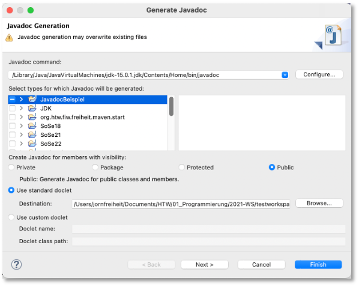
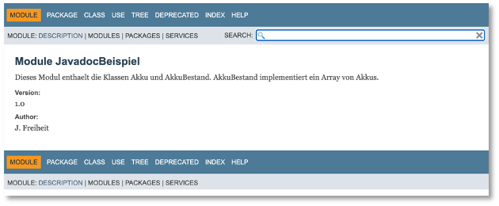
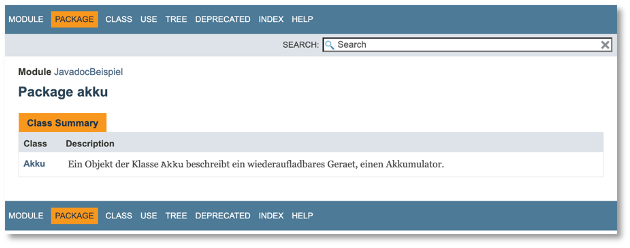

# Javadoc

[Javadoc](https://www.oracle.com/java/technologies/javase/javadoc.html) ist ein Werkzeug, das Teil des [Java Development Kit (JDK)](https://www.oracle.com/java/technologies/downloads/) ist. Es erzeugt aus Javadoc-Kommentaren HTML-Seiten, die im Browser aufgerufen werden können. Die Javadoc-Kommentare aller Klassen aus den Java-Standardpaketen finden Sie z.B. [hier (Java Version 11)](https://docs.oracle.com/en/java/javase/11/docs/api/).

Ein Javadoc-Kommentar beginnt mit `/**` und endet mit `*/`. Ein solcher Kommentar kann sich über mehrer Zeilen erstrecken. Hier nochmal die drei Möglichkeiten der Kommentierung in Java:

```java 

// einzeiliger Kommentar - Kommentar endet am Zeilenende

/*

	Blockkommentar
	kann sich über mehrer Zeilen erstrecken

*/

/**
	Javadoc-Kommentar
	wie Blockkommentar über mehrere Zeilen
	aus Javadoc-Kommentaren erzeugt javadoc 
	HTML-Seiten

*/

```

Eine Anleitung dazu, wie Javadoc-Kommentare geschrieben werden sollten, findet sich [hier](https://www.oracle.com/java/technologies/javase/writing-doc-comments.html). Diese Anleitung enthält auch nützliche Beispiele. 

## Ein einfaches Beispiel

Wir wollen die Dokumentation an einem (sehr) einfachen Beispiel erläutern. Gegeben sei folgende Klasse `Akku.java`.

```java linenums="1"
	package akku;

	public class Akku {
		private String typ;
		private int kapazitaet;
		private int anzahlLadungen;
		
		public Akku(String typ, int kapazitaet)
		{
			this.typ = typ;
			this.kapazitaet = kapazitaet;
			this.anzahlLadungen = 0;
		}
		
		public void laden()
		{
			this.anzahlLadungen++;
		}
		
		public int getZustand()
		{
			int zustand = 100;
			zustand = (zustand - (this.anzahlLadungen/100));
			if(zustand < 0) zustand = 0;
			return zustand;
		}
		
		@Override
		public String toString()
		{
			String s = String.format("%-4s: %5dmAh %5d Ladungen. Zustand %3d%% %n", this.typ, this.kapazitaet, this.anzahlLadungen, this.getZustand());
			return s;
		}
		
		@Override
		public boolean equals(Object o)
		{
			if(o == null) return false;
			if(this == o) return true;
			if(o.getClass() != this.getClass()) return false;
			
			Akku a = (Akku)o;
			return a.typ.equals(this.typ);
		}
		
		public void print()
		{
			System.out.print(this.toString());
		}

	}

```

### Javadoc-Kommentierung des Beispiels

Wir schauen uns zunächst mal eine mögliche (nicht wirklich gute, z.B. weil es nicht auf Englisch ist) Javadoc-Kommentierung an und betrachten dann Einzelheiten:


```java linenums="1"
package akku;

/**
 * Ein Objekt der Klasse <code>Akku</code> beschreibt ein wiederaufladbares Geraet, 
 * einen Akkumulator.
 * Objekte der Klasse sind spezifiziert durch den Typ, die Kapazitaet (wieviel Stunden 
 * Entladzeit bei gegebenem Entladestrom) und der Anzahl der bisherigen Ladungen.
 * @author jornfreiheit
 * @version 1.0
 */
public class Akku {
	/**
	 * Der Typ eines <code>Akku</code>-Objektes.
	 */
	private String typ;
	/**
	 * Die Kapazitaet eines <code>Akku</code>-Objektes in Ah.
	 */
	private int kapazitaet;
	/**
	 * Die Anzahl bisheriger Ladungen eines <code>Akku</code>-Objektes.
	 */
	private int anzahlLadungen;
	
	/**
	 * Konstruktor; erzeugt ein <code>Akku</code>-Objekt. Das erzeugte <code>Akku</code>-Objekt
	 * ist bisher noch nicht geladen worden (<code>anzahlLadungen</code> initial <code>0</code>
	 * @param typ: initiiert den Wert von <code>typ</code> des <code>Akku</code>-Objektes
	 * @param kapazitaet: initiiert den Wert von <code>kapazitaet</code> des <code>Akku</code>-Objektes
	 */
	public Akku(String typ, int kapazitaet)
	{
		this.typ = typ;
		this.kapazitaet = kapazitaet;
		this.anzahlLadungen = 0;
	}
	
	/**
	 * erhoeht die Anzahl bisheriger Ladungen um 1 
	 * der um 1 erhoehte Wert wird in <code>anzahlLadungen</code> gespeichert
	 */
	public void laden()
	{
		this.anzahlLadungen++;
	}
	
	
	/**
	 * berechnet den Zustand des <code>Akku</code>-Objektes und
	 * gibt diesen zurueck.
	 * Der Zustand wird in Prozent ermittelt. Initial hat ein 
	 * (bis dahin nie aufgeladenes) <code>Akku</code>-Objekt den Zustand 
	 * <code>100%%</code>. Fuer alle <code>100</code> Ladungen reduziert sich
	 * der Zustand um <code>1%%</code>. Das bedeutet, fuer <code>1000</code> Ladungen reduziert sich
	 * der Zustand um <code>10%%</code>. Nach <code>10000</code> Ladungen ist
	 * der Zustand bei <code>0%%</code> und somit ist das <code>Akku</code>-Objekt
	 * nicht mehr nutzbar.
	 * 
	 * @return berechneten Zustand in Prozent
	 */
	public int getZustand()
	{
		int zustand = 100;
		zustand = (zustand - (this.anzahlLadungen/100));
		if(zustand < 0) zustand = 0;
		return zustand;
	}
	
	/**
	 * Ueberschreibt die {@link Object#toString()}-Methode der Klasse <code>Object</code>
	 * Gibt einen <code>String</code> der Form
	 * <code>A1  : 10000mAh   984 Ladungen. Zustand  91%</code>
	 * wobei 
	 * <ul>
	 * 	<li><code>A1</code> ein <code>typ</code> ist, </li> 
	 *  <li><code>10000</code> ist die <code>kapazitaet</code>, </li>
	 *  <li><code>984</code> sind die <code>anzahlLadungen</code> und </li>
	 *  <li><code>91%</code> der berechnete Zustand <code>getZustand()</code>.</li>
	 * </ul>
	 * @return String, der die Werte eines <code>Akku</code>-Objektes enthaelt
	 */
	@Override
	public String toString()
	{
		String s = String.format("%-4s: %5dmAh %5d Ladungen. Zustand %3d%% %n", this.typ, this.kapazitaet, this.anzahlLadungen, this.getZustand());
		return s;
	}
	
	/**
	 * Ueberschreibt die {@link Object#equals(Object o)}-Methode der Klasse <code>Object</code>
	 * Gibt <code>true</code> zurueck, wenn das aufrufende <code>Akku</code>-Objekt
	 * gleich dem als Parameter uebergebenden <code>Akku</code>-Objektes ist.
	 * Gibt <code>false</code> zurueck sonst.
	 * Zwei <code>Akku</code>-Objekte sind gleich, wenn sie den gleichen <code>typ</code>
	 * haben.
	 * @return <code>true</code> wenn gleich, <code>false</code> sonst.
	 */
	@Override
	public boolean equals(Object o)
	{
		if(o == null) return false;
		if(this == o) return true;
		if(o.getClass() != this.getClass()) return false;
		
		Akku a = (Akku)o;
		return a.typ.equals(this.typ);
	}
	
	/**
	 * gibt den von {@link toString()} erzeugten <code>String</code> auf
	 * die Konsole aus
	 */
	public void print()
	{
		System.out.print(this.toString());
	}

}
```

Wichtig ist auch, dass Sie auch das Modul (Ihr Java-Projekt) kommentieren können und auch jedes einzelne Package darin. Um das Package zu kommentieren, erstellen Sie in Ihrem Package eine `package-info.java` und fügen darin Ihre Javadoc-Kommentare ein. Um Ihr Modul (Ihr Java-Projekt) zu kommentieren, fügen Sie in die `module-info.java` den Javadoc-Kommentar ein, z.B. 

=== "module-info.java"
	```java
	/**
	 * Dieses Modul enthaelt die Klassen Akku und AkkuBestand. 
	 * AkkuBestand implementiert ein Array von Akkus.
	 * 
	 * @author J. Freiheit
	 * @version 1.0
	 */
	module JavadocBeispiel
	{
	}
	```

### Generate Javadoc...

Wenn Sie mit der Javadoc-Kommentierung fertig sind, dann wählen Sie in Eclipse im Menüpunkt `Project` den Menüeintrag `Generate Javadoc...`. Es erscheint folgendes Fenster:



Hier können Sie insbesondere auswählen, für welches Java-Projekt Sie die Javadoc-Dokumentation erzeugen lassen möchten. Es ist auch die Auswahl von Paketen und Klassen möglich. Außerdem werden in der Standardeinstellung nur die Dokumentationen für `public` Eigenschaften erzeugt, also für als `public` deklarierte Methoden und Objektvariablen. Auch das lässt sich in dieser Eingabemaske ändern. Nachdem Sie `Finish` geklickt haben, erscheint in der Konsole so etwas wie:

```bash
Loading source files for package akku...
Constructing Javadoc information...
Standard Doclet version 15.0.1+9-18
Building tree for all the packages and classes...
```

gefolgt von einer Liste aller `.html`-Dateien, die erzeugt werden. Eventuell gibt es jedoch auch Fehlerausgaben, die Sie erst noch beheben müssen. Nachdem alle `.html`-Dateien erzeugt wurden, gibt es in Ihrem Workspace in dem Projektordner, dessen Javadoc-Dokumentation Sie gerade erzeugt haben, einen neuen Ordner `doc`:


In diesem Ordner befinden sich mehrer `.html`-Dateien (und Ordner und `.js`- sowie `.css`-Datein). Öffnen Sie die `index.html` durch Doppelklick. Diese öffnet sich im Browser und es erscheint folgende Ansicht:



Klicken Sie darin auf den Button `Package` und es erscheint:




Klicken Sie auf die Klasse `Akku` und es erscheint:


## Tags

Wie Sie in den Kommentaren vielleicht erkannt haben, gibt es darin einige `@` gefolgt von Schlüsselwörtern. Dabei handelt es sich um sogenannte *Tags*. Hier eine Liste der *Tags*, die wir verwendet haben:

- [@author](https://docs.oracle.com/javase/1.5.0/docs/tooldocs/windows/javadoc.html#@author) - für den/die Programmierer_innen des Codes; bei mehreren Autor_innen entweder je Autor_in mit `@author`-Tag oder Autor_innennamen durch Komma getrennt, siehe auch [hier](https://www.oracle.com/technical-resources/articles/java/javadoc-tool.html#@author)
- [@version](https://docs.oracle.com/javase/1.5.0/docs/tooldocs/windows/javadoc.html#@version) - gibt die Version des Codes an, siehe auch [hier](https://www.oracle.com/technical-resources/articles/java/javadoc-tool.html#@version)
- [@param](https://docs.oracle.com/javase/1.5.0/docs/tooldocs/windows/javadoc.html#@param) - beschreibt einen Parameter der Methode; für jeden Parameter wird ein eigener `@param`-Tag verwendet; siehe auch [hier](https://www.oracle.com/technical-resources/articles/java/javadoc-tool.html#@param)
- [@return](https://docs.oracle.com/javase/1.5.0/docs/tooldocs/windows/javadoc.html#@return) - beschreibt die Rückgabe einer Methode mit Rückgabetyp; auch den Wertebereich der Rückgabe erläutern; siehe auch [hier](https://www.oracle.com/technical-resources/articles/java/javadoc-tool.html#@return)

### Weitere Tags

Mit den oben genannten *Tags* können Klassen bereits gut dokumentiert werden. Es gibt jedoch noch weitere *Tags*, die wir hier kurz auflisten wollen (Liste ist aber nicht vollständig):

- [@deprecated](https://docs.oracle.com/javase/1.5.0/docs/tooldocs/windows/javadoc.html#@deprecated) - kennzeichnet, dass diese Klasse oder Methode nicht weiter genutzt werden soll, siehe auch [hier](https://www.oracle.com/technical-resources/articles/java/javadoc-tool.html#@deprecated) und [hier](https://docs.oracle.com/javase/1.5.0/docs/guide/javadoc/deprecation/index.html)
- [@throws](https://docs.oracle.com/javase/1.5.0/docs/tooldocs/windows/javadoc.html#@throws) - synonym zu `@exception`; in Verbindung zu der Exception (den Exceptions), die durch eine Methode geworfen werden kann/können und für welche Fälle die jeweilige Exception geworfen wird, siehe auch [hier](https://www.oracle.com/technical-resources/articles/java/javadoc-tool.html#@exception)
- [@see](https://docs.oracle.com/javase/1.5.0/docs/tooldocs/windows/javadoc.html#@see) - erstellt einen Link zu einer Klasse, Methode, etc. in der API-Dokumentation (Syntax: `@see  package.class#member  label`, wobei `label` sichtbar und `package.class#member ` der Link), siehe auch [hier](https://www.oracle.com/technical-resources/articles/java/javadoc-tool.html#@see); `@see` ist ähnlich zu [{@ link}](https://docs.oracle.com/javase/1.5.0/docs/tooldocs/windows/javadoc.html#{@link}), aber ein `{@link}` beschreibt einen In-line-Link, während der `@see`-Link im `See also`-Bereich aufgeführt wird.