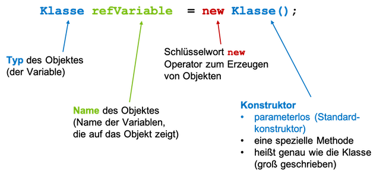
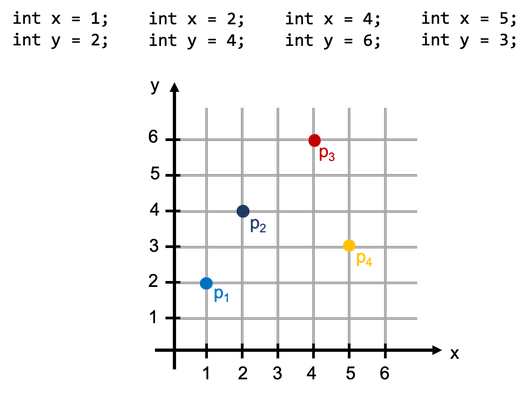

# Klassen und Objekte

Wir haben Datentypen kennengelernt, in denen wir bestimmte Werte speichern konnten, z.B. `int` für ganze Zahlen, `boolean` für Wahrheitswerte, `char` für einzelne Zeichen, `double` für Gleitkommawerte usw. Eine Variable von so einem Wertetyp kann immer genau einen Wert speichern. Das genügt meistens jedoch nicht. Das haben wir bereits gemerkt, als wir nicht nur ein Zeichen speichern wollten, sondern eine ganze Zeichenkette. Dazu haben wir den Datentyp `String` verwendet. Bei diesem Datentyp war es dann nicht nur so, dass wir ganze Zeichenketten speichern konnten, sondern dazu kamen auch noch Methoden, die in diesem Datentyp definiert sind, die wir zur Manipulation von solchen Zeichenketten verwenden können, z.B. `charAt()`, `length()`, `substring()` usw. 

Wenn wir nun z.B. `Auto`s speichern wollen oder `Adresse`n oder `Studentin`nnen, dann gibt es dafür keinen passenden Datentyp in Java. Das wollen wir nun ändern. Wir bauen uns **eigene Datentypen**. 

Wenn wir uns die Welt betrachten, dann besteht diese aus lauter *Objekten*, die miteinander in Beziehung stehen. Man ganz *konkret* über bestimmte *Objekte* sprechen:

- „das ist ein schöner Stuhl“
- „das ist ein teurer Tisch“
- „das Auto ist blau“

oder ganz *allgemein* über eine *Klasse* von Objekten:

- „Computer machen immer, was sie wollen“
- „die Bahnen kommen immer zu spät“
- "Klausuren sind immer schwer"

In der Welt des *objektorientierten Programmierens* sind die *Klassen* die "Muster" oder die "Bauanleitungen" für konkrete *Objekte*. Mit *Klassen* beschreiben wir die allgemeinen Eigenschaften, die für alle *Objekte* dieser Klasse gelten. Klassen beschreiben

- eine *Struktur* der Objekte (das sind die *Objektvariablen*) und
- ein *Verhalten* dieser Objekte (das sind die *Objektmethoden*). 

Insgesamt sprechen wir bei der Struktur und dem Verhalten von den *Eigenschaften* einer Klasse. Eine Klasse ist ein *Datentyp* und jeder "Wert" ist ein konkretes *Objekt* von diesem Typ. Von einer Klasse können wir beliebig viele Objekte erzeugen. 

!!! info "Beachte!"
	In der objektorientierten Programmierung unterscheiden wir sehr genau zwischen Objekten und Werten. Werte sind soetwas wie `4`, `true`, `5.5` usw. Solche Werte haben kein Verhalten. Objekte haben aber ein Verhalten (die Objektmethoden - siehe z.B. für `String` die Methoden `charAt()`, `length()`, `substring()`). Wir werden sehr detailliert auf die Unterschiede zwischen Werten und Objekten eingehen. Die Datentypen, die wir erstellen, sind sogenannte *Referentypen*. Eine Variable von so einem Referenztyp *zeigt auf* (*referenziert*) ein Objekt.


### Ein erster eigener Datentyp `Adresse`

Wir erstellen uns einfach mal einen neuen Datentyp. Wir nennen ihn `Adresse`. In unserer IDE (Eclipse) erstellen wir eine neue Klasse `Adresse`. Achtung! Wenn wir einen Datentyp erzeugen, dann **ohne `main()`-Methode**. Die `main()`-Methode ist **keine Eigenschaft** eines Datentyps. Unsere neue Klasse sieht also so aus:

=== "Adresse.java"

	```java linenums="1"
	public class Adresse
	{

	}
	```

Wir erstellen uns eine weitere Klasse (am besten im gleichen Paket) mit `main()`-Methode - wir nennen die Klasse `Testklasse`:

=== "Testklasse.java"
	```java linenums="1"
	public class Testklasse
	{

		public static void main(String[] args)
		{
			Adresse adresse1;

		}
	}
	```

In der `main()`-Methode können wir nun bereits den Datentyp verwenden, um eine Variable zu deklarieren. Wir nennen die Variable `adresse1` und weisen ihr den Typ `Adresse` zu. Wir haben unseren ersten eigenen Datentyp erstellt!

#### Eigenschaften definieren

Unser Datentyp `Adresse` hat noch keine Eigenschaften. Als erstes definieren wir uns **Objektvariablen** für unsere Klasse:

=== "Adresse.java"
	```java linenums="1"
	public class Adresse
	{
		// --- Objektvariablen -----
		public String strasse;
		public int nummer;
		public int postleitzahl;
		public String wohnort;
		
	}
	```

Die *Struktur* aller Objekte unserer Klasse sieht also wie folgt aus. **Jedes Objekt** vom Typ `Adresse` hat 

- **eine eigene** Variable `strasse` (vom Typ `String`),
- **eine eigene** Variable `nummer` (vom Typ `int`),
- **eine eigene** Variable `postleitzahl` (vom Typ `int`),
- **eine eigene** Variable `wohnort` (vom Typ `String`).

#### Objektvariablen sind global!

Bis jetzt hatten wir unsere Variablen immer *lokal* in einer Methode deklariert. Diese Variablen waren nur in der Methode sichtbar und existierten auch nur in der Methode, in der sie deklariert wurden. Siehe dazu [Sichtbarkeit und Lebensdauer von lokalen Variablen](methodenstack.md#lebensdauer-und-sichtbarkeit-von-lokalen-variablen). 

Objektvariablen sind in der **Klasse** deklariert, nicht in einer Methode - sie sind *global*. Objektvariablen sind deshalb in der gesamten Klasse sichtbar, d.h. es kann in der gesamten Klasse daruf zugegriffen werden (in jeder Methode der Klasse). Objektvariablen existieren für ein konkretes Objekt. Jedes Objekt hat seine eigenen Objektvariablen. Diese existieren für das Objekt also so lange, solange das Objekt existiert. 

> Objektvariablen sind *global* und sind in allen Methoden der Klasse sichtbar, d.h. es kann in allen Methoden der Klasse auf die Objektvariablen zugegriffen werden.

#### Objektmethode hinzufügen

Jetzt wollen wir auch noch ein *Verhalten* implementieren und definieren uns dazu eine **Objektmethode**:

=== "Adresse.java"
	```java linenums="1"
	public class Adresse
	{
		// --- Objektvariablen -----
		public String strasse;
		public int nummer;
		public int postleitzahl;
		public String wohnort;
	
		// --- Objektmethoden ------
		public String getAdresse()
		{
			return strasse + " " + nummer + " in " + postleitzahl + " " + wohnort;
		}		
	}
	```

Achtung! Objektmethoden sind **nicht `static`**! Methoden, die als `static` deklariert sind, können ausgeführt werden, ohne ein Objekt der Klasse zu erzeugen. Von unseren bisherigen Klassen `Uebung1`, `Uebung2`, `Aufgabe1`, `Aufgabe2` usw. haben wir keine Objekte erzeugt und wollten aber die Methoden trotzdem aufrufen. Wir haben sie deshalb als `static` deklariert. Von den Klassen, die wir nun als `Datentyp` implementieren, wollen wir Objekte erzeugen. Deshalb werden die Methoden nicht als `static` deklariert. Objektmethoden können **nur von Objekten** aufgerufen werden! Jedes Objekt der Klasse `Adresse` hat **seine eigene** Methode `getAdresse()`. 

#### Objekte erzeugen - der Konstruktor

Wir haben jetzt einen "Bauplan" für alle Objekte vom Datentyp `Adresse` erzeugt. Nun wollen wir nach diesem Bauplan Objekte von der Klasse (vom Datentyp) `Adresse` erzeugen. Das geschieht mithilfe des *Konstruktors*.

> der Konstruktor einer Klasse heißt genau wie die Klasse selbst, ist aber eine Methode (z.B. `Adresse()`)

Um ein Objekt der Klasse zu erzeugen, verwenden wir das Schlüsselwort `new` und rufen dann den Konstruktor der Klasse auf:

> `new Klassenname();` 

Wir erzeugen in der `main()`-Methode der `Testklasse` zwei Objekte der Klasse `Adresse`:

=== "Testklasse.java"
	```java linenums="1"
	public class Testklasse
	{

		public static void main(String[] args)
		{
			Adresse adresse1 = new Adresse();		// erstes Objekt erzeugt
			Adresse adresse2 = new Adresse();		// zweites Objekt erzeugt
		}
	}
	```


Das generelle Vorgehen bei der Erzeugung eines Objektes zeigt die folgende Abbildung:



Wir haben nun zwei Objekte vom Typ `Adresse` erstellt. Die *Referenzvariable* `adresse1` zeigt auf das erste Objekt (Sie können auch sagen, dass `adresse1` der Name des ersten Objektes ist) und die Referenzvariable `adresse2` zeigt auf das zweite Objekt. **Jedes** dieser beiden Objekte hat seine eigenen Objektvariablen `strasse`, `nummer`, `postleitzahl` und `wohnort` und seine eigene Objektmethode `getAdresse()`. Wir werden jetzt auf diese Eigenschaften zugreifen.

#### Zugriff auf Objekteigenschaften - Punktnotation

Auf die Eigenschaften eines Objektes können wir über die Referenzvariable mittels Punktnotation zugreifen. Wir kennen das bereits z.B. von `Random`, wenn wir über die Variable `r` auf die `nextInt()`-Methode zugreifen `r.nextInt()` oder von `String` mit dem Zugriff `pi.charAt()` usw. Die Syntax ist also wie folgt:

> `referenzVariable.eigenschaft` 

Wir verwenden die Punktnotation für unsere Objekte vom Typ `Adresse`, um ihnen Werte für die Objektvariablen zuzuweisen und jeweils auf die Objektmethode zuzugreifen:

=== "Testklasse.java"
	```java linenums="1"
	public class Testklasse
	{

		public static void main(String[] args)
		{
			Adresse adresse1 = new Adresse();
			Adresse adresse2 = new Adresse();
			
			adresse1.strasse = "Wilhelminenhofstr.";
			adresse1.nummer = 75;
			adresse1.postleitzahl = 12459;
			adresse1.wohnort = "Berlin";
			
			adresse2.strasse = "Treskowallee";
			adresse2.nummer = 8;
			adresse2.postleitzahl = 10318;
			adresse2.wohnort = "Berlin";
			
			System.out.println(adresse1.getAdresse());
			System.out.println(adresse2.getAdresse());
		}
	}
	```

Wir weisen also den jeweiligen Objektvariablen der beiden Objekte Werte zu und geben diese jeweils mithilfe der `getAdresse()`-Methode aus. Es ist ganz wichtig, zu verstehen, dass jedes Objekt seine eigenen Objektvariablen und seine eigenen Objektmethoden hat. Zugriff auf diese Variablen und Methoden gibt es stets nur über ein Objekt!

Die Ausgabe für obiges Beispiel sieht so aus:

```bash
Wilhelminenhofstr. 75 in 12459 Berlin
Treskowallee 8 in 10318 Berlin
```

Alle Objekte werden also nach dem gleichen "Bauplan" erstellt. Alle Objekte vom Typ `Adresse` haben die Eigenschaften:

- `strasse`, 
- `nummer`, 
- `postleitzahl`,  
- `wohnort` und 
- `getAdresse()`

Wenn wir die Klasse `Adresse` ändern, dann ändern sich auch die Eigenschaften entsprechend für **alle** Objekte dieser Klasse. 


#### Datenkapselung (Information Hiding) - das Schlüsselwort `private`

Ein wesentlicher Grundsatz der objektorientierten Programmierung ist das Prinzip der *Datenkapselung* (auch *data hiding* oder *information hiding* genannt). Dieses Prinzip dient dem Datenschutz. Wir wollen vermeiden, dass

- Unbefugte die Struktur (die Daten) unserer Objekte kennen und
- Unbefugte die Daten ändern können, ohne dass wir es erlauben. 

Angenommen, Sie haben eine Klasse `Konto` und es wäre möglich, ganz einfach auf ihre `pin` zuzugreifen. Das wäre fatal. Bereits der lesende Zugriff darauf könnte schädlich sein, aber genau so ärgerlich wäre es, wenn die `pin` einfach durch Fremde geändert werden könnte. Wir wollen deshalb sowohl den lesenden als auch den schreibenden Zugriff auf unsere Daten (auf unsere Objektvariablen) verbieten. Dazu deklarieren wir unsere Objektvariablen als `private`:

=== "Adresse.java"
	```java linenums="1"
	public class Adresse
	{
		// --- Objektvariablen -----
		private String strasse;			// Zugriff nur innerhalb der Klasse
		private int nummer;				// Zugriff nur innerhalb der Klasse
		private int postleitzahl;		// Zugriff nur innerhalb der Klasse
		private String wohnort;			// Zugriff nur innerhalb der Klasse
	
		// --- Objektmethoden ------
		public String getAdresse()
		{
			return strasse + " " + nummer + " in " + postleitzahl + " " + wohnort;
		}		
	}
	```

Wir haben die *Sichtbarkeit* der Objektvariablen in unserer Klasse geändert. Vorher waren die Objektvariablen als `public` deklariert. Das führte dazu, dass sie von allen anderen Klassen gelesen und geschrieben werden konnten (z.B. von unserer `Testklasse`). Indem wir die Variablen als `private` deklarieren, ist der Zugriff darauf außerhalb unserer Klasse nicht mehr möglich. 

Wenn wir uns jetzt unsere `Testklasse` anschauen, dann sehen wir Fehler:

=== "Testklasse.java"
	```java linenums="1"
	public class Testklasse
	{

		public static void main(String[] args)
		{
			Adresse adresse1 = new Adresse();
			Adresse adresse2 = new Adresse();
			
			adresse1.strasse = "Wilhelminenhofstr.";	// Fehler: The field Adresse.strasse is not visible
			adresse1.nummer = 75;						// Fehler: The field Adresse.nummer is not visible
			adresse1.postleitzahl = 12459;				// Fehler: The field Adresse.postleitzahl is not visible
			adresse1.wohnort = "Berlin";				// Fehler: The field Adresse.wohnort is not visible
			
			adresse2.strasse = "Treskowallee";			// Fehler: The field Adresse.strasse is not visible
			adresse2.nummer = 8;						// Fehler: The field Adresse.nummer is not visible
			adresse2.postleitzahl = 10318;				// Fehler: The field Adresse.postleitzahl is not visible
			adresse2.wohnort = "Berlin";				// Fehler: The field Adresse.wohnort is not visible
			
			System.out.println(adresse1.getAdresse());
			System.out.println(adresse2.getAdresse());
		}
	}
	```

Die `Testklasse` lässt sich nun nicht mehr compilieren und ausführen. Auch lesende Zugriffe, z.B. `System.out.println(adresse1.wohnort);` sind nicht mehr möglich. Beachten Sie aber, dass wir weiterhin die Methode `getAdresse()` aufrufen können. Sie ist als `public` deklariert und deshalb in anderen Klassen durch `Adresse`-Objekte ausführbar. Wir könnten auch die Methode als `private` deklarieren, dann würde auch sie nicht mehr ausführbar in anderen Klassen sein. 

> Auf eine als `private` deklarierte Variable kann außerhalb der Klasse, in der sie deklariert ist, nicht zugegriffen werden.

> Eine als `private` deklarierte Methode kann außerhalb der Klasse, in der sie definiert ist, nicht ausgeführt (aufgerufen) werden. 

Wie können wir unseren Objektvariablen aber nun Werte zuweisen? Dafür gibt es zwei Antworten

1. durch einen parametrisierten Konstruktor und
2. durch sogenannte *Setter*

Wir betrachten zunächst den parametrisierten Konstruktor. 

#### Ein eigener Konstruktor

Wir haben einen *Konstruktor* bereits kennengelernt. Ein Konstruktor ist eine Methode, die genau wie die Klasse heißt (also auch großgeschrieben) und mit runden Klammern. Wir haben den Konstruktor auch bereits verwendet, nämlich zur Erzeugung von Objekten (genau dafür ist er auch da). Betrachten wir nochmal die beiden Aufrufe:

```java
Adresse adresse1 = new Adresse();	// Aufruf des Standardkonstruktors
Adresse adresse2 = new Adresse();	// Aufruf des Standardkonstruktors
```

Wir konnten die Objekte vom Typ `Adresse` mithilfe des Konstrutors `Adresse()` erzeugen. Dies ist ein sogenannter *Standardkonstruktor*, denn er existiert automatisch für jede neue Klasse (für jeden Datentyp), die wir erstellen. Jetzt wollen wir aber einen eigenen Konstruktor definieren, den wir in Zukunft zur Erzeugung unserer `Adresse`-Objekte verwenden wollen. In unserem neuen Konstruktor wollen wir nämlich bereits Werte als Parameter übergeben, die für die Initialisierung der Objektvariablen verwendet werden sollen. Wir erweitern unsere Klasse `Adresse` um einen solchen Konstruktor:

=== "Adresse.java"
	```java linenums="1"
	public class Adresse
	{
		// --- Objektvariablen -----
		private String strasse;			// Zugriff nur innerhalb der Klasse
		private int nummer;				// Zugriff nur innerhalb der Klasse
		private int postleitzahl;		// Zugriff nur innerhalb der Klasse
		private String wohnort;			// Zugriff nur innerhalb der Klasse
		
		// --- Konstruktor ---------
		public Adresse(String str, int nr, int plz, String ort)
		{
			strasse = str;
			nummer = nr;
			postleitzahl = plz;
			wohnort = ort;
		}

		// --- Objektmethoden ------
		public String getAdresse()
		{
			return strasse + " " + nummer + " in " + postleitzahl + " " + wohnort;
		}		
	}
	```

In den Zeilen `10-16` haben wir einen solchen Konstruktor hinzugefügt. Wir übergeben dem Konstruktor vier Parameterwerte. Diese Werte werden verwendet, um unsere Objektvariablen zu initialisieren. Der Konstruktor wird aufgerufen, um ein neues Objekt zu erzeugen. Wir verwenden ihn hinter dem Schlüsselwort `new`. 

Bei der Definition eines solchen Konstruktors sind zwei Dinge zu beachten: 

1. Der Konstruktor heißt exakt wie die Klasse (also auch Großschreibung beachten).
2. Der Konstruktor hat **keinen** Rückgabetyp (auch nicht `void`).

Die Aufgabe eines Konstruktors ist einzig und allein Objekte der Klasse zu erzeugen. Die "Rückgabe" eines solchen Konstruktors ist also ein Objekt der Klasse. Theoretisch wäre der Rückhgabetyp hier also `Adresse`. Aber wie gesagt, bei der Definition eines Konstruktors gibt man keinen Rückgabetyp an!

Wenn wir uns nun erneut die `Testklasse` anschauen, dann sind durch die Definition eines eigenen Konstruktors weitere Fehler hinzugekommen:

=== "Testklasse.java"
	```java linenums="1"
	public class Testklasse
	{

		public static void main(String[] args)
		{
			Adresse adresse1 = new Adresse();			// Fehler: The constructor Adresse() is undefined
			Adresse adresse2 = new Adresse();			// Fehler: The constructor Adresse() is undefined
			
			adresse1.strasse = "Wilhelminenhofstr.";	// Fehler: The field Adresse.strasse is not visible
			adresse1.nummer = 75;						// Fehler: The field Adresse.nummer is not visible
			adresse1.postleitzahl = 12459;				// Fehler: The field Adresse.postleitzahl is not visible
			adresse1.wohnort = "Berlin";				// Fehler: The field Adresse.wohnort is not visible
			
			adresse2.strasse = "Treskowallee";			// Fehler: The field Adresse.strasse is not visible
			adresse2.nummer = 8;						// Fehler: The field Adresse.nummer is not visible
			adresse2.postleitzahl = 10318;				// Fehler: The field Adresse.postleitzahl is not visible
			adresse2.wohnort = "Berlin";				// Fehler: The field Adresse.wohnort is not visible
			
			System.out.println(adresse1.getAdresse());
			System.out.println(adresse2.getAdresse());
		}
	}
	```

Dadurch, dass wir einen eigenen Konstruktor geschrieben haben, existiert der Standardkonstruktor nicht mehr (siehe Zeilen `6` und `7`). Wir müssen (und wollen ja auch) nun unseren eigenen Konstruktor verwenden, um Objekte zu erzeugen. Wir passen die `Testklasse` entsprechend an:

=== "Testklasse.java"
	```java linenums="1" hl_lines="6-7"
	public class Testklasse
	{

		public static void main(String[] args)
		{
			Adresse adresse1 = new Adresse("Wilhelminenhofstr.", 75, 12459, "Berlin");			
			Adresse adresse2 = new Adresse("Treskowallee", 8, 10318, "Berlin");			
			
			System.out.println(adresse1.getAdresse());
			System.out.println(adresse2.getAdresse());
		}
	}
	```

In den Zeilen `6` und `7` verwenden wir nun den eigenen Konstruktor und übergeben die Werte für die Objektvariablen als Parameter. Bei der Erzeugung der Objekte werden die Objektvariablen nun gleich initialisiert. Der direkte Zugriff auf die Objektvariablen wurde entfernt, da dieser aufgrund der `private`-Deklaration nicht mehr möglich ist. Die Ausgaben in Zeilen `9` und `10` zeigen aber, dass die Objekte die entsprechenden Werte enthalten:

```bash
Wilhelminenhofstr. 75 in 12459 Berlin
Treskowallee 8 in 10318 Berlin
```

Die Objekte erhalten somit gleich bei der Erzeugung alle Werte für die Objektvariablen und es ist nun auch nicht mehr möglich, diese Werte zu ändern. Ein direkter Zugriff auf die Objektvariablen ist nicht möglich. Die einzigen Wertzuweisungen finden im Konstruktor statt. Objekte, deren Werte nicht mehr geändert werden können, heißen *immutable objects* (*unveränderliche Objekte*). Sehr häufig ist es wünschenswert, dass Objekte *immutable* sind - das vermeidet Fehler. Wir kommen (sehr viel später) nochmal darauf zu sprechen. 

Die einzige Schnittstelle (also die Möglichkeiten anderer Klassen unseren neuen Datentyp `Adresse` zu nutzen) unserer Klasse besteht nun aus zwei Methoden: dem Konstruktor zum Erzeugen eines Objektes und der Methode `getAdresse()`. Wenn wir aber z.B. nur den `wohnort` wissen wollen, dann ist es derzeit noch nicht möglich. Wir wollen deshalb den **lesenden** Zugriff auf unsere Objektvariablen erlauben und definieren uns dafür sogenannte *Getter*.

#### `getXXX()`-Methoden - Getter

Da die Objektvariablen alle als `private` deklariert sind, ist außerhalb der Klasse `Adresse` kein Zugriff auf diese Variablen möglich. Wir können ihnen weder Werte zuweisen, noch deren Werte auslesen. Wir haben bereits gesagt, dass dies ein Feature der objektorientierten Programmierung ist, ein solches *information hiding* einfach durchführen zu können. 

Wir können jetzt steuern, ob und wie der Zugriff doch möglich sein soll. Wenn man bspw. den lesenden Zugriff erlauben möchte, dann definiert man sich innerhalb der Klasse sogenannte `get`-Methoden (*Getter*). Eine solche `get`-methode gibt den Wert einer Objektvariablen zurück. Es wird somit ein *lesender* Zugriff auf den Wert der Variablen ermöglicht. Für unsere Klasse schreiben wir uns nun für jede Objektvariable einen eigenen Getter:

- `getWohnort()` gibt den Wert von `wohnort` zurück, ist also vom Rückgabetyp `String`
- `getPostleitzahl()` gibt den Wert von `postleitzahl` zurück, ist also vom Rückgabetyp `int`
- `getStrasse()` gibt den Wert von `strasse` zurück, ist also vom Rückgabetyp `String`
- `getNummer()` gibt den Wert von `nummer` zurück, ist also vom Rückgabetyp `int`

Unsere Klasse `Adresse` sieht nun wie folgt aus:

=== "Adresse.java"
	```java linenums="1"
	public class Adresse
	{
		// --- Objektvariablen -----
		private String strasse;
		private int nummer;
		private int postleitzahl;
		private String wohnort;
		
		// --- Konstruktor ---------
		public Adresse(String str, int nr, int plz, String ort)
		{
			strasse = str;
			nummer = nr;
			postleitzahl = plz;
			wohnort = ort;
		}
		
		// --- Objektmethoden ------
		public String getAdresse()
		{
			return strasse + " " + nummer + " in " + postleitzahl + " " + wohnort;
		}
		
		public String getStrasse()
		{
			return strasse;
		}
		
		public int getNummer()
		{
			return nummer;
		}
		
		public int getPostleitzahl()
		{
			return postleitzahl;
		}
		
		public String getWohnort()
		{
			return wohnort;
		}
	}
	```

Unsere Schnittstelle hat sich also erweitert. Es sind jetzt auch mehr Methoden unserer Klasse `Adresse` nutzbar. Wir probieren die Methoden in unserer `Testklasse` aus:

=== "Testklasse.java"
	```java linenums="1" hl_lines="12-13 15-16"
	public class Testklasse
	{

		public static void main(String[] args)
		{
			Adresse adresse1 = new Adresse("Wilhelminenhofstr.", 75, 12459, "Berlin");			
			Adresse adresse2 = new Adresse("Treskowallee", 8, 10318, "Berlin");			
			
			System.out.println(adresse1.getAdresse());
			System.out.println(adresse2.getAdresse());
			
			System.out.println("Strasse Nr  : " + adresse1.getStrasse() + " " +  adresse1.getNummer());
			System.out.println("PLZ Wohnort : " + adresse1.getPostleitzahl() + " " + adresse1.getWohnort());
			
			System.out.println("Strasse Nr  : " + adresse2.getStrasse() + " " +  adresse1.getNummer());
			System.out.println("PLZ Wohnort : " + adresse2.getPostleitzahl() + " " +  adresse1.getWohnort());
		}
	}
	```

Beachten Sie, dass der Aufruf unserer `get`-Methoden auch wieder nur für konkrete Objekte erfolgen kann, hier also für `adresse1` und `adresse2`. Wir greifen also wieder mittels Punktnotation auf diese Methoden zu. Wir sehen, dass wir nun mithilfe der Getter lesenden Zugriff auf die Objektvariablen haben - in der `Testklasse` können also die einzelnen Werte der Objektvariablen der jeweiligen `Adresse`-Objekte ausgelesen werden. 

!!! success
	Wir haben unseren ersten eigenen Datentyp erstellt! Wir haben dazu eine Klasse geschrieben. Die Klasse enthält Objektvariablen und Objektmethoden. Wir haben mithilfe des Schlüsselwortes `new` und dem Aufruf eines Konstruktors Objekte dieser Klasse erzeugt. Über die Punktnotation können wir auf die Objektmethoden zugreifen und diese ausführen. Wir haben außerdem das Schlüsselwort `private` kennengelernt. Auf Objektvariablen und Objektmethoden, die als `private` deklariert sind, kann außerhalb der Klasse nicht zugegriffen werden. Um doch einen lesenden Zugriff auf die Werte der Objektvariablen zu ermöglichen, haben wir Getter definiert. 

--- 

Wir wollen jetzt das Neuerlernte an weiteren Beispielen festigen.

### Eine weiterer Datentyp `Point`

Angenommen, wir wollen in einem kartesischen Koordinatensystem einen Punkt beschreiben, also soetwas wie in der folgenden Abbildung:



Um uns eine eigene Klasse für `Point` zu schreiben, überlegen wir uns zunächst, was die allgemeine Struktur eines solchen Punktes ist. Das ist recht leicht aus der oberen Abbildung zu erkennen: ein Punkt wird durch zwei `int`-Werte `x` und `y` beschrieben. Dieses werden also unsere Objektvariablen:

=== "Point.java"
	```java linenums="1"
	public class Point
	{
		// --- Objektvariablen -----
		private int x;
		private int y;
	}
	```

Wir setzen die Objektvariablen nun gleich auf `private`. Wenn keine zwingenden Gründe dagegen sprechen (und das ist fast nie der Fall), deklarieren wir unsere Objektvariablen stets als `private`, um dem Prinzip des *information hiding* zu entsprechen. Hier nochmal eine Übersicht der bisherigen Begriffe und Bedeutungen:


Wir erstellen uns auch gleich einen parametrisierten Konstruktor, um den Objektvariablen bereits beim Erzeugen der Objekte ihre Werte zuzuweisen:

=== "Point.java"
	```java linenums="1"
	public class Point
	{
		// --- Objektvariablen -----
		private int x;
		private int y;

		// --- Konstruktor ---------
		public Point(int px, int py)
		{
			x = px;
			y = py;
		}
	}
	```

Wie wir bereits wissen, heißt der Konstruktor exakt wie die Klasse und hat keinen Rückgabetyp (auch nicht `void`). Achten Sie darauf, dass die Parameter (derzeit noch) anders heißen, als die Objektvariablen. Wir haben ansonsten innerhalb des Konstruktors einen Namenskonflikt. Diesen werden wir auflösen, wenn wir das Schlüsselwort `this` kennenlernen. 

In unserer Testklasse können wir uns nun einige `Point`-Objekte erzeugen:

=== "Testklasse.java"
	```java linenums="1"
	public class Testklasse
	{

		public static void main(String[] args)
		{
			Point p1 = new Point(1, 2);
			Point p2 = new Point(2, 4);
			Point p3 = new Point(4, 6);
			Point p4 = new Point(5, 3);
		}
	}
	```

Wir erstellen uns also vier `Point`-Objekte. Die Variablen `p1`, `p2`, `p3` und `p4` referenzieren jeweils ein `Point`-Objekt und sind vom Typ `Point`. Wir können uns die vier Objekte wie folgt veranschaulichen:


Jedes `Point`-Objekt hat also seine eigenen Objektvariablen mit den dazugehörigen Werten.  

#### Getter und eine `print()`-Methode für `Point`

Wir wollen jetzt, dass außerhalb der Klasse die Werte von `x` und `y` ausgelesen werden können. Dazu definieren wir uns Getter, also eine `getX()`- und eine `getY()`-Methode. Außerdem wollen wir eine `print()`-Methode zur Klasse `Point` hinzufügen, um die Werte von `x` und `y` auf die Konsole auszugeben. Die Klasse `Point` sieht nun so aus:

=== "Point.java"
	```java linenums="1"
	public class Point
	{
		// --- Objektvariablen -----------
		private int x;
		private int y;
		
		// --- Konstruktor ---------------
		public Point(int px, int py)
		{
			x = px;
			y = py;
		}
		
		// --- Getter --------------------
		public int getX()
		{
			return x;
		}
		
		public int getY()
		{
			return y;
		}
		
		// --- weitere Objektmethoden ----
		public void print()
		{
			System.out.println("[ x=" + x + ", y=" + y + " ]");
		}
	}
	```

Wir testen die neuerstellten Objektmethoden in unserer `Testklasse`:

=== "Testklasse.java"
	```java linenums="1"
	public class Testklasse
	{

		public static void main(String[] args)
		{
			Point p1 = new Point(1, 2);
			Point p2 = new Point(2, 4);
			Point p3 = new Point(4, 6);
			Point p4 = new Point(5, 3);
			
			System.out.println(" p1 : ( " + p1.getX() + ", " + p1.getY() + " )");
			System.out.println(" p2 : ( " + p2.getX() + ", " + p2.getY() + " )");
			System.out.println(" p3 : ( " + p3.getX() + ", " + p3.getY() + " )");	
			System.out.println(" p4 : ( " + p4.getX() + ", " + p4.getY() + " )");
			
			p1.print();
			p2.print();
			p3.print();
			p4.print();
		}
	}
	```

Wir greifen also wieder über die jeweilige Referenzvariable `p1`, `p2`, `p3` bzw. `p4` über Punktnotation auf die Objektmethoden zu. Beachten Sie, dass - genau wie für die Objektvariablen - auch bei den Objektmethoden jedes Objekt "seine eigene" Objektmethode hat. `p1.getX()` gibt also genau den `x`-Wert des Objektes aus, auf das `p1` zeigt (`1`) und `p2.getX()` gibt also genau den `x`-Wert des Objektes aus, auf das `p2` zeigt (`2`). Die `print()`-Methode gibt genau die `x`- und `y`-Werte des Objektes aus, das die `print()`-Methode aufgerufen hat. Unsere vier Objekte können wir uns nun also so veranschaulichen:


Die Ausgabe sieht so aus:

```bash
 p1 : ( 1, 2 )
 p2 : ( 2, 4 )
 p3 : ( 4, 6 )
 p4 : ( 5, 3 )
[ x=1, y=2 ]
[ x=2, y=4 ]
[ x=4, y=6 ]
[ x=5, y=3 ]
```

Wir erstellen eine weitere Objektmethode für die Klasse `Point`, um einen Punkt zu verschieben. 

#### Objektmethode `translate()` für `Point`

Wir wollen einen Punkt um ein `deltaX` nach links oder rechts und um ein `deltaY` nach oben oder unten verschieben:


Angenommen, unser Punkt ist, wie in der obigen Abbildung gezeigt, bei `x=1` und `y=2` und er soll um `deltaX=4` nach rechts und um `deltaY=3` nach oben verschoben werden, dann ist er nach `translate(4,3)` bei `x=5` und `y=5`. Wir implementieren die Objektmethode in der Klasse `Point` wie folgt:

```java
	public void translate(int deltaX, int deltaY)
	{
		x = x + deltaX;
		y = y + deltaY;
	}
```

Beachten Sie, dass der Rückgabetyp `void` ist. Das hatten wir bisher immer nur bei Methoden, in denen eine Ausgabe auf die Konsole erfolgte. Bei Objektmethoden wird dies nun häufig vorkommen. In der Methode `translate()` werden die Werte von den Objektvariablen `x` und `y` neu gesetzt. Sie ergeben sich hier aus den alten Werten von `x` und `y` und der Addition mit `deltaX` bzw. `deltaY`. Beachten Sie auch, dass die Werte von `deltaX` und `deltaY` negativ sein können. Dann wird der Punkt nach links bzw. nach unten verschoben. Im Ergebnis der Ausführung der Methode `translate()` haben die Objektvariablen des Objektes, das diese Methode aufgerufen hat, neue Werte. Wir testen das in unserer `Testklasse`:


=== "Testklasse.java"
	```java linenums="1"
	public class Testklasse
	{

		public static void main(String[] args)
		{
			/* hier gekuerzt - siehe oben 						*/
			/* die Erzeugung der Objekte muss bleiben 			*/
			/* Testen der Getter und print() kann auch bleiben 	*/ 

			p1.print();				// [ x=1, y=2 ]
			p1.translate(4, 3);
			p1.print();				// [ x=5, y=5 ]
			
			p4.print();				// [ x=5, y=3 ]
			p4.translate(-3, -1);
			p4.print(); 			// [ x=2, y=2 ]
		}
	}
	```

#### Vergleiche mit anderen Objekten gleichen Typs

Angenommen, ein Punkt möchte "wissen", ob er selbst weiter links positioniert ist, als ein anderer Punkt. Dann muss er seinen eigenen `x`-Wert mit dem `x`-Wert des anderen Punktes vergleichen. Wenn wir dafür eine Objektmethode schreiben wollen, dann müssen wir den anderen Punkt als Parameter übergeben. Das ist kein Problem:

```java
	public boolean isLeft(Point otherPoint)
	{
		return (x < otherPoint.x);
	}
```

Wir übergeben der Objektmethode ein Objekt vom Typ `Point`. Wir wissen, dass jedes `Point`-Objekt folgende Eigenschaften hat:

- `x`, 
- `y`, 
- `getX()`, 
- `getY()`,
- `print()` und 
- `translate()` 

Auf diese Eigenschaften können wir natürlich auch innerhalb der Klasse über die Punktnotation zugreifen. Hierbei ist anzumerken, dass wir innerhalb der Klasse auch direkt auf die `x`- und `y`-variablen zugreifen können. Der Sichtbarkeitsmodifizierer `private` besagt nur, dass wir **nicht außerhalb** der Klasse auf die Objektvariablen zugreifen können. Innerhalb der Klasse ist der direkte Zugriff erlaubt! Wir hätten aber auch über die `getX()`-Methode den Wert von `x` von `otherPoint` auslesen können. 

Wir erweitern um die Methoden `isRight()`, `isAbove()`, `isBelow()`. Die gesamte Klasse `Point` sieht dann so aus:

=== "Point.java"
	```java linenums="1"
	public class Point
	{
		// --- Objektvariablen -----------
		private int x;
		private int y;
		
		// --- Konstruktor ---------------
		public Point(int px, int py)
		{
			x = px;
			y = py;
		}
		
		// --- Getter --------------------
		public int getX()
		{
			return x;
		}
		
		public int getY()
		{
			return y;
		}
		
		// --- weitere Objektmethoden ----
		public void print()
		{
			System.out.println("[ x=" + x + ", y=" + y + " ]");
		}
		
		public void translate(int deltaX, int deltaY)
		{
			x = x + deltaX;
			y = y + deltaY;
		}
		
		public boolean isLeft(Point otherPoint)
		{
			return (x < otherPoint.x);
		}
		
		public boolean isRight(Point otherPoint)
		{
			return (x > otherPoint.x);
		}
		
		public boolean isAbove(Point otherPoint)
		{
			return (y > otherPoint.y);
		}
		
		public boolean isBelow(Point otherPoint)
		{
			return (y < otherPoint.y);
		}
	}
	```

Wir testen die Methoden in unserer Testklasse:


=== "Testklasse.java"
	```java linenums="1" hl_lines="29-32"
	public class Testklasse
	{

		public static void main(String[] args)
		{
			Point p1 = new Point(1, 2);
			Point p2 = new Point(2, 4);
			Point p3 = new Point(4, 6);
			Point p4 = new Point(5, 3);
			
			System.out.println(" p1 : ( " + p1.getX() + ", " + p1.getY() + " )");
			System.out.println(" p2 : ( " + p2.getX() + ", " + p2.getY() + " )");
			System.out.println(" p3 : ( " + p3.getX() + ", " + p3.getY() + " )");	
			System.out.println(" p4 : ( " + p4.getX() + ", " + p4.getY() + " )");
			
			p1.print();
			p2.print();
			p3.print();
			p4.print();
			
			p1.print();				// [ x=1, y=2 ]
			p1.translate(4, 3);
			p1.print();				// [ x=5, y=5 ]
			
			p4.print();				// [ x=5, y=3 ]
			p4.translate(-3, -1);
			p4.print(); 			// [ x=2, y=2 ]
			
			System.out.println("p1 links  von p2 ? " + p1.isLeft(p2));		// p1.x=5 > p2.x=2
			System.out.println("p1 rechts von p2 ? " + p1.isRight(p2));
			System.out.println("p3 ueber p4 ? " + p3.isAbove(p4));			// p3.y=6 > p4.y=2
			System.out.println("p3 unter p4 ? " + p3.isBelow(p4));
		}
	}
	```

Beachten Sie, dass es immer ein Objekt gibt, das die Methode aufruft und ein Objekt, das der Methode als Parameter übergeben wird. Beispielsweise ist bei `p1.isLeft(p2)` das `Point`-Objekt `p1` das aufrufende Objekt und das `Point`-Objekt `p2` das Objekt, das der Methode als Parameter"wert" übergeben wird. `p1` vergleicht sich also selbst mit `p2`. Da der `x`-Wert von `p1` `5` ist und der `x`-Wert von `p2` ist `2` ergibt `p1.isLeft(p2)` `false`. Der Aufruf `p2.isLeft(p1)` würde dann `true` ergeben. 

!!! success
	Wir haben einen weiteren Datentyp erstellt, nämlich `Point`. In diesem beispiel gibt es eine Methode `translate()`, in der die Werte der Objektvariablen `x` und `y` geändert werden. Objekte vom Typ `Point` sind somit nicht *immutable* (unveränderlich). Der Rückgabetyp solcher Objektmethoden, die die Werte von Objektvariablen ändern, ist typischerweise `void`. Wir haben außerdem Objektmethoden definiert, in denen sich das aufrufende Objekt mit einem anderen Objekt gleichen Typs vergleicht. Der Vergleich erfolgt über die Werte der Objektvariablen sowohl des aufrufenden Objektes, als auch der Werte der Objektvariablen des Objektes, mit dem verglichen wird (das als Parameter übergeben wird). 

---

Wir festigen unserer neuen Erkenntnisse an einem weiteren Beispiel:

### Ein weiterer Datentyp `Circle`

Wir erstellen uns einen Datentyp, der einen Kreis repräsentiert. Wir nennen den Datentyp `Circle`. Ein Kreis ist durch seinen `radius` eindeutig beschrieben. Wir könnten als Objektvariable auch den Durchmesser `diameter` wählen, das bleibt sich gleich und ist eine eigene Programmierentscheidung. Wir sollten aber keinesfalls `radius` **und** `diameter` als Objekteigenschaften wählen, da es ansonsten zu Inkonsistenten kommen könnte - angenommen, `radius` hätte den Wert `5` und `diameter` den Wert `11`, das wäre inkonsistent und würde nicht passen. Vielmehr kann der Durchmesser aus dem Radius berechnet werden. Wir implementieren also:


=== "Circle.java"
	```java linenums="1"
	public class Circle
	{
		// ------- Objektvariable ---------------
		private double radius;
		
		// --------- Konstruktor ----------------
		public Circle(double pRadius)
		{
			radius = pRadius;
		}
		
		// ----- Getter der Objektvariablen -----
		public double getRadius()
		{
			return radius;
		}
		
		// ----- weitere Objektmethoden ---------
		public double getDiameter()
		{
			return 2.0 * radius;
		}
		
		public void print()
		{
			System.out.println("Radius      : " + radius);
			System.out.println("Durchmesser : " + getDiameter());	// Aufruf Objektmethode
		}
	}
	```

Die Objektvariable `radius` ist wieder als `private` deklariert - es gibt keinen Grund, dies nicht zu tun. Wir erlauben aber den lesenden Zugriff darauf durch die Erstellung der `getRadius()`-Methode, die `public` ist. Außerdem berechnen wir auch noch den Durchmesser und geben ihn mit der `getDiameter()`-Methode zurück. Beachten Sie, dass sowohl `radius` als auch `getDiameter()` vom Typ `double` sind. Damit wir die Werte auch ausgeben, haben wir eine `print()`-Methode erstellt. Beachten Sie, dass wir in der `print()`-Methode die Objektmethode `getDiameter()` aufrufen. 

Wir testen den Datentyp `Circle` in der `Testklasse`:

=== "Testklasse.java"
	```java linenums="1"
	public class Testklasse
	{

		public static void main(String[] args)
		{
			Circle c1 = new Circle(5.0);
			Circle c2 = new Circle(3.5);

			c1.print();
			System.out.println();
			c2.print();
		}
	}
	```

Es werden folgende Ausgaben erzeugt:

```bash
Radius      : 5.0
Durchmesser : 10.0

Radius      : 3.5
Durchmesser : 7.0
```

Für einen Kreis können wir auch noch den Umfang `circumference()` und den Flächeninhalt `area()` berechnen und verwenden dazu die Konstante `PI` aus der `Math`-Klasse (siehe [Die Klasse `Math`](hilfsklassen.md#die-klasse-math)). Mit den Ergebnissen der `circumference()`- und der `area()`-Methode erweitern wir auch die Ausgabe in `print()`: 


=== "Circle.java"
	```java linenums="1" hl_lines="28-29 32-35 37-40"
	public class Circle
	{
		// ------- Objektvariable ---------------
		private double radius;
		
		// --------- Konstruktor ----------------
		public Circle(double pRadius)
		{
			radius = pRadius;
		}
		
		// ----- Getter der Objektvariablen -----
		public double getRadius()
		{
			return radius;
		}
		
		// ----- weitere Objektmethoden ---------
		public double getDiameter()
		{
			return 2.0 * radius;
		}
	
		public void print()
		{
			System.out.println("Radius         : " + radius);
			System.out.println("Durchmesser    : " + getDiameter());	// Aufruf Objektmethode
			System.out.println("Umfang 		   : " + circumference());	// Aufruf Objektmethode
			System.out.println("Flaecheninhalt : " + area());	// Aufruf Objektmethode
		}
		
		public double circumference()
		{
			return Math.PI * getDiameter();
		}
		
		public double area()
		{
			return Math.PI * radius * radius;
		}
	}
	```


Das erneute Ausführen der `Testklasse` (in der `Testklasse` nichts geändert, aber die `print()`-Methode wurde geändert) ergibt:

```bash
Radius         : 5.0
Durchmesser    : 10.0
Umfang         : 31.41592653589793
Flaecheninhalt : 78.53981633974483

Radius         : 3.5
Durchmesser    : 7.0
Umfang         : 21.991148575128552
Flaecheninhalt : 38.48451000647496
```

Zur Weiderholung und Festigung wollen wir auch hier zwei `Circle`-Objekte miteinander vergleichen. Auch hier gibt es immer ein aufrufendes `Circle`-Objekt und ein `Circle`-Objekt, das als Parameter übergeben wird. Wir schreiben drei Methoden, die jeweils ein `boolean` zurückgeben: `isSmaller()`, `isBigger()`, `isEqual()`:


=== "Circle.java"
	```java linenums="1" hl_lines="42-45 47-50 52-55"
	public class Circle
	{
		// ------- Objektvariable ---------------
		private double radius;
		
		// --------- Konstruktor ----------------
		public Circle(double pRadius)
		{
			radius = pRadius;
		}
		
		// ----- Getter der Objektvariablen -----
		public double getRadius()
		{
			return radius;
		}
		
		// ----- weitere Objektmethoden ---------
		public double getDiameter()
		{
			return 2.0 * radius;
		}
	
		public void print()
		{
			System.out.println("Radius         : " + radius);
			System.out.println("Durchmesser    : " + getDiameter());	// Aufruf Objektmethode
			System.out.println("Umfang 		   : " + circumference());	// Aufruf Objektmethode
			System.out.println("Flaecheninhalt : " + area());	// Aufruf Objektmethode
		}
		
		public double circumference()
		{
			return Math.PI * getDiameter();
		}
		
		public double area()
		{
			return Math.PI * radius * radius;
		}

		public boolean isSmaller(Circle c)
		{
			return (radius < c.radius);
		}
		
		public boolean isBigger(Circle c)
		{
			return (radius > c.radius);
		}
		
		public boolean isEqual(Circle c)
		{
			return !isSmaller(c) && !isBigger(c);
		}
	}
	```

In der `isEqual()`-Methode hätten wir natürlich auch `return radius==c.radius;` schreiben können. Aber wir wollten hier nochmal die Verwendung von Objektmethoden innerhalb der Klasse zeigen. Die `Testklasse`

=== "Testklasse.java"
	```java linenums="1"
	public class Testklasse
	{

		public static void main(String[] args)
		{
			Circle c1 = new Circle(5.0);
			Circle c2 = new Circle(3.5);
			
			c1.print();
			System.out.println();	
			c2.print();
			
			System.out.println("c1 groesser als c2 ? " + c1.isBigger(c2));		
			System.out.println("c1 kleiner als c2  ? " + c1.isSmaller(c2));		
			System.out.println("c1 gleich c2       ? " + c1.isEqual(c2));
			System.out.println();
			
			System.out.println("c2 groesser als c1 ? " + c2.isBigger(c1));		
			System.out.println("c2 kleiner als c1  ? " + c2.isSmaller(c1));		
			System.out.println("c2 gleich c1       ? " + c2.isEqual(c1));
			System.out.println();
			
			System.out.println("c1 groesser als c1 ? " + c1.isBigger(c1));		
			System.out.println("c1 kleiner als c1  ? " + c1.isSmaller(c1));		
			System.out.println("c1 gleich c1       ? " + c1.isEqual(c1));
			System.out.println();	
		}
	}
	```

erzeugt folgende Ausgaben (nur die Vergleiche):

```

bash
c1 groesser als c2 ? true
c1 kleiner als c2  ? false
c1 gleich c2       ? false

c2 groesser als c1 ? false
c2 kleiner als c1  ? true
c2 gleich c1       ? false

c1 groesser als c1 ? false
c1 kleiner als c1  ? false
c1 gleich c1       ? true
```

Beachten Sie, dass im dritten Vergleichsblock das `c1`-Objekt mit sich selbst verglichen wird. Auch das ist ohne Probleme möglich (aber normalerweise sinnlos).

!!! success
	Wir haben in diesem dritten Beispiel die ersten Erkenntnisse über das objektorientierte Programmieren wiederholt und gefestigt. In der Klasse `Circle` haben wir insbesondere häufiger die Objektmethoden innerhalb der Klasse aufgerufen. Die Einführung in die objektorientierte Programmierung ist hiermit zunächst beendet. Beim nächsten Mal werden wir mehrere Konstruktoren in der Klasse definieren, wir werden eigene Datentypen in neuen Datentypen verwenden und das Schlüsselwort `this` kennenlernen. Viel Spaß beim [Üben](https://www.youtube.com/watch?v=oHg5SJYRHA0)!

??? "Die Klassen `Adresse`, `Point`, `Circle` und `Testklasse`"

	=== "Adresse.java"
		```java linenums="1"
		public class Adresse
		{
			// --- Objektvariablen -----
			private String strasse;
			private int nummer;
			private int postleitzahl;
			private String wohnort;
			
			// --- Konstruktor ---------
			public Adresse(String str, int nr, int plz, String ort)
			{
				strasse = str;
				nummer = nr;
				postleitzahl = plz;
				wohnort = ort;
			}
			
			// --- Objektmethoden ------
			public String getAdresse()
			{
				return strasse + " " + nummer + " in " + postleitzahl + " " + wohnort;
			}
			
			public String getStrasse()
			{
				return strasse;
			}
			
			public int getNummer()
			{
				return nummer;
			}
			
			public int getPostleitzahl()
			{
				return postleitzahl;
			}
			
			public String getWohnort()
			{
				return wohnort;
			}
		}
		```

	=== "Point.java"
		```java linenums="1"
		public class Point
		{
			// --- Objektvariablen -----------
			private int x;
			private int y;
			
			// --- Konstruktor ---------------
			public Point(int px, int py)
			{
				x = px;
				y = py;
			}
			
			// --- Getter --------------------
			public int getX()
			{
				return x;
			}
			
			public int getY()
			{
				return y;
			}
			
			// --- weitere Objektmethoden ----
			public void print()
			{
				System.out.println("[ x=" + x + ", y=" + y + " ]");
			}
			
			public void translate(int deltaX, int deltaY)
			{
				x = x + deltaX;
				y = y + deltaY;
			}
			
			public boolean isLeft(Point otherPoint)
			{
				return (x < otherPoint.x);
			}
			
			public boolean isRight(Point otherPoint)
			{
				return (x > otherPoint.x);
			}
			
			public boolean isAbove(Point otherPoint)
			{
				return (y > otherPoint.y);
			}
			
			public boolean isBelow(Point otherPoint)
			{
				return (y < otherPoint.y);
			}
		}
		```

	=== "Circle.java"
		```java linenums="1"
		public class Circle
		{
			// ------- Objektvariable ---------------
			private double radius;
			
			// --------- Konstruktor ----------------
			public Circle(double pRadius)
			{
				radius = pRadius;
			}
			
			// ----- Getter der Objektvariablen -----
			public double getRadius()
			{
				return radius;
			}
			
			// ----- weitere Objektmethoden ---------
			public double getDiameter()
			{
				return 2.0 * radius;
			}
			
			public void print()
			{
				System.out.println("Radius         : " + radius);
				System.out.println("Durchmesser    : " + getDiameter());	// Aufruf Objektmethode
				System.out.println("Umfang         : " + circumference());	// Aufruf Objektmethode
				System.out.println("Flaecheninhalt : " + area());	// Aufruf Objektmethode
				System.out.println();
			}
			
			public double circumference()
			{
				return Math.PI * getDiameter();
			}
			
			public double area()
			{
				return Math.PI * radius * radius;
			}
			
			public boolean isSmaller(Circle c)
			{
				return (radius < c.radius);
			}
			
			public boolean isBigger(Circle c)
			{
				return (radius > c.radius);
			}
			
			public boolean isEqual(Circle c)
			{
				return !isSmaller(c) && !isBigger(c);
			}
		}		
		```

	=== "Testklasse.java"
		```java linenums="1"
		public class Testklasse
		{

			public static void main(String[] args)
			{
				// Tests fuer Adresse
				System.out.printf("%n%n ---------------- Testen des Datentyps Adresse ------------------ %n%n");
				Adresse adresse1 = new Adresse("Wilhelminenhofstr.", 75, 12459, "Berlin");			
				Adresse adresse2 = new Adresse("Treskowallee", 8, 10318, "Berlin");			
				
				System.out.println(adresse1.getAdresse());
				System.out.println(adresse2.getAdresse());
				
				System.out.println("Strasse Nr  : " + adresse1.getStrasse() + " " +  adresse1.getNummer());
				System.out.println("PLZ Wohnort : " + adresse1.getPostleitzahl() + " " + adresse1.getWohnort());
				
				System.out.println("Strasse Nr  : " + adresse2.getStrasse() + " " +  adresse1.getNummer());
				System.out.println("PLZ Wohnort : " + adresse2.getPostleitzahl() + " " +  adresse1.getWohnort());
			
				// Tests fuer Point
				System.out.printf("%n%n ---------------- Testen des Datentyps Point ------------------ %n%n");
				Point p1 = new Point(1, 2);
				Point p2 = new Point(2, 4);
				Point p3 = new Point(4, 6);
				Point p4 = new Point(5, 3);
				
				System.out.println(" p1 : ( " + p1.getX() + ", " + p1.getY() + " )");
				System.out.println(" p2 : ( " + p2.getX() + ", " + p2.getY() + " )");
				System.out.println(" p3 : ( " + p3.getX() + ", " + p3.getY() + " )");	
				System.out.println(" p4 : ( " + p4.getX() + ", " + p4.getY() + " )");
				
				p1.print();
				p2.print();
				p3.print();
				p4.print();
				
				p1.print();				// [ x=1, y=2 ]
				p1.translate(4, 3);
				p1.print();				// [ x=5, y=5 ]
				
				p4.print();				// [ x=5, y=3 ]
				p4.translate(-3, -1);
				p4.print(); 			// [ x=2, y=2 ]
				
				System.out.println("p1 links  von p2 ? " + p1.isLeft(p2));		// p1.x=5 > p2.x=2
				System.out.println("p1 rechts von p2 ? " + p1.isRight(p2));
				System.out.println("p3 ueber p4 ? " + p3.isAbove(p4));			// p3.y=6 > p4.y=2
				System.out.println("p3 unter p4 ? " + p3.isBelow(p4));
				
				
				// Tests fuer Circle
				System.out.printf("%n%n ---------------- Testen des Datentyps Circle ------------------ %n%n");
				Circle c1 = new Circle(5.0);
				Circle c2 = new Circle(3.5);
				
				c1.print();
				System.out.println();	
				c2.print();
				
				System.out.println("c1 groesser als c2 ? " + c1.isBigger(c2));		
				System.out.println("c1 kleiner als c2  ? " + c1.isSmaller(c2));		
				System.out.println("c1 gleich c2       ? " + c1.isEqual(c2));
				System.out.println();
				
				System.out.println("c2 groesser als c1 ? " + c2.isBigger(c1));		
				System.out.println("c2 kleiner als c1  ? " + c2.isSmaller(c1));		
				System.out.println("c2 gleich c1       ? " + c2.isEqual(c1));
				System.out.println();
				
				System.out.println("c1 groesser als c1 ? " + c1.isBigger(c1));		
				System.out.println("c1 kleiner als c1  ? " + c1.isSmaller(c1));		
				System.out.println("c1 gleich c1       ? " + c1.isEqual(c1));
				System.out.println();		
			}
		}	
		```


