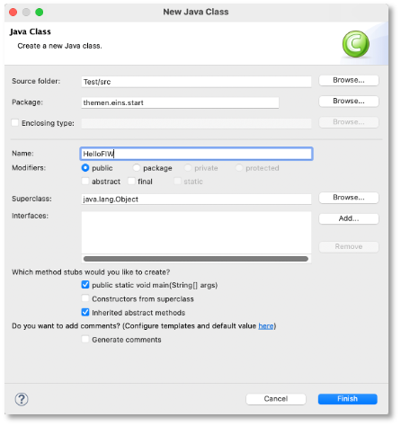

# Unser erstes Programm

Bevor wir uns mit der Funktionsweise von Java auseinandersetzen, schreiben wir einfach einmal unser erstes Programm. Wir öffnen dazu [*Eclipse*](tools.md#eclipse) und erstellen uns eine Klasse `HelloFIW`. Dazu 

1. erstellen wir uns ein Java-Projekt (falls noch nicht geschehen): Menüpunkt `File --> New --> Java Project`, geben in das Textfeld `Project name:` z.B. `WS22` ein.

	

	Den `module name` beim Erstellen der `module-info.java` können Sie genau so lassen, wie vorgeschlagen (`WS22`). Klicken Sie auf den Button `Create`.

2. erstellen wir uns ein Paket: Menüpunkt `File --> New --> Package` und geben `themen.eins.start` ein.
3. erstellen wir uns eine Klasse: Wir wählen das Paket `themen.eins.start` aus und wählen den Menüpunkt `File --> New --> Class`, geben in dem Fenster den Klassennamen `HelloFIW` ein und setzen bei `public static void main(Strg[] args)` ein Häkchen:



Im Editor-Fenster von Eclipse erscheint:

=== "HelloFIW.java"
```java linenums="1"
package themen.eins.start;

public class HelloFIW 
{

	public static void main(String[] args) 
	{
		// TODO Auto-generated method stub

	}

}
```

Schauen wir uns diesen Code zunächst an:

- in Zeile `1` sehen wir, in welchem Paket sich unsere Klasse befindet. Die Anweisung `package themen.eins.start;`definiert, dass wir uns im Paket `themen.eins.start` befinden. Mit Paketen werden wir uns in Kürze ausführlich auseinandersetzen.
- in Zeile `3` steht unsere Klassendefinition. Diese erkennen wir am Schlüsselwort `class` gefolgt von dem Namen der Klasse `HelloFIW`. Das Schlüsselwort `public` beschreibt, dass es sich um eine *öffentliche* Klasse handelt, die von allen genutzt werden kann. Dieses Schlüsselwort ist ein sogenannter *Sichtbarkeitsmodifierer* (auch *Zugriffsmodifizierer*). Mit Sichtbarkeitsmodifizierern werden wir uns ebenfalls noch ausführlich auseinandersetzen. Wichtig ist, dass die Klasse nicht nur aus dem Klassenkopf (`public class HelloFIW`) besteht, sondern aus allem, was diese Klassen enthält (dem Klassenrumpf). Der Klassenrumpf beginnt mit einer öffnenden geschweiften Klammer `{` (Zeile `4`) und endet mit einer schließenden geschweiften Klammer `}` (Zeile `12`).
- eine Klasse kann beliebig viele *Methoden* enthalten. Unsere Klasse enthält bis jetzt eine Methode, die Methode namens `main()`. Methoden erkennen wir an den runden Klammern nach dem Methodennamen. Hier ist der Name `main` gefolgt von runden Klammern, in denen *Parameter* (auch *Argumente* genannt) definiert sein können (hier ein Parameter namens `args` vom Typ String-Array: `Strg[] args`). Wie bei den Klassen auch, bestehen Methoden aus einem Methodenkopf und einem Methodenrumpf. Wie bei den Klassen auch, beginnt der Methodenrumpf mit einer öffnenden geschweiften Klammer (Zeile `7`) und endet mit einer schließenden geschweiften Klammer (Zeile `10`). Der Methodenkopf 
	- beginnt erneut mit einem Sichtbarkeitsmodifizierer. Dieser ist hier wieder `public` und gibt an, dass diese Methode öffentlich ist und von allen ausgeführt werden kann. 
	- Danach kommt das Schlüsselwort `static`. Dieses Schlüsselwort besagt, dass es sich bei dieser Methode um eine *Klassenmethode* handelt. Das Gegenstück zu einer Klassenmethode ist die *Objektmethode*. Wir werden uns mit der Unterscheidung zwischen Klassen- und Objektmnethoden ausführlich auseinandersetzen. Wir können uns aber schon merken (wenn überhaupt), dass wir eine Klassenmethode aufrufen können ohne ein Objekt der Klasse erstellen zu müssen. 
	- Danach kommt das Schlüsselwort `void`. Dieses Schlüsslwort gibt an, dass die Methode nichts zurückgibt. An dieser Stelle steht der Rückgabetyp eine Methode - wenn die Methode etwas zurückgibt. Unsere Methode gibt nichts zurück, deshalb hier `void`. Wir werden uns mit Methodenrückgaben ausführlich beschäftigen.
	- Jetzt kommt der Name der Methode, hier `main`. Die `main()`-Methode ist eine ganz besondere Methode. Sie existiert in einem Programm genau einmal und wird aufgerufen, wenn das Programm aufgerufen wird - die sogenannte *Programmmethode*. Wenn wir ein Programm ausführen, wird alles das ausgeführt, was in dem Rumpf der `main()`-Methode definiert ist (derzeit noch nichts). 
	- In den runden Klammern stehen *Parameter* (auch *Argumente* genannt). In unserem Fall ist ein Parameter namens `args` definiert. Der *Datentyp* dieses Parameters ist `Strg[]`, d.h. dass der Parameter einem *Array* von Zeichenketten *Strings* entspricht. Wir kümmern uns um Parameter später ausführlich. 
- In unserer Methode gibt es derzeit nur einen einzigen Eintrag (Zeile `8`). Dabei handelt es sich um einen *Kommentar*, genauer hier um einen *Zeilenkommentar*. Zeilenkommentare beginnen mit einem Doppelslash `//`. Hinter diesen Doppelslash können Sie schreiben, was Sie möchten - bis an das Zeilenende. Kommentare dienen Ihnen dazu, den Code verständlicher zu gestalten oder Ihnen Hinweise zu geben. Hier steht der Hinweis, dass die Methode automatisch durch Eclipse erstellt wurde und Sie noch das ToDo haben, die Methode zu befüllen. Das machen wir jetzt auch!

Wir löschen den Kommentar und fügen nun die Anweisung `System.out.println("HelloFIW !");` in unseren Methodenrumpf ein. Unsere Klasse sieht nun so aus (die neuhinzugekommene Zeile ist markiert):

=== "HelloFIW.java"
``` java linenums="1" hl_lines="8"
package themen.eins.start;

public class HelloFIW
{

	public static void main(String[] args)
	{
		System.out.println("Hello FIW!");

	}

}
```

Jetzt wählen wir entweder im Menü `Run --> Run` oder klicken auf den kleinen grünen Kreis mit dem weißen Pfeil in der Mitte in der Werkzeugleiste. Sie werden gefragt, ob Sie Ihr Programm zunächst speichern wollen. Bevor Sie das bestätigen, sollten Sie ein Häkchen setzen, um zu sagen, dass Sie das gar nicht mehr gefragt werden wollen, sondern das Programm immer gespeichert werden soll, bevor Sie es ausführen. In der Konsole erscheint:

 

!!! success
    Herzlichen Glückwunsch! Sie haben Ihr erstes Java-Programm geschrieben und ausgeführt!

### System.out.println("Hello FIW!");

Schauen wir uns `System.out.println("Hello FIW!");` zunächst etwas genauer an. Wir verwenden hier eine Klasse, nämlcih die Klasse `System`. Diese Klasse existiert bereits und wurde von den Java-Entwicklern für uns gesschrieben. Sie gehört zum Standardpaket von Java, existiert bereits seit der ersten Version von Java und befindet sich im Paket `java.lang`. Diese Klasse hat eine interssante Klassenvariable, die wir verwenden, nämlich `out`. Diese Variable stellt in unserem (Betriebs-)System die Verbindung zu unserem Standardausgabegerät bereit, in unserem Fall die Konsole. Um nun eine Ausgabe auf diese Konsole zu generieren verwenden wir die Methode `println()`. Wir sehen hier eine typische Notation in Java, die sogenannte *Punktnotation*. Mithilfe dieser Punktnotation greifen wir auf Eigenschaften von Klassen und Objekten zu. In unserem Beispiel greifen wir mit `System.out` auf das Standardausgabegerät zu und mit `System.out.println()` auf die `println()`-Methode des Ausgabegerätes[^1].

[^1]: Wenn wir ganz genau sein wollen, dann ist `out` vom Typ `PrintStream` und wir greifen auf die Objektmethode `println()` des `PrintStream`-Objektes `out` zu. 

Die Methode `println()` erzeugt also eine Ausgabe auf unsere Konsole. Jetzt müssen wir nur noch sagen, WAS ausgegeben werden sollen. Dazu übergeben wir dieser Methode eine *Zeichenkette* (einen *String*). Eine Zeichenkette erkennt man an den doppelten Anführungsstrichen `"das ist eine Zeichekette"`. Innerhalb dieser Anführungsstriche können Sie schreiben, was Sie möchten (außer `"`). Wir haben uns für `"Hello FIW!"`entschieden und genau diese Zeichenkette (ohne die Anführungsstriche) wird ausgegeben. Die Zeichnkette, die wir ausgeben möchten, schreiben wir in die runden Klammern der `println()`-Methode, also `println("Hello FIW!")`. 

Bei `System.out.println("Hello FIW!");` handelt es sich um eine *Anweisung*. Eine Anweisung endet in Java immer mit einem Semikolon `;`. Dieses dürfen wir nicht vergessen, ansonsten haben wir einen *Syntaxfehler* und unser Programm kann nicht compiliert und nicht ausgeführt werden. 

!!! hint "Tipp"
	Wir müssen `System.out.println()` von nun an recht häufig schreiben. Deshalb gibt es in Eclipse dafür einen Shortcut. Schreiben Sie einfach `syso` und klicken dann die `Control` (`Strg`)-Taste zusammen mit der Leertaste und dann `Enter`. Aus dem `syso` macht Eclipse dann automatisch `System.out.println()`.


Das heißt, dass jede der Ausgaben mithilfe der `println()`-Methode in einer neuen Zeile erfolgt. Nach jeder Ausgabe erfolgt also ein Zeilenumbruch, der Ausgabecursor wird in die nächste Zeile gesetzt. Die nächste Ausgabe beginnt am Anfang der neuen Zeile. 

Wir wollen nun unser Programm ändern und verwenden nicht mehr die `println()`- Methode, sondern `print()`:

=== "main()-Methode mit print()"
	``` java linenums="1" hl_lines="8-10"
	package themen.eins.start;

	public class HelloFIW
	{

		public static void main(String[] args)
		{
			System.out.print("Hello FIW!");
			System.out.print("Hello FIW!");
			System.out.print("Hello FIW!");
		}

	}
	```

Wir führen das Programm erneut aus (grüner Pfeil ) und erhalten auf der Konsole die Ausgabe:

``` bash
Hello FIW!Hello FIW!Hello FIW!
```

Die `print()`-Methode gibt also nur die Zeichenkette aus, führt aber danach keinen Zeilenumbruch durch. Der Ausgabecursor bleibt hinter dem letzten ausgegebenen Zeichen stehen. Unsere drei Zeichenketten werden in der Konsole deshalb hintereinander ausgegeben.

!!! question "Übung"
	Was müssen Sie im Programm ändern, damit zwischen `!` und `H` jeweils ein Leerzeichen ist, also anstelle von `Hello FIW!Hello FIW!Hello FIW!` besser `Hello FIW! Hello FIW! Hello FIW!` ausgegeben wird? 

Wir ändern nun unser Programm erneut und fügen folgende Anweisungen hinzu: `System.out.println()`. Wir rufen also die `println()`-Methode auf, ohne eine Zeichenkette zu übergeben, die ausgegeben werden soll. Diese Anweisung sorgt einfach dafür, dass ein Zeilenumbruch erfolgt. Es wird also nichts ausgegeben, aber der Ausgabecursor an den Beginn der nächsten Zeile gesetzt.

=== "main()-Methode mit print() und println()"
	``` java linenums="1" hl_lines="9 11 13"
	package themen.eins.start;

	public class HelloFIW
	{

		public static void main(String[] args)
		{
			System.out.print("Hello FIW!");
			System.out.println();
			System.out.print("Hello FIW!");
			System.out.println();
			System.out.print("Hello FIW!");
			System.out.println();
		}

	}
	```

Wir führen das Programm erneut aus (grüner Pfeil ) und erhalten auf der Konsole die Ausgabe:

``` bash
Hello FIW!
Hello FIW!
Hello FIW!
```

!!! question "Übung"
	Erzeugen Sie folgende Ausgabe auf der Konsole:
	``` bash
	Hello FIW!

	Hello FIW!

	Hello FIW!

	```

??? example "Eine mögliche Lösung"
	``` java linenums="1"
	package themen.eins.start;

	public class HelloFIW
	{

		public static void main(String[] args)
		{
			System.out.println("Hello FIW!");
			System.out.println();
			System.out.println("Hello FIW!");
			System.out.println();
			System.out.println("Hello FIW!");
			System.out.println();
		}

	}
	```

### Syntaxfehler

Programmieren bedeutet auch, Fehler zu machen. Wichtig ist, dass Sie die Fehlerausschriften lesen und die Fehler analysieren. Haben Sie einen Syntaxfehler, so ist ein Bereich Ihres Programmcodes rot unterstrichen und an der Seite erscheint ein rotes Kreuz. Fahren Sie mit der Maus über das rote Kreuz, um die Fehlerausschrift zu erhalten. Bei einem Syntaxfehler lässt sich das Programm nicht compilieren. Sie können es trotzdem versuchen und erhalten die Fehlerausschrift dann auf der Konsole. Das folgende Bild zeigt einen Fehler:


Es erscheint die Fehlermeldung `Syntax error, insert ";" to complete BlockStatements` - ein Hinweis darauf, dass ein Semikolon fehlt - nämlcih am Ende der Anweisung. 

In vielen Fällen bietet Eclipse einen sogenannten Quickfix an. Meistens können Sie diesen Vorschlag einfach annehmen (durch Mausclick auf den Vorschlag). Die folgende Abbildung zeigt einen solchen Quickfix für den Fehler, dass die Methode `prntln()` nicht existiert (es fehlt das `i`).


!!! success
    Wir haben unser erstes Java-Programm geschrieben und ausgeführt! Wir haben gelernt, wie wir mithilfe der Methoden `println()` und `print()` Zeichenketten auf die Konsole ausgeben können und wir haben uns angeschaut, wie wir Fehlerausschriften lesen. Nun schauen wir uns einmal an, was im Hintergrund passiert, wenn wir das Programm ausführen.

## Kommentare

In Ihren Quellcode (Ihr Programm) können Sie an allen beliebigen Stellen *Kommentare* schreiben. Kommentare werden vom Compiler ignoriert, d.h. Sie können dort hineinschreiben, was und wie Sie möchten. Es gibt drei Arten von Kommentaren in Java:

- *Zeilenkommentare*: Diese beginnen mit `//` und danach kommt der Kommentar bis zum Zeilenende. Die neue Zeile ist dann wieder "normaler" Quellcode
	```java
	System.out.println("Ausgabe1"); 	// hier ist ein Zeilenkommentar bis zum Ende der Zeile
	System.out.println("Ausgabe2"); 	// hier ist noch ein Zeilenkommentar
	```
- *Blockkommentare*: Diese beginnen mit `/*` und danach kommt der Kommentar. Er kann sich über mehrere Zeilen erstrecken. Ein Blockkommentar endet mit `*/`. Nach diesem Ende ist sofort wieder "normaler" Quellcode.
	```java
	System.out.println("Ausgabe1");
	/*
		hier ist ein Blockkommentar
		er kann über beliebig viele 
		Zeilen gehen
		Er endet erst mit
	*/ 	
	System.out.println("Ausgabe2"); 	
	```
- *Java-Doc-Kommentare*: `javadoc` ist ein Programm aus dem *Java Development Kit (JDK)*. Es wird eingesetzt, um den Code zu dokumentieren. Wir werden `javadoc` noch ausführlich behandeln. Mit `javadoc` kommentierte Klassen finden Sie [**hier**](https://docs.oracle.com/en/java/javase/14/docs/api/index.html). Java-Doc-Kommentare beginnen mit `/**` und enden mit `*/`. Java-Doc-Kommentare verhalten sich wie Blockkommentare. Sie erstrecken sich über mehrere Zeilen und nach dem `*/` ist, wie bei Blockkommentaren, wieder "normaler" Quellcode. 
	```java
	package uebungen.uebung0;
	/**
	 * 
	 * @author jornfreiheit
	 * 
	 * Das ist die erste Klasse, die wir geschrieben haben.
	 * Sie erzeugt einfache Ausgaben von Zeichenketten auf
	 * die Konsole.
	 *
	 */
	public class MyFirstClass { 
		// Hier die Implementierung unserer Klasse - nicht gezeigt
	}
	```

## Compilieren und Ausführen

Wir haben nun unser erstes einfaches Programm geschrieben - in der Programmiersprache *Java*. Wie wir in [**Werkzeuge -> Java**](./tools.md#java) bereits bei der Installation von Java erläutert haben, ist Java nicht nur eine Programmiersprache, sondern auch ein Programm, in dem wir Java-Programme ausführen können - die *Laufzeitumgebung* von Java. Wir werden zunächst erläutern, was im Hintergrund passiert, wenn wir ein selbstgeschriebenes Java-Programm ausführen. 

Zum besseren Verständnis erzeugen wir uns zunächst ein Verzeichnis `test` irgendwo auf unserem Rechner:

``` bash
mkdir test
cd test
```

Dieses Verzeichnis werden wir später wieder löschen. Nun erzeugen wir uns mithilfe von `vi`oder `vim` eine Datei `Test.java`:

``` bash
vim Test.java
```

Die Datei öffnet sich zum Schreiben und nach Eingabe von `i` können wir in diese Datei Text einfügen. Wir fügen folgendes Programm ein (Kopieren Sie das Programm und fügen es mit `Strg+V` in die Datei `Test.java` ein:

=== "Test.java"
	``` java linenums="1"
		public class Test
		{

			public static void main(String[] args)
			{
				System.out.print("Hello ");
				for(String s : args)
				{
					System.out.print(s + " ");
				}
				System.out.println("!");
			}
		}
	```

Beenden Sie den Einfügemodus von `vim` durch Drücken der Taste `Esc` und speichern die Datei und beenden `vim` unter Eingabe von `ZZ`. In unserem Ordner `test` befindet sich nun die Datei `Test.java`:

``` bash
ls -la
```

zeigt den Inhalt unseres Verzeichnisses `test` an (z.B.):

``` bash
total 8
drwxr-xr-x@  3 jornfreiheit  staff    96  3 Aug 14:17 .
drwxr-xr-x@ 39 jornfreiheit  staff  1248  1 Nov  2018 ..
-rw-r--r--   1 jornfreiheit  staff   189  3 Aug 14:17 Test.java
```

Wir haben eine Klasse `Test` in der Datei erstellt, die genauso heißt, wie die Klasse, nämlich `Test.java`. Wir werden in Zukunft immer die Klasse in der gleichnamigen Datei speichern, die die Dateiendung `.java` hat - das macht Eclipse für uns automatisch. 

### Compilieren der Klasse

Ein Computer kann keine Datei ausführen, die in einer Programmiersprache geschrieben wurde, egal um welche Programmiersprache es sich handelt. Computer verstehen nur Folgen von Nullen und Einsen, also so etwas wie `1000111110101011...`. In eine solche *Maschinensprache* muss unser Programm übersetzt werden. Das *Übersetzen* erfolgt durch einen *Compiler*[^2].

[^2]: Man unterscheidet bei Programmiersprachen, ob die Programme durch einen *Compiler* oder durch einen *Interpreter* übersetzt werden. Programmiersprachen, bei denen die Programme durch einen *Interpreter* übersetzt werden, werden auch *Skriptsprachen* genannt. In Skriptsprachen wird jede einzelne Anweisung nach und nach *interpretiert*, d.h. übersetzt, dann ausgeführt, dann die nächste Anweisung übersetzt, ausgeführt usw. Java-Programme werden compiliert, d.h. sie werden als Ganzes übersetzt und erst dann ausgeführt.

Der Java-Compiler heißt `javac`. Wir haben den Java-Compiler zusammen mit dem *Java Development Kit (JDK)* installiert (siehe [**hier**](./tools.md#java)). Mithilfe des Compilers übersetzen wir nun unsere Klasse:

``` java
javac Test.java
```

Wenn wir uns nun erneut den Inhalt unseres Verzeichnisses ansehen

``` bash
ls -la
```

dann entdecken wir, dass eine Datei `Test.class` erzeugt wurde.

```bash
total 16
drwxr-xr-x@  4 jornfreiheit  staff   128  7 Aug 11:02 .
drwxr-xr-x@ 39 jornfreiheit  staff  1248  1 Nov  2018 ..
-rw-r--r--   1 jornfreiheit  staff  1001  7 Aug 11:02 Test.class
-rw-r--r--   1 jornfreiheit  staff   189  3 Aug 14:17 Test.java
```

Unser Java-Compiler hat unser Programm, das in `Test.java` enthalten ist, in sogenannten *Bytecode* übersetzt. Das ist ein Zwischenschritt, den es in Java gibt. Das Programm wird nicht direkt in Maschinencode übersetzt, sondern in Bytecode. 

### Ausführen des Programms

Dieser Bytecode kann nun von der *Java-Laufzeitumgebung (Java Runtime Environment - JRE)* ausgeführt werden. Diese Laufzeitumgebung ist selbst ein Programm, eine sogenannte *Virtuelle Maschine*[^3].

[^3]: Genauer handelt es sich dabei um einen *Interpreter*. Der Java-Bytecode wird Anweisung für Anweisung interpretiert und ausgeführt. 

Die Ausführung unseres Programms erfolgt mithilfe der Java-Laufzeitumgebung `java`:

```bash
java Test
```

Beachten Sie, dass Sie nicht die Dateiendung `.class` für Ihr Programm angeben (müssen/dürfen). Auf unserer Konsole erscheint die Ausgabe 

```bash
Hello !
```

Diese Ausgabe erfolgt durch die Anweisung `System.out.print("Hello ");` (in Zeile `6`), gefolgt von der Anweisung `System.out.println("!");` (in Zeile `11`). In den Zeilen `7`-`10` stehen Anweisungen, die wir noch nicht verstehen. Das macht nichts, wir kommen später darauf zurück. Es ist jedoch so, dass wir dadurch unserem Programm *Argumente* übergeben können. Betrac hten wir zum Beispiel die Anweisung `ls -la`. `ls` wäre z.B. ein "Programm" und `-la` ein Argument (`-l` sorgt dafür, dass ein langes Listenformat erscheint, also alle Angaben zu den Dateien und Ordnern erscheinen und `-a` sorgt dafür, dass auch die Dateien und Ordner angezeigt werden, die mit `.` beginnen). Versuchen wir also einmal, umserem Programm `Test` ein Argument zu übergeben (ohne `-`):

```bash
java Test FIW
```

Es erscheint die Ausgabe:

```bash
Hello FIW !
```

Wir können sogar mehrere Argumente übergeben:

```bash
java Test FIW HTW Berlin Welt
```

Es erscheint die Ausgabe:

```bash
Hello FIW HTW Berlin Welt !
```

Es erscheint zunächst aufwendig, das Programm zunächst in Bytecode zu übersetzen und dann den Bytecode nochmal interpretieren und ausführen zu lassen. Warum wird nicht direkt in Maschinencode übersetzt? Die Antwort ist, dass der Java-Compiler so beriebssystemunabhängig arbeiten kann. Alle, egal, ob Windows-, iOS- oder Linux-Nutzerinnen können den gleichen Compiler verwenden. Die Programme können völlig systemunabhängig geschrieben und von allen compiliert werden. Erst die Java-Laufzeitumgebung ist beriebssystemabhängig, d.h. diese wird entsprechend dem Betriebssystem installiert. Alle Java-Programme und auch ihre Compilierung sind jedoch völlig losgelöst vom verwendeten Betriebssystem und können deshalb überall ausgeführt werden.

!!! success
    Wir haben uns angeschaut, was passiert, wenn wir das Programm übersetzen und ausführen. Die Übersetzung erfolgt durch den Java-Compiler `javac`. Dieser erzeugt *Java-Bytecode*. Die Ausführung dieses Bytcodes übernimmt die Java-Laufzeitumgebung `java`. Diese interpretiert den Bytecode und führt ihn *sequentiell* (also nacheinander, Anweisung für Anweisung) aus.


