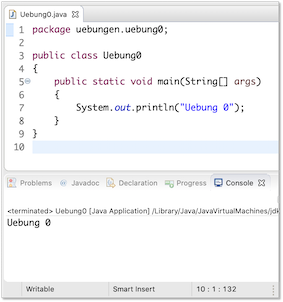
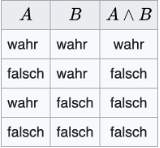
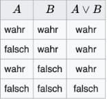
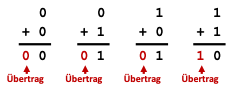
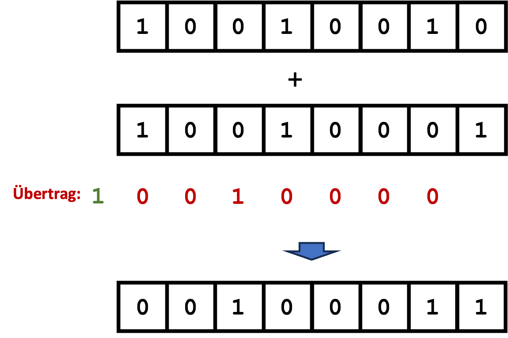

# Übungen

## Übungsblätter (wochenweise)


??? note "<a id="ubung-0"></a>Übung 0"
	1. Installieren Sie sich - falls noch nicht geschehen - eine Java-Entwicklungsumgebung (siehe [**Java**](tools.md#java)).
	2. Installieren Sie sich die IDE Ihrer Wahl (siehe [**IDE**](tools.md#ide)). In den Vorlesungen und Übungen verwende ich [**Eclipse**](tools.md#eclipse) und beschreibe die Schritte auch für Eclipse.
	3. Starten Sie Eclipse durch Doppelklick auf das Programmsymbol.
	4. Erstellen Sie einen *Workspace* (Arbeitsbereich) in einem gewünschten Ordner (z. B.
	`Prog1`) im Dateisystem. Achten Sie darauf, dass Sie Schreibrechte in diesem Ordner besitzen.
	5. Anlegen eines Projektordners:
		* Auswahl im Menü `File-->New-->Java Project`.
		* Eingabe des `Project name:` Name des Projektes (z.B. `WiSe24`). Klicken auf den Button `Finish`.
		* Das Fenster `New module-info.java` können Sie einfach mit `Create` bestätigen.
	4. Erstellen eines neuen Packages (Paketes):
		* Öffnen der Projektmappe im `Package Explorer`.
		* Auswahl des Ordners `src` mit der rechten Maustaste.
		* Auswahl des Menüpunktes `New --> Package`.
		* Geben Sie folgenden Paketnamen ein (Paketnamen werden kleingeschrieben) `uebungen.uebung0` (Achten Sie auf den Punkt und dass Sie alles zusammen schreiben).
	5. Erstellen einer neuen Klasse:
		* Öffnen der Projektmappe im Package Explorer.
		* Auswahl des Paketes (`uebungen.uebung0`) mit der rechten Maustaste.
		* Auswahl des Menüpunktes `New --> Class`.
		* Eingabe des Namens, der gleichzeitig der Klassen- und Dateiname ist: `Uebung0`. Klassennamen werden immer groß geschrieben.
		* Setzen des Häkchens bei `public static void main()`. (Sollten Sie vergessen haben, das Häkchen zu setzen, dann ist die Klasse, nachdem Sie `Finish` gedrückt haben, leer. Setzen Sie dann den Cursor zwischen die beiden geschweiften Klammern `{ }`, geben dann `main` ein und drücken die <kbd class="key-ctrl">Ctrl</kbd><span>+</span><kbd class="key-space">Leer</kbd>-Tasten und anschließend <kbd class="key-enter">Enter</kbd>. Dann erscheint die `main()`-Methode)
		* Klicken auf den Button `Finish`.
	6. In die `main()`-Methode (zwischen die geschweiften Klammern `{` und `}` geben 	Sie ein: `System.out.println("Uebung 0"));`.
	7. Drücken Sie dann entweder auf den -Button oder 		wählen Sie aus dem Menü `Run --> Run` oder drücken Sie <kbd class="key-shift">shift</kbd><span>+</span><kbd class="key-command">command</kbd>+</span><kbd class="key-f11">f11</kbd>. In der `Console` in Ihrer IDE (in Eclipse unten) erscheint `Uebung 0`. 

	=== "Uebung0.java"
		```java
		package uebungen.uebung0;

		public class Uebung0
		{
			public static void main(String[] args)
			{
				System.out.println("Uebung 0");
			}
		}
		```

	

	!!! success
		Fertig! Ihre Entwicklungsumgebung ist bereit! Wir können loslegen. :thumbsup:


??? note "<a id="ubung-1"></a>Übung 1"
	1. Erstellen Sie ein package `uebungen.uebung1`. 
	2. Erstellen Sie in diesem package eine Klasse `Uebung1` mit `main()`-Methode.
	3. Deklarieren und initialisieren Sie in der `main()`-Methode jeweils eine Variable mit dem Datentyp `int`, `long`, `char`, `byte`, `short`, `float`, `double`, `boolean` und `String`. Geben Sie alle Werte einzeln durch Aufruf der `println()`-Methode aus. Erzeugen Sie dabei folgende Ausgabe (Werte nur Beispiele):
	```bash
	Wert vom Typ int 		: 	123
	Wert vom Typ long 		: 	456789
	Wert vom Typ char 		: 	a
	Wert vom Typ byte 		: 	127
	Wert vom Typ short 		: 	32767
	Wert vom Typ float 		: 	4.23
	Wert vom Typ double		: 	6.98
	Wert vom Typ boolean	: 	true
	Wert vom Typ String		: 	Hallo!
	```
	4. Setzen Sie den Wert Ihrer `int`-Variablen auf `2147483647`. Geben Sie den Wert auf der Konsole aus, z.B.:	
	```bash
	Wert von i 	: 	2147483647
	```
	Versuchen Sie nun den Wert auf `2147483648` zu setzen. Was passiert? Warum?
	5. Wiederholen Sie das gleiche mit einer `long`-Variablen.
	6. Weisen Sie Ihrer `char`-Variablen den Wert `65` zu. Geben Sie den Wert Ihrer `char`-Variablen aus. Was passiert? Warum?
	7. Gegeben ist die folgende Klasse:
			
		```java
		public class PrinterClass 
		{

			public static void main(String[] args) 
			{
				System.out.print("answer=");
				System.out.println(42);
			}
		}
		```

		Was wird auf der Konsole ausgegeben?<br/>
		<b>a)</b> 
		```
		answer=42
		```
		<b>b)</b> 
		```
		answer=
		42
		```
		<b>c)</b> 
		```
		answer
		=
		42
		```
	


??? question "Eine mögliche Lösung für Übung 1"
	```java
	package uebungen.uebung1;

	public class Uebung1
	{
		public static void main(String[] args)
		{
			int in = 123;
			long lo = 456789;
			char ch = 'a';
			byte by = 127;
			short sh = 32767;
			float fl = 4.23f;		// f notwendig
			double d1 = 6.98;
			boolean b1 = true;
			String s1 = "Hallo!";
			
			System.out.println(" --- Aufgabe 3 -------");
			System.out.println();
			System.out.print("Wert vom Typ int     : ");
			System.out.println(in);
			System.out.print("Wert vom Typ long    : ");
			System.out.println(lo);
			System.out.print("Wert vom Typ char    : ");
			System.out.println(ch);
			System.out.print("Wert vom Typ byte    : ");
			System.out.println(by);
			System.out.print("Wert vom Typ short   : ");
			System.out.println(sh);
			System.out.print("Wert vom Typ float   : ");
			System.out.println(fl);
			System.out.print("Wert vom Typ double  : ");
			System.out.println(d1);
			System.out.print("Wert vom Typ boolean : ");
			System.out.println(b1);
			System.out.print("Wert vom Typ String  : ");
			System.out.println(s1);
			
			System.out.println();
			System.out.println(" --- Aufgabe 4 -------");
			System.out.println();
			in = 2147483647;
			System.out.println("Wert vom Typ int     : " + in );
			//in = 2147483648;		// Compilerfehler out of range
			
			System.out.println();
			System.out.println(" --- Aufgabe 5 -------");
			System.out.println();
			lo = 2147483647;	
			System.out.println("Wert vom Typ long    : " + lo );
			lo = 2147483648L;		// L notwendig, da 2147483648 kein int	
			System.out.println("Wert vom Typ long    : " + lo );
			
			System.out.println();
			System.out.println(" --- Aufgabe 6 -------");
			System.out.println();
			ch = 65;
			System.out.println(ch);		// A
			
			// 7 a)		
		}

	}
	```

??? note "<a id="ubung-2"></a>Übung 2"
	
	1. Erstellen Sie ein package `uebungen.uebung2`. 
	2. Erstellen Sie in diesem package eine Klasse `Uebung2` mit `main()`-Methode.
	3. Deklarieren Sie in `main()` 2 `int`-Variablen und geben Sie Ihnen Werte (die folgenden Werte `17` und `4` sind nur Beispiele). Erzeugen Sie nun unter Verwendung dieser Variablen folgende Ausgabe (bei anderen Werten natürlich entsprechend anders):  
	```bash 
	17 geteilt durch 4 ergibt 4. Es bleibt ein Rest von 1
	```
	

	4. Erzeugen Sie nun stattdessen folgende Ausgabe: 
	```bash 
	17/4 = 4
	17 mod 4 = 1
	```
	5. Beachten Sie, dass Sie den Wert für den Quotienten und für den Rest für `3.` und `4.` nur einmal ermitteln sollen.

	6. Deklarieren Sie sich eine `boolean`-Variable. Der Wert der Variablen soll `true` sein, wenn das Produkt der beiden `int`-Variablen aus `3.` gerade ist und `false`, wenn es ungerade ist. 

	7. Probieren Sie die Dvision `100/3` in den folgenden Datentypen: `int`, `float`, `double`. Was stellen Sie fest? 

	8. Prüfen Sie, ob die letzte Ziffer von 2 `int`-Variablen gleich ist (dann `true`, sonst `false`). 

	9. <b>Zusatz</b>: Gegeben sei eine Anzahl von Stunden. Geben Sie aus, wieviel ganze Tage in dieser Anzahl enthalten sind, z.B. 
	```bash 
	In 34567 Stunden sind 1440 ganze Tage enthalten.
	```
	Wieviele Stunden bleiben übrig? 
	```bash
	Zieht man von den 34567 Stunden die 1440 Tage ab, bleiben 7 Stunden übrig.
	```


??? question "Eine mögliche Lösung für Übung 2"
	```java
	package uebungen.uebung2;

	public class Uebung2
	{

		public static void main(String[] args)
		{
			System.out.println();
			System.out.println("-------------------- 3. -------------------------");
			System.out.println();
			int i1 = 77;
			int i2 = 5;
			int quotient = i1/i2;
			int rest = i1%i2;
			
			System.out.print(i1 + " geteilt durch " + i2 + " ergibt " + quotient + ". ");
			System.out.println("Es bleibt ein Rest von " + rest + ".");
			
			System.out.println();
			System.out.println("-------------------- 4. -------------------------");
			System.out.println();
			
			System.out.println(i1 + "/" + i2 + " = " + quotient);
			System.out.println(i1 + " mod " + i2 + " = " + rest);
			
			System.out.println();
			System.out.println("-------------------- 6. -------------------------");
			System.out.println();
			
			int product = i1 * i2;
			boolean productIsEven = product % 2 == 0;
			boolean productIsOdd = !productIsEven;		// product % 2 == 1
			
			System.out.println(product + " ist gerade   ? " + productIsEven);
			System.out.println(product + " ist ungerade ? " + productIsOdd);
			
			
			System.out.println();
			System.out.println("-------------------- 7. -------------------------");
			System.out.println();
			
			System.out.println("int    : " + 100/3); 		// int
			
			System.out.println("float  : " + 100.0f/3.0f); 	// float
			System.out.println("float  : " + 100f/3f); 		// float
			
			System.out.println("double : " + 100.0/3.0); 	// double
			System.out.println("double : " + 100.0/3); 		// double
			System.out.println("double : " + 100/3.0); 		// double
			
			System.out.println();
			System.out.println("-------------------- 8. -------------------------");
			System.out.println();
			
			int lastDigitOfi1 = i1 % 10;
			int lastDigitOfi2 = i2 % 10;
			boolean lastDigitsAreEqual = (lastDigitOfi1 == lastDigitOfi2);
			
			System.out.println();
			System.out.println("-------------------- 9. -------------------------");
			System.out.println();
			
			int hours = 34567;
			int oneDay = 24;
			int days = hours/oneDay;
			
			System.out.println("In " + hours + " Stunden sind " + days + " ganze Tage enthalten.");
			System.out.println("Zieht man von den " + hours + " Stunden die " + days + " Tage ab, "
					+ "bleiben " + hours%oneDay + " Stunden übrig.");
			
		}

	}

	```


??? note "<a id="ubung-2a"></a>Übung 2a (1.11.2024)"
	
	1. Verwenden Sie erneut die Klasse `Uebung2` aus dem Paket `uebungen.uebung2` (oder Sie erstellen sich ein Paket `uebungen.uebung2.a` und darin eine Klasse `Uebung2a`).
	3. Schreiben Sie eine Methode 
	```java
	public static void printIntDivision(int nr1, int nr2) 
	{
	}
	``` 
	Diese Methode soll folgende Ausgabe auf die Konsole erzeugen,
	z.B. für `printIntDivision(7, 4);` die Ausgabe 
	```bash
	7 geteilt durch 4 ergibt 1. Es bleibt ein Rest von 3
	```
	z.B. für `printIntDivision(17, 4);` die Ausgabe
	```bash 
	17 geteilt durch 4 ergibt 4. Es bleibt ein Rest von 1
	```
	Falls kein Rest bleibt, soll die Ausgabe sein:
	```bash
	16 geteilt durch 4 ergibt 4. Es bleibt kein Rest.
	```
	Rufen Sie die Methode entsprechend in der `main()`-Methode auf!<br/><br/>
	**Zusatz:** Prüfen Sie, ob der Wert von `nr2` ungleich `0` ist. Nur dann ist die Division definiert. Sollte er `0` sein, geben Sie `Division durch 0 ist nicht definiert!` auf die Konsole aus. 

	5. Schreiben Sie zwei Methoden 
	```java
	public static int getQuotient(int nr1, int nr2) {} // und 
	public static int getRemainder(int nr1, int nr2) {}
	``` 
	Rufen Sie diese Methoden in der `main()`-Methode auf generieren mit den Aufrufen und unter Verwendung der `println()`-Methode folgende Ausgaben: 
	```bash 
	17/4 = 4
	17 mod 4 = 1
	```
	6. Besitzen die folgende Methodenaufrufe einem Wert? Wenn ja, welcher?

		- `printIntDivision(17, 4);`
		- `getQuotient(17,4);`
		- `getRemainder(17,4);`

	7. Können wir die Methoden `getQuotient(int nr1, int nr2)` und `getRemainder(int nr1, int nr2)` auch in der `printIntDivision(int nr1, int nr2)`-Methode verwenden/aufrufen? Wenn ja, wie?
	8. Schreiben Sie eine Methode `lastDigitsAreEqual(int nr1, int nr2)`, die ein `true` zurückgibt, wenn `nr1` und `nr2` dieselbe letzte Ziffer haben und `false` sonst. <br/><br/>
	**Zusatz:** Schreiben Sie eine Methode `last2DigitsAreEqual(int nr1, int nr2)`, die ein `true` zurückgibt, wenn `nr1` und `nr2` dieselben letzten 2 Ziffern haben. 
	9. Schreiben Sie eine Methode `getDays(int hours)`, die für eine gegebene Stundenanzahl `hours` zurückgibt, wieviele ganze Tage diese Studnden entsprechen. Schreiben Sie eine Methode `getRemainingHours(int hours)`, die für eine gegebene Stundenanzahl `hours` zurückgibt, wieviele Stunden noch verbleiben, wenn man die ganzen Tage darin abzieht. Erstellen Sie in `main()` mit diesen Methoden und der `println()`-Methode folgende Ausgaben auf der Konsole (Beispielwerte):
	```bash 
	In 34567 Stunden sind 1440 ganze Tage enthalten.
	```
	Wieviele Stunden bleiben übrig? 
	```bash
	Zieht man von den 34567 Stunden die 1440 Tage ab, bleiben 7 Stunden übrig.
	```	
		**Zusatz:** Ändern Sie `main()` so, dass für den Fall, dass die Gesamtanzahl der Stunden keinen ganzen Tag enthält, folgende Ausgabe erscheint: 
		```bash
		In 22 Stunden ist kein ganzer Tag enthalten. 
		```
		Es soll dann auch keine Ausgabe bezüglich der übrig bleibenden Stunden erscheinen.  


??? question "Eine mögliche Lösung für Übung 2a"
	```java
	package uebungen.uebung2.a;

	public class Uebung2a
	{
		public static void printIntDivision(int nr1, int nr2) 
		{		
			if(nr2 == 0)
			{
				System.out.println("Division durch 0 nicht definiert!");
			}
			else	// nr2 != 0
			{
				// int quotient = nr1 / nr2;
				int quotient = getQuotient(nr1, nr2);
				// int rest = nr1 % nr2;
				int rest = getRemainder(nr1, nr2);
				
				System.out.print(nr1 + " geteilt durch " + nr2 + " ergibt " + quotient + ".");
				
				if(rest != 0 )
				{
					System.out.println(" Es bleibt ein Rest von " + rest + ".");
				}
				else 	// rest == 0
				{
					System.out.println(" Es bleibt kein Rest.");
				}
			}	// else nr2 != 0
		}
		
		public static int getQuotient(int nr1, int nr2)
		{
			return nr1 / nr2;
		}
		
		public static int getRemainder(int nr1, int nr2)
		{
			return nr1 % nr2;
		}
		
		public static boolean lastDigitsAreEqual(int nr1, int nr2)
		{
			int lastDigitOfNr1 = nr1 % 10;
			int lastDigitOfNr2 = nr2 % 10;
			return (lastDigitOfNr1 == lastDigitOfNr2);
		}
		
		public static int getDays(int hours)
		{
			int oneDay = 24;
			return hours / oneDay;
		}
		
		public static int getRemainingHours(int hours)
		{
			int oneDay = 24;
			return hours % oneDay;
		}
		
		public static void printHours2Days(int hours)
		{
			int days = getDays(hours);
			int remainingHours = getRemainingHours(hours);
			
			if(days > 0)
			{
				System.out.println("In " + hours + " Stunden sind " + days 
					+ " ganze Tage enthalten.");
				System.out.println("Zieht man von den " + hours + " Stunden die " 
					+ days + " Tage ab, bleiben " + remainingHours + " Stunden übrig.");
			}
			else // days == 0
			{
				System.out.println("In " + hours + " Stunden ist kein ganzer Tag enthalten.");
			}
		}
		
		public static void main(String[] args)
		{
			System.out.println();
			System.out.println("--------------- 2. ----------------");
			System.out.println();
			
			printIntDivision(17, 4);
			printIntDivision(16, 4);
			printIntDivision(16, 0);
			
			System.out.println();
			System.out.println("--------------- 3. ----------------");
			System.out.println();
			
			int nr1 = 17;
			int nr2 = 4;
			System.out.println(nr1 + "/" + nr2 + " = " + getQuotient(nr1, nr2));
			System.out.println(nr1 + " mod " + nr2 + " = " + getRemainder(nr1, nr2));
			
			nr1 = 15;
			nr2 = 5;
			System.out.println(nr1 + "/" + nr2 + " = " + getQuotient(nr1, nr2));
			System.out.println(nr1 + " mod " + nr2 + " = " + getRemainder(nr1, nr2));
			
			
			System.out.println();
			System.out.println("--------------- 6. ----------------");
			System.out.println();
			
			System.out.println(nr1 + ", " + nr2 + " ? " + lastDigitsAreEqual(nr1, nr2));
			nr1 = 123;
			nr2 = 3;
			System.out.println(nr1 + ", " + nr2 + " ? " + lastDigitsAreEqual(nr1, nr2));
			
			System.out.println();
			System.out.println("--------------- 7. ----------------");
			System.out.println();
			
			int hours = 34567;
			// hours = 22;
			int days = getDays(hours);
			int remainingHours = getRemainingHours(hours);
			
			if(days > 0)
			{
				System.out.println("In " + hours + " Stunden sind " + days 
					+ " ganze Tage enthalten.");
				System.out.println("Zieht man von den " + hours + " Stunden die " 
					+ days + " Tage ab, bleiben " + remainingHours + " Stunden übrig.");
			}
			else // days == 0
			{
				System.out.println("In " + hours + " Stunden ist kein ganzer Tag enthalten.");
			}
			
			printHours2Days(34567);
			printHours2Days(22);
		}

	}
	```

??? note "<a id="ubung-3"></a>Übung 3"
	
	1. Erstellen Sie ein package `uebungen.uebung3`. 
	2. Erstellen Sie in diesem package eine Klasse `Uebung3` mit `main()`-Methode.
	3. Schreiben Sie eine Methode `public static void printTimesTables(int nr1, int nr2)`. Bei Aufruf der Methode z.B. für `printTimesTables(10,10);` soll das kleine Ein-Mal-Eins in der folgenden Form ausgegeben werden:

		??? "Ausgabe für printTimesTables(10,10);"
			```bash 
			1 * 1 = 1
			1 * 2 = 2
			1 * 3 = 3
			1 * 4 = 4
			1 * 5 = 5
			1 * 6 = 6
			1 * 7 = 7
			1 * 8 = 8
			1 * 9 = 9
			1 * 10 = 10

			2 * 1 = 2
			2 * 2 = 4
			2 * 3 = 6
			2 * 4 = 8
			2 * 5 = 10
			2 * 6 = 12
			2 * 7 = 14
			2 * 8 = 16
			2 * 9 = 18
			2 * 10 = 20

			3 * 1 = 3
			3 * 2 = 6
			3 * 3 = 9
			3 * 4 = 12
			3 * 5 = 15
			3 * 6 = 18
			3 * 7 = 21
			3 * 8 = 24
			3 * 9 = 27
			3 * 10 = 30

			4 * 1 = 4
			4 * 2 = 8
			4 * 3 = 12
			4 * 4 = 16
			4 * 5 = 20
			4 * 6 = 24
			4 * 7 = 28
			4 * 8 = 32
			4 * 9 = 36
			4 * 10 = 40

			5 * 1 = 5
			5 * 2 = 10
			5 * 3 = 15
			5 * 4 = 20
			5 * 5 = 25
			5 * 6 = 30
			5 * 7 = 35
			5 * 8 = 40
			5 * 9 = 45
			5 * 10 = 50

			6 * 1 = 6
			6 * 2 = 12
			6 * 3 = 18
			6 * 4 = 24
			6 * 5 = 30
			6 * 6 = 36
			6 * 7 = 42
			6 * 8 = 48
			6 * 9 = 54
			6 * 10 = 60

			7 * 1 = 7
			7 * 2 = 14
			7 * 3 = 21
			7 * 4 = 28
			7 * 5 = 35
			7 * 6 = 42
			7 * 7 = 49
			7 * 8 = 56
			7 * 9 = 63
			7 * 10 = 70

			8 * 1 = 8
			8 * 2 = 16
			8 * 3 = 24
			8 * 4 = 32
			8 * 5 = 40
			8 * 6 = 48
			8 * 7 = 56
			8 * 8 = 64
			8 * 9 = 72
			8 * 10 = 80

			9 * 1 = 9
			9 * 2 = 18
			9 * 3 = 27
			9 * 4 = 36
			9 * 5 = 45
			9 * 6 = 54
			9 * 7 = 63
			9 * 8 = 72
			9 * 9 = 81
			9 * 10 = 90

			10 * 1 = 10
			10 * 2 = 20
			10 * 3 = 30
			10 * 4 = 40
			10 * 5 = 50
			10 * 6 = 60
			10 * 7 = 70
			10 * 8 = 80
			10 * 9 = 90
			10 * 10 = 100
			```

		??? "Ausgabe für printTimesTables(3,7);"
			```bash 
			1 * 1 = 1
			1 * 2 = 2
			1 * 3 = 3
			1 * 4 = 4
			1 * 5 = 5
			1 * 6 = 6
			1 * 7 = 7

			2 * 1 = 2
			2 * 2 = 4
			2 * 3 = 6
			2 * 4 = 8
			2 * 5 = 10
			2 * 6 = 12
			2 * 7 = 14

			3 * 1 = 3
			3 * 2 = 6
			3 * 3 = 9
			3 * 4 = 12
			3 * 5 = 15
			3 * 6 = 18
			3 * 7 = 21
			```

	4. Schreiben Sie eine Methode `public static void printTimesMatrix(int nr1, int nr2)`. Bei Aufruf der Methode z.B. für printTimesMatrix(10,10) soll das kleine Ein-Mal-Eins in der folgenden Form ausgegeben werden:

		??? "Ausgabe für printTimesMatrix(10,10);"
			```bash
			 1  2  3  4  5  6  7  8  9  10 
			 2  4  6  8  10  12  14  16  18  20 
			 3  6  9  12  15  18  21  24  27  30 
			 4  8  12  16  20  24  28  32  36  40 
			 5  10  15  20  25  30  35  40  45  50 
			 6  12  18  24  30  36  42  48  54  60 
			 7  14  21  28  35  42  49  56  63  70 
			 8  16  24  32  40  48  56  64  72  80 
			 9  18  27  36  45  54  63  72  81  90 
			 10  20  30  40  50  60  70  80  90  100 
			```

		??? "Ausgabe für printTimesMatrix(3,7);"
			```bash
			 1  2  3  4  5  6  7   
			 2  4  6  8  10  12  14   
			 3  6  9  12  15  18  21  
			```

	5. Schreiben Sie eine Methode `public static void printTriangleUp(int height)`. Bei Aufruf der Methode z.B. für `printTriangleUp(7)` soll folgende Ausgabe erscheinen:
		```bash
		*******
		******
		*****
		****
		***
		**
		*
		```

	6. Geben Sie alle möglichen Kombinationen für 3 ganze Zahlen `x`, `y` und `z` aus, für die gilt:
		```java
		x <= y <= z und
		x * y * z = 36
		```

		---
		
		<b><i>Genügt bis hierher. Ab hier Zusatz nur für diejenigen, die bereits früher fertig sind.</i></b>

		---

	- <b>Zusatz</b> Schreiben Sie eine Umrechnung für eine gegebene Anzahl von Sekunden (`printSeconds(int seconds)`), z.B. `printSeconds(3456789)`:
		```bash
		3456789 Sekunden sind 40 Tage, 13 Minuten, 9 Sekunden.
		```
		Aber z.B. `printSeconds(2345678)`:
		```bash
		2345678 Sekunden sind 27 Tage, 3 Stunden, 34 Minuten, 38 Sekunden.
		```
		Aber z.B. `printSeconds(123456)`:
		```bash
		123456 Sekunden sind 1 Tag, 10 Stunden, 17 Minuten, 36 Sekunden.
		```
		Aber z.B. `printSeconds(12345)`:
		```bash
		12345 Sekunden sind 3 Stunden, 25 Minuten, 45 Sekunden.
		```


??? question "Eine mögliche Lösung für Übung 3"
	```java
	package uebungen.uebung3;

	public class Uebung3
	{
		public static void printTimesTables(int nr1, int nr2)
		{
			for(int factor1 = 1; factor1 <= nr1; factor1++)
			{
				//System.out.println();
				//System.out.println("factor1 : " + factor1);
				//System.out.println("--> vor innerer Schleife");
				
				for(int factor2 = 1; factor2 <= nr2; factor2++)
				{
					//System.out.println("            factor2 : " + factor2);
					int product = factor1 * factor2;
					System.out.println(factor1 + " * " + factor2 + " = " + product);
				}
				
				//System.out.println("--> nach innerer Schleife");
				System.out.println();
			}
		}
		
		public static void printTimesMatrix(int nr1, int nr2)
		{
			for(int factor1 = 1; factor1 <= nr1; factor1++)
			{
				for(int factor2 = 1; factor2 <= nr2; factor2++)
				{
					System.out.print(factor1 * factor2 + " ");
				}
				System.out.println();
			}
			System.out.println();
		}
		
		public static void printTriangleUp(int height)
		{
			for(int row = 0; row < height; row++)
			{
				System.out.print(" Zeile " + row + " : ");
				for(int stars = 1; stars <= height-row; stars++)
				{
					System.out.print("* ");
				}
				System.out.println();
			}
			System.out.println();
		}

		public static void main(String[] args)
		{
			System.out.println();
			System.out.println("----------------- 3. --------------------");
			System.out.println();
			printTimesTables(10,10);
			printTimesTables(3,7);
			
			System.out.println();
			System.out.println("----------------- 4. --------------------");
			System.out.println();
			printTimesMatrix(10,10);
			printTimesMatrix(3,7);
			
			System.out.println();
			System.out.println("----------------- 5. --------------------");
			System.out.println();
			printTriangleUp(9);
			printTriangleUp(4);
			
			
			System.out.println();
			System.out.println("----------------- 6. --------------------");
			System.out.println();
			
			for(int x = -36; x <= 36; x++)
			{
				for(int y = x; y <= 36; y++)
				{
					for(int z = y; z <= 36; z++)
					{
						int product = x * y * z;
						//if(product == 36 && x <= y && y <= z)
						if(product == 36)
						{
							System.out.println(x + " * " + y + " * " + z + " = " + product );
						}
					}
				}
			}
		}

	}
	```

	
??? note "<a id="ubung-4"></a>Übung 4"
	
	1. Erstellen Sie ein package `uebungen.uebung4`. 
	2. Erstellen Sie in diesem package eine Klasse `Uebung4` mit `main()`-Methode.
	3. Implementieren Sie folgende Methoden: 
		- `public static boolean isPrime(int number)` – diese Methode prüft, ob die als Parameter übergebene `number` eine Primzahl ist. Die Methode gibt ein `true` zurück, wenn `number` eine Primzahl ist und `false` sonst.
		- `public static void printPrimeNumbers(int maximum)` – diese Methode gibt alle Primzahlen von 1 bis einschließlich `maximum` wie folgt auf der Konsole aus (Bsp. für `maximum=61`):
			```bash
			Zahl : 61
			.2 3 .5 .7 ...11 .13 ...17 .19 ...23 .....29 .31 .....37 ...41 .43 ...47 .....53 .....59 .61
			```
			d.h. es werden die Zahlen, die Primzahlen sind, ausgegeben und für die anderen Zahlen erscheint nur ein Punkt. Verwenden Sie in der Methode `printPrimenumbers(int)` die Methode `isPrime(int)`.
		- `public static int getSmallestDivider(int number)` – diese Methode gibt den kleinsten Teiler zurück, der `number` ganzzahlig teilt. Ist `number` eine Primzahl, wird `number` zurückgegeben. Für den Fall, dass `number` kleiner als `2` ist, geben Sie ebenfalls `number` zurück.
		- `public static String createStringOfPrimeFactorization(int number)` – diese Methode gibt einen String in folgender Form zurück (Bsp. für `number=632060`):
			```bash
			" 2 * 2 * 5 * 11 * 13 * 13 * 17 = 632060 "
			```
			d.h. alle kleinsten Teiler werden mit dem Multiplikationszeichen verbunden und am Ende erscheint `= Wert von number`. 
		- Testen Sie alle Methoden. Rufen Sie insbesondere `printPrimenumbers(int)` und `createStringOfPrimeFactorization(int)` in der `main()`-Methode auf.
		- <b>Zusatz</b> Schreiben Sie eine Methode, die für eine natürliche Zahl deren Quersumme ausgibt, z.B.: `crossSum(12345678)`
			```bash
			Die Quersumme von 12345678 ist 36.
			```


??? question "Eine mögliche Lösung für Übung 4"
	```java
	package uebungen.uebung4;


	public class Uebung4
	{

		public static void main(String[] args)
		{
			System.out.println();
			System.out.println("------------------ isPrime ------------------");
			System.out.println();
			
			System.out.println(isPrime(17));
			System.out.println(isPrime(121));

	        System.out.println();
			System.out.println("--------------- printPrimeNumbers ----------------");
			System.out.println();
			printPrimeNumbers(1000);
			
	        System.out.println();
			System.out.println("--------------- createStringOfPrimeFactorization ----------------");
			System.out.println();
			System.out.println(createStringOfPrimeFactorization(632030));
		}
		
		public static void printPrimeNumbers(int maximum)
		{
			for(int i = 1; i <= maximum; i++)
			{
				if(isPrime(i))
				{
					System.out.print(i + " ");
				}
				else
				{
					System.out.print(".");
				}
				if(i % 50 == 0)		// alle 50 Zahlen ein Zeilenumbruch
				{
					System.out.println();
				}
			}
			System.out.println();
		}
		
		public static boolean isPrime(int number)
		{
			if(number < 2)
			{
				return false;		// Methode wird sofort verlassen (keine Primzahl)
			}
			else
			{
				for(int divider = 2; divider < number; divider++)
				{
					if(number % divider == 0)
					{
						return false;	// Methode wird sofort verlassen (keine Primzahl)
					}
				}
				return true;  	// number ist Primzahl (kein divider war Teiler)
			}
		}
		
		public static int getSmallestDivider(int number)
		{
			if(number < 2 || isPrime(number))
			{
				return number;
			}
			else
			{
				for(int divider = 2; divider < number; divider++)
				{
					if(number % divider == 0)
					{
						return divider;     // ist immer eine Primzahl 
	                                        // denn falls divider = a * b 
	                                        // haetten wir schon a oder b zurueckgegeben
					}
				}
				return number;	// wird gar nicht erreicht, weiss aber der Compiler nicht
			}
		}
		
		public static String createStringOfPrimeFactorization(int number) 
		{
			/*
			 * 2 * 2 * 5 * 11 * 13 * 13 * 17 = 632060
			 * 632060 --> 2			(632060 / 2 --> 316030)
			 * 316030 --> 2			(316030 / 2 --> 158015)
			 * 158015 --> 5			(158015 / 5 --> 31603)
			 * 31603 --> 11			(31603 / 11 --> 2873)
			 * ...
			 * 17 --> 17 			( 17 / 17 --> 1 schluss)
			 * 
			 */
			
			int smallestDivider = getSmallestDivider(number);
			int quotient = number / smallestDivider;
			String s = "" + smallestDivider;
			
	        // falls number ist Primzahl, wird Schleife gar nicht betreten
			while(quotient > 1)
			{
				smallestDivider = getSmallestDivider(quotient);
				quotient = quotient / smallestDivider;
				s = s + " * " + smallestDivider;
			}
	        
			s = s  + " = " + number;
			return s;
		}

	}
	```

	
??? note "<a id="ubung-5"></a>Übung 5"
	
	1. Erstellen Sie ein package `uebungen.uebung5`. 
	2. Erstellen Sie in diesem package eine Klasse `Konto` (ohne `main()`-Methode!)
	3. Erstellen Sie in diesem package eine Klasse `Testklasse` mit `main()`-Methode	
	4. Erstellen Sie in der Klasse `Konto` zwei Objektvariablen
		- `guthaben` vom Typ `double` --> nur in der Klasse sichtbar!
		- `pin` vom Typ `int`	--> ebenfalls nur in der Klasse sichtbar!
	5. Erstellen Sie in der Klasse `Konto` einen Konstruktor für `Konto`
		- diesem Konstruktor wird als Parameter `int pin` übergeben
		- mit dem Wert des Parameters wird innerhalb des Konstruktors der Wert von `pin` initialisiert
		- Initialisieren Sie im Konstruktor auch die Objektvariable `guthaben`. Sie bekommt den Wert `0.0` (hierfür haben wir also keinen Parameter, wir setzen den initialen Wert einfach generell auf `0.0`)
	6. Erstellen Sie in der Klasse `Konto` eine Objektmethode `einzahlen(double betrag)`
		- diese Objektmethode ist `public` und gibt nichts zurück
		- in dieser Methode wird der Wert der Objektvariablen `guthaben` um den Wert von `betrag` erhöht
		- erzeugen Sie in dieser Methode außerdem eine Ausgabe in der Form:
			```bash
			Es wurden 100,00 Euro eingezahlt.
			```
			falls der `betrag` den Wert `100.0` hatte. (**Optional:** Verwenden Sie am besten die `printf()`-Methode, um stets genau 2 Stellen nach dem Komma des Betrages auszugeben (siehe [hier](hilfsklassen.md#formatierung-von-gleikommazahlen)). 
	7. Geben Sie in der `main()`-Methode der `Testklasse` ein:
		```java
		Konto k1 = new Konto(1234);
		
		k1.einzahlen(100.0);
		k1.einzahlen(50.0);
		k1.einzahlen(150.0);
		```
		und führen Sie die `Testklasse` aus. Es sollten folgende Ausgaben erzeugt werden (falls `printf()` verwendet wird, ansonsten ist die Ausgabe z.B. `100.0 Euro`):
		```bash
		Es wurden 100,00 Euro eingezahlt.
		Es wurden 50,00 Euro eingezahlt.
		Es wurden 150,00 Euro eingezahlt.
		```
	8. Erstellen Sie in der Klasse `Konto` eine Objektmethode `kontoauszug(int pin)`
		- diese Objektmethode ist `public` und gibt nichts zurück
		- einen `kontoauszug(int pin)` können Sie nur "ziehen", wenn der Parameterwert von `pin` mit dem Wert der Objektvariablen `pin` übereinstimmt
		- wird der richtige Wert für die `pin` übergeben, geben Sie das `guthaben` in der folgenden Form aus:
			```bash
			Ihr aktuelles Guthaben betraegt 300,00 Euro.
			```
			falls `guthaben` den Wert von `300.0` hat. 
		- wird ein falscher Wert für die `pin` übergeben, geben Sie folgende Ausgabe aus:
			```bash
			Falsche PIN!
			```
	9. Erweitern Sie die `main()`-Methode der Testklasse um folgende Anweisungen:
		```java
		k1.kontoauszug(1235); 		// Falsche PIN!
		k1.kontoauszug(1234); 	
		``` 
		und führen Sie die `Testklasse` aus. Es sollten folgende (weitere) Ausgaben erzeugt werden:
		```bash
		Falsche PIN!
		Ihr aktuelles Guthaben betraegt 300,00 Euro.
		```
	10. Erstellen Sie in der Klasse `Konto` eine Objektmethode `auszahlen(int pin, double betrag)`
		- diese Objektmethode ist `public` und gibt nichts zurück
		- es kann nur etwas ausgezahlt werden, wenn der Parameterwert von `pin` mit dem Wert der Objektvariablen `pin` übereinstimmt
		- stimmen die Werte nicht überein, geben Sie erneut 
			```bash
			Falsche PIN!
			```
			aus. 
		- stimmt der `pin`-Wert, dann müssen Sie prüfen, ob das `guthaben` reicht, um `betrag` auszuzahlen. Ist nicht genug `guthaben` vorhanden, dann geben Sie aus
			```bash
			Ihr Guthaben reicht nicht, um 400,00 Euro auszuzahlen.
			``` 
			falls `betrag` den Wert `400.0` hatte. 
		- wenn der `pin`-Wert stimmt und genug `guthaben` vorhanden ist, um den `betrag` auszuzahlen, dann reduzieren Sie `guthaben` um den entsprechenden `betrag` und geben aus
			```bash
			Es wurden 100,00 Euro ausgezahlt.
			```
			falls der `betrag` den Wert `100.0` hatte.
	11. Erweitern Sie die `main()`-Methode der Testklasse um folgende Anweisungen:
		```java
		k1.auszahlen(1235, 100.0); 	// Falsche PIN!
		k1.auszahlen(1234, 100.0); 	
		k1.kontoauszug(1234); 		
		k1.auszahlen(1234, 300.0);	// Guthaben reicht nicht
		k1.auszahlen(1234, 200.0); 	
		k1.kontoauszug(1234); 	
		``` 
		und führen Sie die `Testklasse` aus. Es sollten folgende (weitere) Ausgaben erzeugt werden:
		```bash
		Falsche PIN!
		Es wurden 100,00 Euro ausgezahlt.
		Ihr aktuelles Guthaben betraegt 200,00 Euro.
		Ihr Guthaben reicht nicht, um 300,00 Euro auszuzahlen.
		Es wurden 200,00 Euro ausgezahlt.
		Ihr aktuelles Guthaben betraegt 0,00 Euro.
		```
	12. **Zusatz:** 
		- Erweitern Sie die Klasse um eine weitere Objektvariable `private double dispogrenze`
		- Initialisieren Sie diese Variable innerhalb des Konstruktors (ohne weiteren Parmeter) auf den Wert `-1000.0`. Sie dürfen somit Ihr Konto um `1000.00 Euro` überziehen.
		- Passen Sie die `auszahlen()`-Methode entsprechend an, so dass es auch möglich ist, einen `betrag` auszuzahlen, so lange man nicht unter die `dispogrenze` fällt.
		- Erstellen Sie eine Methode `public void zinsenZahlen()`.
			- Erstellen Sie in dieser Methode zwei [Konstanten](variablen.md#konstanten)
				- `DISPOZINSEN` vom Typ `double` bekommt den Wert `12.0` (soll `12%` entsprechen) und
				- `GUTHABENZINSEN` vom Typ `double` bekommt den Wert `0.5` (soll `0.5%` entsprechen) 
			- Berechnen Sie innerhalb der Methode die Zinsen für das Konto
				- `DISPOZINSEN` werden fällig (werden von `guthaben` abgezogen), falls `guthaben` negativ ist
				- `GUTHABENZINSEN` werden gewährt (werden zu `guthaben` addiert), falls `guthaben` positiv ist
				- passen Sie den Wert von `guthaben` entsprechend an
				- erzeugen Sie entsprechende Ausgaben, z.B. 
					```bash
					Ihnen wurden 18,00 Euro Zinsen abgebucht.
					```
					bzw.
					```bash
					Ihnen wurden 4,16 Euro Zinsen gutgeschrieben.
					```
		- Angenommen, die gesamte `main()`-Methode sieht jetzt so aus:
			```java
			public static void main(String[] args)
			{
				Konto k1 = new Konto(1234);
				
				k1.einzahlen(100.0);
				k1.einzahlen(50.0);
				k1.einzahlen(150.0);
				
				k1.kontoauszug(1235); 		// Falsche PIN!
				k1.kontoauszug(1234); 		
				
				k1.auszahlen(1235, 100.0); 	// Falsche PIN!
				k1.auszahlen(1234, 100.0); 	
				k1.kontoauszug(1234); 		
				k1.auszahlen(1234, 300.0);	
				k1.auszahlen(1234, 200.0); 	
				k1.kontoauszug(1234); 
				
				k1.einzahlen(150.0);
				k1.kontoauszug(1234); 		
				k1.zinsenZahlen();
				k1.kontoauszug(1234); 		
				k1.einzahlen(1000.0);
				k1.kontoauszug(1234); 		
				k1.zinsenZahlen();
				k1.kontoauszug(1234); 
			}
			```
			dann sollten Sie folgende Ausgabe erzeugen (gilt nur für **Zusatz**!):
			```bash
			Es wurden 100,00 Euro eingezahlt.
			Es wurden 50,00 Euro eingezahlt.
			Es wurden 150,00 Euro eingezahlt.
			Falsche PIN!
			Ihr aktuelles Guthaben betraegt 300,00 Euro.
			Falsche PIN!
			Es wurden 100,00 Euro ausgezahlt.
			Ihr aktuelles Guthaben betraegt 200,00 Euro.
			Es wurden 300,00 Euro ausgezahlt.
			Es wurden 200,00 Euro ausgezahlt.
			Ihr aktuelles Guthaben betraegt -300,00 Euro.
			Es wurden 150,00 Euro eingezahlt.
			Ihr aktuelles Guthaben betraegt -150,00 Euro.
			Ihnen wurden 18,00 Euro Zinsen abgebucht.
			Ihr aktuelles Guthaben betraegt -168,00 Euro.
			Es wurden 1000,00 Euro eingezahlt.
			Ihr aktuelles Guthaben betraegt 832,00 Euro.
			Ihnen wurden 4,16 Euro Zinsen gutgeschrieben.
			Ihr aktuelles Guthaben betraegt 836,16 Euro.
			```


??? question "Eine mögliche Lösung für Übung 5"
	=== "Konto.java"
		```java
		package uebungen.uebung5;

		public class Konto
		{
			private double guthaben;
			private int pin;
			private double dispogrenze;
			
			public Konto(int pin)
			{
				this.pin = pin;
				this.guthaben = 0.0;
				this.dispogrenze = -1000;
			}
			
			public void einzahlen(double betrag)
			{
				if(betrag > 0)
				{
					this.guthaben += betrag;
					System.out.printf("Es wurden %6.2f Euro eingezahlt.%n", betrag);
				}
				else
				{
					System.out.println("Betrag muss groesser als 0 sein!");
				}
			}
			
			public void kontoauszug(int pin)
			{
				if(this.pin == pin)			// pin stimmt
				{
					System.out.printf("Ihr aktuelles Guthaben betraegt %.2f Euro.%n", this.guthaben);
				}
				else						// pin stimmt nicht
				{
					System.out.println("Falsche PIN!");
				}
			}
			
			public void auszahlen(int pin, double betrag)
			{
				if(this.pin == pin)			// pin stimmt
				{
					if(this.guthaben - betrag >= this.dispogrenze)	// guthaben reicht
					{
						this.guthaben -= betrag;
						System.out.printf("Es wurden %.2f Euro ausgezahlt.%n", betrag);
					}
					else						// guthaben reicht nicht
					{
						System.out.printf("Ihr Guthaben reicht nicht, um %.2f Euro auszuzahlen.%n", betrag);
					}
				}
				else						// pin stimmt nicht
				{
					System.out.println("Falsche PIN!");
				}
			}
			
			public void zinsenZahlen()
			{
				final double DISPOZINSEN = 12.0;
				final double GUTHABENZINSEN = 0.5;
				// DISPOZINSEN = 13.0;  // Fehler wegen final
				
				double zinsen = 0;
				if(this.guthaben > 0)		// positives guthaben (Habenzinsen)
				{
					zinsen = this.guthaben * (GUTHABENZINSEN/100.0);		// positiver Wert
				}
				else 						// negatives guthaben (Dispozinsen)
				{
					zinsen = this.guthaben * (DISPOZINSEN/100.0);			// negativer Wert
				}
				
				this.guthaben += zinsen;
				
				if(zinsen > 0)		// Guthabenzinsen - gutgeschrieben
				{
					System.out.printf("Ihnen wurden %.2f Euro Zinsen gutgeschrieben.%n", zinsen);
				}
				else				// Dispozinsen	- abgebucht
				{
					System.out.printf("Ihnen wurden %.2f Euro Zinsen abgebucht.%n", -zinsen);
				}
			}
		}

		```
	=== "Testklasse.java"
		```java
		package uebungen.uebung5;

		public class Testklasse
		{

			public static void main(String[] args)
			{
				Konto k1 = new Konto(1234);
				
				k1.einzahlen(100.0);
				k1.einzahlen(50.0);
				k1.einzahlen(150.0);
				
				k1.kontoauszug(1235);       // Falsche PIN!
				k1.kontoauszug(1234);
				
				k1.auszahlen(1235, 100.0);  // Falsche PIN!
				k1.auszahlen(1234, 100.0);  
				k1.kontoauszug(1234);       
				k1.auszahlen(1234, 300.0);  // Guthaben reicht nicht
				k1.auszahlen(1234, 200.0);  
				k1.kontoauszug(1234);
			}

		}
		```

??? note "<a id="ubung-6"></a>Übung 6"
	
	1. Erstellen Sie ein package `uebungen.uebung6`. 
	2. Erstellen Sie in diesem package eine Klasse `Rectangle` (ohne `main()`-Methode!)
	3. Erstellen Sie in diesem package eine Klasse `Testklasse` mit `main()`-Methode	
	4. Erstellen Sie in der Klasse `Rectangle` zwei Objektvariablen

		- `a` vom Typ `int` --> nur in der Klasse sichtbar!
		- `b` vom Typ `int`	--> ebenfalls nur in der Klasse sichtbar!
		
		`a` und `b` sollen die Seiten des Rechtecks sein. 
	5. Implementieren Sie einen parameterlosen Konstruktor `Rectangle()`, der für die Seite `a` den Wert `10` und für die Seite `b` den Wert `20` setzt. 
	6. Implementieren Sie einen parametrisierten Konstruktor `Rectangle(int a, int b)`, der die Parameterwerte zum Initialisieren der Seiten verwendet. 
	7. Implementieren Sie eine Objektmethode `public int area()`, die den Flächeninhalt des Rechtecks zurückgibt. 
	8. Implementieren Sie eine Objektmethode `public int perimeter()`, die den Umfang des Rechtecks zurückgibt. 
	9. Implementieren Sie eine Objektmethode `public String toString()`, die einen `String` mit allen Informationen des Rechtecks in der folgenden Form
		```bash
		Rectangle : ( a=10, b=20, area=200, perimeter=60 )
		```
		zurückgibt. 
	10. Implementieren Sie eine Objektmethode `public void print()`, die den durch `toString()` erzeugten `String` auf die Konsole ausgibt.
	11. Geben Sie in der `main()`-Methode der `Testklasse` ein:
		```java
		// Objekte erzeugen
		Rectangle r1 = new Rectangle();
		Rectangle r2 = new Rectangle(12, 18);
		Rectangle r3 = new Rectangle(40, 5);
		Rectangle r4 = new Rectangle(20, 10);
		Rectangle r5 = new Rectangle(11, 21);
		
		System.out.printf("%n%n--------------- print()-Methode -----------------%n%n");
		r1.print();
		r2.print();
		r3.print();
		r4.print();
		r5.print();
		```
		und führen Sie die `Testklasse` aus. Es sollten folgende Ausgaben erzeugt werden:
		```bash
		--------------- print()-Methode -----------------

		Rectangle : ( a=10, b=20, area=200, perimeter=60 )
		Rectangle : ( a=12, b=18, area=216, perimeter=60 )
		Rectangle : ( a=40, b= 5, area=200, perimeter=90 )
		Rectangle : ( a=20, b=10, area=200, perimeter=60 )
		Rectangle : ( a=11, b=21, area=231, perimeter=64 )
		```
	12. Implementieren Sie eine Objektmethode `public boolean sidesAreEqual(Rectangle r)`, die ein `true` zurückgibt, wenn die Seiten des aufrufenden Objektes gleich den Seiten des Rectangle `r` sind. Beachten Sie, dass das Rechteck auch gedreht noch gleiche Seiten haben soll, also `a=10, b=20` ist nicht nur mit `a=10, b=20` gleich, sondern auch mit `a=20, b=10`. Wenn die Seiten ungleich sind, gibt die Methode ein `false` zurück.
	13. Implementieren Sie eine Objektmethode `public boolean areasAreEqual(Rectangle r)`, die ein `true` zurückgibt, wenn die Flächeninhalte des aufrufenden Objektes und des Rectangle `r` gleich sind. Ansonsten `false`.
	14. Implementieren Sie eine Objektmethode `public boolean perimetersAreEqual(Rectangle r)`, die ein `true` zurückgibt, wenn die Umfänge des aufrufenden Objektes und des Rectangle `r` gleich sind. Ansonsten `false`.
	15. Implementieren Sie eine Objektmethode `public void printComparison(Rectangle r)`, die die Vergleiche mit `r` in der unten dargestellten Form ausgibt. Rufen Sie in der Methode die Methoden `print()` (oder `toString()`), `sidesAreEqual()`, `areasAreEqual()` und `perimetersAreEqual()` auf. 
	16. Fügen Sie in der `main()`-Methode der `Testklasse` folgende Anweisungen hinzu:
		```java	
		System.out.printf("%n%n---------- printComparison()-Methode ------------%n%n");
		r1.printComparison(r2);
		r1.printComparison(r3);
		r1.printComparison(r4);
		r1.printComparison(r5);
		```
		und führen Sie die `Testklasse` aus. Es sollten folgende zusätzliche Ausgaben erzeugt werden:
		```bash
		---------- printComparison()-Methode ------------

		this      Rectangle : ( a=10, b=20, area=200, perimeter=60 ) 
		the other Rectangle : ( a=12, b=18, area=216, perimeter=60 ) 
		sides are not equal 
		areas are not equal 
		perimeters are equal 

		this      Rectangle : ( a=10, b=20, area=200, perimeter=60 ) 
		the other Rectangle : ( a=40, b= 5, area=200, perimeter=90 ) 
		sides are not equal 
		areas are equal 
		perimeters are not equal 

		this      Rectangle : ( a=10, b=20, area=200, perimeter=60 ) 
		the other Rectangle : ( a=20, b=10, area=200, perimeter=60 ) 
		sides are equal 
		areas are equal 
		perimeters are equal 

		this      Rectangle : ( a=10, b=20, area=200, perimeter=60 ) 
		the other Rectangle : ( a=11, b=21, area=231, perimeter=64 ) 
		sides are not equal 
		areas are not equal 
		perimeters are not equal 
		```

	17. **Zusatz:** 
		- Implementieren Sie eine Objektmethode `public double diagonal()`, die die Länge einer Diagonalen des Rechtecks zurückgibt. 
		- Erweitern Sie die `toString()`-Methode um die Ausgabe dieser Länge wie folgt:
			```bash
			Rectangle : ( a=10, b=20, area=200, perimeter=60, diagonal=22,361 )
			Rectangle : ( a=12, b=18, area=216, perimeter=60, diagonal=21,633 )
			Rectangle : ( a=40, b= 5, area=200, perimeter=90, diagonal=40,311 )
			Rectangle : ( a=20, b=10, area=200, perimeter=60, diagonal=22,361 )
			Rectangle : ( a=11, b=21, area=231, perimeter=64, diagonal=23,707 )
			``` 
			
		- Implementieren Sie eine Objektmethode `public void scale(int factor)`. Diese Methode "skaliert" (vergrößert oder verkleinert) das Rechteck um den Faktor `factor`, genauer gesagt, wird der **Flächeninhalt** um diesen Faktor skaliert (vergrößert oder verkleinert). Die neuen Seiten sollen das gleiche Verhältnis zueinander haben, wie die alten Seiten. Geben Sie die neuen Seitenlängen in der folgenden Form auf die Konsole aus (siehe nächsten Punkt `main()`).
		- Fügen Sie in der `main()`-Methode der `Testklasse` folgende Anweisungen hinzu:
		```java	
		System.out.printf("%n%n--------------- scale()-Methode -----------------%n%n");
		r1.scale(2);
		r2.scale(2);
		r3.scale(2);
		r4.scale(2);
		r5.scale(2);
		r1.scale(10);
		r2.scale(10);
		r3.scale(10);
		r4.scale(10);
		r5.scale(10);
		```
		und führen Sie die `Testklasse` aus. Es sollten folgende zusätzliche Ausgaben erzeugt werden:
		```bash
		--------------- scale()-Methode -----------------

		newArea=  400,00 newA= 14,14 newB= 28,28 check (newA*newB)= 400,00
		newArea=  432,00 newA= 16,97 newB= 25,46 check (newA*newB)= 432,00
		newArea=  400,00 newA= 56,57 newB=  7,07 check (newA*newB)= 400,00
		newArea=  400,00 newA= 28,28 newB= 14,14 check (newA*newB)= 400,00
		newArea=  462,00 newA= 15,56 newB= 29,70 check (newA*newB)= 462,00
		newArea= 2000,00 newA= 31,62 newB= 63,25 check (newA*newB)=2000,00
		newArea= 2160,00 newA= 37,95 newB= 56,92 check (newA*newB)=2160,00
		newArea= 2000,00 newA=126,49 newB= 15,81 check (newA*newB)=2000,00
		newArea= 2000,00 newA= 63,25 newB= 31,62 check (newA*newB)=2000,00
		newArea= 2310,00 newA= 34,79 newB= 66,41 check (newA*newB)=2310,00
		```

		Sollte die `scale()`-Methode besser ein neues `Rectangle`-Objekt zurückgeben? Wenn ja, dann implementieren Sie es so.


??? question "Eine mögliche Lösung für Übung 6"
	=== "Rectangle.java"
		```java
		package uebungen.uebung6;

		public class Rectangle
		{
			private int a;
			private int b;
			
			public Rectangle()
			{
				this.a = 10;
				this.b = 20;
			}
			
			public Rectangle(int a, int b)
			{
				this.a = a;
				this.b = b;
			}
			
			public int area()
			{
				return this.a * this.b;
			}
			
			public int perimeter()
			{
				return 2 * (this.a + this.b);
			}
			
			public String toString()
			{
				return String.format("Rectangle : ( a=%2d, b=%2d, area=%3d, perimeter=%2d, diagonal=%.3f )", 
						this.a, this.b, this.area(), this.perimeter(), this.diagonal());
			}
			
			public void print()
			{
				System.out.println(this.toString());
			}
			
			public boolean sidesAreEqual(Rectangle r)
			{
				return (this.a == r.a && this.b == r.b) ||
					   (this.a == r.b && this.b == r.a);
			}
			
			public boolean areasAreEqual(Rectangle r)
			{
				return this.area() == r.area();
			}
			
			public boolean perimetersAreEqual(Rectangle r)
			{
				return this.perimeter() == r.perimeter();
			}
			
			public void printComparison(Rectangle r)
			{
				System.out.println("this      " + this.toString());
				System.out.println("the other " + r.toString());
				if(this.sidesAreEqual(r))
				{
					System.out.println("sides are equal");
				}
				else
				{
					System.out.println("sides are not equal");
				}
				if(this.areasAreEqual(r))
				{
					System.out.println("areas are equal");
				}
				else
				{
					System.out.println("areas are not equal");
				}
				if(this.perimetersAreEqual(r))
				{
					System.out.println("perimeters are equal");
				}
				else
				{
					System.out.println("perimeters are not equal");
				}
				System.out.println();
			}
			
			public double diagonal()
			{
				int a2 = this.a * this.a;
				int b2 = this.b * this.b;
				double d = Math.sqrt(a2+b2);
				return d;
			}
			
			public void scale(int factor)
			{
				double areaNew = factor * this.area();
				double newA = Math.sqrt(factor * this.a * this.a); 
				double newB = Math.sqrt(factor * this.b * this.b); 
				System.out.printf("newArea=%7.2f newA=%6.2f newB=%6.2f", areaNew, newA, newB);
				System.out.printf(" check (newA * newB) = %.2f %n", (newA * newB));
			}
		}
		```
	=== "Testklasse.java"
		```java
		package uebungen.uebung6;

		public class Testklasse
		{

			public static void main(String[] args)
			{
				// Objekte erzeugen
				Rectangle r1 = new Rectangle();
				Rectangle r2 = new Rectangle(12, 18);
				Rectangle r3 = new Rectangle(40, 5);
				Rectangle r4 = new Rectangle(20, 10);
				Rectangle r5 = new Rectangle(11, 21);

				System.out.printf("%n%n--------------- print()-Methode -----------------%n%n");
				r1.print();
				r2.print();
				r3.print();
				r4.print();
				r5.print();
				
				System.out.printf("%n%n---------- printComparison()-Methode ------------%n%n");
				r1.printComparison(r2);
				r1.printComparison(r3);
				r1.printComparison(r4);
				r1.printComparison(r5);
				
				System.out.printf("%n%n--------------- scale()-Methode -----------------%n%n");
				r1.scale(2);
				r2.scale(2);
				r3.scale(2);
				r4.scale(2);
				r5.scale(2);
				r1.scale(10);
				r2.scale(10);
				r3.scale(10);
				r4.scale(10);
				r5.scale(10);

			}

		}
		```


??? "<a id="ubung-7"></a>Übung 7"
	
	---

	**Info:** Wir erstellen uns zwei neue Datentypen `Counter` und `Clock`. Die Idee der Klasse `Counter` soll sein, einen `counter` bis zu einem bestimmten `limit` hochzuzählen. Bevor der `counter` das `limit` erreicht, wird er wieder auf `0` gesetzt. Angenommen also das `limit` ist `60` und der `counter` hat den aktuellen Wert `59` und soll erhöht werden, dann ist der nächste Wert von `counter` wieder `0`, da das `limit` erreicht wurde. Die Klasse `Clock` verwendet zwei `Counter`-Objekte, eins für `hours` und das andere für `minutes`.

	---
	
	1. Erstellen Sie ein package `uebungen.uebung7`. 
	2. Erstellen Sie in diesem package eine Klasse `Counter` (ohne `main()`-Methode!)
	3. Erstellen Sie in diesem package eine Klasse `Programmklasse` mit `main()`-Methode	
	4. Erstellen Sie in der Klasse `Counter` zwei Objektvariablen
		- `counter` vom Typ `int` --> nur in der Klasse sichtbar!
		- `limit` vom Typ `int`	--> ebenfalls nur in der Klasse sichtbar!

	5. Erstellen Sie einen parametrisierten Konstruktor `public Counter(int limit)`, der den `counter` auf `0` initialisiert und das `limit` auf den Parameterwert. 

	6. Implementieren Sie eine Methode `public boolean increase()`. Diese Methode soll den Wert von `counter` um `1` erhöhen. Es muss jedoch geprüft werden, ob eventuell das `limit` erreicht wurde. Sollte dies der Fall sein, wird der Wert von `counter` wieder auf `0` gesetzt. Wird der `counter` tatsächlich um `1` erhöht, gibt die Methode ein `true` zurück, wurde der Wert von `counter` jedoch auf `0` gesetzt, gibt die Methode `false` zurück. Beispiel:

		- Angenommen `counter` hat den Wert `58` und das `limit` ist `60`. Dann ist der neue Wert von `counter` `59` und die Methode gibt `true` zurück. 

		- Angenommen `counter` hat den Wert `59` und das `limit` ist `60`. Dann ist der neue Wert von `counter` `0` und die Methode gibt `false` zurück. 

	7. Überschreiben Sie die Methode `public String toString()`. Diese Methode gibt den Wert von `counter` als zweistelligen String zurück. Beachten Sie

		- Ist der Wert von `counter` einstellig, z.B. `5`, dann soll der String `"05"` zurückgegeben werden.

	8. Implementieren Sie eine Methode `public void print()`. Diese Methode gibt den aktuellen Wert von `counter` unter Verwendung der Methode `toString()` auf die Konsole aus. 

	9. Geben Sie in der `main()`-Methode der `Programmklasse` ein:
		```java
		System.out.printf("%n---------------- Test Counter -----------%n%n");
		
		Counter counter = new Counter(60);
		for(int i=0; i<120; i++)
		{
			counter.increase();
			System.out.printf("%3d : ", i);
			counter.print();
		}
		```
		und führen Sie die `Testklasse` aus. Es sollten folgende Ausgaben erzeugt werden:

		??? "Ausgabe auf der Konsole"

			```bash

			---------------- Test Counter -----------

			  0 : 01
			  1 : 02
			  2 : 03
			  3 : 04
			  4 : 05
			  5 : 06
			  6 : 07
			  7 : 08
			  8 : 09
			  9 : 10
			 10 : 11
			 11 : 12
			 12 : 13
			 13 : 14
			 14 : 15
			 15 : 16
			 16 : 17
			 17 : 18
			 18 : 19
			 19 : 20
			 20 : 21
			 21 : 22
			 22 : 23
			 23 : 24
			 24 : 25
			 25 : 26
			 26 : 27
			 27 : 28
			 28 : 29
			 29 : 30
			 30 : 31
			 31 : 32
			 32 : 33
			 33 : 34
			 34 : 35
			 35 : 36
			 36 : 37
			 37 : 38
			 38 : 39
			 39 : 40
			 40 : 41
			 41 : 42
			 42 : 43
			 43 : 44
			 44 : 45
			 45 : 46
			 46 : 47
			 47 : 48
			 48 : 49
			 49 : 50
			 50 : 51
			 51 : 52
			 52 : 53
			 53 : 54
			 54 : 55
			 55 : 56
			 56 : 57
			 57 : 58
			 58 : 59
			 59 : 00
			 60 : 01
			 61 : 02
			 62 : 03
			 63 : 04
			 64 : 05
			 65 : 06
			 66 : 07
			 67 : 08
			 68 : 09
			 69 : 10
			 70 : 11
			 71 : 12
			 72 : 13
			 73 : 14
			 74 : 15
			 75 : 16
			 76 : 17
			 77 : 18
			 78 : 19
			 79 : 20
			 80 : 21
			 81 : 22
			 82 : 23
			 83 : 24
			 84 : 25
			 85 : 26
			 86 : 27
			 87 : 28
			 88 : 29
			 89 : 30
			 90 : 31
			 91 : 32
			 92 : 33
			 93 : 34
			 94 : 35
			 95 : 36
			 96 : 37
			 97 : 38
			 98 : 39
			 99 : 40
			100 : 41
			101 : 42
			102 : 43
			103 : 44
			104 : 45
			105 : 46
			106 : 47
			107 : 48
			108 : 49
			109 : 50
			110 : 51
			111 : 52
			112 : 53
			113 : 54
			114 : 55
			115 : 56
			116 : 57
			117 : 58
			118 : 59
			119 : 00
			```

	10. Erstellen Sie im package eine weitere Klasse `Clock`. In der Klasse `Clock` verwenden Sie zwei `Counter`. Der eine `Counter` zählt die `minutes` und hat das `limit` `60` und der andere `Counter` zählt die `hours` und hat das `limit` `24`.  

	11. In der Klasse `Clock` erstellen Sie zwei Objektvariablen `minutes` und `hours`, jeweils vom Typ `Counter` (beide nur in der Klasse sichtbar). 

	12. Erstellen Sie einen parameterlosen Konstruktor `public Clock()`. Darin erzeugen Sie für `minutes` das `Counter`-Objekt mit dem `limit` `60` und für `hours` das `Counter`-Objekt mit dem `limit` `24`.  

	13. Implementieren Sie eine Methode `public void increase()`. Diese Methode soll den Wert von `minutes` um `1` erhöhen. Sollte jedoch das `limit` von `minutes` erreicht sein, wird auch `hours` um `1` erhöht. Nutzen Sie die `increase()`-Methode von `Counter`!

	14. Überschreiben Sie die Methode `public String toString()`. Diese Methode gibt die Werte von `minutes` und `hours` in der Form `hh:mm`als String zurück, also z.B. `"23:59"` oder `"01:09"`. Nutzen Sie die `toString()`-Methode von `Counter`!

	15. Implementieren Sie eine Methode `public void print()`. Diese Methode gibt den aktuellen Wert von `Clock` unter Verwendung der Methode `toString()` auf die Konsole aus. 

	16. Fügen Sie in der `main()`-Methode der `Programmklasse` folgende Anweisungen hinzu:
		```java	
		
		System.out.printf("%n----------------- Test Clock ------------%n%n");
		
	    Clock clock = new Clock();
	    for(int i=0; i<1600; i++)
	    {
	        clock.increase();
	        if(i%50==0)
	        {
	            System.out.printf("%4d : ", i);
	            clock.print();
	        }
	    }
	    ```
		und führen Sie die `Programmklasse` aus. Es sollten folgende zusätzliche Ausgaben erzeugt werden:

		??? "Ausgabe auf der Konsole"

			```bash
			----------------- Test Clock ------------

			   0 : 00:01
			  50 : 00:51
			 100 : 01:41
			 150 : 02:31
			 200 : 03:21
			 250 : 04:11
			 300 : 05:01
			 350 : 05:51
			 400 : 06:41
			 450 : 07:31
			 500 : 08:21
			 550 : 09:11
			 600 : 10:01
			 650 : 10:51
			 700 : 11:41
			 750 : 12:31
			 800 : 13:21
			 850 : 14:11
			 900 : 15:01
			 950 : 15:51
			1000 : 16:41
			1050 : 17:31
			1100 : 18:21
			1150 : 19:11
			1200 : 20:01
			1250 : 20:51
			1300 : 21:41
			1350 : 22:31
			1400 : 23:21
			1450 : 00:11
			1500 : 01:01
			1550 : 01:51
			```


??? question "Eine mögliche Lösung für Übung 7"
	=== "Counter.java"
		```java 
		package uebungen.uebung7;

		public class Counter
		{
			private int counter;
			private int limit;
			
			public Counter(int limit)
			{
				this.counter = 0;
				this.limit = limit;
			}
			
			public boolean increase()
			{
				this.counter++;
				if(this.counter == this.limit)
				{
					this.counter = 0;
					return false;
				}
				return true;		// falls this.counter != this.limit
			}
			
			@Override
			public String toString()
			{
		//		String s = "";
		//		if(this.counter < 10)
		//		{
		//			s += "0" + this.counter;	// s = s + "0" + this.counter
		//		}
		//		else
		//		{
		//			s += this.counter;			// s = s + this.counter
		//		}
		//		return s;
				return String.format("%02d", this.counter);
			}
			
			public void print()
			{
				System.out.println(this.toString());
			}
		}

		```
	=== "Clock.java"
		```java 
		package uebungen.uebung7;

		public class Clock
		{
			private Counter minutes;
			private Counter hours;
			
			public Clock()
			{
				this.minutes = new Counter(60);
				this.hours = new Counter(24);
			}
			
			public void increase()
			{
				boolean increased = this.minutes.increase();
				if(!increased)
				{
					this.hours.increase();
				}
			}
			
			@Override
			public String toString()
			{
				return this.hours.toString() + ":" + this.minutes.toString();
			}
			
			public void print()
			{
				System.out.println(this.toString());
			}
		}

		```
	=== "Programmklasse.java"
		```java 
		package uebungen.uebung7;

		public class Programmklasse
		{

			public static void main(String[] args)
			{
				System.out.printf("%n---------------- Test Counter -----------%n%n");

				Counter counter = new Counter(60);
				for(int i=0; i<120; i++)
				{
				    counter.increase();
				    System.out.printf("%3d : ", i);
				    counter.print();
				}
				
				System.out.printf("%n----------------- Test Clock ------------%n%n");

				Clock clock = new Clock();
				for(int i=0; i<1600; i++)
				{
				    clock.increase();
				    if(i%50==0)
				    {
				        System.out.printf("%4d : ", i);
				        clock.print();
				    }
				}


			}

		}

		```


??? note "<a id="ubung-8"></a>Übung 8"
	
	1. Erstellen Sie ein package `uebungen.uebung8`. 
	2. Erstellen Sie in diesem package eine Klasse `Uebung8` mit `main()`-Methode.
	3. Implementieren Sie eine `public static void print(char[] ca)`-Methode, so dass das `char[] ca` auf die Konsole ausgegeben wird. Achten Sie darauf, dass hinter dem letzten Element kein Komma steht. Testen Sie Ihre Methode auch für ein leeres Array.<br/>
		Bsp:  `print(['a', 'b', 'c', 'a', 'c', 'a', 'b', 'c'])` <br/>
		Ausgabe auf Konsole: `[a, b, c, a, c, a, b, c]`

	4. Kopieren Sie die `print`-Methode vollständig und ändern Sie den Typ des Parameters von `char[]` in `int[]`. (Die Methode ist jetzt *überladen* und `print()` kann jetzt entweder ein `char[]` oder ein `int[]` übergeben werden, welches auf die Konsole ausgegeben wird.)<br/>
		Bsp:  `print([4, 2, 8, 1, 6, 2, 4, 1, 8])` <br/>
		Ausgabe auf Konsole: `[8, 1, 4, 2, 6, 1, 8, 2, 4]`

	5. Implementieren Sie eine Methode `public static char[] stringToCharArray(String s)`. Diese Methode wandelt einen `String` in ein `char[]` um, so dass jedes Zeichen des Strings im `char[]` enthalten ist. Das `char[]` wird zurückgegeben. 
		Tipps: die Länge eines Strings wird mit der Objektmethode `length()` ermittelt. Die einzelnen Zeichen eines Strings können mithilfe der `charAt(index)`-Objektmethode von Strings ermittelt werden. Siehe [String](hilfsklassen.md#die-klasse-string) <br/>
		Bsp.: `stringToCharArray("hallo!")` --> `['h','a','l','l','o','!']` 

	7. Implementieren Sie eine Methode `public static int[] minAndMax(int[] iarr)`, der ein `int`-Array als Parameter übergeben wird und die ein zweielementiges Array zurückgibt. Das erste Element des zurückgegeben Arrays ist das Minimum des als Parameter übergebenen Arrays und das zweite Element ist das Maximum. <br/>
		Bsp.: 	`minAndMax([4,2,8,1,6,2,4,1,8])` --> `[1,8]` <br/>
              	`minAndMax([4])` --> `[4,4]`

	8. Implementieren Sie eine Methode `public static int[] reverse(int[] iarr)`, der ein `int`-Array übergeben wird und die die Reihenfolge der Elemente des Arrays umdreht (das letzte zuerst usw.) Das neuerstellte Array wird zurückgegeben. <br/>
		Bsp.: `reverse([4,2,8,1,6,2,4,1,8])` --> `[8,1,4,2,6,1,8,2,4]`  <br/>
              `reverse([4])` --> `[4]`

    9. **Zusatz:** 
		- Implementieren Sie eine Methode `public static char[] filter(char[] carr, char filter)`, der als Parameter ein `char`-Array und ein `char` übergeben wird. Die Methode soll ein `char`-Array zurückgeben, das dem als Parameter übergeben Array entspricht, außer dass jedes Vorkommen des als Parameter übergeben `carr` entfernt wurde <br/>
		Bsp: `filter(['a', 'b', 'c', 'a', 'c', 'a', 'b', 'c'], 'c')` --> `['a', 'b', 'a', 'a', 'b']`
    	- Implementieren Sie eine Methode `public static boolean containsDoublets(char[] ca)` die ein `true` zurückgibt, wenn *mindestens* ein Wert in `ca` *mindestens* zwei Mal vorkommt (wenn Sie schon dabei sind, können Sie sich auch überlegen, wenn *genau* ein Wert *genau* zwei Mal vorkommt - oder *mindestens* ein Wert *genau* zwei Mal - oder *genau* ein Wert *mindestens* zwei Mal) und `false` sonst.


??? question "Eine mögliche Lösung für Übung 8"

	```java
	package uebungen.uebung8;

	public class Uebung8 {

		public static void print(char[] ca)
	    {
			System.out.print("[");
			
			// Ausgabe der Werte von ca
			for(int index = 0; index < ca.length; index++ )
			{
				System.out.print(ca[index]);
				if(index < ca.length-1)
				{
					System.out.print(", ");
				}
			}
			
			System.out.println("]");
	    }
		
		public static void print(int[] ia)
	    {
			System.out.print("[");
			
			// Ausgabe der Werte von ia
			for(int index = 0; index < ia.length; index++ )
			{
				System.out.print(ia[index]);
				if(index < ia.length-1)
				{
					System.out.print(", ");
				}
			}
			
			System.out.println("]");
	    }
		
		public static char[] stringToCharArray(String s)
		{
			/*
			 * ca hat dieselbe Laenge wie der String
			 * (gleichviele Zeichen)
			 */
			char[] ca = new char[s.length()];
			for (int index = 0; index < ca.length; index++)
			{
				ca[index] = s.charAt(index);
			}
			
			return ca;
		}
		
		public static int[] reverse(int[] iarr)
		{
			int[] ia = new int[iarr.length];
			
			/*
			 * ia wird von links nach rechts durchlaufen
			 * iarr von rechts nach links
			 */
			for (int index = 0; index < ia.length; index++)
			{
				ia[index] = iarr[iarr.length-1 - index];
			}
			return ia;
		}

		public static char[] filter(char[] carr, char filter)
		{
			/*
			 * neues Array erzeugen -- Idee:
			 * 		1. neues Array erzeugen (char[])
			 * 		2. aber wie lang ist das neue Array?
			 * 		3. Laenge von neuen Array ist (Laenge von carr - Anzahl des Vorkommens von filter in carr)
			 */
			
			// wie oft kommt filter in carr vor?
			int counter = 0;
			for (int index = 0; index < carr.length; index++)
			{
				if(carr[index] == filter)
				{
					counter++;
				}
			}
			
			// jetzt wissen wir, wie oft filter in carr vorkommt: counter
			int laengeVomNeuenArray = carr.length - counter;
			
			// jetzt kann das neue Array erzeugt werden (jetzt kennen wir die Laenge)
			char[] filterArray = new char[laengeVomNeuenArray];
			
			/*
			 * neues Array befuellen -- Idee:
			 * 		1. wir laufen durch das komplette carr (for-Schleife)
			 * 		2. fuer jedes Element aus carr pruefen, ob es dem filter entspricht
			 * 			2a. wenn es nicht filter entspricht, dann kopieren
			 * 			2b. wenn es filter entspricht, dann wird es nicht kopiert
			 * 		3. wichtig: unterschiedlich indexCarr und indexNeuesArray (haben ja auch unter-
			 * 			schiedliche Laengen)
			 */
			
			// jetzt befuellen - zunaechst for-Schleife fuer carr
			int indexFilterArray = 0;
			for (int indexCarr = 0; indexCarr < carr.length; indexCarr++)
			{
				if(carr[indexCarr] != filter)
				{
					// dann kopieren (sonst nicht)
					// das geht nicht: --> filterArray[indexCarr] = carr[indexCarr];
					filterArray[indexFilterArray] = carr[indexCarr];
					indexFilterArray++;
				}
			}
			return filterArray;
		}

		public static int[] minAndMax(int[] iarr)
		{
			// wir koennen davon ausgehen, dass iarr.length mind. 1 ist
			int curMin = iarr[0];
			int curMax = iarr[0];
			for (int index = 0; index < iarr.length; index++)
			{
				if(iarr[index] < curMin)
				{
					curMin = iarr[index];	// iarr[index] ist nun mein neues aktuelles Minimum
				}
				if(iarr[index] > curMax)
				{
					curMax = iarr[index];	// iarr[index] ist nun mein neues aktuelles Maximum
				}
			}
			// entweder so:
			/*
			 * int[] minAndMax = new int[2]; 
			 * minAndMax[0] = curMin; 
			 * minAndMax[1] = curMax;
			 * return minAndMax;
			 */
			
			// oder so:
			/*
			 * int[] minAndMax = { curMin, curMax }; 
			 * return minAndMax;
			 */
			
			// oder so:
			return new int[]{ curMin, curMax };
		}

		public static void main(String[] args) 
		{
			char[] ca1 = {'a', 'b', 'c', 'a', 'c', 'a', 'b', 'c'};
			char[] ca2 = new char[0];
			
			int[] ia1 = {4,2,8,1,6,2,4,1,8};
			int[] ia2 = { 4 };
			
			System.out.printf("%n%n------------------ print() --------------------%n%n");

			print(ca1);
			print(ca2);
			print(ia1);
			print(ia2);
			
			System.out.printf("%n%n------------ stringToCharArray()---------------%n%n");

			char[] ca3 = stringToCharArray("Hallo FIW!");
			print(ca3);
			
			System.out.printf("%n%n----------------- reverse() -------------------%n%n");

			int[] ia3 = reverse(ia1);
			print(ia1);
			print(ia3);

			System.out.printf("%n%n------------------ filter() -------------------%n%n");

			print(ca1);
			
			char[] ca4 = filter(ca1, 'c');
			print(ca4);
			
			char[] ca5 = filter(ca1, 'a');
			print(ca5);
				
			char[] ca6 = filter(ca1, 'b');
			print(ca6);
			
			char[] ca7 = filter(ca1, 'd');
			print(ca7);
			
			System.out.println();
			
			print(ca3);
			
			char[] ca8 = filter(ca3, 'l');
			print(ca8);
			
			char[] ca9 = stringToCharArray("superlangerTeststringzumFiltern kann auch Leerzeichen enthalten oder alle möglichen Zeichen ?%$§!*");
			print(ca9);
			print(u1.filter(ca9, 'e'));
			
			System.out.printf("%n%n----------------- minAndMax() ----------------%n%n");

			print(ia1);
			int[] mm1 = minAndMax(ia1);
			print(mm1);

			System.out.println();
			
			print(ia2);
			int[] mm2 = minAndMax(ia2);
			print(mm2);
		}
	}
	```		
	

	
??? note "<a id="ubung-9"></a>Übung 9"
	
	1. Erstellen Sie ein package `uebungen.uebung9`. 
	2. Erstellen Sie in diesem package eine Klasse `Uebung9` mit `main()`-Methode.
	3. **Vorabinformation**: 
		- Wir implementieren Würfe eines Würfels. Alle Würfe werden in einem Array `statistics` gespeichert. Das Array hat die Länge 6 und beschreibt, wie oft eine 1, wie oft eine 2, ..., wie oft eine 6 gewürfelt wurde.	

			

	4. Erstellen Sie sich in der `main()`-Methode zunächst das `statistics`-Array. Alle Elemente des Arrays sind vom Typ `int` und es hat die Länge `6`. 

	5. Implementieren Sie folgende Methoden: 

		- Implementieren Sie eine `public static int throwDice()`-Methode, die eine Zufallszahl aus dem Wertebereich `[1, ... , 6]` erzeugt und zurückgibt.
		
		- Implementieren Sie eine Methode `public static void printThrow(int cast)`, die den Wert des übergebenen Wurfes (`cast`) wie folgt ausgibt (Beispiel `cast==5`):
			```bash
			Es wurde eine 5 gewuerfelt
			```
		
		- Testen Sie beide Methoden, indem Sie in der `main()`-Methode eingeben:
			```java
			System.out.printf("%n%n------------------- Test throwDice and printThrow -------------------%n%n");
			for(int index=0; index<10; index++)
			{
				int cast = throwDice();
				printThrow(cast);
			}
			```

			Sie sollten eine Ausgabe in folgender Form bekommen (Zufallszahlen):
			```bash		
			------------------- Test throwDice and printThrow -------------------

			Es wurde eine 5 gewuerfelt
			Es wurde eine 4 gewuerfelt
			Es wurde eine 6 gewuerfelt
			Es wurde eine 5 gewuerfelt
			Es wurde eine 3 gewuerfelt
			Es wurde eine 4 gewuerfelt
			Es wurde eine 1 gewuerfelt
			Es wurde eine 5 gewuerfelt
			Es wurde eine 6 gewuerfelt
			Es wurde eine 6 gewuerfelt
			```

		- Implementieren Sie eine Methode `public static void insertIntoStatistics(int[] statistics, int cast)`. Das `statistics`-Array wird als Parameter übergeben und auch der gewürfelte `cast`. Im `statistics`-Array wird der Wert an der Stelle um `1` erhöht, der dem Wurf `cast` entspricht. D.h. wurde eine `1` gewürfelt, wird der Wert im Index `0` um `1` erhöht, wurde eine `2` gewürfelt, der Wert im Index `1` usw. (siehe auch oben die Abbildung zu `statistics`)

		- Implementieren Sie eine Methode `public static void printStatistics(int[] statistics)`, die das `statistics`-Array wie folgt auf die Konsole ausgibt. <br/>

			Angenommen, das `statistics`-Array ist so befüllt: `[ 3,8,4,5,8,2 ]`, dann ist die Ausgabe auf der Konsole:

			```bash
			[ (3 x 1), (8 x 2), (4 x 3), (5 x 4), (8 x 5), (2 x 6) ]
			```

		- Testen Sie beide Methoden, indem Sie in der `main()`-Methode eingeben:
			```java			
			System.out.printf("%n%n------------------ Test insert- and printStatistics -----------------%n%n");
			for(int index=0; index<100; index++)
			{
				int cast = throwDice();
				insertIntoStatistics(statistics, cast);
			}
			printStatistics(statistics);	
			```

			Es wird angenommen, dass Sie das `statistics`-Array bereits gleich am Anfang in der `main()` erzeugt haben - wenn nicht, können Sie das auch hier machen.  

			Sie sollten eine Ausgabe in folgender Form bekommen (Zufallszahlen):
			```bash		
			------------------ Test insert- and printStatistics -----------------

			[  (20 x 1), (13 x 2), (16 x 3), (15 x 4), (19 x 5), (17 x 6) ]
			```

		- Implementieren Sie eine Methode `public static int sumOfStatistics(int[] statistics)`, die eine Summe über alle Werte im `statistics`-Array wie folgt berechnet: <br/>

			**Beispiel**: Angenommen, das Array ist so befüllt: `[ 3,8,4,5,8,2 ]`, dann ist die Summe: `3x1 + 8x2 + 4x3 + 5x4 + 8x5 + 2x6 = 3 + 16 + 12 + 20 + 40 + 12 = 103`. Die Summe `103` wird zurückgegeben.  

		- Testen Sie die Methode, indem Sie in der `main()`-Methode eingeben:
			```java			
			System.out.printf("%n%n--------------------- Test sumOfStatistics --------------------------%n%n");
			printStatistics(statistics);
			int sumTest = sumOfStatistics(statistics);
			System.out.println("Summe = " + sumTest);
			```

			Das `statistics`-Array ist ja bereits oben befüllt worden, das müssen wir hier also nicht mehr machen. Sie sollten eine Ausgabe in folgender Form bekommen (Zufallszahlen):
			```bash		
			--------------------- Test sumOfStatistics --------------------------

			[  (14 x 1), (15 x 2), (11 x 3), (16 x 4), (27 x 5), (17 x 6) ]
			Summe = 378
			```

		- **Zusatz:** Implementieren Sie eine Methode `public static int throwDiceUntilTarget(int target, int[] statistics)`, die so lange einen Würfel würfelt, bis als Summe der Augen das `target` erreicht ist. Die Anzahl der Würfe wird zurückgegeben. In dieser Methode erfolgen folgende Aufrufe:
			- nach jedem Wurf (`throwDice()`) wird der Wurf ausgegeben (`printThrow()`) 
			- jeder Wurf wird in das `statistics`-Array eingetragen (`insertIntoStatistics()`)
			- nach jedem Wurf wird die Summme aller Augen aller bisherigen Würfe ermittelt (`sumOfStatistics()`). 
			- so lange die Summe kleiner ist als das `target`, wird weiter gewürfelt

		- Testen Sie die Methode, indem Sie in der `main()`-Methode eingeben:
			```java				
			System.out.printf("%n%n------------------- Test throwDiceUntilTarget -----------------------%n%n");
			statistics = new int[6];	// altes Array war schon befuellt 
			final int TARGET = 100;
			int tries = throwDiceUntilTarget(TARGET, statistics);
			printStatistics(statistics);
			int sum = sumOfStatistics(statistics);
			System.out.println("Es wurden " + tries + " Versuche benötigt, um " + sum + " Punkte zu erzielen.");
			```

			Da das `statistics`-Array zuvor bereits befüllt war, erstellen wir es für das Testen dieser Methode nochmal neu. Sie sollten eine Ausgabe in folgender Form bekommen (Zufallszahlen):
			```bash		
			------------------- Test throwDiceUntilTarget -----------------------

			Es wurde eine 5 gewuerfelt
			Es wurde eine 1 gewuerfelt
			Es wurde eine 5 gewuerfelt
			Es wurde eine 3 gewuerfelt
			Es wurde eine 5 gewuerfelt
			Es wurde eine 2 gewuerfelt
			Es wurde eine 5 gewuerfelt
			Es wurde eine 3 gewuerfelt
			Es wurde eine 4 gewuerfelt
			Es wurde eine 3 gewuerfelt
			Es wurde eine 3 gewuerfelt
			Es wurde eine 3 gewuerfelt
			Es wurde eine 1 gewuerfelt
			Es wurde eine 1 gewuerfelt
			Es wurde eine 2 gewuerfelt
			Es wurde eine 3 gewuerfelt
			Es wurde eine 6 gewuerfelt
			Es wurde eine 3 gewuerfelt
			Es wurde eine 3 gewuerfelt
			Es wurde eine 2 gewuerfelt
			Es wurde eine 3 gewuerfelt
			Es wurde eine 2 gewuerfelt
			Es wurde eine 6 gewuerfelt
			Es wurde eine 4 gewuerfelt
			Es wurde eine 3 gewuerfelt
			Es wurde eine 1 gewuerfelt
			Es wurde eine 4 gewuerfelt
			Es wurde eine 3 gewuerfelt
			Es wurde eine 4 gewuerfelt
			Es wurde eine 1 gewuerfelt
			Es wurde eine 6 gewuerfelt
			[  (5 x 1), (4 x 2), (11 x 3), (4 x 4), (4 x 5), (3 x 6) ]
			Es wurden 31 Versuche benötigt, um 100 Punkte zu erzielen.
			```

			Es muss das `target` nicht exakt getroffen werden, das ist Zufall. Es stoppt, sobald `100` oder mehr Punkte erreicht wurden. 


??? question "Eine mögliche Lösung für Übung 9"

	```java
	package uebungen.uebung9;

	import java.util.Random;

	public class Uebung9
	{
		public static int throwDice()
		{
			Random r = new Random();
			int cast = r.nextInt(6) + 1; 	// bound [0 ... bound-1]
											// 6 	[0 ... 5]
											// +1   [1 ... 6]
			return cast;
		}
		
		public static void printThrow(int cast)
		{
			System.out.println("Es wurde eine " + cast + " gewuerfelt.");
		}
		
		public static void insertIntoStatistics(int[] statistics, int cast)
		{
			int index = cast - 1;
			if(index >= 0 && index < statistics.length)
			{
				statistics[index]++;
			}
			else
			{
				System.out.println("index " + index + 
						" existiert nicht im Array der Laenge " + 
						statistics.length);
			}
		}
		
		public static void printStatistics(int[] statistics)
		{
			System.out.print("[ ");
			for (int index = 0; index < statistics.length; index++)
			{
				System.out.print("(" + statistics[index] + " x " + (index+1) + ")");
				if(index < statistics.length - 1)
				{
					System.out.print(", ");
				}
			}	
			System.out.println(" ]");
		}
		
		public static int sumOfStatistics(int[] statistics)
		{
			int sum = 0;
			for (int index = 0; index < statistics.length; index++)
			{
				sum = sum + statistics[index] * (index + 1);
			}
			return sum;
		}
		
		public static int throwDiceUntilTarget(int target, int[] statistics)
		{
			int nrOfThrows = 0;
			
			int cast = throwDice();
			printThrow(cast);
			insertIntoStatistics(statistics, cast);
			int currentSum = sumOfStatistics(statistics);
			nrOfThrows++;
			
			while(currentSum < target)
			{
				cast = throwDice();
				printThrow(cast);
				insertIntoStatistics(statistics, cast);
				currentSum = sumOfStatistics(statistics);
				nrOfThrows++;
			}

			return nrOfThrows;	
		}

		public static void main(String[] args)
		{
			int[] statistics = new int[6];
			
			System.out.printf("%n%n------------------- Test throwDice and printThrow -------------------%n%n");
			for(int index=0; index<10; index++)
			{
			    int cast = throwDice();
			    printThrow(cast);
			}
			
			System.out.printf("%n%n------------------ Test insert- and printStatistics -----------------%n%n");
			for(int index=0; index<100; index++)
			{
			    int cast = throwDice();
			    insertIntoStatistics(statistics, cast);
			}
			printStatistics(statistics);
			
			System.out.printf("%n%n--------------------- Test sumOfStatistics --------------------------%n%n");
			printStatistics(statistics);
			int sumTest = sumOfStatistics(statistics);
			System.out.println("Summe = " + sumTest);
			
			
			System.out.printf("%n%n------------------- Test throwDiceUntilTarget -----------------------%n%n");
			statistics = new int[6];    // altes Array war schon befuellt 
			final int TARGET = 100;
			int tries = throwDiceUntilTarget(TARGET, statistics);
			printStatistics(statistics);
			int sum = sumOfStatistics(statistics);
			System.out.println("Es wurden " + tries + " Versuche benötigt, um " + sum + " Punkte zu erzielen.");

		}

	}

	```

??? note "<a id="ubung-10"></a>Übung 10"
	
	1. Erstellen Sie ein package `uebungen.uebung10`. 
	2. Erstellen Sie in diesem package eine Klasse `Lottery` mit 

		- der privaten Objektvariablen `drawingResults` vom Typ `int[]`. <br />
			**Information**: *Lottery steht für eine Lotterie, bei der aus 9 Zahlen (1..9) 5 Zahlen zufällig gelost werden (5 aus 9). Das Array `drawingResults` dient zum Speichern der gezogenen 5 Zahlen.*
			
		- Schreiben Sie für die Klasse `Lottery` einen parameterlosen Konstruktor. In diesem Konstruktor wird das Array `drawingResults` mit der Länge 5 erzeugt. 
		- Schreiben Sie eine Objektmethode `contains(int number)`. Diese Methode gibt ein `true` zurück, wenn `number` in `drawingResults` enthalten ist und `false` sonst. 
		- Schreiben Sie eine Objektmethode `drawing()`. In dieser Methode werden die 5 Zufallszahlen gezogen (5 aus 9). Sie benötigen dafür ein Objekt der Klasse `Random` (`Random` muss aus `java.util` importiert werden). „Ziehen“ Sie nun zufällig 5 Zufallszahlen aus dem Bereich `1..9` (1 und 9 inklusive) und speichern Sie diese im Array `drawingResults`. <br/>
		**Achtung**: *Die gleiche Zahl darf nicht doppelt gezogen (gespeichert) werden! D.h. die 5 im Array gespeicherten Zufallszahlen müssen sich voneinander unterscheiden!*
		- Schreiben Sie eine Objektmethode `sort()`. Diese Methode sortiert das Array `drawingResults` aufsteigend (von klein nach groß).

		- Überschreiben Sie die Objektmethode `toString()`, die das `drawingResult`-Array als `String` in folgender Form zurückgibt (Beispielwerte für den Fall, dass `1, 3, 5, 6, 7` gezogen wurden):
			```bash
			( 1 - 3 - 5 6 7 - - )
			```

			1. das `dawingResult`-Array wird zunächst sortiert
			2. ist die Zahl im Array enthalten, wird sie als Wert angezeigt
			3. ist die Zahl nicht enthalten, wird ein `-` angezeigt
			4. d.h. es werden immer die 5 gezogenen Zahlen ausgegeben und 4 Striche.

		- Schreiben Sie eine Objektmethode `print()`, die den von `toString()`zurückgegebenen `String` auf der Konsole ausgibt.   

	3. Erstellen Sie im gleichen package eine Klasse `Programmklasse` mit `main()`-Methode. 

		- Erzeugen Sie in der `main()`-Methode in einer Schleife `10` Objekte der Klasse `Lottery` und rufen (auch in der Schleife) jeweils die `drawing()` und die `print()`-Methode auf. Es entsteht folgende Ausgabe (Beispielwerte sind zufällig und unterscheiden sich!):
			```bash
			( 1 - 3 - 5 6 7 - - )
			( 1 2 3 - 5 - 7 - - )
			( 1 - 3 - - 6 7 8 - )
			( - - 3 4 5 6 - - 9 )
			( 1 2 3 4 - - - - 9 )
			( 1 2 - 4 - 6 - 8 - )
			( - 2 3 - - - 7 8 9 )
			( 1 2 3 - - 6 - - 9 )
			( 1 - - 4 5 - 7 8 - )
			( - 2 3 - 5 - - 8 9 )
			```

	4. **Zusatz:**:

		- Implementieren Sie in der Klasse `Lottery` eine Objektmethode `isEqual(Lottery other)`, die ein `true` zurückgibt, wenn das aufrufende Objekt das gleiche `drawingResults`-Array enthält, wie `other` (also die Werte darin jeweils gleich sind). <br />
			**Tipp:** *Implementieren Sie die Methode am einfachsten so, dass Sie die beiden drawingResult-Arrays erst sortieren und dann die sortierten Arrays elementweise miteinander vergleichen.*
		- Erzeugen Sie ein Objekt von `Lottery` und rufen für dieses Objekt die `drawing()`-Methode auf. Erzeugen Sie in einer Schleife so lange ein weiteres Objekt von `Lottery` und rufen dafür die `drawing()`-Methode auf, bis die beiden Objekte die gleichen gezogenen Zahlen enthalten, d.h. laut `isEqual()`-Methode gleich sind. Geben Sie dann beide Objekte mithilfe der `print()`-Methode aus. Es entsteht folgende Ausgabe (zufällige Beispielwerte):
			```bash
			( 1 - 3 - - 6 - 8 9 )
			( 1 - 3 - - 6 - 8 9 )
			```


??? question "Eine mögliche Lösung für Übung 10"
	=== "Lottery.java"
		```java
		package uebungen.uebung10;

		import java.util.Random;

		public class Lottery
		{
			private int[] drawingResults;
			
			public Lottery()
			{
				this.drawingResults = new int[5];
			}
			
			public boolean contains(int number)
			{
				for (int index = 0; index < this.drawingResults.length; index++) 
				{
					if(this.drawingResults[index] == number)
					{
						return true;
					}
				}
				return false;
			}
			
			public void drawing()
			{
				Random r = new Random();
				
				for (int index = 0; index < this.drawingResults.length; index++) 
				{
					int newValue = r.nextInt(9) + 1;
					while(this.contains(newValue)) 
					{
						newValue = r.nextInt(9) + 1; 
					}
					this.drawingResults[index] = newValue;
				}	
			}
			
			public void printArray()
			{
				String s = "[ ";
				for (int index = 0; index < this.drawingResults.length; index++) 
				{
					s += this.drawingResults[index];
					if(index < this.drawingResults.length-1)
					{
						s += ", ";
					}
				}
				s += " ]";
				//System.out.println(s);
				System.out.println(this.toString());
			}
			
			public void sort()
			{
				for (int bubble = 0; bubble < this.drawingResults.length-1; bubble++) 
				{
					for (int index = 0; index < this.drawingResults.length-1-bubble; index++) 
					{
						if(this.drawingResults[index] > this.drawingResults[index+1])
						{
							int tmp = this.drawingResults[index];
							this.drawingResults[index] = this.drawingResults[index+1];
							this.drawingResults[index+1] = tmp;
						}
					}
				}
			}
			
			@Override
			public String toString()
			{
				String s = "( ";
				for(int number=1; number<10; number++)
				{
					if(this.contains(number))
					{
						s += number + " ";
					}
					else
					{
						s += "- ";
					}
				}
				s += ")";
				return s;
			}

			public void print()
			{
				System.out.println(this.toString());
			}
			
			@Override
			public boolean equals(Object o)
			{
				if(o == null) return false;
				if(this == o) return true;
				if(this.getClass() != o.getClass()) return false;

				// jetzt wissen wir, dass o vom Lauzeittyp Lottery ist
				// o.contains() geht nicht, da o vom Compilertyp Object ist
				Lottery lo = (Lottery)o; 	// lo und o zeigen auf dasselbe Objekt

				for (int index = 0; index < this.drawingResults.length; index++) 
				{
					if(!lo.contains(this.drawingResults[index]))
					{
						return false;
					}
				}
				return true;
			}
		}
		```		
	=== "Programmklasse.java"
		```java
		package uebungen.uebung10;

		public class Programmklasse
		{

			public static void main(String[] args)
			{
				for(int i=0; i<10; i++)
				{
					Lottery lo = new Lottery();
					lo.drawing();
					lo.sort();
					lo.print();
				}
				
				System.out.printf("%n%n--------- Zusatz ------------%n%n");
				
				Lottery lo1 = new Lottery();
				lo1.drawing();
				lo1.print();
				
				Lottery lo2 = new Lottery();
				lo2.drawing();
				while(!lo1.isEqual(lo2))
				{
					lo2 = new Lottery();	// damit das Array wieder leer ist
					lo2.drawing();
				}
				lo2.print();
			}

		}
		```


??? note "<a id="ubung-11"></a>Übung 11"

	[Übung 11 (pdf)](./files/prog1_uebung11.pdf)


??? question "Eine mögliche Lösung für Übung 12 (Fahrzeug)"
	=== "Fahrzeug.java"
		```java
		package klausurvorbereitung.fahrzeug.b;

		import java.util.Random;

		public class Fahrzeug
		{
			private String marke;
			private int kmStand;
			private int maxV;
			private double verbrauch;
			
			public Fahrzeug(String marke, int maxV, double verbrauch)
			{
				this.marke = marke;
				this.maxV = maxV;
				this.verbrauch = verbrauch;
				this.kmStand = 0;
			}
			
			public void fahren()
			{
				Random r = new Random();
				this.kmStand += r.nextInt(1000);
			}
			
			public double gesamtVerbrauch()
			{
				return this.kmStand * this.verbrauch / 100.0;
			}

			public String getMarke()
			{
				return this.marke;
			}

			public int getKmStand()
			{
				return this.kmStand;
			}

			public int getMaxV()
			{
				return this.maxV;
			}

			public double getVerbrauch()
			{
				return this.verbrauch;
			}
			
			@Override
			public String toString()
			{
				return String.format("%-4s %3dkm/h %4.1fl/100km %7dkm %8.2fl", 
						this.marke, this.maxV, this.verbrauch, this.kmStand, 
						this.gesamtVerbrauch());
			}
			
			public void print()
			{
				System.out.println(this.toString());
			}
			
			@Override
			public boolean equals(Object o)
			{
				if(o == null) return false;
				if(this == o) return true;
				if(this.getClass() != o.getClass()) return false;
				
				Fahrzeug other = (Fahrzeug)o;
				return this.marke.equals(other.marke) 
					&& this.kmStand == other.kmStand;	
			}
		}
		```		
	=== "Auto.java"
		```java
		package klausurvorbereitung.fahrzeug.b;

		public class Auto extends Fahrzeug
		{

			public Auto(String marke, int maxV, double verbrauch)
			{
				super(marke, maxV, verbrauch);
			}

		}
		```
	=== "LKW.java"
		```java
		package klausurvorbereitung.fahrzeug.b;

		public class LKW extends Fahrzeug
		{

			public LKW(double verbrauch)
			{
				super("LKW", 100, verbrauch);
			}

		}
		```
	=== "Fuhrpark.java"
		```java
		package klausurvorbereitung.fahrzeug.b;

		import java.util.Random;

		public class Fuhrpark
		{
			private Fahrzeug[] fuhrpark;
			private int anzahl;
			
			public Fuhrpark(int groesse)
			{
				this.fuhrpark = new Fahrzeug[groesse];
				this.anzahl = 0;
			}
			
			public void fahrzeugKaufen()
			{
				Random r = new Random();
				int zufZahl = r.nextInt(400) + 50;
				if(zufZahl <= 250)
				{
					// Auto
					this.fuhrpark[this.anzahl] = new Auto("A"+this.anzahl, zufZahl, zufZahl/10.0);
				}
				else
				{
					// LKW
					this.fuhrpark[this.anzahl] = new LKW(zufZahl/10.0);
				}
				this.anzahl++;
			}
			
			public void fahrzeugKaufen(Fahrzeug fahrzeug)
			{
				this.fuhrpark[this.anzahl] = fahrzeug;
				this.anzahl++;
			}
			
			@Override
			public String toString()
			{
				String s = String.format("Im Fuhrpark sind %d Fahrzeuge :%n", this.anzahl);
				s += String.format("---------------------------%n");
				for(int index=0; index < this.anzahl; index++)
				{
					s += String.format("%s %n", this.fuhrpark[index].toString());
				}
				s += String.format("---------------------------%n%n");
				return s;
			}
			
			public void reisenImMonat(int anzahlReisen)
			{
				Random r = new Random();
				for(int anz = 0; anz < anzahlReisen; anz++)
				{
					int indexZuf = r.nextInt(this.anzahl);
					this.fuhrpark[indexZuf].fahren();
				}
			}
		}
		```
	=== "Programmklasse.java"
		```java
		package klausurvorbereitung.fahrzeug.b;

		import java.util.Random;

		public class Programmklasse
		{

			public static void main(String[] args)
			{
				Fahrzeug[] fahrzeuge = new Fahrzeug[4];
				fahrzeuge[0] = new Fahrzeug("A", 250, 10.0);
				fahrzeuge[1] = new Fahrzeug("B", 200, 8.5);
				fahrzeuge[2] = new Fahrzeug("C", 160, 6.5);
				fahrzeuge[3] = new Fahrzeug("D", 180, 7.0);
				
				for (int index = 0; index < fahrzeuge.length; index++)
				{
					fahrzeuge[index].print();
				}
				System.out.println();
				
				Random r = new Random();
				for(int fahrt = 0; fahrt < 100; fahrt++)
				{
					int indexZuf = r.nextInt(fahrzeuge.length);
					fahrzeuge[indexZuf].fahren();
				}
				
				for (int index = 0; index < fahrzeuge.length; index++)
				{
					fahrzeuge[index].print();
				}
				System.out.println();
				
				Fuhrpark fp1 = new Fuhrpark(20);
				System.out.println(fp1.toString());
				
				for(int anz = 0; anz < 15; anz++)
				{
					fp1.fahrzeugKaufen();
				}
				fp1.fahrzeugKaufen(new Auto("B", 200, 8.5));
				fp1.fahrzeugKaufen(new LKW(35.5));
				System.out.println(fp1.toString());
				
				fp1.reisenImMonat(75);
				System.out.println(fp1.toString());
			}

		}
		```


??? note "<a id="ubung-12"></a>Übung 13"

	Implementieren Sie eine Methode, die überprüft, ob ein gegebener String doppelte Zeichen enthält. Von der `String`-Klasse dürfen nur die Methoden `length()` und `charAt(int)` verwendet werden.

	- Was ist Ihre algorithmische Idee? 
	- Welche Hilfsmethoden benötigen Sie? 


	**Zusatz** (Es dürfen weiterhin nur die Methoden `length()` und `charAt(int)` von der Klasse `String` verwendet werden)

	- Wie oben, aber Groß-und Kleinschreibung wird ignoriert. 
	- Implementieren Sie die `startsWith()`-Methode der Klasse [String](https://docs.oracle.com/javase/8/docs/api/java/lang/String.html) nach. 
	- Implementieren Sie die `replace(char, char)`-Methode der Klasse [String](https://docs.oracle.com/javase/8/docs/api/java/lang/String.html) nach. 
	- Implementieren Sie die `split(char)`-Methode der Klasse [String](https://docs.oracle.com/javase/8/docs/api/java/lang/String.html) nach. 

	
## Probeklausuren


??? note "Bit und Byte [(pdf)](./files/2024-02-05_Klausur_ProgI_PZ1.pdf)"
		
	1. Erstellen Sie ein package `klausurvorbereitung.bit`. 
	2. (**Teil 1**) Erstellen Sie in diesem package eine Klasse `Bit` mit 

		- der privaten Objektvariablen 

			- `value` vom Typ `boolean`. 

		- Erstellen Sie in der `Bit`-Klasse einen parametrisierten Konstruktor, dem ein Wert für `value` übergeben wird. Initialisieren Sie damit die Objektvariable. 

		- Erstellen Sie eine Objektmethode `bitToInt()`. Diese Methode gibt eine `1` zurück, wenn die Objektvariable `value` den Wert `true` hat und eine `0`, wenn der Wert der Objektvariable `false` ist.

		- Erstellen Sie eine Objektmethode `and(Bit b)`, die ein `Bit`-Objekt zurückgibt. Der Wert der Objektvariablen `value` des zurückzugebenden Objektes ergibt sich aus der `&&`-Verknüpfung (Java-UND-Operator) der beiden `value`-Werte des aufrufenden Objektes und `b`. 

			

		- Erstellen Sie eine Objektmethode `or(Bit b)`, die ein `Bit`-Objekt zurückgibt. Der Wert der Objektvariablen `value` des zurückzugebenden Objektes ergibt sich aus der `||`-Verknüpfung (Java-OR-Operator) der beiden `value`-Werte des aufrufenden Objektes und `b`. 

			

		- Erstellen Sie eine Objektmethode `isBigger(Bit b)`, die genau dann ein `true` zurückgibt, wenn `value` des aufrufenden Objektes `true` und der Wert von `b` `false` ist. Ansonsten wird `false` zurückgegeben. 

		- Erstellen Sie eine Objektmethode `isEqual(Bit b)`, die genau dann ein `true` zurückgibt, wenn `value` des aufrufenden Objektes gleich dem Wert von `b` ist (also entweder `true` und `true` oder `false` und `false`). Ansonsten wird `false` zurückgegeben.

		- ^^Überschreiben^^ Sie die Methode `toString()` so, dass eine `"1"` zurückgegeben wird, wenn `value` den Wert `true` hat und eine `"0"`, wenn `false`. 

		- Erstellen Sie eine `Programmklasse` mit `main()`-Methode. Erzeugen Sie in der `main()`-Methode vier `Bit`-Objekte `b1`, `b2`, `b3` und `b4` mit den Werten `true` (`b1`), `true` (`b2`), `false` (`b3`), `false` (`b4`). Erzeugen Sie mithilfe der `toString()`-Methode von `Bit` folgende Konsolenausgaben:

			```bash
			------------------ Bit-Objekte ----------------------
			b1 = 1
			b2 = 1
			b3 = 0
			b4 = 0
			```
		- Wenden Sie die `and(Bit)`- und `or(Bit)`-Methode jeweils für (`b1,b2`), (`b1, b3`) und (`b3, b4`) (zuerst immer das aufrufende Objekt) an und erzeugen Sie mithilfe der `toString()`-Methode von `Bit` folgende Konsolenausgaben:

			```bash
			---------------- Bit and und or ---------------------

			b1 and b2 = 1
			b1 or  b2 = 1
			b1 and b3 = 0
			b1 or  b3 = 1
			b3 and b4 = 0
			b3 or  b4 = 0
			```

		- Wenden Sie die `isBigger(Bit)`- und `isEqual(Bit)`-Methode jeweils für (`b1,b2`), (`b1, b3`) und (`b3, b4`) (`>` steht für `isBigger()` und `==` steht für `isEqual()`) an und erzeugen Sie mithilfe der `toString()`-Methode von `Bit` folgende Konsolenausgaben:

			```bash
			---------------- Bit Vergleiche ---------------------

			b1 >  b2 ? false
			b1 >  b3 ? true
			b3 >  b4 ? false
			b1 == b2 ? true
			b1 == b3 ? false
			b3 == b4 ? true
			```


	3. (**Teil 2**) Erstellen Sie eine Klasse `Byte` mit 

		- der privaten Objektvariablen 

			- `bits` vom Typ `Bit[]`.

		- Erstellen Sie für die Klasse `Byte` einen parameterlosen Konstruktor. Innerhalb des Konstruktors wird das `bits`-Array der Länge `8` erzeugt.
		- Erstellen Sie eine Objektmethode `createByte()`. Diese Methode gibt nichts zurück. 

			- In der Methode wird das `bits`-Array vollständig mit `Bit`-Objekten befüllt.
			- Die `value`-Werte der einzelnen `Bit`-Objekte werden jeweils zufällig mithilfe der `nextBoolean()`-Methode der Klasse `Random` erzeugt. (`nextBoolean()` gibt zufällig ein `true` oder ein `false` zurück).
			- Erzeugen Sie sich dazu in der `createByte()`-Methode ein `Random`-Objekt, für das Sie jeweils `nextBoolean()` aufrufen. Die Klasse `Random` muss aus dem `java.util`-Paket importiert werden. 

		- Erstellen Sie eine Objektmethode `createByte(String nr)`. Diese Methode gibt nichts zurück. Für den übergebenen String können Sie folgende Annahmen treffen:

			- Der String hat die Länge `8`.
			- Der String enthält nur die Zeichen `0` und `1`.
			- Beispiele: `"10010010"`, `"10010001"`, `"01110001"`, `"01110011"`

			- In der Methode wird das `bits`-Array vollständig mit `Bit`-Objekten befüllt.
			- Die `value`-Werte der einzelnen `Bit`-Objekte entsprechen dem Zeichen im übergebenen String (`'1'` :material-arrow-right-thin: `true`, `'0'` :material-arrow-right-thin: `false`).

				

		- ^^Überschreiben^^ Sie die Methode `toString()` so, dass ein String in der folgenden Form zurückgegeben wird (Beispielwerte): 

			```bash
			1001 0010
			```

			- Nach 4 `Bits` erfolgt ein Leerzeichen

		- Erzeugen Sie in der `main()`-Methode der `Programmklasse` ein Objekt `by1` von `Byte` und befüllen Sie das `bits`-Array mithilfe der `createByte()`-Methode (also zufällig). <br><br>
		Erzeugen Sie 5 weite `Byte`-Objekte `by2`, `by3`, `by4`, `by5` und `by6` und befüllen Sie das jeweilige `bits`-Array mithilfe der `createByte(String)`-Methode unter Verwendung folgender Strings: 

			- `by2` :material-arrow-right-thin: `"10010010"`
			- `by3` :material-arrow-right-thin: `"10010001"`
			- `by4` :material-arrow-right-thin: `"10010010"`
			- `by5` :material-arrow-right-thin: `"01110001"`
			- `by6` :material-arrow-right-thin: `"01110011"`

			Erzeugen Sie mithilfe der `toString()`-Methode für `Byte` folgende Konsolenausgaben (für `by1` Beispielwerte – zufällig erzeugt):

			```bash
			----------------- Byte-Objekte ----------------------

			by1 = 0011 0100
			by2 = 1001 0010
			by3 = 1001 0001
			by4 = 1001 0010
			by5 = 0111 0001
			by6 = 0111 0011 
			```

		- Erstellen Sie in der Klasse `Byte` eine Objektmethode `isBigger(Byte b)`. Diese Methode gibt ein `true` zurück, wenn das aufrufende `Byte`-Objekt einem höheren `Byte`-Wert entspricht als `b`, also z.B. `"1001 0010"` **isBigger** als `"1001 0001"` oder `"0111 0011"` **isBigger** als `"0111 0001"`. Für gleich oder kleiner wird `false` zurückgegeben.

		- Erstellen Sie in der Klasse `Byte` eine Objektmethode `and(Byte b)`. Diese Methode gibt ein `Byte`-Objekt zurück. Die Werte des `bits`-Array des zurückzugebenden Objektes ergeben sich durch bitweise `&&`-Verknüpfung (`and(Bit)`-Methode), z.B.: 

			

		- Erstellen Sie in der Klasse `Byte` eine Objektmethode `add(Byte b)`. Diese Methode gibt ein `Byte`-Objekt zurück. Die Werte des `bits`-Array des zurückzugebenden Objektes ergeben sich durch bitweise Addition: 

			

			Beispiel:

			

		- Verwenden Sie in der `main()`-Methode 

			- die Methode `isBigger(Byte)` für den Vergleich der Objekte (`by2, by3`), (`by2, by4`) und (`by3, by4`) und erzeugen Sie unter Verwendung der `toString()`-Methode von `Byte` folgende Konsolenausgaben:

				```bash
				--------------- Byte Vergleiche ---------------------

				1001 0010 > 1001 0001 ? true
				1001 0010 > 1001 0010 ? false
				1001 0001 > 1001 0010 ? false
				```

			- die Methode `and(Byte)` für die Operation der Objekte (`by2, by3`) und (`by2, by4`) und erzeugen Sie unter Verwendung der `toString()`-Methode von `Byte` folgende Konsolenausgaben:

				```bash
				------------------- Byte and ------------------------

				1001 0010 and 1001 0001 = 0000 1001
				1001 0010 and 1001 0010 = 0100 1001
				```

			- die Methode `add(Byte)` für die Operation der Objekte (`by2, by3`) und (`by5, by6`) und erzeugen Sie unter Verwendung der `toString()`-Methode von `Byte` folgende Konsolenausgaben:

				```bash
				------------------- Byte add ------------------------

				1001 0010 + 1001 0001 = 0010 0011
				0111 0001 + 0111 0011 = 1110 0100
				```

	4. (**Teil  - Programmklasse**) 

		- Erzeugen Sie in der `main()`-Methode der `Programmklasse` zwei `Byte`-Arrays `bya1` und `bya2`. 
			- Das `Byte`-Array `bya1` hat die Länge `10`. Befüllen Sie es vollständig mit `Byte`-Objekten. Wenden Sie auf die `Byte`-Objekte jeweils die `createByte()`-Methode an (zufällige Werte).
			- Das `Byte`-Array `bya2` hat die Länge `20`. Befüllen Sie es vollständig mit `Byte`-Objekten. Wenden Sie auf die `Byte`-Objekte jeweils die `createByte()`-Methode an (zufällige Werte).

		- Erstellen Sie in der `Programmklasse` eine statische Methode `printByteArray(Byte[] bya)`. Diese Methode gibt das übergebene `Byte`-Array `bya` auf der Konsole in der folgenden Form aus (Beispiel `bya1` – Zufallswerte):  


			```bash
			------ Byte-Array der Laenge 10 --------

			 0 :  0001 1110 
			 1 :  1000 0000 
			 2 :  0010 1000 
			 3 :  1110 1010 
			 4 :  0100 0111 
			 5 :  0010 0101 
			 6 :  1100 0001 
			 7 :  1010 0111 
			 8 :  1100 1100 
			 9 :  0100 0001
			```

			- In der obersten Zeile wird also auch immer zunächst die Länge des Arrays mitausgegeben!
			- Die einzelnen `Byte`-Objekte werden nummeriert (ganz linker Wert in jeder Zeile) beginnend mit `0` (gefolgt von Doppelpunkt).

		- Rufen Sie in der `main()`-Methode die `printByteArray()`-Methode für die `Byte`-Arrays `bya1` und `bya2` auf. Es entstehen folgende Ausgaben (Zufallswerte!):  

			```bash
			------ Byte-Array der Laenge 10 --------

			 0 :  0001 1110 
			 1 :  1000 0000 
			 2 :  0010 1000 
			 3 :  1110 1010 
			 4 :  0100 0111 
			 5 :  0010 0101 
			 6 :  1100 0001 
			 7 :  1010 0111 
			 8 :  1100 1100 
			 9 :  0100 0001 

			------ Byte-Array der Laenge 20 --------

			 0 :  1101 0111 
			 1 :  0110 1000 
			 2 :  0011 0101 
			 3 :  1100 0000 
			 4 :  1001 0010 
			 5 :  0101 0010 
			 6 :  1110 1101 
			 7 :  0110 1100 
			 8 :  1100 1010 
			 9 :  1111 1110 
			10 :  0101 0101
			11 :  0101 1100 
			12 :  1011 1101 
			13 :  1011 0101 
			14 :  0110 1000 
			15 :  1011 0100 
			16 :  1001 1000 
			17 :  0011 0001 
			18 :  1000 1101 
			19 :  0011 0100 
			```

		- Erstellen Sie in der `Programmklasse` eine statische Methode `sortByteArray(Byte[] bya)`. Diese Methode gibt ein `Byte`-Array zurück. Das zurückgegebene `Byte`-Array enthält alle `Byte`-Objekte aus `bya` und ist aufsteigend sortiert. Das übergebene `bya` wird nicht sortiert!  

		- Rufen Sie in der `main()`-Methode die `sortByteArray()`-Methode für die `Byte`-Arrays `bya1` und `bya2` auf. Geben Sie das jeweils zurückgegebene `Byte`-Array mithilfe der `printByteArray()`-Methode auf die Konsole aus. Es entstehen folgende Ausgaben (Beispielwerte - zufällig):

			```bash
			------ Byte-Array der Laenge 10 --------

			 0 :  0001 1110 
			 1 :  0010 0101 
			 2 :  0010 1000 
			 3 :  0100 0001 
			 4 :  0100 0111 
			 5 :  1000 0000 
			 6 :  1010 0111 
			 7 :  1100 0001 
			 8 :  1100 1100 
			 9 :  1110 1010 


			------ Byte-Array der Laenge 20 --------

			 0 :  0011 0001 
			 1 :  0011 0100 
			 2 :  0011 0101 
			 3 :  0101 0010 
			 4 :  0101 0101 
			 5 :  0101 1100 
			 6 :  0110 1000 
			 7 :  0110 1000 
			 8 :  0110 1100 
			 9 :  1000 1101 
			10 :  1001 0010 
			11 :  1001 1000 
			12 :  1011 0100 
			13 :  1011 0101 
			14 :  1011 1101 
			15 :  1100 0000 
			16 :  1100 1010 
			17 :  1101 0111 
			18 :  1110 1101 
			19 :  1111 1110 
			```

			??? abstract "Zur Kontrolle. Die möglichen Ausgaben (Zufallswerte) könnten sein:"
				```bash

				------------------ Bit-Objekte ----------------------

				b1 = 1
				b2 = 1
				b3 = 0
				b4 = 0


				---------------- Bit and und or ---------------------

				b1 and b2 = 1
				b1 or  b2 = 1
				b1 and b3 = 0
				b1 or  b3 = 1
				b3 and b4 = 0
				b3 or  b4 = 0


				---------------- Bit Vergleiche ---------------------

				b1 >  b2 ? false
				b1 >  b3 ? true
				b3 >  b4 ? false
				b1 == b2 ? true
				b1 == b3 ? false
				b3 == b4 ? true


				----------------- Byte-Objekte ----------------------

				by1 = 1111 0101
				by2 = 1001 0010
				by3 = 1001 0001
				by4 = 1001 0010
				by5 = 0111 0001
				by6 = 0111 0011

				--------------- Byte Vergleiche ---------------------

				1001 0010 > 1001 0001 ? true
				1001 0010 > 1001 0010 ? false
				1001 0001 > 1001 0010 ? false


				------------------- Byte and ------------------------

				1001 0010 and 1001 0001 = 1001 0000
				1001 0010 and 1001 0010 = 1001 0010


				------------------- Byte add ------------------------

				1001 0010 + 1001 0001 = 0010 0011
				0111 0001 + 0111 0011 = 1110 0100


				------------------- Byte-Array unsortiert ------------------------


				------ Byte-Array der Laenge 10 --------

				 0 :  0001 1110 
				 1 :  1000 0000 
				 2 :  0010 1000 
				 3 :  1110 1010 
				 4 :  0100 0111 
				 5 :  0010 0101 
				 6 :  1100 0001 
				 7 :  1010 0111 
				 8 :  1100 1100 
				 9 :  0100 0001 


				------ Byte-Array der Laenge 20 --------

				 0 :  1101 0111 
				 1 :  0110 1000 
				 2 :  0011 0101 
				 3 :  1100 0000 
				 4 :  1001 0010 
				 5 :  0101 0010 
				 6 :  1110 1101 
				 7 :  0110 1100 
				 8 :  1100 1010 
				 9 :  1111 1110 
				10 :  0101 0101 
				11 :  0101 1100 
				12 :  1011 1101 
				13 :  1011 0101 
				14 :  0110 1000 
				15 :  1011 0100 
				16 :  1001 1000 
				17 :  0011 0001 
				18 :  1000 1101 
				19 :  0011 0100 


				--------------------- Byte-Array sortiert ------------------------


				------ Byte-Array der Laenge 10 --------

				 0 :  0001 1110 
				 1 :  0010 0101 
				 2 :  0010 1000 
				 3 :  0100 0001 
				 4 :  0100 0111 
				 5 :  1000 0000 
				 6 :  1010 0111 
				 7 :  1100 0001 
				 8 :  1100 1100 
				 9 :  1110 1010 

				------ Byte-Array der Laenge 20 --------

				 0 :  0011 0001 
				 1 :  0011 0100 
				 2 :  0011 0101 
				 3 :  0101 0010 
				 4 :  0101 0101 
				 5 :  0101 1100 
				 6 :  0110 1000 
				 7 :  0110 1000 
				 8 :  0110 1100 
				 9 :  1000 1101 
				10 :  1001 0010 
				11 :  1001 1000 
				12 :  1011 0100 
				13 :  1011 0101 
				14 :  1011 1101 
				15 :  1100 0000 
				16 :  1100 1010 
				17 :  1101 0111 
				18 :  1110 1101 
				19 :  1111 1110 

				```


??? question "Eine mögliche Lösung für Bit und Byte"
	=== "Bit.java"
		```java
		package klausurvorbereitung.bit;

		public class Bit
		{
			private boolean value;
			
			public Bit(boolean value)
			{
				this.value = value;
			}
			
			public int bitToInt()
			{
				if(this.value) return 1;
				else return 0;
			}
			
			public Bit and(Bit b)
			{
				return new Bit(this.value && b.value);
			}
			
			public Bit or(Bit b)
			{
				return new Bit(this.value || b.value);
			}
			
			public boolean isBigger(Bit b)
			{
				return (this.value && !b.value);
			}
			
			public boolean isEqual(Bit b)
			{
				return (this.value && b.value) || (!this.value && !b.value);
			}
			
			@Override
			public String toString()
			{
				return this.bitToInt()+"";
			}
		}
		```	

	=== "Byte.java"
		```java
		package klausurvorbereitung.bit;

		import java.util.Random;

		public class Byte
		{
			private Bit[] bits;
			
			public Byte()
			{
				this.bits = new Bit[8];
			}
			
			public void createByte()
			{
				Random r = new Random();
				for(int i=0; i < this.bits.length; i++)
				{
					this.bits[i] = new Bit(r.nextBoolean());
				}
			}
			
			public void createByte(String nr)
			{
				for(int i=this.bits.length-1; i >= 0; i--)
				{
					if(nr.charAt(i) == '1')
					{
						this.bits[i] = new Bit(true);
					}
					else
					{
						this.bits[i] = new Bit(false);
					}
				}
			}
			
			public String toString()
			{
				String s = "";
				for (int i = 0; i < this.bits.length; i++) 
				{
					if(i==4) s+= " ";
					s += this.bits[i].bitToInt();
				}
				return s;
			}
			
			public boolean isBigger(Byte b)
			{
				for (int i = 0; i < this.bits.length; i++) 
				{
					if(this.bits[i].isBigger(b.bits[i])) return true;
					else if(b.bits[i].isBigger(this.bits[i])) return false;
				}
				return false;
			}
			
			public Byte and(Byte b)
			{
				String s = "";
				for (int i = 0; i < this.bits.length; i++) 
				{
					Bit result = this.bits[i].and(b.bits[i]);
					s = s + result.bitToInt();
				}
				Byte by = new Byte();
				by.createByte(s);
				return by;
			}
			
			public Byte add(Byte b)
			{
				int uebertrag = 0;
				String result = "";
				for (int i = bits.length-1; i >= 0; i--) 
				{
					if(this.bits[i].and(b.bits[i]).bitToInt()==1)
					{
						result = (0 + uebertrag) + result;
						uebertrag = 1;
					} 
					else if(this.bits[i].or(b.bits[i]).bitToInt()==1)
					{
						if(uebertrag == 0)
						{
							result = "1" + result;
							uebertrag = 0;
						} 
						else if(uebertrag == 1)
						{
							result = "0" + result;
							uebertrag = 1;
						}
					}
					else
					{
						result = (0 + uebertrag) + result;
						uebertrag = 0;
					}
				}
				Byte resultByte = new Byte();
				resultByte.createByte(result);
				return resultByte;
			}
		}

		```	

	=== "Programmklasse.java"
		```java
		package klausurvorbereitung.bit;

		public class Programmklasse
		{
			public static void printByteArray(Byte[] bya)
			{
				String s = String.format("%n%n------ Byte-Array der Laenge %d --------%n%n", bya.length);
				for (int i = 0; i < bya.length; i++) 
				{
					s += String.format("%2d : %10s %n", i, bya[i].toString());
				}
				System.out.println(s);
			}
			
			public static Byte[] sortByteArray(Byte[] unsorted)
			{
				Byte[] sorted = new Byte[unsorted.length];
				for (int i = 0; i < sorted.length; i++) 
				{
					sorted[i] = unsorted[i];
				}
				
				for (int bubble = 1; bubble < sorted.length; bubble++) 
				{
					for (int index = 0; index < sorted.length - bubble; index++) 
					{
						if(sorted[index].isBigger(sorted[index+1]))
						{
							Byte tmp = sorted[index];
							sorted[index] = sorted[index+1];
							sorted[index+1] = tmp;
						}
					}
				}
				return sorted;
			}

			public static void main(String[] args)
			{
				System.out.printf("%n%n------------------ Bit-Objekte ----------------------%n%n");
				Bit b1 = new Bit(true);
				Bit b2 = new Bit(true);
				Bit b3 = new Bit(false);
				Bit b4 = new Bit(false);

				System.out.println("b1 = " + b1.toString());
				System.out.println("b2 = " + b2.toString());
				System.out.println("b3 = " + b3.toString());
				System.out.println("b4 = " + b4.toString());
				
				System.out.printf("%n%n---------------- Bit and und or ---------------------%n%n");
				Bit b = b1.and(b2);
				System.out.println("b1 and b2 = " + b.toString());
				b = b1.or(b2);
				System.out.println("b1 or  b2 = " + b.toString());
				b = b1.and(b3);
				System.out.println("b1 and b3 = " + b.toString());
				b = b1.or(b3);
				System.out.println("b1 or  b3 = " + b.toString());
				b = b3.and(b4);
				System.out.println("b3 and b4 = " + b.toString());
				b = b3.or(b4);
				System.out.println("b3 or  b4 = " + b.toString());

				
				System.out.printf("%n%n---------------- Bit Vergleiche ---------------------%n%n");
				System.out.println("b1 >  b2 ? " + b1.isBigger(b2));
				System.out.println("b1 >  b3 ? " + b1.isBigger(b3));
				System.out.println("b3 >  b4 ? " + b3.isBigger(b4));
				System.out.println("b1 == b2 ? " + b1.isEqual(b2));
				System.out.println("b1 == b3 ? " + b1.isEqual(b3));
				System.out.println("b3 == b4 ? " + b3.isEqual(b4));
				
				System.out.printf("%n%n----------------- Byte-Objekte ----------------------%n%n");
				Byte by1 = new Byte();
				by1.createByte();
				System.out.println("by1 = " + by1.toString());
				
				Byte by2 = new Byte();
				by2.createByte("10010010");
				System.out.println("by2 = " + by2.toString());
				
				Byte by3 = new Byte();
				by3.createByte("10010001");
				System.out.println("by3 = " + by3.toString());
				
				Byte by4 = new Byte();
				by4.createByte("10010010");
				System.out.println("by4 = " + by4.toString());
				
				Byte by5 = new Byte();
				by5.createByte("01110001");
				System.out.println("by5 = " + by5.toString());	
				
				Byte by6 = new Byte();
				by6.createByte("01110011");
				System.out.println("by6 = " + by6.toString());	
				
				System.out.printf("%n%n--------------- Byte Vergleiche ---------------------%n%n");
				System.out.println(by2.toString() + " > " + by3.toString()  + " ? " + by2.isBigger(by3));
				System.out.println(by2.toString() + " > " + by4.toString()  + " ? " + by2.isBigger(by4));
				System.out.println(by3.toString() + " > " + by4.toString()  + " ? " + by3.isBigger(by4));
				
				System.out.printf("%n%n------------------- Byte and ------------------------%n%n");
				Byte by10 = by2.and(by3);
				System.out.println(by2.toString() + " and " + by3.toString()  + " = " + by10.toString());
				Byte by11 = by2.and(by4);
				System.out.println(by2.toString() + " and " + by4.toString()  + " = " + by11.toString());
				
				System.out.printf("%n%n------------------- Byte add ------------------------%n%n");
				Byte by12 = by2.add(by3);
				System.out.println(by2.toString() + " + " + by3.toString()  + " = " + by12.toString());
				Byte by13 = by5.add(by6);
				System.out.println(by5.toString() + " + " + by6.toString()  + " = " + by13.toString());

				System.out.printf("%n%n------------------- Byte-Array unsortiert ------------------------%n%n");
				Byte[] bya1 = new Byte[10];
				for (int i = 0; i < bya1.length; i++) 
				{
					bya1[i] = new Byte();
					bya1[i].createByte();
				}
				printByteArray(bya1);
				
				Byte[] bya2 = new Byte[20];
				for (int i = 0; i < bya2.length; i++) 
				{
					bya2[i] = new Byte();
					bya2[i].createByte();
				}
				printByteArray(bya2);
				
				System.out.printf("%n%n--------------------- Byte-Array sortiert ------------------------%n%n");
				Byte[] bya3 = sortByteArray(bya1);
				printByteArray(bya3);
				Byte[] bya4 = sortByteArray(bya2);
				printByteArray(bya4);
			}

		}
		```


??? note "Clothes [(pdf)](./files/2024-03-25_Klausur_ProgI_PZ2.pdf)"
		
	1. Erstellen Sie ein package `klausurvorbereitung.clothes`. 
	2. (**Teil 1 - Clothes**) 

		- Erstellen Sie in diesem package eine Klasse `Clothes` mit den Objektvariablen 

			- `color` vom Typ `String`,	// Farbe des Kleidungsstückes
			- `type` vom Typ `int`,		// Typ des Kleidungsstückes
			- `size` vom Typ `int`.		// Größe des Kleidungsstückes
			
			Die Objektvariablen sind nur innerhalb der Klasse sichtbar!

		- Erstellen Sie für die Klasse `Clothes` einen parameterlosen Konstruktor. Darin werden die drei Objektvariablen wie folgt initialisiert:
			- `color` erhält zufällig einen der Werte `"Rot"`, `"Gelb"`, `"Blau"`, `"Schwarz"`.
			- `type` erhält zufällig einen der Werte `1, 2, 3, 4, 5`.  
			- `size` erhält zufällig einen der Werte `30, 32, 34, 36, 38, 40, 42, 44, 46, 48, 50, 52`.

			Verwenden Sie dazu die Klasse `Random` aus dem Paket `java.util`.

		- Erstellen Sie eine Objektmethode `getType()`. Diese Methode gibt einen `String` zurück. Ist der Wert der Objektvariablen `type` eine `1`, wird `"Hose"` zurückgeben, ist er `2`, `"Jacke"`, ist `3`, `"Kleid"`, ist er `4`, `"Rock"` und ist er `5`, wird `"Pullover"` zurückgegeben.  Für alle anderen Werte von `type` wird ein leerer String zurückgegeben.

		- Erstellen Sie die Objektmethoden `getColor()` und `getSize()`, die den Wert der jeweiligen Objektvariablen zurückgeben. 

		- ^^Überschreiben^^ Sie die Methode `toString()` so, dass ein *formatierter* String in folgender Form zurückgegeben wird (zufällige Beispielwerte): 
			```bash
			Pullover Farbe Schwarz in Groesse 42
			```

			Der String soll so formatiert sein, dass bei Ausgabe mehrerer `Clothes`-Objekte die jeweiligen Werte untereinander stehen, also z.B. (zufällige Beispielwerte):
			```bash
			Jacke    Farbe Schwarz in Groesse 30
			Kleid    Farbe Blau    in Groesse 40
			Pullover Farbe Blau    in Groesse 40
			Hose     Farbe Rot     in Groesse 40
			Rock     Farbe Blau    in Groesse 48
			Kleid    Farbe Schwarz in Groesse 36
			```

		- Erstellen Sie eine Objektmethode `isEqual(Clothes c)`, die genau dann ein `true` zurückgibt, wenn das aufrufende Objekt und `c` in ihren jeweiligen drei Objektvariablen paarweise dieselben Werte haben. Sonst `false`.

		- Erstellen Sie eine Objektmethode `isBigger(Clothes c)`, die genau dann ein `true` zurückgibt, wenn der Wert von `size` des aufrufenden Objektes größer ist, als der Wert von `size` von `c`. Sonst `false`. 

		- Erzeugen Sie eine `Programmklasse` mit `main()`-Methode. <br> <br>
		Erzeugen Sie in der `main()`-Methode der `Programmklasse` ein `Clothes[] ca` der Länge `10`. Befüllen Sie in *einer Schleife* das `Clothes`-Array mit `Clothes`-Objekten und geben Sie diese auf die Konsole aus. Es entsteht folgende Ausgabe (zufällige Beispielwerte):
			```bash
			---------------- Teil 1 --------------------

			Pullover Farbe Rot     in Groesse 36
			Rock     Farbe Blau    in Groesse 32
			Pullover Farbe Blau    in Groesse 38
			Hose     Farbe Schwarz in Groesse 48
			Jacke    Farbe Gelb    in Groesse 38
			Kleid    Farbe Blau    in Groesse 40
			Hose     Farbe Schwarz in Groesse 48
			Hose     Farbe Gelb    in Groesse 34
			Kleid    Farbe Blau    in Groesse 32
			Hose     Farbe Rot     in Groesse 52
			```

	3. (**Teil 2 - Item**)

		- Erstellen Sie eine Klasse `Item`. Objektvariablen sind 

			- `prize` vom Typ `double`,		// Preis des Kleidungsstückes
			- `amount` vom Typ `int`,		// Anzahl der Kleidungsstücke
			- `clothes` vom Typ `Clothes`.	// das jeweilige Kleidungsstück

			Die Objektvariablen sind nur innerhalb der Klasse sichtbar!

		- Erstellen Sie für die Klasse `Item` einen parameterlosen Konstruktor. Innerhalb des Konstruktors werden die drei Objektvariablen wie folgt initialisiert:
			- `prize` erhält zufällig einen Wert zwischen `50,00` und `99,99` (jeweils inklusive),
			- `amount` erhält den Wert `5`.  
			- `clothes` zeigt auf ein neu erstelltes `Clothes`-Objekt.

			***Tipp:*** Erzeugen Sie für `prize` einen passenden `int`-Wert und teilen diesen durch `100`.

		- Erstellen Sie für die Klasse `Item` einen Konstruktor, dem ein `Clothes c` als Parameter übergeben wird. Initialisieren Sie die Objektvariablen `prize` und `amount` wie im parameterlosen Konstruktor. Die Objektvariable `clothes` wird mit `c` initialisiert.  

		- Erstellen Sie eine Objektmethode `getClothes()`, die den Wert der Objektvariablen `clothes` zurückgibt. 

		- Erstellen Sie eine Objektmethode `available()`, die genau dann ein `true` zurückgibt, wenn der Wert von `amount` größer als `0` ist. Sonst `false`.

		- Erstellen Sie eine Objektmethode `reduce()`, die den Wert von `amount` um `1` reduziert.

		- Erstellen Sie eine Objektmethode `increase()`, die den Wert von `amount` um `5` erhöht.

		- Erstellen Sie eine Objektmethode `getPrize()`, die den Wert der Objektvariablen `prize` zurückgibt. 

		- ^^Überschreiben^^ Sie die Methode `toString()` so, dass ein formatierter String in der folgenden Form zurückgegeben wird (zufällige Beispielwerte):
			```bash 
			Pullover Farbe Schwarz in Groesse 42  5 Stueck fuer je 88,32 Euro
			```

		- Erzeugen Sie in der `main()`-Methode der `Programmklasse` ein `Item[] ia` der Länge `20`.

			- Befüllen Sie in einer Schleife die **ersten** `10` Elemente des `Item`-Arrays mit `Item`-Objekten unter Verwendung des parameterlosen Konstruktors von `Item`.

			- Befüllen Sie in einer Schleife die **letzten** `10` Elemente des `Item`-Arrays unter Verwendung des parametrisierten Konstruktors von `Item`. Übergeben Sie diesem Konstruktor sukzessive die `Clothes`-Objekte aus dem `Clothes`-Array `ca` aus Teil 1. Es entsteht folgende Ausgabe (zufällige Beispielwerte):

				```bash
				---------------- Teil 2 --------------------

				Kleid    Farbe Gelb    in Groesse 44  5 Stueck fuer je 66,49 Euro
				Jacke    Farbe Rot     in Groesse 42  5 Stueck fuer je 51,61 Euro
				Kleid    Farbe Blau    in Groesse 34  5 Stueck fuer je 67,01 Euro
				Kleid    Farbe Rot     in Groesse 50  5 Stueck fuer je 89,76 Euro
				Kleid    Farbe Gelb    in Groesse 32  5 Stueck fuer je 96,25 Euro
				Rock     Farbe Schwarz in Groesse 42  5 Stueck fuer je 59,62 Euro
				Rock     Farbe Blau    in Groesse 48  5 Stueck fuer je 65,93 Euro
				Jacke    Farbe Schwarz in Groesse 32  5 Stueck fuer je 88,81 Euro
				Rock     Farbe Schwarz in Groesse 42  5 Stueck fuer je 71,11 Euro
				Pullover Farbe Rot     in Groesse 52  5 Stueck fuer je 75,88 Euro
				Pullover Farbe Rot     in Groesse 36  5 Stueck fuer je 91,53 Euro
				Rock     Farbe Blau    in Groesse 32  5 Stueck fuer je 69,84 Euro
				Pullover Farbe Blau    in Groesse 38  5 Stueck fuer je 53,19 Euro
				Hose     Farbe Schwarz in Groesse 48  5 Stueck fuer je 61,06 Euro
				Jacke    Farbe Gelb    in Groesse 38  5 Stueck fuer je 69,07 Euro
				Kleid    Farbe Blau    in Groesse 40  5 Stueck fuer je 58,04 Euro
				Hose     Farbe Schwarz in Groesse 48  5 Stueck fuer je 78,22 Euro
				Hose     Farbe Gelb    in Groesse 34  5 Stueck fuer je 64,14 Euro
				Kleid    Farbe Blau    in Groesse 32  5 Stueck fuer je 50,53 Euro
				Hose     Farbe Rot     in Groesse 52  5 Stueck fuer je 64,61 Euro
				```

	4. (**Teil 3 - Shop**)

		- Erstellen Sie eine Klasse `Shop`. Objektvariable ist

			- `stock` vom Typ `Item[]`.		

			Die Objektvariable ist nur innerhalb der Klasse sichtbar!	

		- Erstellen Sie für die Klasse `Shop` einen parameterlosen Konstruktor. Innerhalb des Konstruktors wird die Objektvariable mit einem leeren `Item`-Array initialisiert.

		- Erstellen Sie eine Objektmethode `delivery(Item i)`. Das als Parameter übergebene `Item` wird dem `stock`-Array hinzugefügt. Die Länge des `stock`-Arrays muss sich dazu um `1` erhöhen. <br> <br>

			**Beachten Sie:** Ist das in `Item i` enthaltene Kleidungsstück `clothes` (mit gleicher Größe, Typ und Farbe – siehe `isEquals(Clothes)`) bereits in `stock` enthalten, erhöht sich nur der `amount` des `Item`s in `stock` (siehe `increase()`). Die Länge des `stock`-Arrays ändert sich dann nicht. 

			**Tipp:** Es kann hier ratsam sein, eine `contains(Item i)`-Methode zu schreiben, die prüft, ob `Item i` bereits in `stock` enthalten ist. Diese Methode kann man auch im Folgenden gebrauchen. 

		- Erstellen Sie eine Objektmethode `delivery(int quantity)`. Das `stock`-Array wird um die Länge `quantity` erhöht. Die neuen Elemente werden mithilfe des parameterlosen `Item`-Konstruktors mit `Item`-Objekten befüllt. 

			**Beachten Sie:** Es sollen keine „doppelten“ `Item`-Objekte in `stock` eingefügt werden, d.h. keine `clothes` mit gleicher Größe, Typ und Farbe – siehe `isEquals(Clothes)` (oder siehe `contains(Item i)`). 
	
		- Erstellen Sie eine Objektmethode `sell(Clothes c)`.

			1. Ist das passende `Item` im `stock`-Array und verfügbar (siehe `available()`), wird dessen `amount` um `1` reduziert und es erfolgt die Ausgabe auf die Konsole (Beispielwert): 
				```bash
				Jacke    Farbe Gelb    in Groesse 50 fuer 84,80 Euro verkauft.
				```

			2. Ist das passende `Item` nicht im `stock`-Array, erfolgt die Ausgabe auf die Konsole (Beispielwert): 
				```bash
				Pullover Farbe Blau    in Groesse 44 nicht erhaeltlich.
				```

			3. Ist das passende `Item` nicht verfügbar (siehe `available()`), erfolgt die Ausgabe auf die Konsole (Beispielwert): 
				```bash
				Kleid    Farbe Rot     in Groesse 48 nicht verfuegbar.
				```

		- ^^Überschreiben^^ Sie die Methode `toString()` so, dass ein formatierter String in der folgenden Form zurückgegeben wird (zufällige Beispielwerte): 
			```bash
			9 items in stock ---------- 

			Hose     Farbe Schwarz in Groesse 32  5 Stueck fuer je 84,69 Euro 
			Pullover Farbe Schwarz in Groesse 30  5 Stueck fuer je 66,70 Euro 
			Hose     Farbe Rot     in Groesse 48 10 Stueck fuer je 87,67 Euro 
			Pullover Farbe Schwarz in Groesse 50  5 Stueck fuer je 53,60 Euro 
			Kleid    Farbe Rot     in Groesse 42  5 Stueck fuer je 71,00 Euro 
			Hose     Farbe Blau    in Groesse 46  5 Stueck fuer je 77,10 Euro 
			Kleid    Farbe Schwarz in Groesse 30  5 Stueck fuer je 55,47 Euro 
			Kleid    Farbe Rot     in Groesse 36  5 Stueck fuer je 65,42 Euro 
			Rock     Farbe Rot     in Groesse 46  5 Stueck fuer je 80,64 Euro
			```

			- Zunächst die Anzahl der `Item`s in `stock`
			- Dann alle `Item`s in `stock`

		- Erstellen Sie eine Objektmethode `sort()`. Diese sortiert das `stock`-Array den Preisen nach aufsteigend. 

		- Erstellen Sie eine Objektmethode `filter(int size)`. Diese gibt ein `Item`-Array mit allen Items aus dem `stock`-Array zurück, die die übergebene Kleidergröße `size` haben.

		- Erzeugen Sie in der `main()`-Methode der `Programmklasse` ein `Shop`-Objekt `s1`. 

			- Liefern Sie mithilfe der `delivery(int)`-Methode `20` Items.
			- Geben Sie `s1` auf die Konsole aus.
			- „Verkaufen“ Sie (`sell(Clothes)`) in `s1` alle `Clothes` aus `ca` (Teil 1). (die „verkauften“ `Clothes` sind eventuell gar nicht im `stock`).

			Es entsteht folgende Ausgabe (zufällige Beispielwerte):

			```bash
			20 items in stock ---------- 

			Hose     Farbe Schwarz in Groesse 42  5 Stueck fuer je 95,50 Euro 
			Pullover Farbe Rot     in Groesse 32  5 Stueck fuer je 83,17 Euro 
			Hose     Farbe Gelb    in Groesse 38  5 Stueck fuer je 54,02 Euro 
			Rock     Farbe Gelb    in Groesse 44  5 Stueck fuer je 97,98 Euro 
			Jacke    Farbe Blau    in Groesse 40  5 Stueck fuer je 76,35 Euro 
			Kleid    Farbe Gelb    in Groesse 46  5 Stueck fuer je 94,77 Euro 
			Hose     Farbe Blau    in Groesse 40  5 Stueck fuer je 89,68 Euro 
			Hose     Farbe Schwarz in Groesse 46  5 Stueck fuer je 77,56 Euro 
			Pullover Farbe Rot     in Groesse 38  5 Stueck fuer je 58,85 Euro 
			Rock     Farbe Gelb    in Groesse 38  5 Stueck fuer je 83,63 Euro 
			Rock     Farbe Blau    in Groesse 30  5 Stueck fuer je 85,67 Euro 
			Pullover Farbe Gelb    in Groesse 48  5 Stueck fuer je 66,45 Euro 
			Hose     Farbe Gelb    in Groesse 48  5 Stueck fuer je 60,87 Euro 
			Hose     Farbe Gelb    in Groesse 32  5 Stueck fuer je 71,71 Euro 
			Kleid    Farbe Gelb    in Groesse 46  5 Stueck fuer je 91,35 Euro 
			Rock     Farbe Blau    in Groesse 48  5 Stueck fuer je 74,04 Euro 
			Rock     Farbe Rot     in Groesse 50  5 Stueck fuer je 88,73 Euro 
			Kleid    Farbe Schwarz in Groesse 38  5 Stueck fuer je 96,23 Euro 
			Pullover Farbe Gelb    in Groesse 32  5 Stueck fuer je 62,45 Euro 
			Rock     Farbe Gelb    in Groesse 30  5 Stueck fuer je 64,27 Euro 


			Pullover Farbe Rot     in Groesse 36 nicht erhaeltlich.
			Rock     Farbe Blau    in Groesse 32 nicht erhaeltlich.
			Pullover Farbe Blau    in Groesse 38 nicht erhaeltlich.
			Hose     Farbe Schwarz in Groesse 48 nicht erhaeltlich.
			Jacke    Farbe Gelb    in Groesse 38 nicht erhaeltlich.
			Kleid    Farbe Blau    in Groesse 40 nicht erhaeltlich.
			Hose     Farbe Schwarz in Groesse 48 nicht erhaeltlich.
			Hose     Farbe Gelb    in Groesse 34 nicht erhaeltlich.
			Kleid    Farbe Blau    in Groesse 32 nicht erhaeltlich.
			Hose     Farbe Rot     in Groesse 52 nicht erhaeltlich.

			```

		- Erzeugen Sie in der `main()`-Methode der `Programmklasse` ein `Shop`-Objekt `s2`. 

			- Liefern Sie mithilfe der `delivery(Item)`-Methode alle Items aus `ia` (Teil 2).
			- Geben Sie `s2` auf die Konsole aus.
			- Verkaufen Sie (`sell(Clothes)`) in `s1` alle `Clothes` aus `ca` (Teil 1).

			Es entsteht folgende Ausgabe (zufällige Beispielwerte):

			```bash
			18 items in stock ---------- 

			Kleid    Farbe Gelb    in Groesse 44  5 Stueck fuer je 66,49 Euro 
			Jacke    Farbe Rot     in Groesse 42  5 Stueck fuer je 51,61 Euro 
			Kleid    Farbe Blau    in Groesse 34  5 Stueck fuer je 67,01 Euro 
			Kleid    Farbe Rot     in Groesse 50  5 Stueck fuer je 89,76 Euro 
			Kleid    Farbe Gelb    in Groesse 32  5 Stueck fuer je 96,25 Euro 
			Rock     Farbe Schwarz in Groesse 42 10 Stueck fuer je 59,62 Euro 
			Rock     Farbe Blau    in Groesse 48  5 Stueck fuer je 65,93 Euro 
			Jacke    Farbe Schwarz in Groesse 32  5 Stueck fuer je 88,81 Euro 
			Pullover Farbe Rot     in Groesse 52  5 Stueck fuer je 75,88 Euro 
			Pullover Farbe Rot     in Groesse 36  5 Stueck fuer je 91,53 Euro 
			Rock     Farbe Blau    in Groesse 32  5 Stueck fuer je 69,84 Euro 
			Pullover Farbe Blau    in Groesse 38  5 Stueck fuer je 53,19 Euro 
			Hose     Farbe Schwarz in Groesse 48 10 Stueck fuer je 61,06 Euro 
			Jacke    Farbe Gelb    in Groesse 38  5 Stueck fuer je 69,07 Euro 
			Kleid    Farbe Blau    in Groesse 40  5 Stueck fuer je 58,04 Euro 
			Hose     Farbe Gelb    in Groesse 34  5 Stueck fuer je 64,14 Euro 
			Kleid    Farbe Blau    in Groesse 32  5 Stueck fuer je 50,53 Euro 
			Hose     Farbe Rot     in Groesse 52  5 Stueck fuer je 64,61 Euro 


			Pullover Farbe Rot     in Groesse 36 fuer 91,53 Euro verkauft.
			Rock     Farbe Blau    in Groesse 32 fuer 69,84 Euro verkauft.
			Pullover Farbe Blau    in Groesse 38 fuer 53,19 Euro verkauft.
			Hose     Farbe Schwarz in Groesse 48 fuer 61,06 Euro verkauft.
			Jacke    Farbe Gelb    in Groesse 38 fuer 69,07 Euro verkauft.
			Kleid    Farbe Blau    in Groesse 40 fuer 58,04 Euro verkauft.
			Hose     Farbe Schwarz in Groesse 48 fuer 61,06 Euro verkauft.
			Hose     Farbe Gelb    in Groesse 34 fuer 64,14 Euro verkauft.
			Kleid    Farbe Blau    in Groesse 32 fuer 50,53 Euro verkauft.
			Hose     Farbe Rot     in Groesse 52 fuer 64,61 Euro verkauft.

			```

		- Rufen Sie in der `main()`-Methode für `s2` die `sort()`-Methode auf und geben Sie `s2` auf die Konsole aus. 

			Es entsteht folgende Ausgabe (zufällige Beispielwerte):

			```bash
			---------------- sort() --------------------


			18 items in stock ---------- 

			Kleid    Farbe Blau    in Groesse 32  4 Stueck fuer je 50,53 Euro 
			Jacke    Farbe Rot     in Groesse 42  5 Stueck fuer je 51,61 Euro 
			Pullover Farbe Blau    in Groesse 38  4 Stueck fuer je 53,19 Euro 
			Kleid    Farbe Blau    in Groesse 40  4 Stueck fuer je 58,04 Euro 
			Rock     Farbe Schwarz in Groesse 42 10 Stueck fuer je 59,62 Euro 
			Hose     Farbe Schwarz in Groesse 48  8 Stueck fuer je 61,06 Euro 
			Hose     Farbe Gelb    in Groesse 34  4 Stueck fuer je 64,14 Euro 
			Hose     Farbe Rot     in Groesse 52  4 Stueck fuer je 64,61 Euro 
			Rock     Farbe Blau    in Groesse 48  5 Stueck fuer je 65,93 Euro 
			Kleid    Farbe Gelb    in Groesse 44  5 Stueck fuer je 66,49 Euro 
			Kleid    Farbe Blau    in Groesse 34  5 Stueck fuer je 67,01 Euro 
			Jacke    Farbe Gelb    in Groesse 38  4 Stueck fuer je 69,07 Euro 
			Rock     Farbe Blau    in Groesse 32  4 Stueck fuer je 69,84 Euro 
			Pullover Farbe Rot     in Groesse 52  5 Stueck fuer je 75,88 Euro 
			Jacke    Farbe Schwarz in Groesse 32  5 Stueck fuer je 88,81 Euro 
			Kleid    Farbe Rot     in Groesse 50  5 Stueck fuer je 89,76 Euro 
			Pullover Farbe Rot     in Groesse 36  4 Stueck fuer je 91,53 Euro 
			Kleid    Farbe Gelb    in Groesse 32  5 Stueck fuer je 96,25 Euro 
			```

		- Rufen Sie in der `main()`-Methode für `s2` die `filter()`-Methode für eine bestimmte Größe auf. Geben Sie alle zurückgegebenen Items auf die Konsole aus. 

			Es entsteht folgende Ausgabe (zufällige Beispielwerte – hier nach Größe 32 gefiltert):

			```bash
			----------- filter(int size) ---------------

			Kleid    Farbe Blau    in Groesse 32  4 Stueck fuer je 50,53 Euro
			Rock     Farbe Blau    in Groesse 32  4 Stueck fuer je 69,84 Euro
			Jacke    Farbe Schwarz in Groesse 32  5 Stueck fuer je 88,81 Euro
			Kleid    Farbe Gelb    in Groesse 32  5 Stueck fuer je 96,25 Euro

			```

			??? abstract "Zur Kontrolle. Die möglichen Ausgaben (Zufallswerte) könnten sein:"
				```bash

				---------------- Teil 1 --------------------

				Pullover Farbe Rot     in Groesse 36
				Rock     Farbe Blau    in Groesse 32
				Pullover Farbe Blau    in Groesse 38
				Hose     Farbe Schwarz in Groesse 48
				Jacke    Farbe Gelb    in Groesse 38
				Kleid    Farbe Blau    in Groesse 40
				Hose     Farbe Schwarz in Groesse 48
				Hose     Farbe Gelb    in Groesse 34
				Kleid    Farbe Blau    in Groesse 32
				Hose     Farbe Rot     in Groesse 52


				---------------- Teil 2 --------------------

				Kleid    Farbe Gelb    in Groesse 44  5 Stueck fuer je 66,49 Euro
				Jacke    Farbe Rot     in Groesse 42  5 Stueck fuer je 51,61 Euro
				Kleid    Farbe Blau    in Groesse 34  5 Stueck fuer je 67,01 Euro
				Kleid    Farbe Rot     in Groesse 50  5 Stueck fuer je 89,76 Euro
				Kleid    Farbe Gelb    in Groesse 32  5 Stueck fuer je 96,25 Euro
				Rock     Farbe Schwarz in Groesse 42  5 Stueck fuer je 59,62 Euro
				Rock     Farbe Blau    in Groesse 48  5 Stueck fuer je 65,93 Euro
				Jacke    Farbe Schwarz in Groesse 32  5 Stueck fuer je 88,81 Euro
				Rock     Farbe Schwarz in Groesse 42  5 Stueck fuer je 71,11 Euro
				Pullover Farbe Rot     in Groesse 52  5 Stueck fuer je 75,88 Euro
				Pullover Farbe Rot     in Groesse 36  5 Stueck fuer je 91,53 Euro
				Rock     Farbe Blau    in Groesse 32  5 Stueck fuer je 69,84 Euro
				Pullover Farbe Blau    in Groesse 38  5 Stueck fuer je 53,19 Euro
				Hose     Farbe Schwarz in Groesse 48  5 Stueck fuer je 61,06 Euro
				Jacke    Farbe Gelb    in Groesse 38  5 Stueck fuer je 69,07 Euro
				Kleid    Farbe Blau    in Groesse 40  5 Stueck fuer je 58,04 Euro
				Hose     Farbe Schwarz in Groesse 48  5 Stueck fuer je 78,22 Euro
				Hose     Farbe Gelb    in Groesse 34  5 Stueck fuer je 64,14 Euro
				Kleid    Farbe Blau    in Groesse 32  5 Stueck fuer je 50,53 Euro
				Hose     Farbe Rot     in Groesse 52  5 Stueck fuer je 64,61 Euro


				---------------- Teil 3 --------------------


				20 items in stock ---------- 

				Hose     Farbe Schwarz in Groesse 42  5 Stueck fuer je 95,50 Euro 
				Pullover Farbe Rot     in Groesse 32  5 Stueck fuer je 83,17 Euro 
				Hose     Farbe Gelb    in Groesse 38  5 Stueck fuer je 54,02 Euro 
				Rock     Farbe Gelb    in Groesse 44  5 Stueck fuer je 97,98 Euro 
				Jacke    Farbe Blau    in Groesse 40  5 Stueck fuer je 76,35 Euro 
				Kleid    Farbe Gelb    in Groesse 46  5 Stueck fuer je 94,77 Euro 
				Hose     Farbe Blau    in Groesse 40  5 Stueck fuer je 89,68 Euro 
				Hose     Farbe Schwarz in Groesse 46  5 Stueck fuer je 77,56 Euro 
				Pullover Farbe Rot     in Groesse 38  5 Stueck fuer je 58,85 Euro 
				Rock     Farbe Gelb    in Groesse 38  5 Stueck fuer je 83,63 Euro 
				Rock     Farbe Blau    in Groesse 30  5 Stueck fuer je 85,67 Euro 
				Pullover Farbe Gelb    in Groesse 48  5 Stueck fuer je 66,45 Euro 
				Hose     Farbe Gelb    in Groesse 48  5 Stueck fuer je 60,87 Euro 
				Hose     Farbe Gelb    in Groesse 32  5 Stueck fuer je 71,71 Euro 
				Kleid    Farbe Gelb    in Groesse 46  5 Stueck fuer je 91,35 Euro 
				Rock     Farbe Blau    in Groesse 48  5 Stueck fuer je 74,04 Euro 
				Rock     Farbe Rot     in Groesse 50  5 Stueck fuer je 88,73 Euro 
				Kleid    Farbe Schwarz in Groesse 38  5 Stueck fuer je 96,23 Euro 
				Pullover Farbe Gelb    in Groesse 32  5 Stueck fuer je 62,45 Euro 
				Rock     Farbe Gelb    in Groesse 30  5 Stueck fuer je 64,27 Euro 


				Pullover Farbe Rot     in Groesse 36 nicht erhaeltlich.
				Rock     Farbe Blau    in Groesse 32 nicht erhaeltlich.
				Pullover Farbe Blau    in Groesse 38 nicht erhaeltlich.
				Hose     Farbe Schwarz in Groesse 48 nicht erhaeltlich.
				Jacke    Farbe Gelb    in Groesse 38 nicht erhaeltlich.
				Kleid    Farbe Blau    in Groesse 40 nicht erhaeltlich.
				Hose     Farbe Schwarz in Groesse 48 nicht erhaeltlich.
				Hose     Farbe Gelb    in Groesse 34 nicht erhaeltlich.
				Kleid    Farbe Blau    in Groesse 32 nicht erhaeltlich.
				Hose     Farbe Rot     in Groesse 52 nicht erhaeltlich.

				18 items in stock ---------- 

				Kleid    Farbe Gelb    in Groesse 44  5 Stueck fuer je 66,49 Euro 
				Jacke    Farbe Rot     in Groesse 42  5 Stueck fuer je 51,61 Euro 
				Kleid    Farbe Blau    in Groesse 34  5 Stueck fuer je 67,01 Euro 
				Kleid    Farbe Rot     in Groesse 50  5 Stueck fuer je 89,76 Euro 
				Kleid    Farbe Gelb    in Groesse 32  5 Stueck fuer je 96,25 Euro 
				Rock     Farbe Schwarz in Groesse 42 10 Stueck fuer je 59,62 Euro 
				Rock     Farbe Blau    in Groesse 48  5 Stueck fuer je 65,93 Euro 
				Jacke    Farbe Schwarz in Groesse 32  5 Stueck fuer je 88,81 Euro 
				Pullover Farbe Rot     in Groesse 52  5 Stueck fuer je 75,88 Euro 
				Pullover Farbe Rot     in Groesse 36  5 Stueck fuer je 91,53 Euro 
				Rock     Farbe Blau    in Groesse 32  5 Stueck fuer je 69,84 Euro 
				Pullover Farbe Blau    in Groesse 38  5 Stueck fuer je 53,19 Euro 
				Hose     Farbe Schwarz in Groesse 48 10 Stueck fuer je 61,06 Euro 
				Jacke    Farbe Gelb    in Groesse 38  5 Stueck fuer je 69,07 Euro 
				Kleid    Farbe Blau    in Groesse 40  5 Stueck fuer je 58,04 Euro 
				Hose     Farbe Gelb    in Groesse 34  5 Stueck fuer je 64,14 Euro 
				Kleid    Farbe Blau    in Groesse 32  5 Stueck fuer je 50,53 Euro 
				Hose     Farbe Rot     in Groesse 52  5 Stueck fuer je 64,61 Euro 


				Pullover Farbe Rot     in Groesse 36 fuer 91,53 Euro verkauft.
				Rock     Farbe Blau    in Groesse 32 fuer 69,84 Euro verkauft.
				Pullover Farbe Blau    in Groesse 38 fuer 53,19 Euro verkauft.
				Hose     Farbe Schwarz in Groesse 48 fuer 61,06 Euro verkauft.
				Jacke    Farbe Gelb    in Groesse 38 fuer 69,07 Euro verkauft.
				Kleid    Farbe Blau    in Groesse 40 fuer 58,04 Euro verkauft.
				Hose     Farbe Schwarz in Groesse 48 fuer 61,06 Euro verkauft.
				Hose     Farbe Gelb    in Groesse 34 fuer 64,14 Euro verkauft.
				Kleid    Farbe Blau    in Groesse 32 fuer 50,53 Euro verkauft.
				Hose     Farbe Rot     in Groesse 52 fuer 64,61 Euro verkauft.

				18 items in stock ---------- 

				Kleid    Farbe Gelb    in Groesse 44  5 Stueck fuer je 66,49 Euro 
				Jacke    Farbe Rot     in Groesse 42  5 Stueck fuer je 51,61 Euro 
				Kleid    Farbe Blau    in Groesse 34  5 Stueck fuer je 67,01 Euro 
				Kleid    Farbe Rot     in Groesse 50  5 Stueck fuer je 89,76 Euro 
				Kleid    Farbe Gelb    in Groesse 32  5 Stueck fuer je 96,25 Euro 
				Rock     Farbe Schwarz in Groesse 42 10 Stueck fuer je 59,62 Euro 
				Rock     Farbe Blau    in Groesse 48  5 Stueck fuer je 65,93 Euro 
				Jacke    Farbe Schwarz in Groesse 32  5 Stueck fuer je 88,81 Euro 
				Pullover Farbe Rot     in Groesse 52  5 Stueck fuer je 75,88 Euro 
				Pullover Farbe Rot     in Groesse 36  4 Stueck fuer je 91,53 Euro 
				Rock     Farbe Blau    in Groesse 32  4 Stueck fuer je 69,84 Euro 
				Pullover Farbe Blau    in Groesse 38  4 Stueck fuer je 53,19 Euro 
				Hose     Farbe Schwarz in Groesse 48  8 Stueck fuer je 61,06 Euro 
				Jacke    Farbe Gelb    in Groesse 38  4 Stueck fuer je 69,07 Euro 
				Kleid    Farbe Blau    in Groesse 40  4 Stueck fuer je 58,04 Euro 
				Hose     Farbe Gelb    in Groesse 34  4 Stueck fuer je 64,14 Euro 
				Kleid    Farbe Blau    in Groesse 32  4 Stueck fuer je 50,53 Euro 
				Hose     Farbe Rot     in Groesse 52  4 Stueck fuer je 64,61 Euro 


				---------------- sort() --------------------

				18 items in stock ---------- 

				Kleid    Farbe Blau    in Groesse 32  4 Stueck fuer je 50,53 Euro 
				Jacke    Farbe Rot     in Groesse 42  5 Stueck fuer je 51,61 Euro 
				Pullover Farbe Blau    in Groesse 38  4 Stueck fuer je 53,19 Euro 
				Kleid    Farbe Blau    in Groesse 40  4 Stueck fuer je 58,04 Euro 
				Rock     Farbe Schwarz in Groesse 42 10 Stueck fuer je 59,62 Euro 
				Hose     Farbe Schwarz in Groesse 48  8 Stueck fuer je 61,06 Euro 
				Hose     Farbe Gelb    in Groesse 34  4 Stueck fuer je 64,14 Euro 
				Hose     Farbe Rot     in Groesse 52  4 Stueck fuer je 64,61 Euro 
				Rock     Farbe Blau    in Groesse 48  5 Stueck fuer je 65,93 Euro 
				Kleid    Farbe Gelb    in Groesse 44  5 Stueck fuer je 66,49 Euro 
				Kleid    Farbe Blau    in Groesse 34  5 Stueck fuer je 67,01 Euro 
				Jacke    Farbe Gelb    in Groesse 38  4 Stueck fuer je 69,07 Euro 
				Rock     Farbe Blau    in Groesse 32  4 Stueck fuer je 69,84 Euro 
				Pullover Farbe Rot     in Groesse 52  5 Stueck fuer je 75,88 Euro 
				Jacke    Farbe Schwarz in Groesse 32  5 Stueck fuer je 88,81 Euro 
				Kleid    Farbe Rot     in Groesse 50  5 Stueck fuer je 89,76 Euro 
				Pullover Farbe Rot     in Groesse 36  4 Stueck fuer je 91,53 Euro 
				Kleid    Farbe Gelb    in Groesse 32  5 Stueck fuer je 96,25 Euro 


				----------- filter(int size) ---------------

				Kleid    Farbe Blau    in Groesse 32  4 Stueck fuer je 50,53 Euro
				Rock     Farbe Blau    in Groesse 32  4 Stueck fuer je 69,84 Euro
				Jacke    Farbe Schwarz in Groesse 32  5 Stueck fuer je 88,81 Euro
				Kleid    Farbe Gelb    in Groesse 32  5 Stueck fuer je 96,25 Euro

				```


??? question "Eine mögliche Lösung für Clothes"
	=== "Clothes.java"
		```java
		package klausurvorbereitung.clothes;

		import java.util.Random;

		public class Clothes
		{
			private String color;
			private int type;
			private int size;
			
			public Clothes()
			{
				Random r = new Random();
				int color = r.nextInt(4);
				this.color = switch(color) {
					case 0 -> "Rot";
					case 1 -> "Gelb";
					case 2 -> "Blau";
					case 3 -> "Schwarz";
					default -> "";
				};
				this.type = r.nextInt(5) + 1;
				this.size = r.nextInt(12)*2 + 30;	
			}
			
			public String getType()
			{
				String type = switch(this.type) {
					case 1 -> "Hose";
					case 2 -> "Jacke";
					case 3 -> "Kleid";
					case 4 -> "Rock";
					case 5 -> "Pullover";
					default -> "";
				};
				return type;
			}
			
			public String getColor()
			{
				return this.color;
			}
			
			public int getSize()
			{
				return this.size;
			}
			
			@Override
			public String toString()
			{
				String output = String.format("%-8s Farbe %-7s in Groesse %2d", this.getType(), this.color, this.size);
				return output;
			}
			
			public boolean isEqual(Clothes c)
			{
				return this.color.equals(c.color) && this.size == c.size && this.type == c.type;
			}
			
			public boolean isBigger(Clothes c)
			{
				return this.size > c.size;
			}	
		}

		```	

	=== "Item.java"
		```java
		package klausurvorbereitung.clothes;

		import java.util.Random;

		public class Item
		{
			private double prize;
			private int amount;
			private Clothes clothes;
			
			public Item()
			{
				Random r = new Random();
				int intPrize = r.nextInt(5000) + 5000;
				this.prize = intPrize/100.0;
				this.amount = 5;
				this.clothes = new Clothes();
			}
			
			public Item(Clothes c)
			{
				this(); 	// oder aus dem oberen Konstruktor erneut die ersten 4 Zeilen
				this.clothes = c;
			}
			
			public Clothes getClothes()
			{
				return this.clothes;
			}
			
			public boolean available()
			{
				return this.amount > 0;
			}
			
			public void reduce()
			{
				this.amount--;
			}
			
			public void increase()
			{
				this.amount += 5;
			}
			
			public double getPrize()
			{
				return this.prize;
			}
			
			@Override
			public String toString()
			{
				return String.format("%-30s %2d Stueck fuer je %.2f Euro", this.clothes.toString(), this.amount, this.prize);
			}
		}

		```	

	=== "Shop.java"
		```java
		package klausurvorbereitung.clothes;

		public class Shop
		{
			private Item[] stock;
			
			public Shop()
			{
				this.stock = new Item[0];
			}
			
			public void delivery(Item i)
			{
				if(this.contains(i.getClothes()))
				{
					for (int index = 0; index < this.stock.length; index++) 
					{
						if(this.stock[index].getClothes().isEqual(i.getClothes()))
						{
							if(this.stock[index].available())
							{
								this.stock[index].increase();
							}
						}
					}
				}
				else
				{
					Item[] copy = new Item[this.stock.length + 1];
					for (int index = 0; index < this.stock.length; index++) 
					{
						copy[index] = this.stock[index];
					}
					copy[this.stock.length] = i;
					this.stock = copy;
				}
			}
			
			public void delivery(int quantity)
			{
				Item[] copy = new Item[this.stock.length + quantity];
				for (int i = 0; i < this.stock.length; i++) 
				{
					copy[i] = this.stock[i];
				}
				for (int i = this.stock.length; i < copy.length; i++) 
				{
					Item newItem = new Item();
					while(this.contains(newItem.getClothes()))
					{
						newItem = new Item();
					}
					copy[i] = newItem;
				}
				this.stock = copy;
			}
			
			private boolean contains(Clothes c)
			{
				for (int i = 0; i < this.stock.length; i++) 
				{
					if(this.stock[i].getClothes().isEqual(c))
					{
						return true;
					}
				}
				return false;
			}
			
			public void sell(Clothes c)
			{
				if(this.contains(c)) 
				{
					for (int i = 0; i < this.stock.length; i++) 
					{
						if(this.stock[i].getClothes().isEqual(c))
						{
							if(this.stock[i].available())
							{
								this.stock[i].reduce();
								System.out.printf("%s fuer %.2f Euro verkauft.%n",  c.toString(), this.stock[i].getPrize());
							}
							else
							{
								System.out.println(c.toString() + " nicht verfuegbar.");
							}
						}
					}
				}
				else
				{
					System.out.println(c.toString() + " nicht erhaeltlich.");
				}
			}
			
			@Override
			public String toString()
			{
				String output = String.format("%n%d items in stock ---------- %n%n", this.stock.length);
				for (int i = 0; i < this.stock.length; i++) 
				{
					output += String.format("%s %n", this.stock[i].toString());
				}
				output += String.format("%n");
				return output;
			}
			
			public void sort()
			{
				for (int bubble = 1; bubble < this.stock.length; bubble++) 
				{
					for (int index = 0; index < this.stock.length - bubble; index++) 
					{
						if(this.stock[index].getPrize() > this.stock[index+1].getPrize())
						{
							Item i = this.stock[index];
							this.stock[index] = this.stock[index+1];
							this.stock[index+1] = i;
						}
					}
				}
			}
			
			public Item[] filter(int size)
			{
				int counter = 0;
				for (int index = 0; index < this.stock.length; index++) 
				{
					if(this.stock[index].getClothes().getSize() == size)
					{
						counter++;
					}
				}
				Item[] filter = new Item[counter];
				int indexFilter = 0;
				for (int index = 0; index < this.stock.length; index++) 
				{
					if(this.stock[index].getClothes().getSize() == size)
					{
						filter[indexFilter++] = this.stock[index];
					}
				}
				return filter;
			}
		}

		```	

	=== "Programmklasse.java"
		```java
		package klausurvorbereitung.clothes;

		public class Programmklasse
		{

			public static void main(String[] args)
			{
				
				System.out.printf("%n---------------- Teil 1 --------------------%n%n");
				Clothes[] ca = new Clothes[10];
				for(int i = 0; i < 10; i++)
				{
					ca[i] = new Clothes();
					System.out.println(ca[i].toString());
				}

				
				System.out.printf("%n---------------- Teil 2 --------------------%n%n");
				Item[] ia = new Item[20];
				for(int i = 0; i < 10; i++)
				{
					ia[i] = new Item();
					System.out.println(ia[i].toString());
				}
				for(int i = 10; i < 20; i++)
				{
					ia[i] = new Item(ca[i-10]);
					System.out.println(ia[i].toString());
				}
				
				System.out.printf("%n---------------- Teil 3 --------------------%n%n");
				Shop s1 = new Shop();
				s1.delivery(20);
				System.out.println(s1.toString());
				for(int i = 0; i < ca.length; i++)
				{
					s1.sell(ca[i]);
				}
				
				Shop s2 = new Shop();
				for(int i = 0; i < 20; i++)
				{
					s2.delivery(ia[i]);
				}
				System.out.println(s2.toString());
				for(int i = 0; i < ca.length; i++)
				{
					s2.sell(ca[i]);
				}
				System.out.println(s2.toString());
				
				System.out.printf("%n---------------- sort() --------------------%n%n");
				
				s2.sort();
				System.out.println(s2.toString());
				
				System.out.printf("%n----------- filter(int size) ---------------%n%n");
				
				Item[] filter = s2.filter(32);
				for(int i = 0; i < filter.length; i++)
				{
					System.out.println(filter[i]);
				}
				
			}

		}

		```


??? note "Produkt [(pdf)](./files/2023-03-28_Klausur_ProgI_PZ2.pdf)"
	
	1. Erstellen Sie ein package `klausurvorbereitung.produkt`. 
	2. (**Teil 1**) Erstellen Sie in diesem package eine Klasse `Produkt` mit 

		- den privaten Objektvariablen 

			- `nummer` vom Typ `int` (*8stellige Produktnummer*), 
			- `preis` vom Typ `double` und 
			- `code` vom Typ `String` (*4stelliger Namenscode*) . 

		- einer Objektmethode `erzeuge8stelligeNummer()`, welche ein `int` zurückgibt. Zurückgegeben wird eine zufällig erzeugte 8-stellige Zahl, also im Wertebereich `[10 000 000 , … , 99 999 999]`. Es werden also potenziell `90 000 000` verschiedene Zufallszahlen erzeugt.

		- einer Objektmethode `erzeugePreis(int nummer)`, welche ein `double` zurückgibt. Die übergebene `nummer` ist 8-stellig (müssen Sie nicht prüfen, Sie können davon ausgehen). Zurückgegeben wird eine `double`-Zahl, die sich aus den ersten 4 Ziffern von `nummer` ergibt und die zwei Nachkommastellen hat. <br />
		*Beispiel:* `nummer = 1234 5678` --> zurückgegeben wird `12,34` <br />
		<br />
		**Tipp:** die letzten vier Ziffern der nummer werden einfach „abgeschnitten“.

		- einer Objektmethode `erzeugeCode()`, welche einen `String` zurückgibt. Zurückgegeben wird eine 4-stellige Zeichenkette aus Kombinationen
		der Großbuchstaben `A, B, C, D, E, F, G, H, I, J`. Die Buchstaben werden jeweils zufällig erzeugt. <br/>
		<br/>
		**Tipp:** Der Großbuchstabe `A` hat den ASCII-Code `65`, `B` den ASCII-Code `66` ... bis `J` ASCII-Code `74`. Es werden also potenziell `10` verschiedene Buchstaben erzeugt. <br />
		<br />
		**Beachten Sie:** Der zurückgegebene Code muss stets 4-stellig sein.

		- Erstellen Sie eine `Programmklasse` mit `main()`-Methode. Rufen Sie in der `main()`-Methode *in einer Schleife* alle drei Methoden **5** Mal auf, so dass folgende Ausgabe entsteht (Beispielwerte zufällig):
			```bash
			12181268 12,18 Euro BCGI
			24708077 24,70 Euro IAHH
			60117886 60,11 Euro HIIG
			80346223 80,34 Euro GCCD
			27118770 27,11 Euro IHHA
			```

			**Beachten Sie**, dass die Ausgabe formatiert ist, d.h. ein Preis von z.B. `12.3` wird als `12,30` dargestellt.

		- Erstellen Sie in der `Produkt`-Klasse einen parameterlosen Konstruktor. Initialisieren Sie darin die drei Objektvariablen `nummer`, `preis` und `code` mithilfe der Objektmethoden `erzeuge8stelligeNummer()`, `erzeugePreis(int)` und `erzeugeCode()`.

		- *Überschreiben* Sie die Methode `toString()` so, dass ein `Produkt`-Objekt in der folgenden Form als String zurückgegeben wird (zufällige Beispielwerte):
			```
			86163993 86,16 Euro DJJD
			```
			
		- Erstellen Sie eine Objektmethode `print()`, die den von `toString()` erzeugten `String` auf die Konsole ausgibt.

		- Erstellen Sie eine Objektmethode `istTeurer(Produkt p)`, die ein `true` zurückgibt, wenn das aufrufende `Produkt`-Objekt einen höheren Preis hat als `p` und `false` sonst.

		- Erstellen Sie für die Objektvariable `code` einen Getter `getCode()`.

	2. (**Teil 2**) Erstellen Sie eine Klasse `Produktgruppe` mit 

		- den privaten Objektvariablen 

			- `gruppe` vom Typ `Produkt[]` und
			- `kennzeichen` vom Typ `char` (*Buchstabe mit dem jeder Produktcode beginnt*). 

		- Erstellen Sie für die Klasse `Produktgruppe` einen parametrisierten Konstruktor `Produktgruppe(char kennzeichen)`. Der Parameterwert wird verwendet, um der Objektvariablen `kennzeichen` einen Wert zuzuweisen. Außerdem wird das `gruppe`-Array mit der Länge 0 erzeugt.

		- Erstellen Sie für Klasse `Produktgruppe` eine Objektmethode `enthalten(Produkt p)`. Diese gibt ein `true` zurück, wenn in `gruppe` bereits ein Produkt enthalten ist, das denselben `code` wie `p` hat und `false` sonst.
	

		- Erstellen Sie für Klasse `Produktgruppe` eine Objektmethode `einfuegen(Produkt p)`. Diese Methode fügt `p` in das `gruppe`-Array ein, aber nur, wenn

			- der `code` von `p` mit demselben Buchstaben beginnt, wie `kennzeichen` und
			- `p` noch nicht in `gruppe` enthalten ist.

			Wird `p` tatsächlich in `gruppe` eingefügt, gibt die Methode ein `true` zurück und `false` sonst. <br />
			<br />
			**Beachten Sie**, dass sich die Länge von `gruppe` um 1 erhöht, wenn `p` eingefügt wird (sonst nicht).

		- Erstellen Sie eine Objektmethode `getAnzahl()`. Diese Methode gibt die Anzahl der in `gruppe` befindlichen Produkte zurück.

		- Erstellen Sie eine Objektmethode `getProdukt(int index)`. Diese Methode gibt das Produkt zurück, das sich unter `index` in `gruppe` befindet. Ist der Wert von `index` kein korrekter Index aus dem `gruppe`-Array, wird `null` zurückgegeben.

		- Erstellen Sie eine Objektmethode `print()`, so dass alle Produkte aus dem `gruppe`-Array in der folgenden Form auf der Konsole ausgegeben werden (zufällige Beispielwerte):
			```bash
			-----------------
			Produktgruppe B Anzahl: 5
			73541548 73,54 Euro BFEI
			64251775 64,25 Euro BHHF
			76401485 76,40 Euro BEIF
			37121451 37,12 Euro BEFB
			32961676 32,96 Euro BGHG
			-----------------
			```

			- Es erscheint also zunächst eine Linie, Länge egal,
			- dann `Produktgruppe B Anzahl: 5`, wobei `B` dem Wert von `kennzeichen` entspricht und `5` der aktuellen Anzahl von Produkten in der Produktgruppe,
			- dann kommen alle Produkte aus dem `gruppe`-Array,
			- dann wieder eine Linie, Länge egal.

		- Erzeugen Sie in der `main()`-Methode der Programmklasse zwei Objekte von `Produktgruppe`. Übergeben Sie dem einen Objekt den Buchstaben `A` und dem anderen Objekt dem Buchstaben `B`.

			- Erstellen Sie *in einer Schleife* so lange `Produkt`-Objekte und fügen Sie diese in die Produktgruppen `A` und `B` ein, bis beide Produktgruppen jeweils genau `10` Produkte enthalten.
			- Beachten Sie, dass die meisten Produkt-Objekte, die erzeugt werden, gar nicht eingefügt werden. Entweder, weil deren `code` weder mit `A` noch mit `B` beginnt oder weil sie bereits in der Produktgruppe `A` oder `B` enthalten sind oder weil die entsprechende Produktgruppe bereits „voll“ ist.
			- Die Schleife wird beendet, sobald beide Produktgruppen „voll“ sind (jeweils `10` Produkte enthalten).
			- Geben Sie danach beide Produktgruppen aus (zufällige Beispielwerte):

				```bash
				-----------------
				Produktgruppe A Anzahl: 10
				65300097 65,30 Euro AAJH
				47910971 47,91 Euro AJHB
				54670624 54,67 Euro AGCE
				24670796 24,67 Euro AHJG
				88720102 88,72 Euro ABAC
				65710294 65,71 Euro ACJE
				62720994 62,72 Euro AJJE
				85260450 85,26 Euro AEFA
				58780851 58,78 Euro AIFB
				77570265 77,57 Euro ACGF
				-----------------
				-----------------
				Produktgruppe B Anzahl: 10
				73541548 73,54 Euro BFEI
				64251775 64,25 Euro BHHF
				76401485 76,40 Euro BEIF
				37121451 37,12 Euro BEFB
				32961676 32,96 Euro BGHG
				89731572 89,73 Euro BFHC
				70431224 70,43 Euro BCCE
				52921559 52,92 Euro BFFJ
				58991433 58,99 Euro BEDD
				42611284 42,61 Euro BCIE
				-----------------
				```


	3. (**Teil 3**) Erstellen Sie eine Klasse `Lager` mit 

		- den privaten Objektvariablen 

			- `lager` vom Typ `Produktgruppe[]` und
			- `kapazitaet` vom Typ `int` (*größtmögliche Anzahl von Produkten im Lager*). 

		- Erstellen Sie für die Klasse Lager einen parametrisierten Konstruktor Lager(int kapazitaet). Der Parameterwert wird verwendet, um der Objektvariablen kapazitaet einen Wert zuzuweisen. Außerdem wird das lager-Array mit der Länge 10 erzeugt. Befüllen Sie das lager-Array mit den Produktgruppen-Objekten A bis J, d.h. das erste Element im lager-Array zeigt auf das Produktgruppe-Objekt A, das zweite auf das Produktgruppe-Objekt B usw.

		- Erstellen Sie eine Objektmethode fuellen(). Diese Methode gibt nichts zurück. In dieser Methode werden kapazitaet viele Produkt-Objekte erzeugt und diese Produkt-Objekte in die Produktgruppen in lager eingefügt. Verwenden Sie zum Einfügen die Objektmethode einfuegen(Produkt) aus der Klasse Produktgruppe. <br />
		<br />
		**Beachten Sie:** am Ende sollen kapazität viele Produkte im Lager sein. Wenn Sie ein Produkt erzeugen, können Sie es prinzipiell allen Produktgruppen hinzufügen, denn das Hinzufügen ist ja nur bei der Produktgruppe erfolgreich, die das passende kennzeichen hat.

		- Erstellen Sie eine Objektmethode print(), die alle Produktgruppen aus dem lager-Array auf die Konsole ausgibt.

		- Erstellen Sie eine Objektmethode produktgruppeMitDenMeistenProdukten(). Diese Methode gibt die Produktgruppe aus dem lager-Array zurück, welche die meisten Produkte enthält.

		- Erstellen Sie eine Objektmethode billigstesProdukt(). Diese Methode gibt das Produkt aus dem gesamten lager-Array zurück, das den geringsten Preis von allen hat.

		- Erzeugen Sie in der main()-Methode der Programmklasse ein Lager-Objekt mit dem Parameterwert 50.

			- Befüllen Sie das Lager-Objekt mithilfe der Methode fuellen() und geben Sie es mithilfe von print() aus (zufällige Beispielwerte):

				```bash
				-----------------
				Produktgruppe A Anzahl: 5
				81530793 81,53 Euro AHJD
				47370387 47,37 Euro ADIH
				67750984 67,75 Euro AJIE
				82940201 82,94 Euro ACAB
				88270574 88,27 Euro AFHE
				-----------------
				-----------------
				Produktgruppe B Anzahl: 5
				13051709 13,05 Euro BHAJ
				72061661 72,06 Euro BGGB
				60111349 60,11 Euro BDEJ
				51931137 51,93 Euro BBDH
				90881647 90,88 Euro BGEH
				-----------------
				-----------------
				Produktgruppe C Anzahl: 3
				71872170 71,87 Euro CBHA
				26982074 26,98 Euro CAHE
				79032470 79,03 Euro CEHA
				-----------------
				-----------------
				Produktgruppe D Anzahl: 7
				77193585 77,19 Euro DFIF
				35983109 35,98 Euro DBAJ
				20313080 20,31 Euro DAIA
				86093082 86,09 Euro DAIC
				41883886 41,88 Euro DIIG
				51103455 51,10 Euro DEFF
				71353002 71,35 Euro DAAC
				-----------------
				-----------------
				Produktgruppe E Anzahl: 6
				62374914 62,37 Euro EJBE
				95954960 95,95 Euro EJGA
				11804488 11,80 Euro EEII
				79574003 79,57 Euro EAAD
				87084361 87,08 Euro EDGB
				37804191 37,80 Euro EBJB
				-----------------
				-----------------
				Produktgruppe F Anzahl: 4
				41795426 41,79 Euro FECG
				94345512 94,34 Euro FFBC
				16055839 16,05 Euro FIDJ
				96565390 96,56 Euro FDJA
				-----------------
				-----------------
				Produktgruppe G Anzahl: 3
				94946327 94,94 Euro GDCH
				65536904 65,53 Euro GJAE
				31006786 31,00 Euro GHIG
				-----------------
				-----------------
				Produktgruppe H Anzahl: 4
				64707668 64,70 Euro HGGI
				11957550 11,95 Euro HFFA
				79047293 79,04 Euro HCJD
				85057454 85,05 Euro HEFE
				-----------------
				-----------------
				Produktgruppe I Anzahl: 8
				57408724 57,40 Euro IHCE
				26408714 26,40 Euro IHBE
				11118773 11,11 Euro IHHD
				64038221 64,03 Euro ICCB
				20578532 20,57 Euro IFDC
				82238986 82,23 Euro IJIG
				35148126 35,14 Euro IBCG
				73748018 73,74 Euro IABI
				-----------------
				-----------------
				Produktgruppe J Anzahl: 5
				52249267 52,24 Euro JCGH
				15129449 15,12 Euro JEEJ
				21219816 21,21 Euro JIBG
				96469515 96,46 Euro JFBF
				56669411 56,66 Euro JEBB
				-----------------
				```

			- Rufen Sie die produktgruppeMitDenMeistenProdukten()-Methode auf und geben Sie die zurückgegebene Produktgruppe aus (Beispielwerte):

				```bash
				-----------------
				Produktgruppe I Anzahl: 8
				57408724 57,40 Euro IHCE
				26408714 26,40 Euro IHBE
				11118773 11,11 Euro IHHD
				64038221 64,03 Euro ICCB
				20578532 20,57 Euro IFDC
				82238986 82,23 Euro IJIG
				35148126 35,14 Euro IBCG
				73748018 73,74 Euro IABI
				-----------------
				```

			- Rufen Sie die billigstesProdukt ()-Methode auf und geben Sie das zurückgegebene Produkt aus (Beispielwerte):

				```
				11118773 11,11 Euro IHHD
				```

	4. Zur Kontrolle: Die möglichen Ausgaben (Beispielwerte) könnten sein:

		```bash
		------------------------- Teil 1 Produkt --------------------------
		12181268 12,18 Euro BCGI
		24708077 24,70 Euro IAHH
		60117886 60,11 Euro HIIG
		80346223 80,34 Euro GCCD
		27118770 27,11 Euro IHHA
		-------------------- Teil 2 Produktgruppe ------------------------
		-----------------
		Produktgruppe A Anzahl: 10
		65300097 65,30 Euro AAJH
		47910971 47,91 Euro AJHB
		54670624 54,67 Euro AGCE
		24670796 24,67 Euro AHJG
		88720102 88,72 Euro ABAC
		65710294 65,71 Euro ACJE
		62720994 62,72 Euro AJJE
		85260450 85,26 Euro AEFA
		58780851 58,78 Euro AIFB
		77570265 77,57 Euro ACGF
		-----------------
		-----------------
		Produktgruppe B Anzahl: 10
		73541548 73,54 Euro BFEI
		64251775 64,25 Euro BHHF
		76401485 76,40 Euro BEIF
		37121451 37,12 Euro BEFB
		32961676 32,96 Euro BGHG
		89731572 89,73 Euro BFHC
		70431224 70,43 Euro BCCE
		52921559 52,92 Euro BFFJ
		58991433 58,99 Euro BEDD
		42611284 42,61 Euro BCIE

		----------------------- Teil 3 Lager ------------------------
		-----------------
		Produktgruppe A Anzahl: 5
		81530793 81,53 Euro AHJD
		47370387 47,37 Euro ADIH
		67750984 67,75 Euro AJIE
		82940201 82,94 Euro ACAB
		88270574 88,27 Euro AFHE
		-----------------
		-----------------
		Produktgruppe B Anzahl: 5
		13051709 13,05 Euro BHAJ
		72061661 72,06 Euro BGGB
		60111349 60,11 Euro BDEJ
		51931137 51,93 Euro BBDH
		90881647 90,88 Euro BGEH
		-----------------
		-----------------
		Produktgruppe C Anzahl: 3
		71872170 71,87 Euro CBHA
		26982074 26,98 Euro CAHE
		79032470 79,03 Euro CEHA
		-----------------
		-----------------
		Produktgruppe D Anzahl: 7
		77193585 77,19 Euro DFIF
		35983109 35,98 Euro DBAJ
		20313080 20,31 Euro DAIA
		86093082 86,09 Euro DAIC
		41883886 41,88 Euro DIIG
		51103455 51,10 Euro DEFF
		71353002 71,35 Euro DAAC
		-----------------
		-----------------
		Produktgruppe E Anzahl: 6
		62374914 62,37 Euro EJBE
		95954960 95,95 Euro EJGA
		11804488 11,80 Euro EEII
		79574003 79,57 Euro EAAD
		87084361 87,08 Euro EDGB
		37804191 37,80 Euro EBJB
		-----------------
		-----------------
		Produktgruppe F Anzahl: 4
		41795426 41,79 Euro FECG
		94345512 94,34 Euro FFBC
		16055839 16,05 Euro FIDJ
		96565390 96,56 Euro FDJA
		-----------------
		-----------------
		Produktgruppe G Anzahl: 3
		94946327 94,94 Euro GDCH
		65536904 65,53 Euro GJAE
		31006786 31,00 Euro GHIG
		-----------------
		-----------------
		Produktgruppe H Anzahl: 4
		64707668 64,70 Euro HGGI
		11957550 11,95 Euro HFFA
		79047293 79,04 Euro HCJD
		85057454 85,05 Euro HEFE
		-----------------
		-----------------
		Produktgruppe I Anzahl: 8
		57408724 57,40 Euro IHCE
		26408714 26,40 Euro IHBE
		11118773 11,11 Euro IHHD
		64038221 64,03 Euro ICCB
		20578532 20,57 Euro IFDC
		82238986 82,23 Euro IJIG
		35148126 35,14 Euro IBCG
		73748018 73,74 Euro IABI
		-----------------
		-----------------
		Produktgruppe J Anzahl: 5
		52249267 52,24 Euro JCGH
		15129449 15,12 Euro JEEJ
		21219816 21,21 Euro JIBG
		96469515 96,46 Euro JFBF
		56669411 56,66 Euro JEBB
		-----------------

		----------------------- Teil 3 Lager – Produktgruppe mit den meisten Produkten ------------------------
		-----------------
		Produktgruppe I Anzahl: 8
		57408724 57,40 Euro IHCE
		26408714 26,40 Euro IHBE
		11118773 11,11 Euro IHHD
		64038221 64,03 Euro ICCB
		20578532 20,57 Euro IFDC
		82238986 82,23 Euro IJIG
		35148126 35,14 Euro IBCG
		73748018 73,74 Euro IABI
		-----------------

		----------------------- Teil 3 Lager – billigstes Produkt ------------------------
		11118773 11,11 Euro IHHD
		```


??? question "Eine mögliche Lösung für Produkt"
	=== "Programmklasse.java"
		```java
		package klausurvorbereitung.produkt;

		public class Programmklasse
		{

			public static void main(String[] args)
			{
				System.out.printf("%n%n----------------------------  Testen von Produkt  --------------------------------%n%n");
				Produkt p1 = new Produkt();
				for(int i = 0; i < 20; i++) {
					int nummer = p1.erzeuge8stelligeNummer();
					double preis = p1.erzeugePreis(nummer);
					String code = p1.erzeugeCode(nummer);
					System.out.printf("%8d %.2f Euro %s %n", nummer, preis, code);
				}
				
				System.out.printf("%n%n-------------------------  Testen von Produktgruppe  -----------------------------%n%n");
				Produktgruppe pgA = new Produktgruppe('A');
				Produktgruppe pgB = new Produktgruppe('B');
				final int LIMIT = 10;
				boolean pgAVoll = pgA.getAnzahl() == LIMIT;
				boolean pgBVoll = pgB.getAnzahl() == LIMIT;
				boolean beideVoll = pgAVoll && pgBVoll;
				while(!beideVoll) {
					Produkt p = new Produkt();
					// p.print();
					if(!pgAVoll) {
						// if(pgA.einfuegen(p)) pgA.print();	// variante mit ausdrucken
						pgA.einfuegen(p);						// ohne ausdrucken
					}
					if(!pgBVoll) {
						// if(pgB.einfuegen(p)) pgB.print();	// mit ausdruck zum testen
						pgB.einfuegen(p);						// ohne ausdruck
					}
					pgAVoll = pgA.getAnzahl() == LIMIT;
					pgBVoll = pgB.getAnzahl() == LIMIT;
					beideVoll = pgAVoll && pgBVoll;
				}
				pgA.print();
				pgB.print();
				
				/*
				 * nicht in der Klausur verlangt
				 */
				Produktgruppe pgC = new Produktgruppe('C', 10);
				//pgC.print();
				
				System.out.printf("%n%n----------------------------   Testen von Lager   --------------------------------%n%n");
				Lager l1 = new Lager(50);
				l1.fuellen();
				l1.print();
				
				System.out.printf("%n%n----------   Produktgruppe mit den meisten Produkten in Lager   ------------------%n%n");	
				Produktgruppe pg = l1.produktgruppeMitDenMeistenProdukten();
				pg.print();
				
				System.out.printf("%n%n------------------------   billigstes Produkt in Lager   -------------------------%n%n");	
				Produkt p = l1.billigstesProdukt();
				p.print();
			}

		}

		```

	=== "Produkt.java"
		```java
		package klausurvorbereitung.produkt;

		import java.util.Random;

		public class Produkt
		{
			private int nummer;
			private double preis;
			private String code;
			
			public int erzeuge8stelligeNummer() {
				Random r = new Random();
				int number = r.nextInt(90000000) + 10000000;
				return number;
			}
			
			public double erzeugePreis(int nummer) {
				double ersten4Ziffern = nummer / 10000;
				double preis = ersten4Ziffern / 100.0;
				return preis;
			}
			
			public String erzeugeCode(int nummer) {
				int letzten4Ziffern = nummer % 10000;
				int nr = letzten4Ziffern;
				String code = "";
				final int ASCII_A = 65;
				while(nr > 0) {
					int rest = nr % 10;
					int asciiCode = ASCII_A + rest;
					char buchstabe = (char)asciiCode;
					code = buchstabe + code;
					nr = nr / 10;
				}
				while(code.length() < 4) {
					code = "A" + code;
				}
				return code;
			}
			
			public Produkt() {
				this.nummer = this.erzeuge8stelligeNummer();
				this.code = this.erzeugeCode(this.nummer);
				this.preis = this.erzeugePreis(this.nummer);
			}
			
			public String toString() {
				String s = String.format("%8d %.2f Euro %s ", this.nummer, this.preis, this.code);
				return s;
			}
			
			public void print() {
				System.out.println(this.toString());
			}
			
			public boolean istTeurer(Produkt p) {
				return this.preis > p.preis;
			}
			
			public String getCode() {
				return this.code;
			}
		}

		```

	=== "Produktgruppe.java"
		```java
		package klausurvorbereitung.produkt;

		public class Produktgruppe
		{
			Produkt[] gruppe;
			char kennzeichen;
			
			Produktgruppe(char kennzeichen) {
				this.gruppe = new Produkt[0];
				this.kennzeichen = kennzeichen;
			}
			
			Produktgruppe(char kennzeichen, int anzahl) {
				this.gruppe = new Produkt[0];
				this.kennzeichen = kennzeichen;
				while(this.gruppe.length < anzahl) {
					this.einfuegen(new Produkt());
				}
			}
			
			public boolean enthalten(Produkt p) {
				for(int index = 0; index < this.gruppe.length; index++) {
					if(this.gruppe[index].getCode().equals(p.getCode())) return true;
				}
				return false;
			}
			
			public boolean einfuegen(Produkt p) {
				String code = p.getCode();
				char pKennzeichen = code.charAt(0);
				if(pKennzeichen == this.kennzeichen && !this.enthalten(p)) {
					Produkt[] neueGruppe = new Produkt[this.gruppe.length + 1];
					for(int index = 0; index < this.gruppe.length; index++) {
						neueGruppe[index] = this.gruppe[index];
					}
					neueGruppe[this.gruppe.length] = p;
					this.gruppe = neueGruppe;
					return true;
				} else {
					return false;
				}
			}
			
			public int getAnzahl() {
				return this.gruppe.length;
			}
			
			public Produkt getProdukt(int index) {
				if(index < 0 || index >= this.getAnzahl()) {
					return null;
				} else {
					return this.gruppe[index];
				}
			}
			
			public void print() {
				System.out.printf("%n-----------------%nProduktgruppe %c Anzahl: %d %n%n", this.kennzeichen, this.getAnzahl());
				for(int index = 0; index < this.gruppe.length; index++) {
					this.gruppe[index].print();
				}
				System.out.printf("%n-----------------%n");	
			}
		}

		```

	=== "Lager.java"
		```java
		package klausurvorbereitung.produkt;

		public class Lager
		{
			int kapazitaet;
			Produktgruppe[] lager;
			
			Lager(int kapazitaet) {
				this.kapazitaet = kapazitaet;
				this.lager = new Produktgruppe[10];
				char kennzeichen = 'A';
				for(int index = 0; index < 10; index++) {
					this.lager[index] = new Produktgruppe(kennzeichen);
					kennzeichen++;
				}
			}
			
			public void fuellen() {
				for(int anzahl = 0; anzahl < this.kapazitaet; anzahl++) {
					Produkt p = new Produkt();
					for(int index = 0; index < 10; index++) {
						this.lager[index].einfuegen(p);
					}
				}
			}
			
			public void print() {
				for(int index = 0; index < 10; index++) {
					this.lager[index].print();
				}
			}
			
			public Produktgruppe produktgruppeMitDenMeistenProdukten() {
				Produktgruppe pg = this.lager[0];
				for(int index = 1; index < 10; index++) {
					if(this.lager[index].getAnzahl() > pg.getAnzahl()) {
						pg = this.lager[index];
					}
				}
				return pg;
			}
			
			public Produkt billigstesProdukt() {
				Produkt p = this.lager[0].getProdukt(0);
				for(int indexPG = 0; indexPG < 10; indexPG++) {
					for(int indexP = 0; indexP < this.lager[indexPG].getAnzahl(); indexP++) {
						if(p.istTeurer(this.lager[indexPG].getProdukt(indexP))) {
							p = this.lager[indexPG].getProdukt(indexP);
						}
					}
				}
				return p;
			}
		}

		```


??? note "Fahrzeug [(pdf)](./files/2023-02-07_Klausur_ProgI_PZ1.pdf)"
	
	1. Erstellen Sie ein package `klausurvorbereitung.fahrzeug`. 
	2. (**Teil 1**) Erstellen Sie in diesem package eine Klasse `Fahrzeug` mit 

		- den privaten Objektvariablen `marke` vom Typ `String`, `kmStand` vom Typ `int` (*AKilometerstand des Fahrzeugs*), `maxV` vom Typ `int` (*Höchstgeschwindigkeit des Fahrzeugs*) und `verbrauch` vom Typ `double` (*AVerbrauch in Litern pro 100km*). 

		- Erstellen Sie für die Klasse `Fahrzeug` einen parametrisierten Konstruktor, dem die Parameter `marke`, `maxV` und `verbrauch` übergeben werden. Mit den Parameterwerten werden die entsprechenden Objektvariablen initialisiert. Die Objektvariable `kmStand` wird mit dem Wert `0` initialisiert.

		- Erstellen Sie eine Methode `fahren()`. Diese Methode gibt nichts zurück. In dieser Methode wird eine Zufallszahl aus dem Wertebereich `0…999` erzeugt, also potenziell `1000` verschiedene Zahlen. Diese Zufallszahl entspricht einer Reise und wird dem `kmStand` hinzuaddiert.

		- Erstellen Sie eine Objektmethode `gesamtverbrauch()`, die ein `double` zurückgibt. In dieser Methode wird der bisherige Gesamtverbrauch ermittelt, d.h. es soll mithilfe von `verbrauch` (Liter auf 100 Kilometer) berechnet werden, wieviel für den bisherigen `kmStand` insgesamt verbraucht wurde. Beachten Sie, dass Ihnen insbesondere beim Dividieren durch `100` keine Informationen verloren gehen.

		- Erstellen Sie für alle Objektvariablen Getter, also `getMarke()`, `getKmStand()`, `getMaxV()` und `getVerbrauch()`.

		- *Überschreiben* Sie die Methode `toString()` so, dass ein `String` in der folgenden Form zurückgegeben wird (Beispielwerte): 
			```hash
			B    200km/h  8,5l/100km   13157km  1118,35l
			```

			Beachten Sie: `B` ist die marke des Fahrzeugs. Reservieren Sie 

			- für die Marke **4** Zeichen,
			- für die Höchstgeschwindigkeit **3** Zeichen (dann kommt `km/h`), 
			- für den Verbrauch insgesamt **4** Zeichen, davon **1** Nachkommastelle (dann kommt `l/100km`),
			- für den Kilometerstand **7** Zeichen (dann kommt `km`) und
			- für den Gesamtverbrauch insgesamt **8** Zeichen, davon **2** Nachkommastellen (dann kommt `l`). 

		- Erstellen Sie eine Objektmethode `print()`, die den von `toString()` erzeugten `String` auf die Konsole ausgibt.

		- *Überschreiben* Sie die Methode `equals(Object o)` so, dass zwei Fahrzeuge gleich sind, wenn sie dieselbe `marke` **und** denselben `kmStand` haben.

		- Erstellen Sie eine `Programmklasse` mit `main()`-Methode. Erzeugen Sie in der `main()`-Methode ein `Array`, in dem alle Elemente vom Typ `Fahrzeug` sind. Das `Array` soll die Länge **4** haben. Befüllen Sie dieses `Array` mit **vier** Fahrzeug-Objekten mit den folgenden Werten für die Objektvariablen (`marke`, `maxV`, `verbrauch`):

			```bash
			"A", 250, 10.0
			"B", 200, 8.5
			"C", 160, 6.5
			"D", 180, 7.0 
			```

			Geben Sie in einer Schleife alle vier Fahrzeug-Objekte auf die Konsole unter Verwendung der `print()`-Methode aus. Es entsteht folgende Ausgabe:

			```bash
			A    250km/h 10,0l/100km       0km     0,00l
			B    200km/h  8,5l/100km       0km     0,00l
			C    160km/h  6,5l/100km       0km     0,00l
			D    180km/h  7,0l/100km       0km     0,00l
			```
 
		- Erweitern Sie die `main()`-Methode wie folgt: In einer Schleife sollen insgesamt `100` Fahrten durchgeführt werden. Es wird zufällig ausgewählt, für welches der Fahrzeuge aus dem obigen Array jeweils die Methode `fahren()` aufgerufen wird. 

			Rufen Sie danach erneut die `print()`-Methode in einer Schleife für alle Fahrzeuge aus dem Array auf. Es entsteht folgende Ausgabe (Beispielwerte – zufällig!):

			```bash
			A    250km/h 10,0l/100km   11845km  1184,50l
			B    200km/h  8,5l/100km   13157km  1118,35l
			C    160km/h  6,5l/100km   11762km   764,53l
			D    180km/h  7,0l/100km   13465km   942,55l 
			```

	3. (**Teil 2**) 

		- Erstellen Sie eine Klasse `Auto`. Diese Klasse erbt von `Fahrzeug`. Dem Konstruktor werden die Parameter `String marke, int maxV, double verbrauch` übergeben. 

		- Erstellen Sie eine Klasse `LKW`. Diese Klasse erbt von `Fahrzeug`. Dem Konstruktor wird nur der Parameter `double verbrauch` übergeben. Die `marke` ist bei einem `LKW` stets `"LKW"` und die Höchstgeschwindigkeit (`maxV`) ist stets `100`.

		- Erstellen Sie eine Klasse `Fuhrpark`. Objektvariablen sind 

			- `fuhrpark` vom Typ `Fahrzeug[]`,
			- `anzahl` vom Typ `int` (*Anzahl der Fahrzeuge im Fuhrpark* ).

			Die Objektvariablen sind nur innerhalb der Klasse sichtbar!

		- Erstellen Sie für die Klasse `Fuhrpark` einen parametrisierten Konstruktor, dem ein `int`-Wert `groesse` übergeben wird. Dieser Wert entspricht der Länge des zu erzeugenden Arrays `fuhrpark`. Der Wert für `groesse` steht also für die *maximal mögliche Anzahl* von Fahrzeugen im Fuhrpark, während der Wert `anzahl` für die *tatsächliche Anzahl* von Fahrzeugen im Fuhrpark steht. Das Array wird innerhalb des Konstruktors erzeugt. Der Wert für `anzahl` ist bei Objekterzeugung stets **0**.

		- Erstellen Sie eine Objektmethode `fahrzeugKaufen()`. Diese Methode gibt nichts zurück. 

			- In der Methode wird eine Zufallszahl aus dem Wertebereich `50…449` erzeugt (also potenziell `400` verschiedene Zufallszahlen). 
			- Ist die erzeugte Zufallszahl kleiner oder gleich `250`, dann wird `fuhrpark` ein `Auto`-Objekt hinzugefügt. 

				- Die `marke` des `Auto`-Objektes ergibt sich aus dem Buchstaben `A` gefolgt vom aktuellen Wert von `anzahl`, also z.B. `A1`, `A2`, `A3`, …
				- Der Wert für `maxV` entspricht dem Wert der Zufallszahl, 
				- Der Wert für `verbrauch` entspricht der Zufallszahl geteilt durch `10` (achten Sie aber darauf, eine `double`-Divsion durchzuführen!)

			- Ist die erzeugte Zufallszahl größer als `250`, dann wird `fuhrpark` ein `LKW`-Objekt hinzugefügt.

				- Der Wert für `verbrauch` entspricht der Zufallszahl geteilt durch `10` (achten Sie aber darauf, eine `double`-Divsion durchzuführen!) 

			- Durch das Hinzufügen eines Fahrzeugs (`Auto` oder `LKW`) erhöht sich der Wert von `anzahl` immer um `1`.

		- Erstellen Sie eine Objektmethode `fahrzeugKaufen(Fahrzeug fahrzeug)`. Diese Methode gibt nichts zurück. In dieser Methode wird das `fahrzeug` dem `fuhrpark` hinzugefügt. Achten Sie darauf, auch `anzahl` enstprechend zu erhöhen. 

		- *Überschreiben* Sie die Methode `toString()` so, dass ein `String` in der folgenden Form zurückgegeben wird (Beispielwerte – nach dem Hinzufügen von 15 Fahrzeugen):

			```bash 
			Im Fuhrpark sind 15 Fahrzeuge : 
			----------------------------- 
			LKW  100km/h 26,0l/100km       0km     0,00l 
			LKW  100km/h 32,9l/100km       0km     0,00l 
			A2   201km/h 20,1l/100km       0km     0,00l 
			LKW  100km/h 43,6l/100km       0km     0,00l 
			LKW  100km/h 39,8l/100km       0km     0,00l 
			A5   195km/h 19,5l/100km       0km     0,00l 
			LKW  100km/h 39,2l/100km       0km     0,00l 
			LKW  100km/h 31,3l/100km       0km     0,00l 
			A8   214km/h 21,4l/100km       0km     0,00l 
			A9   155km/h 15,5l/100km       0km     0,00l 
			A10  241km/h 24,1l/100km       0km     0,00l 
			LKW  100km/h 40,2l/100km       0km     0,00l 
			LKW  100km/h 28,5l/100km       0km     0,00l 
			A13   73km/h  7,3l/100km       0km     0,00l 
			LKW  100km/h 35,3l/100km       0km     0,00l 
			----------------------------- 
			```

			- Es erscheint also zunächst `Im Fuhrpark sind 15 Fahrzeuge :`, wobei `15` dem aktuellen Wert von `anzahl` entspricht,
			- dann eine Linie, Länge egal, 
			- dann kommen alle Fahrzeuge aus dem `fuhrpark`-Array,
			- dann wieder eine Linie, Länge egal.

		- Erzeugen Sie in der `main()`-Methode der Programmklasse ein Objekt von Fuhrpark. Übergeben Sie als Parameterwert die `20`.

			- Geben Sie das Fuhrpark-Objekt unter Verwendung der `toString()`-Methode auf die Konsole aus.
			- Rufen Sie für das Fuhrpark-Objekt die Methode `fahrzeugKaufen()` in einer Schleife `15` Mal auf. 
			- Fügen Sie mithilfe der `fahrzeugKaufen(Fahrzeug)`-Methode ein `Auto` und einen `LKW` dem Fuhrpark-Objekt hinzu. 
			- Geben Sie danach das Fuhrpark-Objekt erneut auf die Konsole aus. 
			- Es entstehen folgende Ausgaben (Beispielwerte): 

				```bash
				Im Fuhrpark sind 0 Fahrzeuge : 
				----------------------------- 
				----------------------------- 

				Im Fuhrpark sind 17 Fahrzeuge : 
				----------------------------- 
				LKW  100km/h 26,0l/100km       0km     0,00l 
				LKW  100km/h 32,9l/100km       0km     0,00l 
				A2   201km/h 20,1l/100km       0km     0,00l 
				LKW  100km/h 43,6l/100km       0km     0,00l 
				LKW  100km/h 39,8l/100km       0km     0,00l 
				A5   195km/h 19,5l/100km       0km     0,00l 
				LKW  100km/h 39,2l/100km       0km     0,00l 
				LKW  100km/h 31,3l/100km       0km     0,00l 
				A8   214km/h 21,4l/100km       0km     0,00l 
				A9   155km/h 15,5l/100km       0km     0,00l 
				A10  241km/h 24,1l/100km       0km     0,00l 
				LKW  100km/h 40,2l/100km       0km     0,00l 
				LKW  100km/h 28,5l/100km       0km     0,00l 
				A13   73km/h  7,3l/100km       0km     0,00l 
				LKW  100km/h 35,3l/100km       0km     0,00l 
				B    200km/h  8,5l/100km       0km     0,00l 
				LKW  100km/h 35,5l/100km       0km     0,00l 
				----------------------------- 
				```

		- Erstellen Sie in der Klasse `Fuhrpark` eine Objektmethode `reisenImMonat(int anzahlReisen)`. Diese Methode gibt nichts zurück. Der Wert des Parameters `anzahlReisen` gibt an, wieviele Fahrten im Fuhrpark durchgeführt werden, d.h. wie oft die Methode `fahren()` insgesamt aufgerufen wird. 

			Für welches Fahrzeug aus dem Fuhrpark die Methode `fahren()` jeweils aufgerufen wird, wird zufällig erzeugt! Achten Sie darauf, die Zufallszahl so zu erzeugen, dass Sie den Wert von `anzahl` berücksichtigen!

		- Rufen Sie in der `main()`-Methode die Methode `reisenImMonat(75)` für das `Fuhrpark`-Objekt auf und geben Sie danach das `Fuhrpark`-Objekt erneut auf die Konsole aus. Es entstehen folgende Ausgaben (Beispielwerte):

			```bash
			Im Fuhrpark sind 17 Fahrzeuge : 
			----------------------------- 
			LKW  100km/h 26,0l/100km    1002km   260,52l 
			LKW  100km/h 32,9l/100km    3964km  1304,16l 
			A2   201km/h 20,1l/100km    4792km   963,19l 
			LKW  100km/h 43,6l/100km    1540km   671,44l 
			LKW  100km/h 39,8l/100km    2720km  1082,56l 
			A5   195km/h 19,5l/100km    1647km   321,17l 
			LKW  100km/h 39,2l/100km    1496km   586,43l 
			LKW  100km/h 31,3l/100km    5086km  1591,92l 
			A8   214km/h 21,4l/100km    1649km   352,89l 
			A9   155km/h 15,5l/100km    1863km   288,77l 
			A10  241km/h 24,1l/100km    2723km   656,24l 
			LKW  100km/h 40,2l/100km    2303km   925,81l 
			LKW  100km/h 28,5l/100km    1031km   293,84l 
			A13   73km/h  7,3l/100km    1455km   106,22l 
			LKW  100km/h 35,3l/100km    2902km  1024,41l 
			B    200km/h  8,5l/100km    2121km   180,29l 
			LKW  100km/h 35,5l/100km     912km   323,76l 
			-----------------------------
			```

		- Erstellen Sie in der Klasse `Fuhrpark` eine Objektmethode `alleLKWs()`. Diese Methode gibt ein neues `Fuhrpark`-Objekt zurück. In dem neuen `Fuhrpark`-Objekt werden alle Fahrzeuge aus dem aufrufenden `Fuhrpark`-Objekt übernommen, die vom (Laufzeit-)Typ `LKW` sind. Verwenden Sie dazu die Objektmethode `fahrzeugKaufen(Fahrzeug)`.

		- Rufen Sie in der `main()`-Methode die Methode `alleLKWs()` auf und lassen Sie sich zurückgegebene `Fuhrpark`-Objekt auf die Konsole ausgeben. Beispielwerte (zufällig):

			```bash
			Im Fuhrpark sind 10 Fahrzeuge : 
			----------------------------- 
			LKW  100km/h 26,0l/100km    1002km   260,52l 
			LKW  100km/h 32,9l/100km    3964km  1304,16l 
			LKW  100km/h 43,6l/100km    1540km   671,44l 
			LKW  100km/h 39,8l/100km    2720km  1082,56l 
			LKW  100km/h 39,2l/100km    1496km   586,43l 
			LKW  100km/h 31,3l/100km    5086km  1591,92l 
			LKW  100km/h 40,2l/100km    2303km   925,81l 
			LKW  100km/h 28,5l/100km    1031km   293,84l 
			LKW  100km/h 35,3l/100km    2902km  1024,41l 
			LKW  100km/h 35,5l/100km     912km   323,76l 
			-----------------------------
			```

		- Erstellen Sie in `Fuhrpark` eine Objektmethode `meistenKm()`, die das `Fahrzeug` aus dem `fuhrpark` zurückgibt, das den höchsten `kmStand` hat. Sie können davon ausgehen, dass mindestens ein `Fahrzeug` im `fuhrpark` ist.

			Rufen Sie diese Methode in der `main()`-Methode auf und geben Sie das Fahrzeug auf der Konsole aus. Beispielwerte:

			```bash			
			LKW  100km/h 31,3l/100km    5086km  1591,92l
			```

		- Erstellen Sie in Fuhrpark eine Objektmethode `hoechsterGesamtverbrauchAuto()`, die das `Fahrzeug` aus dem `fuhrpark` zurückgibt, das bisher den höchsten Gesamtverbrauch hat. Es sollen nur die Objekte vom (Laufzeit-)Typ `Auto` bewertet werden! Sie können davon ausgehen, dass mindestens ein `Auto` im `fuhrpark` ist.

			Rufen Sie diese Methode in der main()-Methode auf und geben Sie das Fahrzeug auf der Konsole aus. Beispielwerte:

			```bash
			A2   201km/h 20,1l/100km    4792km   963,19l
			```

 		- Erstellen Sie in `Fuhrpark` eine Objektmethode `fahrzeugLoeschen(Fahrzeug fahrzeug)`. Die Methode gibt `true` zurück, wenn `fahrzeug` aus dem `fuhrpark` gelöscht wurde und `false` sonst.

			Beachten Sie für den Fall des Löschens, dass alle nachfolgenden Fahrzeuge in `fuhrpark` um eine Stelle im Array nach links rücken! Vergessen Sie auch nicht, den Wert von `anzahl` für den Löschfall zu verringern. 

			Rufen Sie diese Methode in der `main()`-Methode auf und übergeben Sie ein `Fahrzeug`-Objekt, das in `fuhrpark` vorkommt (siehe z.B. oben die beiden Objekte, die mithilfe der `fahrzeugKaufen(Fahrzeug)`-Methode hinzugefügt wurden). Geben Sie das `Fuhrpark`-Objekt erneut aus:

			```bash
			Im Fuhrpark sind 16 Fahrzeuge : 
			----------------------------- 
			LKW  100km/h 26,0l/100km    1002km   260,52l 
			LKW  100km/h 32,9l/100km    3964km  1304,16l 
			A2   201km/h 20,1l/100km    4792km   963,19l 
			LKW  100km/h 43,6l/100km    1540km   671,44l 
			LKW  100km/h 39,8l/100km    2720km  1082,56l 
			A5   195km/h 19,5l/100km    1647km   321,17l 
			LKW  100km/h 39,2l/100km    1496km   586,43l 
			LKW  100km/h 31,3l/100km    5086km  1591,92l 
			A8   214km/h 21,4l/100km    1649km   352,89l 
			A9   155km/h 15,5l/100km    1863km   288,77l 
			A10  241km/h 24,1l/100km    2723km   656,24l 
			LKW  100km/h 40,2l/100km    2303km   925,81l 
			LKW  100km/h 28,5l/100km    1031km   293,84l 
			A13   73km/h  7,3l/100km    1455km   106,22l 
			LKW  100km/h 35,3l/100km    2902km  1024,41l 
			LKW  100km/h 35,5l/100km     912km   323,76l 
			-----------------------------
			```

	4. Zur Kontrolle: Die möglichen Ausgaben (Beispielwerte) könnten sein:

		```bash
		-------------------- Teil 1 -------------------------

		A    250km/h 10,0l/100km       0km     0,00l
		B    200km/h  8,5l/100km       0km     0,00l
		C    160km/h  6,5l/100km       0km     0,00l
		D    180km/h  7,0l/100km       0km     0,00l

		---- fahren ----

		A    250km/h 10,0l/100km   11323km  1132,30l
		B    200km/h  8,5l/100km   10202km   867,17l
		C    160km/h  6,5l/100km   10079km   655,14l
		D    180km/h  7,0l/100km   15939km  1115,73l


		-------------------- Teil 2 -------------------------

		Im Fuhrpark sind 0 Fahrzeuge : 
		----------------------------- 
		----------------------------- 


		---- 15 fahrzeuge kaufen ----

		Im Fuhrpark sind 15 Fahrzeuge : 
		----------------------------- 
		LKW  100km/h 26,0l/100km       0km     0,00l 
		LKW  100km/h 32,9l/100km       0km     0,00l 
		A2   201km/h 20,1l/100km       0km     0,00l 
		LKW  100km/h 43,6l/100km       0km     0,00l 
		LKW  100km/h 39,8l/100km       0km     0,00l 
		A5   195km/h 19,5l/100km       0km     0,00l 
		LKW  100km/h 39,2l/100km       0km     0,00l 
		LKW  100km/h 31,3l/100km       0km     0,00l 
		A8   214km/h 21,4l/100km       0km     0,00l 
		A9   155km/h 15,5l/100km       0km     0,00l 
		A10  241km/h 24,1l/100km       0km     0,00l 
		LKW  100km/h 40,2l/100km       0km     0,00l 
		LKW  100km/h 28,5l/100km       0km     0,00l 
		A13   73km/h  7,3l/100km       0km     0,00l 
		LKW  100km/h 35,3l/100km       0km     0,00l 
		----------------------------- 


		---- 2 weitere fahrzeuge kaufen ----

		Im Fuhrpark sind 17 Fahrzeuge : 
		----------------------------- 
		LKW  100km/h 26,0l/100km       0km     0,00l 
		LKW  100km/h 32,9l/100km       0km     0,00l 
		A2   201km/h 20,1l/100km       0km     0,00l 
		LKW  100km/h 43,6l/100km       0km     0,00l 
		LKW  100km/h 39,8l/100km       0km     0,00l 
		A5   195km/h 19,5l/100km       0km     0,00l 
		LKW  100km/h 39,2l/100km       0km     0,00l 
		LKW  100km/h 31,3l/100km       0km     0,00l 
		A8   214km/h 21,4l/100km       0km     0,00l 
		A9   155km/h 15,5l/100km       0km     0,00l 
		A10  241km/h 24,1l/100km       0km     0,00l 
		LKW  100km/h 40,2l/100km       0km     0,00l 
		LKW  100km/h 28,5l/100km       0km     0,00l 
		A13   73km/h  7,3l/100km       0km     0,00l 
		LKW  100km/h 35,3l/100km       0km     0,00l 
		B    200km/h  8,5l/100km       0km     0,00l 
		LKW  100km/h 35,5l/100km       0km     0,00l 
		----------------------------- 


		---- reisenImMonat(75) ----

		Im Fuhrpark sind 17 Fahrzeuge : 
		----------------------------- 
		LKW  100km/h 26,0l/100km    1002km   260,52l 
		LKW  100km/h 32,9l/100km    3964km  1304,16l 
		A2   201km/h 20,1l/100km    4792km   963,19l 
		LKW  100km/h 43,6l/100km    1540km   671,44l 
		LKW  100km/h 39,8l/100km    2720km  1082,56l 
		A5   195km/h 19,5l/100km    1647km   321,17l 
		LKW  100km/h 39,2l/100km    1496km   586,43l 
		LKW  100km/h 31,3l/100km    5086km  1591,92l 
		A8   214km/h 21,4l/100km    1649km   352,89l 
		A9   155km/h 15,5l/100km    1863km   288,77l 
		A10  241km/h 24,1l/100km    2723km   656,24l 
		LKW  100km/h 40,2l/100km    2303km   925,81l 
		LKW  100km/h 28,5l/100km    1031km   293,84l 
		A13   73km/h  7,3l/100km    1455km   106,22l 
		LKW  100km/h 35,3l/100km    2902km  1024,41l 
		B    200km/h  8,5l/100km    2121km   180,29l 
		LKW  100km/h 35,5l/100km     912km   323,76l 
		----------------------------- 


		---- alleLKWs ----

		Im Fuhrpark sind 10 Fahrzeuge : 
		----------------------------- 
		LKW  100km/h 26,0l/100km    1002km   260,52l 
		LKW  100km/h 32,9l/100km    3964km  1304,16l 
		LKW  100km/h 43,6l/100km    1540km   671,44l 
		LKW  100km/h 39,8l/100km    2720km  1082,56l 
		LKW  100km/h 39,2l/100km    1496km   586,43l 
		LKW  100km/h 31,3l/100km    5086km  1591,92l 
		LKW  100km/h 40,2l/100km    2303km   925,81l 
		LKW  100km/h 28,5l/100km    1031km   293,84l 
		LKW  100km/h 35,3l/100km    2902km  1024,41l 
		LKW  100km/h 35,5l/100km     912km   323,76l 
		----------------------------- 


		---- meisten kilometer ----

		LKW  100km/h 31,3l/100km    5086km  1591,92l

		---- hoechster gesamtverbrauch auto ----

		A2   201km/h 20,1l/100km    4792km   963,19l

		---- fahrzeug loeschen ----

		Im Fuhrpark sind 16 Fahrzeuge : 
		----------------------------- 
		LKW  100km/h 26,0l/100km    1002km   260,52l 
		LKW  100km/h 32,9l/100km    3964km  1304,16l 
		A2   201km/h 20,1l/100km    4792km   963,19l 
		LKW  100km/h 43,6l/100km    1540km   671,44l 
		LKW  100km/h 39,8l/100km    2720km  1082,56l 
		A5   195km/h 19,5l/100km    1647km   321,17l 
		LKW  100km/h 39,2l/100km    1496km   586,43l 
		LKW  100km/h 31,3l/100km    5086km  1591,92l 
		A8   214km/h 21,4l/100km    1649km   352,89l 
		A9   155km/h 15,5l/100km    1863km   288,77l 
		A10  241km/h 24,1l/100km    2723km   656,24l 
		LKW  100km/h 40,2l/100km    2303km   925,81l 
		LKW  100km/h 28,5l/100km    1031km   293,84l 
		A13   73km/h  7,3l/100km    1455km   106,22l 
		LKW  100km/h 35,3l/100km    2902km  1024,41l 
		LKW  100km/h 35,5l/100km     912km   323,76l 
		-----------------------------
		```


??? question "Eine mögliche Lösung für Fahrzeug"
	=== "Programmklasse.java"
		```java
		package klausurvorbereitung.fahrzeug;

		import java.util.Random;

		public class Programmklasse
		{

			public static void main(String[] args)
			{
				System.out.printf("%n%n-------------------- Teil 1 -------------------------%n%n");
				Fahrzeug[] fuhrpark1 = new Fahrzeug[4];
				fuhrpark1[0] = new Fahrzeug("A", 250, 10.0);
				fuhrpark1[1] = new Fahrzeug("B", 200, 8.5);
				fuhrpark1[2] = new Fahrzeug("C", 160, 6.5);
				fuhrpark1[3] = new Fahrzeug("D", 180, 7.0);
				
				for(int index = 0; index < fuhrpark1.length; index++) {
					fuhrpark1[index].print();
				}
				System.out.printf("%n---- fahren ----%n%n");
				for(int fahrten = 0; fahrten < 100; fahrten++) {
					Random r = new Random();
					int nr = r.nextInt(4);
					fuhrpark1[nr].fahren();
				}
				
				for(int index = 0; index < fuhrpark1.length; index++) {
					fuhrpark1[index].print();
				}
				
				System.out.printf("%n%n-------------------- Teil 2 -------------------------%n%n");
				Fuhrpark fp1 = new Fuhrpark(20);
				
				System.out.println(fp1.toString());
				
				System.out.printf("%n---- 15 fahrzeuge kaufen ----%n%n");
				for(int fahrzeuge = 0; fahrzeuge < 15; fahrzeuge++) {
					fp1.fahrzeugKaufen();
				}
				System.out.println(fp1.toString());
				
				System.out.printf("%n---- 2 weitere fahrzeuge kaufen ----%n%n");
				Fahrzeug f1 = new Auto("B", 200, 8.5);
				Fahrzeug f2 = new LKW(35.5);
				fp1.fahrzeugKaufen(f1);
				fp1.fahrzeugKaufen(f2);
				System.out.println(fp1.toString());
				
				System.out.printf("%n---- reisenImMonat(75) ----%n%n");
				fp1.reisenImMonat(75);
				System.out.println(fp1.toString());
				
				System.out.printf("%n---- alleLKWs ----%n%n");
				Fuhrpark lkws = fp1.alleLKWs();
				System.out.println(lkws);
				
				System.out.printf("%n---- meisten kilometer ----%n%n");
				Fahrzeug meistenKm = fp1.meistenKilometer();
				meistenKm.print();
				
				System.out.printf("%n---- hoechster gesamtverbrauch auto ----%n%n");
				Fahrzeug hoechsterVerbrauch = fp1.hoechsterGesamtverbrauchAuto();
				hoechsterVerbrauch.print();
				
				System.out.printf("%n---- fahrzeug loeschen ----%n%n");
				fp1.fahrzeugLoeschen(f1);
				System.out.println(fp1.toString());
			}

		}
		```

	=== "Fahrzaug.java"
		```java
		package klausurvorbereitung.fahrzeug;

		import java.util.Random;

		public class Fahrzeug
		{
			private String marke;
			private int kmStand;
			private int maxV;
			private double verbrauch;
			
			public Fahrzeug(String marke, int maxV, double verbrauch) {
				this.marke = marke;
				this.maxV = maxV;
				this.kmStand = 0;
				this.verbrauch = verbrauch;
			}
			
			public void fahren() {
				Random r = new Random();
				int reise = r.nextInt(1000);
				this.kmStand += reise;
			}
			
			public double gesamtverbrauch() {
				return this.kmStand * this.verbrauch / 100;
			}
			
			public int getKmStand() {
				return this.kmStand;
			}
			
			public String getMarke()
			{
				return this.marke;
			}

			public int getMaxV()
			{
				return this.maxV;
			}

			public double getVerbrauch()
			{
				return this.verbrauch;
			}

			@Override
			public String toString() {
				String s = String.format("%-4s %3dkm/h %4.1fl/100km %7dkm %8.2fl", this.marke, this.maxV, this.verbrauch, this.kmStand, this.gesamtverbrauch());
				return s;
			}
			
			@Override
			public boolean equals(Object o) {
				if(o == null) return false;
				if(this == o) return true;
				if(this.getClass() != o.getClass()) return false;
				
				Fahrzeug other = (Fahrzeug)o;
				return this.marke.equals(other.marke) && this.kmStand == other.kmStand;
			}
			
			public void print() {
				System.out.println(this.toString());
			}
			
		}

		```

	=== "Auto.java"
		```java
		package klausurvorbereitung.fahrzeug;

		public class Auto extends Fahrzeug
		{

			public Auto(String marke, int maxV, double verbrauch)
			{
				super(marke, maxV, verbrauch);
			}

		}
		```

	=== "LKW.java"
		```java
		package klausurvorbereitung.fahrzeug;

		public class LKW extends Fahrzeug
		{

			public LKW(double verbrauch)
			{
				super("LKW", 100, verbrauch);
			}

		}
		```

	=== "Fuhrpark.java"
		```java
		package klausurvorbereitung.fahrzeug;

		import java.util.Random;

		public class Fuhrpark
		{
			private Fahrzeug[] fuhrpark;
			private int anzahl;
			
			public Fuhrpark(int groesse) {
				this.fuhrpark = new Fahrzeug[groesse];
				this.anzahl = 0;
			}
			
			public void fahrzeugKaufen() {
				Random r = new Random();
				int zufzahl = r.nextInt(400) + 50;
				double verbrauch = zufzahl / 10.0;
				
				if(zufzahl <= 250) {
					String marke = "A" + this.anzahl;
					this.fuhrpark[this.anzahl++] = new Auto(marke, zufzahl, verbrauch);
				} else {
					this.fuhrpark[this.anzahl++] = new LKW(verbrauch);
				}
			}
			
			public void fahrzeugKaufen(Fahrzeug fahrzeug) {

				this.fuhrpark[this.anzahl++] = fahrzeug;
			}
			
			public void reisenImMonat(int anzahlReisen) {
				for(int reise = 0; reise < anzahlReisen; reise++) {
					Random r = new Random();
					int zufIndex = r.nextInt(this.anzahl);
					this.fuhrpark[zufIndex].fahren();
				}
			}
			
			public Fahrzeug meistenKilometer() {
				Fahrzeug meistenKm = this.fuhrpark[0];
				for (int index = 1; index < this.anzahl; index++)
				{
					if(this.fuhrpark[index].getKmStand() > meistenKm.getKmStand()) {
						meistenKm = this.fuhrpark[index];
					}
				}
				return meistenKm;
			}
			
			public Fahrzeug hoechsterGesamtverbrauchAuto() {
				double hoechsterVerbrauch = 0.0;
				int indexMax = -1;
				for (int index = 0; index < this.anzahl; index++)
				{
					if(this.fuhrpark[index] instanceof Auto) {
						
						if(this.fuhrpark[index].gesamtverbrauch() > hoechsterVerbrauch) {
							
							hoechsterVerbrauch = this.fuhrpark[index].gesamtverbrauch();
							indexMax = index;
						}
					}
				}
				return this.fuhrpark[indexMax];
			}
			
			public boolean fahrzeugLoeschen(Fahrzeug fahrzeug) {
				boolean deleted = false;
				for (int index = 0; index < this.anzahl && !deleted; index++)
				{
					if(this.fuhrpark[index].equals(fahrzeug)) 
					{
						deleted = true;
						for(int i = index; i < this.anzahl - 1; i++) 
						{
							this.fuhrpark[index] = this.fuhrpark[index+1];
						}
						this.anzahl--;
					}
				}
				return deleted;
			}
			
			public int getAnzahl() {
				return this.anzahl;
			}
			
			@Override
			public String toString() {
				String s = String.format("Im Fuhrpark sind %d Fahrzeuge : %n", this.anzahl);
				s += String.format("----------------------------- %n");
				for(int index = 0; index < this.anzahl; index++) {
					s += String.format("%s %n", this.fuhrpark[index].toString());
				}
				s += String.format("----------------------------- %n%n");
				return s;
			}
			
			public Fuhrpark alleLKWs() {
				int anzahlLKWs = 0;
				for (int index = 0; index < this.anzahl; index++)
				{
					if(fuhrpark[index] instanceof LKW) anzahlLKWs++;
				}
				Fuhrpark fp = new Fuhrpark(anzahlLKWs);
				for (int index = 0; index < this.anzahl; index++)
				{
					if(fuhrpark[index] instanceof LKW) {
						fp.fahrzeugKaufen(fuhrpark[index]);
					}
				}
				return fp;
			}
			
		}

		```


	
??? note "Akku [(pdf)](./files/2022-03-30_Klausur_ProgI_PZ2.pdf)"
	
	1. Erstellen Sie ein package `klausurvorbereitung.akku`. 
	2. (**Teil 1**) Erstellen Sie in diesem package eine Klasse `Akku` mit 

		- den privaten Objektvariablen `typ` vom Typ `String` (*Typ des Akkus*), `kapazitaet` vom Typ `int` (*Akku-Kapazität*) und `anzahlLadungen` vom Typ `int` (*Anzahl der bisherigen Ladungen des Akkus*). 

		- Erstellen Sie für die Klasse `Akku` einen parametrisierten Konstruktor, dem die Parameter `String typ` und `int kapazitaet` übergeben werden. Mit den Parameterwerten werden die entsprechenden Objektvariablen initialisiert. Die Objektvariable `anzahlLadungen` wird mit dem Wert `0` initialisiert.

		- Erstellen Sie eine Methode `laden()`, die den Wert der Objektvariablen `anzahlLadungen` um `1` erhöht. 

		- Erstellen Sie eine Methode `getZustand()`, die ein `int` zurückgibt. Der Zustand berechnet sich wie folgt:

			- Ist der Akku neu, ist der Zustand bei 100%.
			- Durch alle 100 Ladungen verringert sich der Zustand um 1%. 
			- Der Zustand kann nicht kleiner als 0% werden.

			Sie müssen also die `anzahlLadungen` betrachten und durch alle 100 Ladungen reduziert sich der Zustands-Wert `100` um 1. <br/ >
			Beispiele: <br/>
			
			-	`anzahlLadungen`: 99 --> Zustand 100
			-	`anzahlLadungen`: 199 --> Zustand 99
			-	`anzahlLadungen`: 1099 --> Zustand 90
			-	`anzahlLadungen`: 10099 --> Zustand 0

			**Tipps:**<br/> 

			-	Nutzen Sie die Integer-Division durch 100, um zu ermitteln, welchen Wert Sie von 100 abziehen müssen.
			-	Prüfen Sie, ob das Ergebnis unter 0 ist, dann geben Sie 0 zurück.


		- Überschreiben Sie die Methode `toString()` so, dass ein formatierter String in der folgenden Form zurückgegeben wird (Beispielwerte): 

			```bash
			A1  : 10000mAh   984 Ladungen. Zustand  91%
			```

			Beachten Sie: `A1` ist der Typ des Akkus.  <br/>
			
			- reservieren Sie für den Typ **4** Zeichen (dann kommt ein Doppelpunkt `:`),
			- reservieren Sie für die Kapazität **5** Zeichen (dann kommt `mAh`),
			- reservieren Sie für die Anzahl der Ladungen **5** Zeichen (dann kommt ` Ladungen. Zustand `),
			- reservieren Sie für den Zustand **3** Zeichen (dann kommt `%` --> siehe **Tipp**). 


			**Tipp:**<br/> 

			-	das `%`-Zeichen in einem formatierten String wird durch `%%` erzeugt.

		- Erstellen Sie eine `print()`-Methode, die den von `toString()` erzeugten `String` auf die Konsole ausgibt.

		- Überschreiben Sie die Methode `equals(Object o)` so, dass zwei Akkus gleich sind, wenn sie denselben Typ haben. 

		- Erstellen Sie eine `Testklasse` mit `main()`-Methode. Erzeugen Sie in der `main()`-Methode vier `Akku`-Objekte mit den folgenden Werten für die Objektvariablen:
			
			```bash
			"A1", 10000
			"A2", 20000
			"A3", 30000
			"A4", 40000
			```

			Geben Sie alle vier `Akku`-Objekte auf die Konsole unter Verwendung der `print()`-Methode aus. Es entsteht folgende Ausgabe:

			```bash
			A1  : 10000mAh     0 Ladungen. Zustand 100% 
			A2  : 20000mAh     0 Ladungen. Zustand 100% 
			A3  : 30000mAh     0 Ladungen. Zustand 100% 
			A4  : 40000mAh     0 Ladungen. Zustand 100%
			```

		- Erweitern Sie die `main()`-Methode der `Testklasse` um eine Schleife, um `4000` Ladungen durchzuführen. Innerhalb dieser Schleife wird eine Zufallszahl aus dem Bereich `[0, …, 3]` ( `3` inkl.) erzeugt. Nutzen Sie dazu die Klasse `Random` aus dem `java.util`-Paket. 

			-	Ist die Zufallszahl `0`, wird der erste Akku (`A1`) geladen. 
			-	Ist die Zufallszahl `1`, wird der zweite Akku (`A2`) geladen.
			-	Ist die Zufallszahl `2`, wird der dritte Akku (`A3`) geladen.
			-	Ist die Zufallszahl `3`, wird der vierte Akku (`A4`) geladen

			Rufen Sie für die vier Akkus jeweils die `print()`-Methode auf. Es entsteht folgende Ausgabe (Zufallswerte):

			```bash
			A1  : 10000mAh   984 Ladungen. Zustand  91% 
			A2  : 20000mAh   945 Ladungen. Zustand  91% 
			A3  : 30000mAh  1032 Ladungen. Zustand  90% 
			A4  : 40000mAh  1039 Ladungen. Zustand  90%
			```

	3. (**Teil 2**) Erstellen Sie eine Klasse `AkkuBestand` mit 

		- der privaten Objektvariable `akkus` vom Typ `Akku[]`. 

		- Erstellen Sie einen parameterlosen Konstruktor. In dem Konstruktor wird das `akkus`-Array mit der Länge `0` erzeugt. 

		- Erstellen Sie eine Methode `akkuBereitsImBestand(Akku a)`. Diese Methode gibt ein `true` zurück, wenn `a` bereits in `akkus` enthalten ist und `false` sonst.

		- Erstellen Sie eine Methode `akkuHinzufuegen(Akku a)`. Diese Methode fügt den Akku `a` dem `akkus`-Array hinzu. <br/>
		Die Methode gibt ein `true` zurück, wenn `a` dem `akkus`-Array hinzugefügt wurde und ein `false`, wenn nicht. 
		Der Akku `a` wird genau dann nicht dem `akkus`-Array hinzugefügt, wenn er bereits im `akkus`-Array enthalten ist! 

			**Tipps:**<br/> 

			- Nutzen Sie die Methode `akkuBereitsImBestand(Akku a)`, um zu ermitteln, ob `a` bereits in `akkus` enthalten ist.
			- Wenn `a` hinzugefügt wird, muss das `akkus`-Array um `1` größer werden.

		- Erstellen Sie eine Methode `akkuEntfernen(Akku a)`. Diese Methode entfernt den Akku `a` aus dem `akkus`-Array. <br/>
		Die Methode gibt ein `true` zurück, wenn `a` aus dem `akkus`-Array entfernt wurde und ein `false`, wenn nicht. 
		Der Akku `a` wird genau dann **nicht** aus dem `akkus`-Array entfernt, wenn er gar nicht im `akkus`-Array enthalten ist! 

			**Tipps:**<br/> 

			- Nutzen Sie die Methode `akkuBereitsImBestand(Akku a)`, um zu ermitteln, ob `a` überhaupt in `akkus` enthalten ist.
			- Wenn `a` entfernt wurde, muss das `akkus`-Array danach um `1` kleiner sein.

		- Erstellen Sie eine Methode `getLength()`, die die Länge des `akkus`-Arrays zurückgibt.

		- Überschreiben Sie die Methode `toString()` so, dass ein `String` in der folgenden Form zurückgegeben wird (Beispielwerte): 

			```bash
			Bestand (3): 

			A1  : 10000mAh   984 Ladungen. Zustand  91% 
			A2  : 20000mAh   945 Ladungen. Zustand  91% 
			A3  : 30000mAh  1032 Ladungen. Zustand  90%
			```

			Die Zahl in Klammern rechts von `Bestand` gibt die Länge des `akkus`-Arrays an (hier `(3)`).

			Beachten Sie! Enthält das `akkus`-Array **keine** Akkus, dann soll folgender String zurückgegeben werden: 
			
			```bash
			Derzeit sind keine Akkus im Bestand.
			```

		- Erstellen Sie eine `print()`-Methode, die den von `toString()` erzeugten `String` auf die Konsole ausgibt.

		- Erzeugen Sie in der `main()`-Methode der `Testklasse` ein Objekt von `AkkuBestand`. Geben Sie das `AkkuBestand`-Objekt unter Verwendung der `print()`-Methode auf die Konsole aus. Es entsteht folgende Ausgabe:
		
			```bash
			Derzeit sind keine Akkus im Bestand.
			```

			1.	Fügen Sie den Akku `A1` aus **Teil 1** dem `AkkuBestand`-Objekt hinzu. Beachten Sie dabei die Rückgabe der `akkuHinzufuegen()`-Methode. Wird der Akku hinzugefügt, soll die Ausgabe 

				```bash
				Akku hinzugefuegt!
				```

				auf der Konsole erscheinen. Wird er nicht hinzugefügt, erscheint

				```bash
				Akku nicht hinzugefuegt!
				```

			2.	Rufen Sie die `print()`-Methode für das `AkkuBestand`-Objekt auf. Es erscheint:

				```bash
				Bestand (1): 

				A1  : 10000mAh   984 Ladungen. Zustand  91%
				```

			3.	Wiederholen Sie die Schritte `a` und `b` für 

				- Akku `A2` aus **Teil 1** (wird tatsächlich hinzugefügt),
				- Akku `A3` aus **Teil 1** (wird tatsächlich hinzugefügt) und
				- nochmal Akku `A3` aus **Teil 1** (wird nicht hinzugefügt)

				Insgesamt entsteht folgende Ausgabe:

				```bash
				Akku hinzugefuegt!
				Bestand (1): 

				A1  : 10000mAh   984 Ladungen. Zustand  91% 

				Akku hinzugefuegt!
				Bestand (2): 

				A1  : 10000mAh   984 Ladungen. Zustand  91% 
				A2  : 20000mAh   945 Ladungen. Zustand  91% 

				Akku hinzugefuegt!
				Bestand (3): 

				A1  : 10000mAh   984 Ladungen. Zustand  91% 
				A2  : 20000mAh   945 Ladungen. Zustand  91% 
				A3  : 30000mAh  1032 Ladungen. Zustand  90% 

				Akku nicht hinzugefuegt!
				Bestand (3): 

				A1  : 10000mAh   984 Ladungen. Zustand  91% 
				A2  : 20000mAh   945 Ladungen. Zustand  91% 
				A3  : 30000mAh  1032 Ladungen. Zustand  90%
				```

			4. Entfernen Sie mithilfe der `akkuEntfernen()`-Methode den Akku `A2` zwei Mal (einmal wird er tatsächlich entfernt und einmal nicht) und berücksichtigen Sie die Rückgabe der Methode, so dass folgende Ausgaben entstehen (jeweils auch `print()`-Methode von `AkkuBestand` aufrufen) :

				```bash
				Akku entfernt!
				Bestand (2): 

				A1  : 10000mAh   984 Ladungen. Zustand  91% 
				A3  : 30000mAh  1032 Ladungen. Zustand  90% 

				Akku nicht entfernt!
				Bestand (2): 

				A1  : 10000mAh   984 Ladungen. Zustand  91% 
				A3  : 30000mAh  1032 Ladungen. Zustand  90%
				```

	4. (**Teil 3**) `AkkuBestand` - Teil 2 

		- Erstellen Sie einen weiteren Konstruktor in der `AkkuBestand`-Klasse. Diesem Konstruktor soll ein `AkkuBestand`-Objekt als Parameter übergeben werden. Das `akkus`-Array des neu zu erstellenden Objektes soll alle `Akku`-Objekte des als Parameter übergebenen `AkkuBestand`-Objektes aufnehmen.

		- Testen Sie in der `main()`-Methode der `Testklasse` den neuen Konstruktor, indem Sie ein neues `AkkuBestand`-Objekt erzeugen und dem Konstruktor den *alten* `AkkuBestand` aus **Teil 2** übergeben. Rufen Sie für das neue `AkkuBestand`-Objekt die `print()`-Methode auf. Es sollte erscheinen (Zufallswerte):

			```bash
			Bestand (2): 

			A1  : 10000mAh   984 Ladungen. Zustand  91% 
			A3  : 30000mAh  1032 Ladungen. Zustand  90%
			```

		- Fügen Sie nun dem neuen `AkkuBestand`-Objekt auch noch die `Akku`-Objekte  `A2` und `A4` hinzu und rufen Sie die `print()`-Methode erneut auf. Es sollte erscheinen (Zufallswerte):

			```bash
			Bestand (4): 

			A1  : 10000mAh   984 Ladungen. Zustand  91% 
			A3  : 30000mAh  1032 Ladungen. Zustand  90% 
			A2  : 20000mAh   945 Ladungen. Zustand  91% 
			A4  : 40000mAh  1039 Ladungen. Zustand  90%
			```

		- Erstellen Sie in der Klasse `AkkuBestand` eine Methode `fehlendeAkkus(AkkuBestand ab)`. Diese Methode gibt ein `Akku`-Array zurück. Das zurückgegebene `Akku`-Array enthält alle `Akku`-Objekte, die im `akkus`-Array von `ab`, nicht aber im `akkus`-Array des aufrufenden `AkkuBestand`-Objektes enthalten sind. 

		- Testen Sie die `fehlendeAkkus()`-Methode in der `main()`-Methode der `Testklasse`, indem Sie sie für das `AkkuBestand`-Objekt aus **Teil 2** aufrufen und das neue `AkkuBestand`-Objekt als Parameter übergeben, welches alle `Akku`-Typen enthält. Geben Sie die Akkus des zurückgegebenen `Akku`-Arrays aus  (direkt in der `main()`-Methode). Es entsteht folgende Ausgabe (Zufallswerte):

			```bash
			Fehlende : 

			A2  : 20000mAh   945 Ladungen. Zustand  91% 
			A4  : 40000mAh  1039 Ladungen. Zustand  90%
			```

		- Erstellen Sie in der Klasse `AkkuBestand` eine Methode `schlechtesterZustand()`. Diese Methode gibt das (erste) `Akku`-Objekt zurück, das im `akkus`-Array den kleinsten `Zustands`-Wert hat. Sie können davon ausgehen, dass mindestens ein Akku im `akkus`-Array ist.

			Testen Sie die Methode in der `main()`-Methode, z.B. 

			```bash
			Akku mit schlechtestem Zustand : 
			A3  : 30000mAh  1032 Ladungen. Zustand  90% 
			```

		- Erstellen Sie in der Klasse `AkkuBestand` eine Methode `getAkkuAtIndex(int index)`. Diese Methode gibt den `Akku` zurück, der im `akkus`-Array unter dem Index `index` gespeichert ist. Ist `index` kein gültiger Index (zu klein oder zu groß) aus dem `akkus`-Array, dann geben Sie `null` zurück.

		- Testen Sie die `getAkkuAtIndex(int index)` wie folgt:

			- Falls Sie einen ungültigen Index übergeben, dann soll die Ausgabe so sein:

				```bash
				Kein gueltiger Index!
				```

			- Falls Sie einen korrekten Index übergeben, wird das zurückgegebene Akku ausgegeben, z.B. 

				```bash
				A2  : 20000mAh   995 Ladungen. Zustand  91%
				```

		- Erstellen Sie in der Klasse `AkkuBestand` eine Methode `akkusMitSchlechtemZustand()`. Diese Methode gibt ein `Akku`-Array zurück. Das zurückgegebene `Akku`-Array enthält alle `Akku`-Objekte des `akkus`-Arrays, deren Zustand unter **10%** ist.

		- Testen Sie in der `main()`-Methode der `Testklasse` die `akkusMitSchlechtemZustand()`-Methode wie folgt:

			- in einer Schleife laden Sie alle Akkus aus dem `AkkuBestand`-Objekt, welches alle `Akku`-Typen enthält (haben Sie hier in **Teil 3** erstellt)

			- Sie laden alle Akkus solange, bis alle Akkus in dem zurückgegebenen Array der `akkusMitSchlechtemZustand()` enthalten sind (reicht zu prüfen, dass das zurückgegebene Array die Länge `4` hat). Geben Sie dann dieses Array aus. Es erscheint z.B. (Zufallswerte):

				```bash
				Bestand (4): 

				A1  : 10000mAh  9143 Ladungen. Zustand   9% 
				A3  : 30000mAh  9158 Ladungen. Zustand   9% 
				A2  : 20000mAh  9127 Ladungen. Zustand   9% 
				A4  : 40000mAh  9100 Ladungen. Zustand   9%
				```

	4. Zur Kontrolle: Die möglichen Ausgaben (Beispielwerte) könnten sein:

		```bash
		----------- Teil 1 - Akku: Objekte erzeugen -----------

		A1  : 10000mAh     0 Ladungen. Zustand 100% 
		A2  : 20000mAh     0 Ladungen. Zustand 100% 
		A3  : 30000mAh     0 Ladungen. Zustand 100% 
		A4  : 40000mAh     0 Ladungen. Zustand 100% 


		------------ Teil 2 - Akku: 4000 Ladungen ------------

		A1  : 10000mAh  1011 Ladungen. Zustand  90% 
		A2  : 20000mAh   995 Ladungen. Zustand  91% 
		A3  : 30000mAh  1026 Ladungen. Zustand  90% 
		A4  : 40000mAh   968 Ladungen. Zustand  91% 


		------------ Teil 3 - AkkuBestand ------------

		Derzeit sind keine Akkus im Bestand.

		Akku hinzugefuegt!
		Bestand (1): 

		A1  : 10000mAh  1011 Ladungen. Zustand  90% 

		Akku hinzugefuegt!
		Bestand (2): 

		A1  : 10000mAh  1011 Ladungen. Zustand  90% 
		A2  : 20000mAh   995 Ladungen. Zustand  91% 

		Akku hinzugefuegt!
		Bestand (3): 

		A1  : 10000mAh  1011 Ladungen. Zustand  90% 
		A2  : 20000mAh   995 Ladungen. Zustand  91% 
		A3  : 30000mAh  1026 Ladungen. Zustand  90% 

		Akku nicht hinzugefuegt!
		Bestand (3): 

		A1  : 10000mAh  1011 Ladungen. Zustand  90% 
		A2  : 20000mAh   995 Ladungen. Zustand  91% 
		A3  : 30000mAh  1026 Ladungen. Zustand  90% 

		Akku entfernt!
		Bestand (2): 

		A1  : 10000mAh  1011 Ladungen. Zustand  90% 
		A3  : 30000mAh  1026 Ladungen. Zustand  90% 

		Akku nicht entfernt!
		Bestand (2): 

		A1  : 10000mAh  1011 Ladungen. Zustand  90% 
		A3  : 30000mAh  1026 Ladungen. Zustand  90% 


		------------ Teil 4 - AkkuBestand ------------

		Bestand (2): 

		A1  : 10000mAh  1011 Ladungen. Zustand  90% 
		A3  : 30000mAh  1026 Ladungen. Zustand  90% 

		Bestand (4): 

		A1  : 10000mAh  1011 Ladungen. Zustand  90% 
		A3  : 30000mAh  1026 Ladungen. Zustand  90% 
		A2  : 20000mAh   995 Ladungen. Zustand  91% 
		A4  : 40000mAh   968 Ladungen. Zustand  91% 

		Fehlende : 

		A2  : 20000mAh   995 Ladungen. Zustand  91% 
		A4  : 40000mAh   968 Ladungen. Zustand  91% 

		Kein gueltiger Index!
		A2  : 20000mAh   995 Ladungen. Zustand  91% 

		Akku mit schlechtestem Zustand :
		A1  : 10000mAh  1011 Ladungen. Zustand  90% 

		Bestand (4): 

		A1  : 10000mAh  9143 Ladungen. Zustand   9% 
		A3  : 30000mAh  9158 Ladungen. Zustand   9% 
		A2  : 20000mAh  9127 Ladungen. Zustand   9% 
		A4  : 40000mAh  9100 Ladungen. Zustand   9%

		```


??? question "Eine mögliche Lösung für Akku"
	=== "Testklasse.java"
		```java
		package klausurvorbereitung.akku;

		import java.util.Random;

		public class Testklasse {

			public static void main(String[] args) {
				
				System.out.printf("%n%n----------- Teil 1 - Akku: Objekte erzeugen -----------%n%n");
				Akku a1 = new Akku("A1", 10000);
				Akku a2 = new Akku("A2", 20000);
				Akku a3 = new Akku("A3", 30000);
				Akku a4 = new Akku("A4", 40000);
				
				a1.print();
				a2.print();
				a3.print();
				a4.print();
				
				System.out.printf("%n%n------------ Teil 2 - Akku: 4000 Ladungen ------------%n%n");
				
				int anzLadungen = 4000;
				Random r = new Random();
				for(int i=0; i<anzLadungen; i++)
				{
					int zufZahl = r.nextInt(4);
					if(zufZahl==0)
					{
						a1.laden();
					} 
					else if(zufZahl==1)
					{
						a2.laden();
					}
					else if(zufZahl==2)
					{
						a3.laden();
					}
					else if(zufZahl==3)
					{
						a4.laden();
					}
				}
				
				a1.print();
				a2.print();
				a3.print();
				a4.print();
				
				
				System.out.printf("%n%n------------ Teil 3 - AkkuBestand ------------%n%n");
				
				AkkuBestand ab1 = new AkkuBestand();
				ab1.print();
				
				boolean result = false;
				
				result = ab1.akkuHinzufuegen(a1);
				if(result)
				{
					System.out.println("Akku hinzugefuegt!");
				}
				else
				{
					System.out.println("Akku nicht hinzugefuegt!");
				}
				ab1.print();
				
				result = ab1.akkuHinzufuegen(a2);
				if(result)
				{
					System.out.println("Akku hinzugefuegt!");
				}
				else
				{
					System.out.println("Akku nicht hinzugefuegt!");
				}
				ab1.print();
				
				result = ab1.akkuHinzufuegen(a3);
				if(result)
				{
					System.out.println("Akku hinzugefuegt!");
				}
				else
				{
					System.out.println("Akku nicht hinzugefuegt!");
				}
				ab1.print();
				
				result = ab1.akkuHinzufuegen(a3);
				if(result)
				{
					System.out.println("Akku hinzugefuegt!");
				}
				else
				{
					System.out.println("Akku nicht hinzugefuegt!");
				}
				ab1.print();
				
				result = ab1.akkuEntfernen(a2);
				if(result)
				{
					System.out.println("Akku entfernt!");
				}
				else
				{
					System.out.println("Akku nicht entfernt!");
				}
				ab1.print();
				
				result = ab1.akkuEntfernen(a2);
				if(result)
				{
					System.out.println("Akku entfernt!");
				}
				else
				{
					System.out.println("Akku nicht entfernt!");
				}
				ab1.print();
				
				System.out.printf("%n%n------------ Teil 4 - AkkuBestand ------------%n%n");
				
				AkkuBestand alle = new AkkuBestand(ab1);
				alle.print();
				alle.akkuHinzufuegen(a2);
				alle.akkuHinzufuegen(a4);
				alle.print();
				
				Akku[] fehlende = ab1.fehlendeAkkus(alle);
				System.out.printf("%nFehlende : %n%n");
				for (int i = 0; i < fehlende.length; i++) 
				{
					fehlende[i].print();
				}
				
				Akku atIndex = alle.getAkkuAtIndex(-5);
				if(atIndex == null)
				{
					System.out.println("Kein gueltiger Index!");
				}
				else
				{
					atIndex.print();
				}
				atIndex = alle.getAkkuAtIndex(2);
				if(atIndex == null)
				{
					System.out.println("Kein gueltiger Index!");
				}
				else
				{
					atIndex.print();
				}
				
				Akku schlechtesteZustand = ab1.schlechtesterZustand();
				System.out.println("Akku mit schlechtestem Zustand :");
				schlechtesteZustand.print();
				System.out.println();
				
				Akku[] schlechte = alle.akkusMitSchlechtemZustand();
				while(schlechte.length < 4)
				{
					for (int i = 0; i < alle.getLength(); i++) 
					{
						alle.getAkkuAtIndex(i).laden();
					}
					schlechte = alle.akkusMitSchlechtemZustand();
				}
				alle.print();
			}

		}

		```		
	=== "Akku.java"
		```java
		package klausurvorbereitung.akku;

		public class Akku {
			private String typ;
			private int kapazitaet;
			private int anzahlLadungen;
			
			public Akku(String typ, int kapazitaet)
			{
				this.typ = typ;
				this.kapazitaet = kapazitaet;
				this.anzahlLadungen = 0;
			}
			
			public void laden()
			{
				this.anzahlLadungen++;
			}
			
			public int getZustand()
			{
				int zustand = 100;
				zustand = (zustand - (this.anzahlLadungen/100));
				if(zustand < 0) zustand = 0;
				return zustand;
			}
			
			@Override
			public String toString()
			{
				String s = String.format("%-4s: %5dmAh %5d Ladungen. Zustand %3d%% %n", this.typ, this.kapazitaet, this.anzahlLadungen, this.getZustand());
				return s;
			}
			
			@Override
			public boolean equals(Object o)
			{
				if(o == null) return false;
				if(this == o) return true;
				if(o.getClass() != this.getClass()) return false;
				
				Akku a = (Akku)o;
				return a.typ.equals(this.typ);
			}
			
			public void print()
			{
				System.out.print(this.toString());
			}

		}
		```		
	=== "AkkuBestand.java"
		```java
		package klausurvorbereitung.akku;

		public class AkkuBestand {
			private Akku[] akkus;
			
			public AkkuBestand()
			{
				this.akkus = new Akku[0];
			}
			
			public AkkuBestand(AkkuBestand ab)
			{
				this.akkus = new Akku[0];
				for (int i = 0; i < ab.akkus.length; i++) 
				{
					this.akkuHinzufuegen(ab.akkus[i]);
				}
			}
			
			public int getLength()
			{
				return this.akkus.length;
			}
			
			public boolean akkuBereitsImBestand(Akku a)
			{
				for(int i=0; i<this.akkus.length; i++)
				{
					if(this.akkus[i] != null && this.akkus[i].equals(a)) return true;
				}
				return false;
			}
			
			public boolean akkuHinzufuegen(Akku a)
			{
				if(akkuBereitsImBestand(a))
				{
					return false;
				}
				else
				{
					Akku[] neu = new Akku[this.akkus.length+1];
					for(int i=0; i < this.akkus.length; i++)
					{
						neu[i] = this.akkus[i];
					}
					neu[this.akkus.length] = a;
					this.akkus = neu;
					return true;
				}
			}
				
			public boolean akkuEntfernen(Akku a)
			{
				if(!akkuBereitsImBestand(a))
				{
					return false;
				}
				else
				{
					Akku[] neu = new Akku[this.akkus.length-1];
					int indexNeu = 0;
					for(int i=0; i < this.akkus.length; i++)
					{
						if(!this.akkus[i].equals(a))
						{
							neu[indexNeu++] = this.akkus[i];
						}	
					}
					this.akkus = neu;
					return true;
				}
			}
			
			public Akku schlechtesterZustand()
			{
				Akku merke = this.akkus[0];
				for (int i = 1; i < this.akkus.length; i++) 
				{
					if(this.akkus[i].getZustand() < merke.getZustand())
					{
						merke = this.akkus[i];
					}
				}
				return merke;
			}
			
			public Akku[] fehlendeAkkus(AkkuBestand ab)
			{
				int anzahlFehlende = 0;
				for (int i = 0; i < ab.akkus.length; i++) 
				{
					if(!this.akkuBereitsImBestand(ab.akkus[i]))
					{
						anzahlFehlende++;
					}
				}
				Akku[] fehlende = new Akku[anzahlFehlende];
				int indexFehlende = 0;
				for (int i = 0; i < ab.akkus.length; i++) 
				{
					if(!this.akkuBereitsImBestand(ab.akkus[i]))
					{
						fehlende[indexFehlende++] = ab.akkus[i];
					}
				}
				return fehlende;
			}
			
			public Akku getAkkuAtIndex(int index)
			{
				if(index<0 || index >= this.akkus.length)
				{
					return null;
				}
				else
				{
					return this.akkus[index];
				}
			}
			
			public Akku[] akkusMitSchlechtemZustand()
			{
				int anzahlSchlechte = 0;
				for (int i = 0; i < this.akkus.length; i++) 
				{
					if(this.akkus[i].getZustand() < 10)
					{
						anzahlSchlechte++;
					}
				}
				Akku[] schlechte = new Akku[anzahlSchlechte];
				int indexSchlechte = 0;
				for (int i = 0; i < this.akkus.length; i++) 
				{
					if(this.akkus[i].getZustand() < 10)
					{
						schlechte[indexSchlechte++] = this.akkus[i];
					}
				}
				return schlechte;
			}
			
			@Override
			public String toString()
			{
				if(this.akkus.length == 0)
				{
					String s = String.format("Derzeit sind keine Akkus im Bestand.%n%n");
					return s;
				}
				else
				{
					String s = String.format("Bestand (%d): %n%n", this.getLength());
					for(int i=0; i<this.akkus.length; i++)
					{
						s += this.akkus[i].toString();
					}
					return s;
				}
			}
				
			public void print()
			{
				System.out.println(this.toString());
			}

		}
		```		


??? note "Buch [(pdf)](./files/2022-02-02_Klausur_ProgI_PZ1.pdf)"
	
	1. Erstellen Sie ein package `klausurvorbereitung.buch`. 
	2. (**Teil 1**) Erstellen Sie in diesem package eine Klasse `Buch` mit 

		- den privaten Objektvariablen `titel` vom Typ `String` (*Titel des Buches*), `seiten` vom Typ `int` (*Anzahl der Seiten des Buches*) und `jahr` vom Typ `int` (*Erscheinungsjahr des Buches*). 

		- Erstellen Sie für die Klasse `Buch` einen parametrisierten Konstruktor, dem für jede der drei Objektvariablen ein Wert als Parameter übergeben wird. Mit den Parameterwerten werden die Objektvariablen initialisiert. 

		- Erstellen Sie eine Methode `getJahr()`, die den Wert der Objektvariablen `jahr` zurückgibt. 

		- Erstellen Sie eine Methode `istDicker(Buch b)`, die ein `true` zurückgibt, wenn das aufrufende `Buch`-Objekt mehr `seiten` hat, als `b`. Ansonsten wird `false` zurückgegeben.

		- Überschreiben Sie die Objektmethode `toString()`, so, dass ein String in der folgenden Form zurückgegeben wird (Beispielwerte): 
			```bash
			Titel Z   : 133 Seiten, von 1958
			```
			**Beachten Sie**: `Titel Z` ist der Titel des Buches. Reservieren Sie für den Titel `10` Zeichen (dann kommt ein Doppelpunkt `:`, reservieren Sie für die Seitenzahl `3` Zeichen und für die Jahreszahl `4` Zeichen. 

		- Überschreiben Sie die Objektmethode `equals(Object o)` so, dass zwei Bücher gleich sind, wenn sie denselben Titel haben.    

	3. Erstellen Sie im gleichen package eine Klasse `Testklasse` mit `main()`-Methode. 

		- Erzeugen Sie in der `main()`-Methode drei `Buch`-Objekte mit den folgenden Werten für die Objektvariablen:
			```bash
			"Titel A", 55, 1999
			"Titel B", 66, 2000
			"Titel C", 77, 2001 
			```

		- Geben Sie alle drei `Buch`-Objekte auf die Konsole unter Verwendung der `toString()`-Methode aus. Es entsteht folgende Ausgabe:
			```bash
			Titel A   :  55 Seiten, von 1999
			Titel B   :  66 Seiten, von 2000
			Titel C   :  77 Seiten, von 2001
			```

	4. (**Teil 2**) Erweitern Sie die Klasse `Buch` um einen parameterlosen Konstruktor. In diesem Konstruktor werden die Werte für die Objektvariablen zufällig erzeugt. Nutzen Sie dazu die Klasse `Random` aus dem `java.util`-Paket. <br/> **Beachten Sie:**

		- Nutzen Sie immer die `nextInt(bound)`-Methode aus der `Random`-Klasse.

		- Der Wert für `jahr` soll im Bereich von `1900` (inkl.) bis `2021` (inkl.) liegen (`122` verschiedene Jahreszahlen möglich).

		- Der Wert für `seiten` soll im Bereich `20` (inkl.) bis `199` (inkl.) liegen (`180` verschiedene Seitenzahlen möglich).

		- Der Wert für `title` ergibt sich aus `Titel ` gefolgt von einem Großbuchstaben. Der Großbuchstabe soll zufällig erzeugt werden. **Tipp:** Der Ascii-Wert von `A` ist `65`, der von `B` ist `66` usw. und das Alphabet hat `26` Buchstaben. Mögliche Titel können also z.B. sein:
			```bash
			Titel A
			Titel B
			Titel C
			…
			```

	5. Erzeugen Sie in der `main()`-Methode der `Testklasse` ein Array von `Buch`-Objekten. 

		- Das Array hat die Länge `10`.

		- Befüllen Sie in einer Schleife das Array mit `Buch`-Objekten unter Verwendung des parameterlosen Konstruktors. 

		- Berechnen Sie für alle erzeugten `Buch`-Objekte das Alter (ausgehend von aktuellen Jahr `2022` – ein Buch von `2021` ist also `1` Jahr alt, ein Buch von `1950` ist `72` Jahre alt).

		- Geben Sie alle Bücher des Arrays und deren Alter auf der Konsole aus, so dass folgende Ausgabe entsteht (Beispielwerte):

			```bash
			Titel E   :  84 Seiten, von 1944 -->  78 Jahre alt 
			Titel G   :  55 Seiten, von 1964 -->  58 Jahre alt 
			Titel Z   :  52 Seiten, von 1975 -->  47 Jahre alt 
			Titel T   :  28 Seiten, von 1937 -->  85 Jahre alt 
			Titel H   : 190 Seiten, von 1964 -->  58 Jahre alt 
			Titel F   : 145 Seiten, von 1935 -->  87 Jahre alt 
			Titel V   :  77 Seiten, von 1989 -->  33 Jahre alt 
			Titel O   : 122 Seiten, von 2008 -->  14 Jahre alt 
			Titel P   : 143 Seiten, von 2011 -->  11 Jahre alt 
			Titel A   : 112 Seiten, von 2010 -->  12 Jahre alt
			```

	6. (**Teil 3**) Erstellen Sie eine Klasse `Bibliothek`. Objektvariable ist `buecher` vom Typ `Buch[]`. Die Objektvariable ist nur innerhalb der Klasse sichtbar!

		- Erstellen Sie einen parametrisierten Konstruktor, dem als Parameter eine `anzBuecher` übergeben wird. Der Wert von `anzBuecher` entspricht der Länge des `buecher`-Arrays. Erzeugen Sie das Array im Konstruktor und befüllen Sie es mit `Buch`-Objekten unter Verwendung des parameterlosen Konstruktors von `Buch`. 

		- Erstellen Sie eine Methode `sort(boolean vonDuennZuDick)`. In dieser Methode wird das `buecher`-Array sortiert. 

			- Ist der Parameterwert `true`, dann werden die Bücher *aufsteigend* vom Buch mit den wenigsten Seiten bis hoch zum Buch mit den meisten Seiten sortiert.

			- Ist der Parameterwert `false`, dann werden die Bücher *absteigend* vom Buch mit den meisten Seiten bis hoch zum Buch mit den wenigsten Seiten sortiert.

		- Überschreiben Sie die Methode `toString()` so, dass ein `String` in der folgenden Form zurückgegeben wird (Beispielwerte): 
			```bash
			Bibliothek mit  10 Buechern 

			 1. Titel Q   :  77 Seiten, von 1963 
			 2. Titel N   :  55 Seiten, von 1982 
			 3. Titel W   : 112 Seiten, von 2017 
			 4. Titel R   :  26 Seiten, von 1989 
			 5. Titel W   : 161 Seiten, von 2002 
			 6. Titel N   : 147 Seiten, von 1949 
			 7. Titel U   :  80 Seiten, von 1955 
			 8. Titel S   : 148 Seiten, von 1948 
			 9. Titel A   :  96 Seiten, von 1980 
			10. Titel S   :  77 Seiten, von 1920 
			```


	7. Erzeugen Sie in der `main()`-Methode der `Testklasse` ein Objekt von `Bibliothek`. Übergeben Sie als Parameterwert die `10`.   

		- Geben Sie das `Bibliothek`-Objekt unter Verwendung der `toString()`-Methode auf die Konsole aus.

		- Rufen Sie für das `Bibliothek`-Objekt die Methode `sort(true)` auf und geben Sie danach das `Bibliothek`-Objekt erneut auf die Konsole aus. 

		- Rufen Sie für das `Bibliothek`-Objekt die Methode `sort(false)` auf und geben Sie danach das `Bibliothek`-Objekt erneut auf die Konsole aus. 

		- Es entstehen folgende Ausgaben (Beispielwerte):

			```bash
			Bibliothek mit  10 Buechern 

			 1. Titel Q   :  77 Seiten, von 1963 
			 2. Titel N   :  55 Seiten, von 1982 
			 3. Titel W   : 112 Seiten, von 2017 
			 4. Titel R   :  26 Seiten, von 1989 
			 5. Titel W   : 161 Seiten, von 2002 
			 6. Titel N   : 147 Seiten, von 1949 
			 7. Titel U   :  80 Seiten, von 1955 
			 8. Titel S   : 148 Seiten, von 1948 
			 9. Titel A   :  96 Seiten, von 1980 
			10. Titel S   :  77 Seiten, von 1920 


			Bibliothek mit  10 Buechern 

			 1. Titel R   :  26 Seiten, von 1989 
			 2. Titel N   :  55 Seiten, von 1982 
			 3. Titel Q   :  77 Seiten, von 1963 
			 4. Titel S   :  77 Seiten, von 1920 
			 5. Titel U   :  80 Seiten, von 1955 
			 6. Titel A   :  96 Seiten, von 1980 
			 7. Titel W   : 112 Seiten, von 2017 
			 8. Titel N   : 147 Seiten, von 1949 
			 9. Titel S   : 148 Seiten, von 1948 
			10. Titel W   : 161 Seiten, von 2002 


			Bibliothek mit  10 Buechern 

			 1. Titel W   : 161 Seiten, von 2002 
			 2. Titel S   : 148 Seiten, von 1948 
			 3. Titel N   : 147 Seiten, von 1949 
			 4. Titel W   : 112 Seiten, von 2017 
			 5. Titel A   :  96 Seiten, von 1980 
			 6. Titel U   :  80 Seiten, von 1955 
			 7. Titel Q   :  77 Seiten, von 1963 
			 8. Titel S   :  77 Seiten, von 1920 
			 9. Titel N   :  55 Seiten, von 1982 
			10. Titel R   :  26 Seiten, von 1989 
			```

	8. (**Teil 4**) Erstellen Sie in der Klasse `Bibliothek` eine Methode `enthaeltDoppelungen()`. Diese Methode gibt ein `true` zurück, wenn das `buecher`-Array Bücher mit demselben Titel enthält (also die `equals()`-Methode aus Buch für zwei Bücher `true` ergibt). Ansonsten `false`.

		- Ändern Sie die `toString()`-Methode von `Bibliothek` so, dass mit ausgegeben wird, ob das `buecher`-Array Doppelungen enthält oder nicht. Der zurückgegebene String sieht dann so aus (Beispielwerte):
			```bash
			Bibliothek mit   4 Buechern 

			 1. Titel B   : 151 Seiten, von 1940 
			 2. Titel H   : 126 Seiten, von 1977 
			 3. Titel Z   :  94 Seiten, von 1991 
			 4. Titel H   :  65 Seiten, von 1925 

			enthaelt doppelte Eintraege 
			```

			oder so (Beispielwerte):
			```bash
			Bibliothek mit   4 Buechern 

			 1. Titel M   : 131 Seiten, von 1956 
			 2. Titel L   : 192 Seiten, von 1996 
			 3. Titel G   :  39 Seiten, von 2019 
			 4. Titel A   :  81 Seiten, von 1953 

			enthaelt keine doppelten Eintraege 
			```


		- Erstellen Sie in der Klasse `Bibliothek` eine Methode `buecherVonBis(int vonJahr, int bisJahr)`. Diese Methode gibt ein `Buch`-Array zurück. Das zurückgegebene `Buch`-Array enthält alle Bücher aus dem `buecher`-Array, die in der Zeit `vonJahr` (inkl.) – `bisJahr` (inkl.) erschienen sind. 

			Angenommen, das `buecher`-Array sieht so aus:

			```bash
			Bibliothek mit   4 Buechern 

			 1. Titel B   : 151 Seiten, von 1940 
			 2. Titel H   : 126 Seiten, von 1977 
			 3. Titel Z   :  94 Seiten, von 1991 
			 4. Titel H   :  65 Seiten, von 1925
			```

			und es werden alle Bücher aus dem Zeitraum `1950 – 1999` gesucht. Dann sieht das zurückgegebene `Buch`-Array so aus:

			```bash
			Titel H   : 126 Seiten, von 1977
			Titel Z   :  94 Seiten, von 1991
			```

		- Rufen Sie die Methode `buecherVonBis(1950,1999)` in der `main()`-Methode für das unter `7.` erstellte `Bibliothek`sobjekt auf. Geben Sie das zurückgegebene `Buch`-Array unter Verwendung der `toString()`-Methode von `Buch` auf die Konsole aus.

		- Erstellen Sie in der Klasse `Bibliothek` eine Methode `duennstesBuch()`. Diese Methode gibt das `Buch` mit den wenigsten `seiten` aus dem `buecher`-Array zurück. Sie können davon ausgehen, dass das `buecher`-Array mindestens ein Buch enthält.

			Rufen Sie die Methode in der `main()`-Methode auf und geben Sie das dünnste Buch in der folgenden Form auf der Konsole aus (Beispielwerte):

			```bash
			Das duennste Buch ist [ Titel P   :  37 Seiten, von 1990 ]
			```

		- Erstellen Sie in der Klasse `Bibliothek` eine Methode `aeltestesBuch()`. Diese Methode gibt das `Buch` mit dem frühesten Erscheinungsjahr (`jahr`) aus dem  `buecher`-Array zurück. Sie können davon ausgehen, dass das `buecher`-Array mindestens ein Buch enthält.

			Rufen Sie die Methode in der `main()`-Methode auf und geben Sie das älteste Buch in der folgenden Form auf der Konsole aus (Beispielwerte):

			```bash
			Das aelteste Buch ist [ Titel D   : 195 Seiten, von 1910 ]
			```

		- Erstellen Sie in der Klasse `Bibliothek` eine Methode `durchschnittsalter()`. Diese Methode berechnet das Durchschnittsalter aller Bücher aus dem `buecher`-Array und gibt dieses als `double` zurück. Das Alter eines Buches wird berechnet, indem Sie vom aktuellen Jahr `2022` das Erscheinungsjahr des Buches abziehen.

			Rufen Sie die Methode in der `main()`-Methode auf und geben Sie das Durchschnittsalter in der folgenden Form auf der Konsole aus (Beispielwerte):

			```bash
			Das Durchschnittsalter betraegt 62.2 Jahre.
			```

	9. Zur Kontrolle: Die möglichen Ausgaben (Beispielwerte) könnten sein:

		```bash
		----------- Teil 1 -----------------

		Titel A   :  55 Seiten, von 1999
		Titel B   :  66 Seiten, von 2000
		Titel C   :  77 Seiten, von 2001

		----------- Teil 2 -----------------

		Titel V   :  29 Seiten, von 2012 -->  10 Jahre alt 
		Titel B   : 129 Seiten, von 2003 -->  19 Jahre alt 
		Titel E   :  37 Seiten, von 1940 -->  82 Jahre alt 
		Titel F   : 141 Seiten, von 1904 --> 118 Jahre alt 
		Titel L   : 118 Seiten, von 1983 -->  39 Jahre alt 
		Titel O   : 174 Seiten, von 1998 -->  24 Jahre alt 
		Titel U   : 162 Seiten, von 2001 -->  21 Jahre alt 
		Titel I   :  29 Seiten, von 1909 --> 113 Jahre alt 
		Titel V   : 141 Seiten, von 1944 -->  78 Jahre alt 
		Titel O   :  38 Seiten, von 1942 -->  80 Jahre alt 

		----------- Teil 3 -----------------

		Bibliothek mit  10 Buechern 

		 1. Titel P   :  79 Seiten, von 1948 
		 2. Titel U   :  91 Seiten, von 1941 
		 3. Titel J   :  88 Seiten, von 1956 
		 4. Titel H   :  76 Seiten, von 1959 
		 5. Titel Y   :  35 Seiten, von 2002 
		 6. Titel A   :  83 Seiten, von 2020 
		 7. Titel T   :  29 Seiten, von 2010 
		 8. Titel N   : 150 Seiten, von 1936 
		 9. Titel T   :  56 Seiten, von 1956 
		10. Titel W   :  70 Seiten, von 1907 


		Bibliothek mit  10 Buechern 

		 1. Titel T   :  29 Seiten, von 2010 
		 2. Titel Y   :  35 Seiten, von 2002 
		 3. Titel T   :  56 Seiten, von 1956 
		 4. Titel W   :  70 Seiten, von 1907 
		 5. Titel H   :  76 Seiten, von 1959 
		 6. Titel P   :  79 Seiten, von 1948 
		 7. Titel A   :  83 Seiten, von 2020 
		 8. Titel J   :  88 Seiten, von 1956 
		 9. Titel U   :  91 Seiten, von 1941 
		10. Titel N   : 150 Seiten, von 1936 


		Bibliothek mit  10 Buechern 

		 1. Titel N   : 150 Seiten, von 1936 
		 2. Titel U   :  91 Seiten, von 1941 
		 3. Titel J   :  88 Seiten, von 1956 
		 4. Titel A   :  83 Seiten, von 2020 
		 5. Titel P   :  79 Seiten, von 1948 
		 6. Titel H   :  76 Seiten, von 1959 
		 7. Titel W   :  70 Seiten, von 1907 
		 8. Titel T   :  56 Seiten, von 1956 
		 9. Titel Y   :  35 Seiten, von 2002 
		10. Titel T   :  29 Seiten, von 2010 


		----------- Teil 4 -----------------

		Bibliothek mit  10 Buechern 

		 1. Titel N   : 150 Seiten, von 1936 
		 2. Titel U   :  91 Seiten, von 1941 
		 3. Titel J   :  88 Seiten, von 1956 
		 4. Titel A   :  83 Seiten, von 2020 
		 5. Titel P   :  79 Seiten, von 1948 
		 6. Titel H   :  76 Seiten, von 1959 
		 7. Titel W   :  70 Seiten, von 1907 
		 8. Titel T   :  56 Seiten, von 1956 
		 9. Titel Y   :  35 Seiten, von 2002 
		10. Titel T   :  29 Seiten, von 2010 

		enthaelt doppelte Eintraege 


		Titel J   :  88 Seiten, von 1956
		Titel H   :  76 Seiten, von 1959
		Titel T   :  56 Seiten, von 1956


		Das duennste Buch ist [ Titel T   :  29 Seiten, von 2010 ]
		Das aelteste Buch ist [ Titel W   :  70 Seiten, von 1907 ]
		Das Durchschnittsalter betraegt 58.5 Jahre.

		``` 


??? question "Eine mögliche Lösung für Buch"
	=== "Testklasse.java"
		```java
		package klausurvorbereitung.buch;

		public class Testklasse 
		{

			public static void main(String[] args) 
			{
				System.out.printf("%n----------- Teil 1 -----------------%n%n");
				
				Buch b1 = new Buch("Titel A", 55, 1999);
				Buch b2 = new Buch("Titel B", 66, 2000);
				Buch b3 = new Buch("Titel C", 77, 2001);
				
				System.out.println(b1);
				System.out.println(b2);
				System.out.println(b3);
				
				System.out.printf("%n----------- Teil 2 -----------------%n%n");
				
				Buch[] buecher = new Buch[10];
				for (int index = 0; index < buecher.length; index++) 
				{
					buecher[index] = new Buch();
					System.out.print(buecher[index]);
					
					int alter = 2022 -  buecher[index].getJahr();
					System.out.printf(" --> %3d Jahre alt %n", alter);
				}
				
				System.out.printf("%n----------- Teil 3 -----------------%n%n");
				Bibliothek bib1 = new Bibliothek(10);
				System.out.println(bib1);
				bib1.sort(true);
				System.out.println(bib1);
				bib1.sort(false);
				System.out.println(bib1);
				
				// Bibliothek bib2 = new Bibliothek(4);
				// System.out.println(bib2);
				
				System.out.printf("%n----------- Teil 4 -----------------%n%n");
				System.out.println(bib1);	 // nicht gefordert
				Buch[] bib3 = bib1.buecherVonBis(1950, 1999);
				for (int index = 0; index < bib3.length; index++) 
				{
					System.out.println(bib3[index]);
				}
				
				System.out.printf("%n----------- Teil 5 -----------------%n%n");
				Buch duenn = bib1.duennstesBuch();
				System.out.println("Das duennste Buch ist [ " + duenn.toString() + " ]");
				
				Buch alt = bib1.aeltestesBuch();
				System.out.println("Das aelteste Buch ist [ " + alt.toString() + " ]");
				
				double average = bib1.durchschnittsalter();
				System.out.println("Das Durchschnittsalter betraegt " + average + " Jahre.");
			}

		}
		```		
	=== "Buch.java"
		```java
		package klausurvorbereitung.buch;

		import java.util.Random;

		public class Buch 
		{
			private String titel;
			private int seiten;
			private int jahr;
			
			public Buch(String titel, int seiten, int jahr) 
			{
				this.titel = titel;
				this.seiten = seiten;
				this.jahr = jahr;
			}
			
			public Buch()
			{
				Random r = new Random();
				int seiten = r.nextInt(180) + 20;
				int jahr = r.nextInt(122) + 1900;
				char buchstabe = (char)(r.nextInt(26) + 65);
				String titel = "Titel " + buchstabe;
				
				this.titel = titel;
				this.seiten = seiten;
				this.jahr = jahr;
			}
			
			public int getJahr()
			{
				return this.jahr;
			}
			
			public boolean istDicker(Buch b)
			{
				return this.seiten > b.seiten;
			}
			
			@Override
			public String toString()
			{
				String s = String.format("%-10s: %3d Seiten, von %4d", this.titel, this.seiten, this.jahr);
				return s;
			}
			
			@Override
			public boolean equals(Object o)
			{
				if(o == null) return false;
				if(this == o) return true;
				if(this.getClass() != o.getClass()) return false;
				
				Buch b = (Buch)o;
				return this.titel.equals(b.titel);
			}
		}
		```		
	=== "Bibliothek.java"
		```java
		package klausurvorbereitung.buch;

		public class Bibliothek 
		{
			Buch[] buecher;
			
			public Bibliothek(int anzBuecher)
			{
				this.buecher = new Buch[anzBuecher];
				for (int index = 0; index < buecher.length; index++) 
				{
					this.buecher[index] = new Buch();
				}
			}
			
			public void sort(boolean vonDuennZuDick)
			{
				for(int bubble = 1; bubble <= this.buecher.length; bubble++)
				{
					for(int index = 0; index < this.buecher.length - bubble; index++)
					{
						if(vonDuennZuDick && this.buecher[index].istDicker(this.buecher[index+1]))
						{
							Buch tmp = this.buecher[index +1];
							this.buecher[index +1] = this.buecher[index];
							this.buecher[index] = tmp;
						}
						else if(!vonDuennZuDick && this.buecher[index +1].istDicker(this.buecher[index]))
						{
							Buch tmp = this.buecher[index +1];
							this.buecher[index +1] = this.buecher[index];
							this.buecher[index] = tmp;
						}
					}
				}
			}
			
			@Override
			public String toString()
			{
				String s = String.format("Bibliothek mit %3d Buechern %n%n", this.buecher.length);
				for (int index = 0; index < this.buecher.length; index++) 
				{
					s = s + String.format("%2d. %s %n", (index + 1), this.buecher[index].toString());
				}
				s = s + "\n";
			
				if(this.enthaeltDoppelungen())
				{
					s = s + "enthaelt doppelte Eintraege \n";
				}
				else
				{
					s = s + "enthaelt keine doppelten Eintraege \n";
				}	
				s = s + "\n";
				return s;
			}
			
			private boolean contains(Buch b, int fromIndex)
			{
				for (int index = fromIndex; index < buecher.length; index++) 
				{
					if(this.buecher[index].equals(b))
					{
						return true;
					}
				}
				return false;
			}
			
			public boolean enthaeltDoppelungen()
			{
				for (int index = 0; index < buecher.length; index++) 
				{
					if(this.contains(this.buecher[index], index+1))
					{
						return true;
					}
				}
				return false;
			}
				
			public Buch[] buecherVonBis(int vonJahr, int bisJahr)
			{
				int anzahl = 0;
				for (int index = 0; index < this.buecher.length; index++) 
				{
					if(this.buecher[index].getJahr() >= vonJahr && this.buecher[index].getJahr() <= bisJahr)
					{
						anzahl++;
					}
				}
				
				Buch[] books = new Buch[anzahl];
				int indexBooks = 0;
				for (int index = 0; index < this.buecher.length; index++) 
				{
					if(this.buecher[index].getJahr() >= vonJahr && this.buecher[index].getJahr() <= bisJahr)
					{
						books[indexBooks++] = this.buecher[index];
					}
				}
				
				return books;
			}
			
			public Buch duennstesBuch()
			{
				Buch duennstes = this.buecher[0];
				for (int index = 1; index < this.buecher.length; index++) 
				{
					if(duennstes.istDicker(this.buecher[index]))
					{
						duennstes = this.buecher[index];
					}
				}
				return duennstes;
			}
			
			
			public Buch aeltestesBuch()
			{
				Buch aeltestes = this.buecher[0];
				for (int index = 1; index < this.buecher.length; index++) 
				{
					if(this.buecher[index].getJahr() < aeltestes.getJahr())
					{
						aeltestes = this.buecher[index];
					}
				}
				return aeltestes;
			}
			
			public double durchschnittsalter()
			{
				final int HEUTE = 2022;
				double sum = 0.0;
				for (int index = 0; index < this.buecher.length; index++) 
				{
					int alter = HEUTE - this.buecher[index].getJahr();
					sum = sum + alter;
				}

				if(this.buecher.length > 0)
				{
					return (sum/this.buecher.length);
				} 
				else 
				{
					return 0.0;
				}
			}
		}
		```		


??? note "Punkt2D und Punkt3D"
	
	1. Erstellen Sie ein package `klausurvorbereitung.punkt`. 
	2. Erstellen Sie in diesem package eine Klasse `Punkt3D` mit 

		- drei privaten Objektvariablen `x`, `y` und `z`, jeweils vom Typ `int`,
		- einem parametrisierten Konstruktor `Punkt3D(int x, int y, int z)`. Mit den Parameterwerten werden die Objektvariablen initialisiert. 
		- Getter für die drei Objektvariablen (`getX()`, `getY()` und `getZ()`). 
		- Überschreiben Sie die Methode `toString()`, so dass folgende textuelle Reräsentation als `String` erzeugt wird (Beispielwerte):
			```bash
			(5,2,3)
			```
			also in runden Klammern die Werte von `x`, `y` und `z` durch Komma getrennt.
		- Schreiben Sie eine Objektmethode `print()`, die den durch `toString()` erzeugten `String` auf die Konsole ausgibt.
		- Überschreiben Sie die Methode `equals(Object o)` so, dass zwei `Punkt3D`-Objekte gleich sind, wenn ihre Objektvariablen `x`, `y` und `z` jeweils paarweise den gleichen Wert besitzen. 
		- Schreiben Sie eine Objektmethode `xIsSmaller(Punkt3D p)`, die ein `true` zurückgibt, wenn das aufrufende Objekt einen kleineren `x`-Wert hat als `p`; `false` sonst.
		- Schreiben Sie eine Objektmethode `yIsSmaller(Punkt3D p)`, die ein `true` zurückgibt, wenn das aufrufende Objekt einen kleineren `y`-Wert hat als `p`; `false` sonst.
		- Schreiben Sie eine Objektmethode `zIsSmaller(Punkt3D p)`, die ein `true` zurückgibt, wenn das aufrufende Objekt einen kleineren `z`-Wert hat als `p`; `false` sonst.

	3. Erstellen Sie im gleichen package eine Klasse `Punkt2D`. Diese Klasse erbt von `Punkt3D`. Bei einem Objekt vom Typ `Punkt2D` ist der Wert von `z` stets `0`! 

		- Schreiben Sie einen parametrisierten Konstruktor `Punkt2D(int x, int y)`. Verwenden Sie die Parameterwerte, um den entsprechenden Objektvariablen Werte zuzuweisen und setzen Sie den Wert von `z` auf `0`.
		- Überschreiben Sie die Methode `toString()`, so dass folgende textuelle Reräsentation als `String` erzeugt wird (Beispielwerte):
			```bash
			(5,2)
			```
			also in runden Klammern die Werte von `x` und `y` durch Komma getrennt. ( der Wert von `z` wird nicht mehr ausgewertet, er ist ja immer `0`). 

	4. Testen Sie die Klassen `Punkt3D` und `Punkt2D` in einer `Testklasse` mit `main()`-Methode wie folgt:

		- Erstellen Sie ein Array vom Typ `Punkt2D`. Es hat die Länge `3`. 
		- Erzeugen Sie ein `Random`-Objekt. Sie müssen dazu die Klasse `Random` aus dem `java.util`-Paket importieren. 
		- innerhalb einer Schleife soll nun Folgendes passieren:

			- Sie erzeugen sich für `x`, `y` und `z` jeweils Zufallszahlen aus dem Bereich `[0, ... ,9]` (`0` und `9` inklusive, also `10` mögliche Zufallszahlen). 
			- wenn `z` den Wert `0` hat, dann erzeugen Sie mit den zufällig erzeugten Werten von `x` und `y` ein Objekt vom Typ `Punkt2D` und speichern dieses im Array. Rufen Sie dafür die `print()`-Methode auf. 
			- wenn `z` einen Wert ungleich `0` hat, dann erzeugen Sie mit den zufällig erzeugten Werten von `x`, `y` und `z` ein Objekt vom Typ `Punkt3D` und rufen dafür die `print()`-Methode auf. Ein solches Objekt wird nicht weiter gespeichert. 
			- diesen Prozess wiederholen Sie so lange, bis das `Punkt2D[]`-Array befüllt ist, bis Sie also *drei*  `Punkt2D`-Objekte erzeugt und im Array gespeichert haben.  

		- Eine mögliche Ausgabe könnte so sein (Zufallswerte):
			```bash
			---------------- Punkt2D und Punkt3D ---------------

			(3,8,9)
			(3,3,4)
			(1,2,3)
			(7,6,7)
			(0,4,7)
			(9,0,8)
			(0,3,8)
			(3,3,9)
			(7,2,1)
			(2,4)
			(1,8)
			(6,4,7)
			(2,1,2)
			(7,4,1)
			(7,1,1)
			(0,2,2)
			(6,4,9)
			(1,2,7)
			(3,9,8)
			(2,3)
			```
			das letzte Objekt ist immer ein `Punkt2D`-Objekt, denn nach dem dritten `Punkt2D`-Objekt hören Sie ja auf, Objekte zu erzeugen (Schleifenende).

	5. Erstellen Sie im gleichen package eine Klasse `Strecke` mit 

		- den privaten Objektvariablen `start` und `ende`, jeweils vom Typ `Punkt2D`,
		- einem parametrisierten Konstruktor `Strecke(Punkt2D start, Punkt2D ende)`. Mit den Parameterwerten werden die Objektvariablen initialisiert. 
		- einem weiteren parametrisierten Konstruktor `Strecke(int x1, int y1, int x2, int y2)`. Mit den Parameterwerten `x1` und `y1` erzeugen Sie sich ein `Punkt2D`-Objekt, das den `start`-Punkt bildet und mit den Parameterwerten `x2` und `y2` erzeugen Sie sich ein `Punkt2D`-Objekt, das den `ende`-Punkt bildet. 
		- Schreiben Sie eine Objektmethode `laenge()`, die die Länge der `Strecke` als `double` zurückgibt. Sie können dazu die Methoden `Math.abs(number)` für den absoluten Betrag von `number` und `Math.sqrt(number)` für die Quadratwurzel von `number` (als `double`) verwenden. **Tipp:**
			

		- Überschreiben Sie die Methode `toString()`, so dass folgende textuelle Reräsentation der `Strecke` als `String` erzeugt wird (Beispielwerte):
			```bash
			Strecke [start=(2,4), ende=(1,8), Laenge= 4,1231cm]
			```
			also die Start- und Endpunkte ausgegeben werden und die Länge der Strecke in eckigen Klammern nach dem Wort `Strecke`.  
		- Schreiben Sie eine Objektmethode `print()`, die den durch `toString()` erzeugten `String` auf die Konsole ausgibt.

	6. Testen Sie die Klasse `Strecke` in der `Testklasse` mit `main()`-Methode wie folgt:

		- Erzeugen Sie `3` Objekte der Klasse `Strecke`. Wählen Sie 

			- als `start`-Punkt der *ersten* Strecke, den *ersten* Punkt aus dem `Punkt2D`-Array aus dem ersten Teil der Aufgabe, als `ende`-Punkt den *zweiten* Punkt aus dem `Punkt2D`-Array aus dem ersten Teil, 
			- als `start`-Punkt der *zweiten* Strecke, den *zweiten* Punkt aus dem `Punkt2D`-Array aus dem ersten Teil der Aufgabe, als `ende`-Punkt den *dritten* Punkt aus dem `Punkt2D`-Array aus dem ersten Teil, 
			- als `start`-Punkt der *dritten* Strecke, den *dritten* Punkt aus dem `Punkt2D`-Array aus dem ersten Teil der Aufgabe, als `ende`-Punkt den *ersten* Punkt aus dem `Punkt2D`-Array aus dem ersten Teil.
		- Wenden Sie für alle drei `Strecke`-Objekte die `print()`-Methode an. Es sollte folgende Ausgabe erzeugt werden (Beispielwerte):
			```bash
			-------------------- Strecke -----------------------

			Strecke [start=(7,1), ende=(6,4), Laenge= 3,1623cm]
			Strecke [start=(6,4), ende=(4,6), Laenge= 2,8284cm]
			Strecke [start=(4,6), ende=(7,1), Laenge= 5,8310cm]
			```

	7. Erstellen Sie im gleichen package eine Klasse `PunkteArray` mit 

		- der privaten Objektvariablen `punkte` vom Typ `Punkt2D[]`,
		- dem parametrisierten Konstruktor `PunkteArray(int anzahl)`, dem die Anzahl der Punkte, also die Länge des `punkte`-Arrays übergeben wird. Erzeugen Sie unter Verwendung dieser `anzahl` das `punkte`-Array.
		- Schreiben Sie eine Objektmethode `contains(Punkt2D p)`. Diese Methode gibt ein `true` zurück, wenn `p` im `punkte`-Array enthalten ist und `false` sonst. **Tipp:** Beachten Sie, dass es sein kann, dass nicht alle Elemente im `punkte`-Array tatsächlich ein Objekt enthalten. Es kann also sein, dass manche Referenzvariablen `this.punkte[index]` den Wert `null` haben. Mithilfe von `this.punkte[index] != null` können Sie prüfen, ob `this.punkte[index]` **nicht** auf `null` zeigt. 
		- Schreiben Sie eine Objektmethode `fillArray()`. Diese Methode befüllt das `punkte`-Array vollständig mit `Punkte2D`-Objekten. Beachten Sie:

			- die Werte für `x` und `y` aller Objekte sollen jeweils zufällig mithilfe von `Random` erzeugt werden. Der Wertebereich ist dabei jeweils `[0, ... ,9]` (also `0` und `9` inklusive, insgesamt `10` verschiedene Zufallszahlen),
			- `Punkt2D`-Objekte dürfen nicht doppelt im `punkte`-Array vorkommen, d.h. es gibt keine zwei Punkte `p1` und `p2` im `punkte`-Array für die `p1.equals(p2)` den Wert `true` hat. 

		- Überschreiben Sie die Methode `toString()`, so dass folgende textuelle Reräsentation des `PunkteArray` als `String` erzeugt wird (Beispielwerte):
			```bash
			[ (6,7), (3,2), (1,4), (5,0), (4,6), (9,5), (1,5), (0,3), (4,9), (6,9), (5,2), (1,9), (7,6), (2,3), (4,4) ]
			```
			also alle Punkte in eckigen Klammern durch Komma getrennt.  
		- Schreiben Sie eine Objektmethode `print()`, die den durch `toString()` erzeugten `String` auf die Konsole ausgibt.

		- **Hinweis:** (für die folgenden Methoden) Ein *Polygon* ist ein geschlossener Linienezug aus Strecken. Die folgende Abbildung zeigt ein Polygon, das aus den Strecken `(p1, p2)`, `(p2, p3)`, `(p3, p4)`, `(p4, p5)` und `(p5, p1)` besteht. Es gibt darin also `5` Punkte und `5`Strecken:
			

		- Schreiben Sie eine Objektmethode `createPolygon()`, die ein `Strecke[]` zurückgibt. Das `Strecke[]` ist genau so lang wie das `punkte`-Array. Das `Strecke[]` wird mit Objekten vom Typ `Strecke` vollständig befüllt. Dabei sind die `start`- und `ende`-Punkte immer die Nachbarpunkte aus dem `punkte`-Array. Jeder Punkt aus dem `punkte`-Array wird also zwei Mal verwendet, einmal als `ende`-Punkt einer Strecke und einmal als `start`-Punkt der nächsten Strecke im `Strecke[]`. Beachten Sie, dass der `start`-Punkt der letzten Strecke im `Strecke[]` der letzte Punkte im `punkte`-Array und der `ende`-Punkt dieser Strecke der erste Punkt im `punkte`-Array ist - siehe Skizze:
			

		- Schreiben Sie eine Objektmethode `gesamtLaenge()`, die die Gesamtlänge aller Strecken im Polygon ermittelt und diese als `double` zurückgibt. **Tipp:** Sie müssen sich in der Methode erst mithilfe der `createPolygon()`-Methode das Polygon erzeugen. 
		- Schreiben Sie eine Objektmethode `amWeitestenLinks()`, die den `Punkt2D` aus dem `punkte`-Array zurückgibt, der am weitesten links von allen ist (den kleinsten `x`-Wert von allen hat). Geben Sie diesen Punkt zurück.  
		- Schreiben Sie eine Objektmethode `amWeitestenOben()`, die den `Punkt2D` aus dem `punkte`-Array zurückgibt, der am weitesten oben von allen ist (den kleinsten `y`-Wert von allen hat). Geben Sie diesen Punkt zurück. 
		- Schreiben Sie eine Objektmethode `laengsteStrecke()`, die die längste `Strecke` aller Strecken im Polygon ermittelt und diese zurückgibt. **Tipp:** Sie müssen sich in der Methode erst mithilfe der `createPolygon()`-Methode das Polygon erzeugen.  
		- Schreiben Sie eine Objektmethode `printStrecken()`. Diese Methode gibt alle Strecken aus dem Polygon auf die Konsole aus. Außerdem wird die Gesamtlänge aller Strecken aus dem Polygon, der am weitesten links stehende Punkt aus dem `punkte`-Array und der am weitesten oben stehende Punkt aus dem `punkte`-Array ausgegeben. **Tipp:** Sie müssen sich in der Methode erst mithilfe der `createPolygon()`-Methode das Polygon erzeugen. Es sollte folgende Ausgabe erfolgen (Beispielwerte):
			```bash
			Strecke [start=(0,1), ende=(2,1), Laenge= 2,0000cm]
			Strecke [start=(2,1), ende=(5,7), Laenge= 6,7082cm]
			Strecke [start=(5,7), ende=(8,7), Laenge= 3,0000cm]
			Strecke [start=(8,7), ende=(7,4), Laenge= 3,1623cm]
			Strecke [start=(7,4), ende=(8,1), Laenge= 3,1623cm]
			Strecke [start=(8,1), ende=(1,1), Laenge= 7,0000cm]
			Strecke [start=(1,1), ende=(4,6), Laenge= 5,8310cm]
			Strecke [start=(4,6), ende=(2,9), Laenge= 3,6056cm]
			Strecke [start=(2,9), ende=(9,4), Laenge= 8,6023cm]
			Strecke [start=(9,4), ende=(6,8), Laenge= 5,0000cm]
			Strecke [start=(6,8), ende=(9,8), Laenge= 3,0000cm]
			Strecke [start=(9,8), ende=(5,6), Laenge= 4,4721cm]
			Strecke [start=(5,6), ende=(8,4), Laenge= 3,6056cm]
			Strecke [start=(8,4), ende=(6,5), Laenge= 2,2361cm]
			Strecke [start=(6,5), ende=(0,1), Laenge= 7,2111cm]
			Gesamtlaenge der Strecken : 68,5964cm 
			am weitesten links        : (0,1) 
			am weitesten oben         : (0,1) 
			laengste                  : Strecke [start=(2,9), ende=(9,4), Laenge= 8,6023cm] 
			```

	8. Testen Sie die Klasse `PunkteArray` in der `Testklasse` mit `main()`-Methode wie folgt:

		- Erzeugen Sie ein Objekt der Klasse `PunkteArray` und übergeben Sie als Anzahl der `punkte` den Wert `15`.
		- Rufen Sie für diese Objekt die Methoden `fillArray()`, `print()` und `printStrecken()` auf. 
		- Es sollten folgende Ausgaben erzeugt werden (Beispielwerte):
			```bash
			------------------ PunkteArray ---------------------

			[ (0,1), (2,1), (5,7), (8,7), (7,4), (8,1), (1,1), (4,6), (2,9), (9,4), (6,8), (9,8), (5,6), (8,4), (6,5) ]
			Strecke [start=(0,1), ende=(2,1), Laenge= 2,0000cm]
			Strecke [start=(2,1), ende=(5,7), Laenge= 6,7082cm]
			Strecke [start=(5,7), ende=(8,7), Laenge= 3,0000cm]
			Strecke [start=(8,7), ende=(7,4), Laenge= 3,1623cm]
			Strecke [start=(7,4), ende=(8,1), Laenge= 3,1623cm]
			Strecke [start=(8,1), ende=(1,1), Laenge= 7,0000cm]
			Strecke [start=(1,1), ende=(4,6), Laenge= 5,8310cm]
			Strecke [start=(4,6), ende=(2,9), Laenge= 3,6056cm]
			Strecke [start=(2,9), ende=(9,4), Laenge= 8,6023cm]
			Strecke [start=(9,4), ende=(6,8), Laenge= 5,0000cm]
			Strecke [start=(6,8), ende=(9,8), Laenge= 3,0000cm]
			Strecke [start=(9,8), ende=(5,6), Laenge= 4,4721cm]
			Strecke [start=(5,6), ende=(8,4), Laenge= 3,6056cm]
			Strecke [start=(8,4), ende=(6,5), Laenge= 2,2361cm]
			Strecke [start=(6,5), ende=(0,1), Laenge= 7,2111cm]
			Gesamtlaenge der Strecken : 68,5964cm 
			am weitesten links        : (0,1) 
			am weitesten oben         : (0,1) 
			laengste                  : Strecke [start=(2,9), ende=(9,4), Laenge= 8,6023cm] 
			```


??? question "Eine mögliche Lösung für Punkt2D und Punkt3D"
	=== "Punkt3D.java"
		```java 
		package klausurvorbereitung.punkte;

		public class Punkt3D
		{
			private int x;
			private int y;
			private int z;
			
			public Punkt3D(int x, int y, int z)
			{
				this.x = x;
				this.y = y;
				this.z = z;
			}

			public int getX()
			{
				return this.x;
			}

			public int getY()
			{
				return this.y;
			}
			
			public int getZ()
			{
				return this.z;
			}
			
			@Override
			public String toString()
			{
				return String.format("(%d,%d,%d)", this.x, this.y, this.z);
			}
			
			public void print()
			{
				System.out.println(this.toString());
			}
			
			@Override
			public boolean equals(Object o)
			{
				if(o == null) return false;
				if(this == o) return true;
				if(this.getClass() != o.getClass()) return false;
				
				Punkt3D p = (Punkt3D)o;
				return this.x == p.x && this.y == p.y && this.z == p.z;
			}
			
			public boolean xIsSmaller(Punkt3D p)
			{
				return this.x < p.x;
			}	
			
			public boolean yIsSmaller(Punkt3D p)
			{
				return this.y < p.y;
			}
			
			public boolean zIsSmaller(Punkt3D p)
			{
				return this.z < p.z;
			}
		}
		```

	=== "Punkt2D.java"
		```java linenums="1"
		package klausurvorbereitung.punkte;

		public class Punkt2D extends Punkt3D
		{
			public Punkt2D(int x, int y)
			{
				super(x,y,0);
			}
			
			@Override
			public String toString()
			{
				return String.format("(%d,%d)", this.getX(), this.getY());
			}
		}
		```

	=== "Strecke.java"
		```java linenums="1" 
		package klausurvorbereitung.punkte;

		public class Strecke
		{
			private Punkt2D start;
			private Punkt2D ende;
			
			public Strecke(Punkt2D start, Punkt2D ende)
			{
				this.start = start;
				this.ende = ende;
			}
			
			public Strecke(int x1, int y1, int x2, int y2)
			{
				this.start = new Punkt2D(x1, y1);
				this.ende = new Punkt2D(x2, y2);
			}
			
			public double laenge()
			{
				int diffX = Math.abs(start.getX() - ende.getX());
				int diffY = Math.abs(start.getY() - ende.getY());
				int diffX2 = diffX * diffX;
				int diffY2 = diffY * diffY;
				double laenge = Math.sqrt(diffX2 + diffY2);
				return laenge;
			}
			
			@Override
			public String toString()
			{
				String s = String.format("Strecke [start=%s, ende=%s, Laenge=%7.4fcm]", start.toString(), ende.toString(), this.laenge());
				return s;
			}
			
			public void print()
			{
				System.out.println(this.toString());
			}
		}
		```	

	=== "PunkteArray.java"
		```java linenums="1" 
		package klausurvorbereitung.punkte;

		import java.util.Random;

		public class PunkteArray
		{
			private Punkt2D[] punkte;
			
			public PunkteArray(int anzahl)
			{
				this.punkte = new Punkt2D[anzahl];
			}
			
			public boolean contains(Punkt2D p)
			{
				for (int index = 0; index < this.punkte.length; index++)
				{
					if(this.punkte[index] != null && this.punkte[index].equals(p)) 
					{
						return true;
					}
				}
				return false;
			}
			
			public void fillArray()
			{
				Random r = new Random();
				for(int index=0; index < this.punkte.length; index++)
				{
					int x = r.nextInt(10);
					int y = r.nextInt(10);
					Punkt2D p = new Punkt2D(x,y);
					while(this.contains(p))
					{
						x = r.nextInt(10);
						y = r.nextInt(10);
						p = new Punkt2D(x,y);
					}
					this.punkte[index] = p;
				}
			}
			
			@Override
			public String toString()
			{
				String s = "[ ";
				for(int index=0; index < this.punkte.length; index++)
				{
					if(index<this.punkte.length-1)
					{
						s += this.punkte[index].toString() + ", ";
					}
					else
					{
						s += this.punkte[index].toString();
					}
				}
				s += " ]";
				return s;
			}
			
			public void print()
			{
				System.out.println(this.toString());
			}
			
			public Strecke[] createPolygon()
			{
				Strecke[] polygon = new Strecke[this.punkte.length];
				for(int index=0; index < this.punkte.length-1; index++)
				{
					polygon[index] = new Strecke(this.punkte[index], this.punkte[index+1]);
				}
				int index = this.punkte.length-1;
				polygon[index] = new Strecke(this.punkte[index], this.punkte[0]);
				return polygon;
			}
			
			public void printStrecken()
			{
				Strecke[] polygon = this.createPolygon();
				for(int index=0; index < polygon.length; index++)
				{
					polygon[index].print();
				}
				System.out.printf("Gesamtlaenge der Strecken : %7.4fcm %n", this.gesamtLaenge());
				System.out.printf("am weitesten links        : %s %n", this.amWeitestenLinks().toString());
				System.out.printf("am weitesten oben         : %s %n", this.amWeitestenOben().toString());
				System.out.printf("laengste                  : %s %n", this.laengsteStrecke().toString());
					
			}
			
			public double gesamtLaenge()
			{
				Strecke[] polygon = this.createPolygon();
				double gesamtLaenge = 0.0;
				for(int index=0; index < polygon.length; index++)
				{
					gesamtLaenge += polygon[index].laenge();
				}
				return gesamtLaenge;
			}
			
			public Punkt2D amWeitestenLinks()
			{
				int indexLinks = 0;
				for(int index=0; index < this.punkte.length-1; index++)
				{
					if(this.punkte[index].xIsSmaller(this.punkte[indexLinks]))
					{
						indexLinks = index;
					}
				}
				return this.punkte[indexLinks];
			}
			
			public Punkt2D amWeitestenOben()
			{
				int indexOben = 0;
				for(int index=0; index < this.punkte.length-1; index++)
				{
					if(this.punkte[index].yIsSmaller(this.punkte[indexOben]))
					{
						indexOben = index;
					}
				}
				return this.punkte[indexOben];
			}
			
			public Strecke laengsteStrecke()
			{
				Strecke[] polygon = this.createPolygon();
				int indexLaengste = 0;
				for(int index=0; index < polygon.length; index++)
				{
					if(polygon[index].laenge() > polygon[indexLaengste].laenge())
					{
						indexLaengste = index;
					}
				}
				return polygon[indexLaengste];
			}
		}
		```	

	=== "Testklasse.java"
		```java linenums="1" 
		package klausurvorbereitung.punkte;

		import java.util.Random;

		public class Testklasse
		{

			public static void main(String[] args)
			{
				System.out.printf("%n%n---------------- Punkt2D und Punkt3D ---------------%n%n");
				Random r = new Random();
				Punkt2D[] pa = new Punkt2D[3];
				int anz2D = 0;
				while(anz2D < 3)
				{
					int x = r.nextInt(10);
					int y = r.nextInt(10);
					int z = r.nextInt(10);
					Punkt3D p;
					if(z==0)
					{
						pa[anz2D] = new Punkt2D(x,y);
						pa[anz2D].print();
						anz2D++;
					}
					else
					{
						p = new Punkt3D(x,y,z);
						p.print();
					}
				}
				
				System.out.printf("%n%n-------------------- Strecke -----------------------%n%n");
				Strecke s1 = new Strecke(pa[0], pa[1]);
				Strecke s2 = new Strecke(pa[1], pa[2]);
				Strecke s3 = new Strecke(pa[2], pa[0]);
				s1.print();
				s2.print();
				s3.print();
				
				System.out.printf("%n%n------------------ PunkteArray ---------------------%n%n");
				PunkteArray parr = new PunkteArray(15);
				parr.fillArray();
				parr.print();
				parr.printStrecken();
			}

		}
		```	


??? note "Wohnung [(pdf)](./files/2018-01-29_Klausur_ProgI_PZ1.pdf)"
	
	1. Erstellen Sie ein package `klausurvorbereitung.wohnung`. 
	2. Erstellen Sie in diesem package eine Klasse `Wohnung` mit

		- den privaten Objektvariablen 
			- `qm` vom Typ `int`, (entspricht der Größe der Wohnung in m^2)
			- `anzZimmer` vom Typ `int`,
			- `etage` vom Typ `int` und 
			- `qmMiete` vom Typ `double` (entspricht dem Mietpreis pro m^2). 
		- einem parametrisierten Konstruktor Wohnung(int qm, int anzZimmer, int etage, double qmMiete). Die Werte der Parameter werden verwendet, um den Objektvariablen Werte zuzuweisen.
		- Gettern für alle Objektvariablen (`getQm()`, `getAnzZimmer()`, `getEtage()`, `getQmMiete()`)
		- einer Objektmethode `gesamtMiete()`, die die Gesamtmiete der Wohnung berechnet (`qm` * `qmMiete`) und diesen `double`-Wert zurückgibt. 
		- einer Objektmethode `billiger(Wohnung w)`, die ein `true` zurückgibt, wenn die Gesamtmiete des aufrufenden Objektes kleiner ist als die Gesamtmiete von `w`; `false` sonst.
		- einer Objektmethode `teurer(Wohnung w)`, die ein `true` zurückgibt, wenn die Gesamtmiete des aufrufenden Objektes größer ist als die Gesamtmiete von `w`; `false` sonst.
		- einer Objektmethode `toString()` die Details der Wohnung in folgender Form (ab inkl. 1. Etage aufwärts) als `String` zurückgibt (Beispielwerte):
			```bash
			2-Zimmer Wohnung mit 40 qm in der 4. Etage. Monatliche Miete: 360.00 Euro
			```
			Achtung! Sollte sich die Wohnung in der 0.Etage befinden, geben Sie die Details bitte wie folgt zurück (Beispielwerte):
			```bash
			1-Zimmer Wohnung mit 60 qm im Erdgeschoss. Monatliche Miete: 750.00 Euro`
			```

		- und einer Objektmethode `print()`, die den von `toString()`zurückgegebenen `String` auf der Konsole ausgibt

	2. Erstellen Sie im gleichen package eine Klasse `Testklasse` mit `main()`-Methode. Geben Sie in der `main()`-Methode Folgendes ein:
		```java
		System.out.printf("%n%n--------------------- Test Wohnung -------------------------%n%n");
		Wohnung w1 = new Wohnung(70, 3, 4, 12.50);
		Wohnung w2 = new Wohnung(40, 1, 0, 9.50);
		Wohnung w3 = new Wohnung(90, 4, 2, 11.10);
		Wohnung w4 = new Wohnung(60, 2, 0, 9.00);
		
		w1.print();
		w2.print();
		w3.print();
		w4.print();
		```	
		und führen Sie die `Testklasse` aus. Es sollten folgende zusätzliche Ausgaben erzeugt werden:
		```bash
		--------------------- Test Wohnung -------------------------

		3-Zimmer Wohnung mit 70qm in der 4. Etage. Monatliche Miete: 875,00 Euro
		1-Zimmer Wohnung mit 40qm im Erdgeschoss. Monatliche Miete: 380,00 Euro
		4-Zimmer Wohnung mit 90qm in der 2. Etage. Monatliche Miete: 999,00 Euro
		2-Zimmer Wohnung mit 60qm im Erdgeschoss. Monatliche Miete: 540,00 Euro
		```

	2. Erstellen Sie im gleichen package eine Klasse `Dachgeschosswohnung`. Diese erbt von `Wohnung`. 

		- Implementieren Sie einen parametrisierten Konstruktor `Dachgeschosswohnung(int qm, int anzZimmer, double qmMiete)`. Bei Aufruf des Konstruktors werden die entsprechenden Objektvariablen mit den Parameterwerten initialisiert. Die Objektvariable `etage` bekommt stets den Wert `5`. 
		- Überschreiben Sie die Methode `toString()`, so dass eine Zeichenkette der Form (Beispielwerte)
			```bash
			4-Zimmer DG-Wohnung mit 100 qm in der 5. Etage. Monatliche Miete: 1250.00 Euro
			```
			zurückgegeben wird.  

	3. Fügen Sie in der `main()`-Methode der `Testklasse` folgende Anweisungen hinzu:
		```java	
		System.out.printf("%n%n--------------- Test Dachgeschosswohnung -------------------%n%n");
		Dachgeschosswohnung dg1 = new Dachgeschosswohnung(70, 3, 15.50);
		Dachgeschosswohnung dg2 = new Dachgeschosswohnung(100, 4, 17.25);
		
		dg1.print();
		dg2.print();
		```
		und führen Sie die `Testklasse` aus. Es sollten folgende zusätzliche Ausgaben erzeugt werden:
		```bash
		--------------- Test Dachgeschosswohnung -------------------

		3-Zimmer DG-Wohnung mit 70qm in der 5. Etage. Monatliche Miete: 1085,00 Euro
		4-Zimmer DG-Wohnung mit 100qm in der 5. Etage. Monatliche Miete: 1725,00 Euro
		```

	4. Erstellen Sie im gleichen package eine Klasse `Haus`.  

		- Objektvariable ist `wohnungen` vom Typ `Wohnung[]` und nur in der Klasse sichtbar. 
		- Implementieren Sie eine Objektmethode `neueWohnung()`. Diese Methode gibt ein Objekt vom Typ `Wohnung` zurück. In dieser Methode wird zunächst ein `Random`-Objekt erzeugt. Mithilfe dieses `Random`-Objektes und der Objektmethode `nextInt(int bound)` der Klasse `Random` sollen zunächst nacheinander folgende Werte zufällig erzeugt werden:
			- Ein Wert für eine Quadratmeteranzahl `qm` aus dem Wertebereich `[20, 40, 60, 80, 100]` ( --> also zufällig eine dieser 5 Zahlen),
			- Ein Wert für die Anzahl der Zimmer `anzZimmer` aus dem Wertebereich `[1, 2, 3, 4, 5]` ( --> also zufällig eine dieser 5 Zahlen),
			- Ein Wert für die Etage `etage` aus dem Wertebereich `[0, 1, 2, 3, 4, 5]` ( --> also zufällig eine dieser 6 Zahlen),
			- Ein Wert für den Mietpreis pro Quadratmeter `qmMiete` aus dem Wertebereich `[8.0, 8.5, 9.0, 9.5, 10.0, 10.5, 11.0, 11.5, 12.0, 12.5]` ( --> also zufällig eine dieser 10 Zahlen – Achtung hier `double`, Sie können aber trotzdem `nextInt(int bound)` verwenden, müssen dann aber geeignet multiplizieren und addieren).
		Erzeugen Sie mit diesen Werten ein neues `Wohnung`-Objekt und geben Sie dieses Objekt zurück.

		- Implementieren Sie einen parametrisierten Konstruktor `Haus(int anzWohnungen)`. Darin wird das `wohnungen`-Array erzeugt. Die Länge von `wohnungen` entspricht dem Wert von `anzWohnungen`.
		Befüllen Sie das `wohnungen`-Array vollständig mit Objekten vom Typ `Wohnungen`. Rufen Sie dazu für jedes Element des `wohnungen`-Arrays die Objektmethode `neueWohnung()` auf.<br/>
		**Tipp :** Jedes Element des `wohnungen`-Arrays ist nach dem Befüllen mit Objekten vom Typ `Wohnung` eine Referenzvariable auf ein `Wohnung`-Objekt, d.h. z.B. ist `this.wohnungen[0]` vom Typ `Wohnung` und zeigt auf ein `Wohnung`-Objekt. Die folgende Abbildung verdeutlicht das für den Fall, dass das `wohnungen`-Array die Länge `10` hat:
				

		- Implementieren Sie eine Objektmethode `print()`. Bei Aufruf der Methode soll das `wohnungen`-Array wie folgt ausgegeben werden (Beispielwerte für Array-Länge `5`:)
			```bash 
			Das Haus besteht aus : 
			  5-Zimmer Wohnung mit 80qm im Erdgeschoss. Monatliche Miete: 1000,00 Euro
			  4-Zimmer Wohnung mit 60qm in der 5. Etage. Monatliche Miete: 480,00 Euro
			  2-Zimmer Wohnung mit 80qm in der 5. Etage. Monatliche Miete: 880,00 Euro
			  5-Zimmer Wohnung mit 100qm in der 2. Etage. Monatliche Miete: 1100,00 Euro
			  3-Zimmer Wohnung mit 80qm im Erdgeschoss. Monatliche Miete: 920,00 Euro
			```


	5. Fügen Sie in der `main()`-Methode der `Testklasse` folgende Anweisungen hinzu:
		```java	
		System.out.printf("%n%n---------------------- Test Haus ---------------------------%n%n");
		Haus h1 = new Haus(10);
		h1.print();
		```
		und führen Sie die `Testklasse` aus. Es sollten folgende zusätzliche Ausgaben erzeugt werden (Zufallswerte!):
		```bash
		---------------------- Test Haus ---------------------------

		Das Haus besteht aus : 
		  1-Zimmer Wohnung mit 80qm in der 4. Etage. Monatliche Miete: 840,00 Euro
		  3-Zimmer Wohnung mit 60qm in der 3. Etage. Monatliche Miete: 540,00 Euro
		  4-Zimmer Wohnung mit 80qm in der 3. Etage. Monatliche Miete: 1000,00 Euro
		  5-Zimmer Wohnung mit 60qm in der 3. Etage. Monatliche Miete: 540,00 Euro
		  2-Zimmer Wohnung mit 60qm im Erdgeschoss. Monatliche Miete: 510,00 Euro
		  3-Zimmer Wohnung mit 60qm in der 4. Etage. Monatliche Miete: 600,00 Euro
		  4-Zimmer Wohnung mit 20qm in der 3. Etage. Monatliche Miete: 250,00 Euro
		  4-Zimmer Wohnung mit 100qm in der 5. Etage. Monatliche Miete: 850,00 Euro
		  5-Zimmer Wohnung mit 20qm in der 2. Etage. Monatliche Miete: 160,00 Euro
		  2-Zimmer Wohnung mit 40qm in der 2. Etage. Monatliche Miete: 400,00 Euro
		```

	6. **Zusatz:** Erweitern Sie die Klasse `Haus` um folgende Objektmethoden:

		- eine Objektmethode `wohnungenInEtage(int etage)`. Diese Methode gibt ein `Wohnung[]`-Array zurück. Das zurückgegebene `Wohnung[]`-Array soll alle Wohnungen aus dem `wohnungen`-Array enthalten, die in der Etage liegen, die der Methode als Parameter übergeben wird (`etage`). Befindet sich keine Wohnung in der als Parameter übergeben Etage, so wird ein `Wohnung[]`-Array der Länge `0` zurückgegeben.
		- eine Objektmethode `print(Wohnung[] warr)`. Diese Methode gibt das als Parameter übergebene `warr`-Array auf der Konsole aus, in der Form (Bsp.:):
			```bash
			2-Zimmer Wohnung mit 100 qm in der 2. Etage. Monatliche Miete: 1250.00 Euro
			5-Zimmer Wohnung mit 100 qm in der 2. Etage. Monatliche Miete: 1000.00 Euro
			```
		- Testen der beiden Methoden in `main()`:
			```java
			System.out.printf("%n%n----- Test wohnungenInEtage() und print(Wohnung[]) ---------%n%n");
			for(int etage=0; etage<6; etage++)
			{
				System.out.println("Etage " + etage + " ---------------------------------------");
				h1.print(h1.wohnungenInEtage(etage));
				System.out.println();
			}
			```
			sollte folgende Ausgbabe erzeugen (Zufallswerte):
			```bash
			----- Test wohnungenInEtage() und print(Wohnung[]) ---------

			Etage 0 ---------------------------------------
			2-Zimmer Wohnung mit 60qm im Erdgeschoss. Monatliche Miete: 510,00 Euro

			Etage 1 ---------------------------------------

			Etage 2 ---------------------------------------
			5-Zimmer Wohnung mit 20qm in der 2. Etage. Monatliche Miete: 160,00 Euro
			2-Zimmer Wohnung mit 40qm in der 2. Etage. Monatliche Miete: 400,00 Euro

			Etage 3 ---------------------------------------
			3-Zimmer Wohnung mit 60qm in der 3. Etage. Monatliche Miete: 540,00 Euro
			4-Zimmer Wohnung mit 80qm in der 3. Etage. Monatliche Miete: 1000,00 Euro
			5-Zimmer Wohnung mit 60qm in der 3. Etage. Monatliche Miete: 540,00 Euro
			4-Zimmer Wohnung mit 20qm in der 3. Etage. Monatliche Miete: 250,00 Euro

			Etage 4 ---------------------------------------
			1-Zimmer Wohnung mit 80qm in der 4. Etage. Monatliche Miete: 840,00 Euro
			3-Zimmer Wohnung mit 60qm in der 4. Etage. Monatliche Miete: 600,00 Euro

			Etage 5 ---------------------------------------
			4-Zimmer Wohnung mit 100qm in der 5. Etage. Monatliche Miete: 850,00 Euro
			```

		- eine Objektmethode `teuersteWohnung()`. Diese Methode gibt die Wohnung aus dem `wohnungen`-Array zurück, die die höchste Gesamtmiete von allen Wohnungen aus dem `wohnungen`-Array hat.
		- Testen der Methode in `main()`:
			```java
			System.out.printf("%n%n--------------- Test teuersteWohnung() ---------------------%n%n");
			Wohnung teuerste = h1.teuersteWohnung();
			teuerste.print();
			```
			sollte folgende Ausgbabe erzeugen (Zufallswerte):
			```bash
			--------------- Test teuersteWohnung() ---------------------

			4-Zimmer Wohnung mit 80qm in der 3. Etage. Monatliche Miete: 1000,00 Euro
			```

		- eine Objektmethode `gesamtMieteHaus()`. Diese Methode gibt die Summe der Mieten aller Wohnungen im `wohnungen`-Array als `double` zurück. 
		- Testen der Methode in `main()`:
			```java
			System.out.printf("%n%n---------------- Test gesamtMieteHaus() --------------------%n%n");
			System.out.printf("Die Gesamtmiete fuer das Haus betraegt %.2f Euro.%n", h1.gesamtMieteHaus());
			```
			sollte folgende Ausgbabe erzeugen (Zufallswerte):
			```bash
			---------------- Test gesamtMieteHaus() --------------------

			Die Gesamtmiete fuer das Haus betraegt 5690,00 Euro.
			```

		- eine Objektmethode `sortieren()`. Diese Methode sortiert das `wohnungen`-Array nach Gesamtmieten aufsteigend (beginnend mit der billigsten Wohnung und endend mit der teuersten).
		- Testen der Methode in `main()`:
			```java
			System.out.printf("%n%n------------------- Test sortieren() -----------------------%n%n");
			h1.sortieren();
			h1.print();
			```
			sollte folgende Ausgbabe erzeugen (Zufallswerte):
			```bash
			------------------- Test sortieren() -----------------------

			Das Haus besteht aus : 
			  5-Zimmer Wohnung mit 20qm in der 2. Etage. Monatliche Miete: 160,00 Euro
			  4-Zimmer Wohnung mit 20qm in der 3. Etage. Monatliche Miete: 250,00 Euro
			  2-Zimmer Wohnung mit 40qm in der 2. Etage. Monatliche Miete: 400,00 Euro
			  2-Zimmer Wohnung mit 60qm im Erdgeschoss. Monatliche Miete: 510,00 Euro
			  3-Zimmer Wohnung mit 60qm in der 3. Etage. Monatliche Miete: 540,00 Euro
			  5-Zimmer Wohnung mit 60qm in der 3. Etage. Monatliche Miete: 540,00 Euro
			  3-Zimmer Wohnung mit 60qm in der 4. Etage. Monatliche Miete: 600,00 Euro
			  1-Zimmer Wohnung mit 80qm in der 4. Etage. Monatliche Miete: 840,00 Euro
			  4-Zimmer Wohnung mit 100qm in der 5. Etage. Monatliche Miete: 850,00 Euro
			  4-Zimmer Wohnung mit 80qm in der 3. Etage. Monatliche Miete: 1000,00 Euro
			```


??? question "Eine mögliche Lösung für Wohnung"
	=== "Wohnung.java"
		```java 
		package klausurvorbereitung.wohnung;

		public class Wohnung
		{
			private int qm;
			private int anzZimmer;
			private int etage;
			private double qmMiete;
			
			public Wohnung(int qm, int anzZimmer, int etage, double qmMiete)
			{
				this.qm = qm;
				this.anzZimmer = anzZimmer;
				this.etage = etage;
				this.qmMiete = qmMiete;
			}
			
			public int getQm()
			{
				return this.qm;
			}

			public int getAnzZimmer()
			{
				return this.anzZimmer;
			}

			public int getEtage()
			{
				return this.etage;
			}

			public double getQmMiete()
			{
				return this.qmMiete;
			}

			public double gesamtMiete()
			{
				return this.qm * this.qmMiete;
			}
			
			public boolean billiger(Wohnung w)
			{
				return this.gesamtMiete() < w.gesamtMiete();
			}
			
			public boolean teurer(Wohnung w)
			{
				return this.gesamtMiete() > w.gesamtMiete();
			}
			
			public String toString()
			{
				String s = "";
				if(this.etage == 0)
				{
					s = String.format("%d-Zimmer Wohnung mit %d qm im Erdgeschoss. Monatliche Miete: %.2f Euro", 
							this.anzZimmer, this.qm, this.gesamtMiete() );
				}
				else
				{
					s = String.format("%d-Zimmer Wohnung mit %d qm in der %d. Etage. Monatliche Miete: %.2f Euro", 
							this.anzZimmer, this.qm, this.etage, this.gesamtMiete() );
				}
				return s;
			}
			
			public void print()
			{
				System.out.println(this.toString());
			}
			
		}
		```

	=== "Dachgeschoss.java"
		```java 
		package klausurvorbereitung.wohnung;

		public class Dachgeschosswohnung extends Wohnung
		{
			// alle Objektvariablen von Wohnung geerbt
			// qm, anzZimmer, etage, qmMiete
			// alle Objektmethoden von Wohnung geerbt
			
			public Dachgeschosswohnung(int qm, int anzZimmer, double qmMiete)
			{
				super(qm, anzZimmer, 5, qmMiete);	// Konstruktor Wohnung
			}
			
			@Override
			public String toString()
			{
				String s= "";
				s = String.format("%d-Zimmer Wohnung mit %d qm in der %d. Etage. Monatliche Miete: %.2f Euro", 
						this.getAnzZimmer(), this.getQm(), this.getEtage(), this.gesamtMiete() );
				return s;
			}
		}
		```

	=== "Haus.java"
		```java 
		package klausurvorbereitung.wohnung;

		import java.util.Random;

		public class Haus
		{
			private Wohnung[] wohnungen;
			
			public Wohnung neueWohnung()
			{
				Random r = new Random();
				int qm = r.nextInt(5) * 20 + 20;
				int anzZimmer = r.nextInt(5) + 1;
				int etage = r.nextInt(6);
				double qmMiete = r.nextInt(10) * 0.5 + 8.0;
				
				return new Wohnung(qm, anzZimmer, etage, qmMiete);
			}
			
			public Haus(int anzWohnungen)
			{
				this.wohnungen = new Wohnung[anzWohnungen];
				for (int index = 0; index < this.wohnungen.length; index++)
				{
					this.wohnungen[index] = this.neueWohnung();
				}
			}
			
			public void print()
			{
				System.out.println("Das Haus besteht aus :");
				for (int index = 0; index < this.wohnungen.length; index++)
				{
					this.wohnungen[index].print(); 	// print()-Methode von Wohnung
				}
			}
			
			public Wohnung[] wohnungenInEtage(int etage)
			{
				int anzWohnungenInEtage = 0;
				for (int index = 0; index < this.wohnungen.length; index++)
				{
					if(this.wohnungen[index].getEtage()==etage)
					{
						anzWohnungenInEtage++;
					}
				}
				
				Wohnung[] wohnungenInEtage = new Wohnung[anzWohnungenInEtage];
				int indexWIE = 0;
				for (int index = 0; index < this.wohnungen.length; index++)
				{
					if(this.wohnungen[index].getEtage()==etage)
					{
						wohnungenInEtage[indexWIE] = this.wohnungen[index];
						indexWIE++;
					}
				}
				return wohnungenInEtage;
			}
			
			public void print(Wohnung[] warr)
			{
				for (int index = 0; index < warr.length; index++)
				{
					warr[index].print(); 	// print()-Methode von Wohnung
				}
			}
			
			public Wohnung teuersteWohnung()
			{
				int indexMax = 0;
				
				for (int index = 0; index < this.wohnungen.length; index++)
				{
					if(this.wohnungen[index].teurer(this.wohnungen[indexMax]))
					{
						indexMax = index;
					}
				}
				
				return this.wohnungen[indexMax];
			}
			
			public double gesamtMieteHaus()
			{
				double gesamtMieteHaus = 0.0;
				for (int index = 0; index < this.wohnungen.length; index++)
				{
					gesamtMieteHaus = gesamtMieteHaus + this.wohnungen[index].gesamtMiete();
				}
				return gesamtMieteHaus;
			}
			
			public void sortieren()
			{
				for(int bubble = 1; bubble < this.wohnungen.length; bubble++)
				{
					for(int index = 0; index < this.wohnungen.length - bubble; index++)
					{
						if(this.wohnungen[index].teurer(this.wohnungen[index + 1]))
						{
							Wohnung tmp = this.wohnungen[index];
							this.wohnungen[index] = this.wohnungen[index + 1];
							this.wohnungen[index + 1] = tmp;
						}
					}
				}
			}
		}
		```

	=== "Testklasse.java"
		```java 
		package klausurvorbereitung.wohnung;

		public class Testklasse
		{

			public static void main(String[] args)
			{
				System.out.printf("%n%n--------------------- Test Wohnung -------------------------%n%n");
				Wohnung w1 = new Wohnung(70, 3, 4, 12.50);
				Wohnung w2 = new Wohnung(40, 1, 0, 9.50);
				Wohnung w3 = new Wohnung(90, 4, 2, 11.10);
				Wohnung w4 = new Wohnung(60, 2, 0, 9.00);

				w1.print();
				w2.print();
				w3.print();
				w4.print();
				
				System.out.printf("%n%n--------------- Test Dachgeschosswohnung -------------------%n%n");
				Dachgeschosswohnung dg1 = new Dachgeschosswohnung(70, 3, 15.50);
				Dachgeschosswohnung dg2 = new Dachgeschosswohnung(100, 4, 17.25);

				dg1.print();
				dg2.print();
				
				System.out.printf("%n%n---------------------- Test Haus ---------------------------%n%n");
				Haus h1 = new Haus(10);
				h1.print();

				System.out.printf("%n%n----- Test wohnungenInEtage() und print(Wohnung[]) ---------%n%n");
				for(int etage=0; etage<6; etage++)
				{
				    System.out.println("Etage " + etage + " ---------------------------------------");
				    h1.print(h1.wohnungenInEtage(etage));
				    System.out.println();
				}
				
				System.out.printf("%n%n--------------- Test teuersteWohnung() ---------------------%n%n");
				Wohnung teuerste = h1.teuersteWohnung();
				teuerste.print();
				
				System.out.printf("%n%n---------------- Test gesamtMieteHaus() --------------------%n%n");
				System.out.printf("Die Gesamtmiete fuer das Haus betraegt %.2f Euro.%n", h1.gesamtMieteHaus());
			
				System.out.printf("%n%n------------------- Test sortieren() -----------------------%n%n");
				h1.sortieren();
				h1.print();
			}

		}
		```

??? question "Video zu Wohnung"
	- <iframe src="https://mediathek.htw-berlin.de/media/embed?key=6576514d74c8203d934640551f153b64&width=720&height=385&autoplay=false&autolightsoff=false&loop=false&chapters=false&related=false&responsive=false&t=0" data-src="" class="iframeLoaded" width="720" height="385" frameborder="0" allowfullscreen="allowfullscreen" allowtransparency="true" scrolling="no"></iframe>


??? note "Pizza [(pdf)](./files/2018-03-19_Klausur_ProgI_PZ2.pdf)"
	
	1. Erstellen Sie ein package `klausurvorbereitung.pizza`. 
	2. Erstellen Sie in diesem package eine Klasse `Pizza` mit

		- den privaten Objektvariablen 
			- `name` vom Typ `String` und
			- `preis` vom Typ `float`. 
		- einem parametrisierten Konstruktor `Pizza(String name, float preis)`. Die Werte der Parameter werden verwendet, um den Objektvariablen Werte zuzuweisen.
		- Gettern für die Objektvariablen (`getName()`, `getPreis()`)
		- Überschreiben Sie die Objektmethode `toString()`, die Details der Pizza in folgender Form als `String` zurückgibt (Beispielwerte):
			```bash
			Die Pizza Salami kostet 6.90 Euro.
			```
		- und einer Objektmethode `print()`, die den von `toString()`zurückgegebenen `String` auf der Konsole ausgibt.
		- Überschreiben Sie die Objektmethode `equals(Object o)`. Diese Methode gibt `true` zurück, wenn der Name `name` des aufrufenden Objektes gleich dem Namen `name` des als Parameter übergebenen Objektes ist; `false` sonst. **Tipp :** Die Gleichheit von zwei Strings `s1` und `s2` können Sie mithilfe von `s1.equals(s2)` ermitteln. (`hashCode()` muss nicht überschrieben werden).

	3. Erstellen Sie im gleichen package eine Klasse `Testklasse` mit `main()`-Methode. Geben Sie in der `main()`-Methode Folgendes ein:
		```java
		System.out.printf("%n%n------------------------- Test Pizza ---------------------------%n%n");
		Pizza p1 = new Pizza("Salami", 6.9f);
		Pizza p2 = new Pizza("Margheritha", 5.9f);
		Pizza p3 = new Pizza("Tonno", 6.9f);
		Pizza p4 = new Pizza("Hawaii", 6.9f);
		Pizza p5 = new Pizza("Calzone", 7.9f);
		Pizza p6 = new Pizza("Salami", 6.9f);
		
		p1.print();
		p2.print();
		p3.print();
		p4.print();
		p5.print();
		
		System.out.println("p1 gleich p2 ? : " + p1.equals(p2));
		System.out.println("p1 gleich p1 ? : " + p1.equals(p1));
		System.out.println("p1 gleich p6 ? : " + p1.equals(p6));
		```	
		und führen Sie die `Testklasse` aus. Es sollten folgende zusätzliche Ausgaben erzeugt werden:
		```bash
		------------------------- Test Pizza ---------------------------

		Die Pizza Salami kostet 6,90 Euro.
		Die Pizza Margheritha kostet 5,90 Euro.
		Die Pizza Tonno kostet 6,90 Euro.
		Die Pizza Hawaii kostet 6,90 Euro.
		Die Pizza Calzone kostet 7,90 Euro.

		p1 gleich p2 ? : false
		p1 gleich p1 ? : true
		p1 gleich p6 ? : true
		```
	4. Erstellen Sie im gleichen package eine Klasse `Pizzaverkauf` mit

		- den privaten Objektvariablen 
			- `pizza` vom Typ `Pizza` und
			- `anzVerkaeufe` vom Typ `int`. 
		- einem parametrisierten Konstruktor `Pizzaverkauf(Pizza pizza)`. Mit dem Parameterwert `pizza` wird die Objektvariable `pizza` initialisiert. Der Wert der Objektvariablen `anzVerkaeufe` wird auf `0` gesetzt. 
		- einer Objektmethode `verkaufen()`. Darin wird der Wert der Objektvariablen `anzVerkaeufe` um `1` erhöht.
		- Gettern für die Objektvariablen, also `getAnzVerkaeufe()` und `getPizza()`.
		- einer Objektmethode `umsatz()`. Diese Methode gibt ein `double` zurück. Der Wert berechnet sich aus der Anzahl der Verkäufe der Pizza (`anzVerkaeufe`) mal dem Preis der Pizza. 
		- einer Objektmethode `toString()` die Details der Pizzaverkaeufe in folgender Form als `String` zurückgibt (Beispielwerte):
			```bash
			Pizza Salami wurde 0 mal zum Preis von 6.90 Euro verkauft.
			```

		- und einer Objektmethode `print()`, die den von `toString()`zurückgegebenen `String` auf der Konsole ausgibt

	5. Fügen Sie in der `main()`-Methode der `Testklasse` folgende Anweisungen hinzu:
		```java	
		System.out.printf("%n%n--------------------- Test Pizzaverkauf ------------------------%n%n");
		Pizzaverkauf pv1 = new Pizzaverkauf(p1);
		pv1.print();
		pv1.verkaufen();
		pv1.print();
		```
		und führen Sie die `Testklasse` aus. Es sollten folgende zusätzliche Ausgaben erzeugt werden:
		```bash
		--------------------- Test Pizzaverkauf ------------------------

		Pizza Salami wurde 0 mal zum Preis von 6,90 Euro verkauft.
		Pizza Salami wurde 1 mal zum Preis von 6,90 Euro verkauft.
		```

	6. Erstellen Sie im gleichen package eine Klasse `Speisekarte` mit

		- der privaten Objektvariablen 
			- `angebot` vom Typ `Pizza[]`
 
		- einem parameterlosen Konstruktor `Speisekarte()`. In diesem Konstruktor wird für `angebot` ein `Pizza`-Array der Länge `0` erzeugt. 
		- einer Objektmethode `pizzaHinzufuegen(Pizza pizza)`. Diese Methode fügt die als Parameter übergebene `pizza` dem angebot-Array hinzu. <br/>
		**Beachten Sie:**

			- Um dem `angebot`-Array eine neue Pizza hinzuzufügen, muss die Länge des Arrays um 1 erhöht werden.
			- Kopieren Sie sich dazu das alte `angebot`-Array.
			- Erzeugen Sie dann ein neues `angebot`-Array, das um 1 länger ist als das alte.
			- Kopieren Sie das bisherige Angebot zurück in das neue `angebot`-Array.
			- Fügen Sie die neue Pizza (Parameter `pizza`) als letztes Element im neuen `angebot`-Array hinzu.

		- einer Objektmethode `getLength()`. Diese Methode gibt die Länge des `angebot`-Arrays zurück. 
		- einer Objektmethode `pizzaIstImAngebot(Pizza pizza)`. Diese Methode gibt ein `true` zurück, wenn die als Parameter übergebene `pizza` im `angebot`-Array enthalten ist. Prüfen Sie die Gleichheit mithilfe der `equals()`-Methode von `Pizza`. 
		- einer Objektmethode `pizzaLoeschen(Pizza pizza)`. Diese Methode löscht die als Parameter übergebene `pizza` aus dem `angebot`-Array (wenn Sie darin enthalten ist). <br/>
		**Beachten Sie:**
 
			- Nach dem Löschen der Pizza aus dem `angebot`-Array soll das `angebot`-Array wieder um 1 kleiner sein als vorher (falls die zu löschende Pizza überhaupt im `angebot`-Array enthalten war).
			- Kopieren Sie also das alte `angebot`-Array außer die zu löschende Pizza. 
			- Ihre Kopie ist dann das neue `angebot`-Array. 
 
 		- einer Objektmethode `getPizzaAtIndex(int index)`. Diese Methode gibt die Pizza zurück, die im `angebot`-Array beim Index `index` eingetragen ist. Prüfen Sie, ob der übergebene Parameter ein gültiger Index aus dem `angebot`-Array ist. Wenn nicht, geben Sie `null` zurück.

		- Überschreiben Sie die Objektmethode `toString()`, die die Details der Speisekarte in folgender Form als `String` zurückgibt (Beispielwerte):
			```bash
			====== Speisekarte ======
			Salami          6,90 Euro 
			Margheritha     5,90 Euro 
			Tonno           6,90 Euro 
			Hawaii          6,90 Euro 
			Calzone         7,90 Euro
			```

		- und einer Objektmethode `print()`, die den von `toString()`zurückgegebenen `String` auf der Konsole ausgibt

	7. Fügen Sie in der `main()`-Methode der `Testklasse` folgende Anweisungen hinzu:
		```java	
		System.out.printf("%n%n--------------------- Test Speisekarte -------------------------%n%n");
		Speisekarte s1 = new Speisekarte();
		s1.pizzaHinzufuegen(p1);
		s1.pizzaHinzufuegen(p2);
		s1.pizzaHinzufuegen(p3);
		s1.pizzaHinzufuegen(p4);
		s1.pizzaHinzufuegen(p5);
		s1.print();
		
		s1.pizzaLoeschen(p3);
		s1.print();
		```
		und führen Sie die `Testklasse` aus. Es sollten folgende zusätzliche Ausgaben erzeugt werden:
		```bash
		--------------------- Test Speisekarte -------------------------

		====== Speisekarte ======
		Salami          6,90 Euro 
		Margheritha     5,90 Euro 
		Tonno           6,90 Euro 
		Hawaii          6,90 Euro 
		Calzone         7,90 Euro 

		====== Speisekarte ======
		Salami          6,90 Euro 
		Margheritha     5,90 Euro 
		Hawaii          6,90 Euro 
		Calzone         7,90 Euro 
		```

	8. **Zusatz** Erstellen Sie im gleichen package eine Klasse `Pizzaria` mit

		- der privaten Objektvariablen 
			- `verkaeufe` vom Typ `Pizzaverkauf[]`. 
		- einem parametrisierten Konstruktor `Pizzeria(Speisekarte karte)`. In diesem Konstruktor wird 

			- das `verkaeufe`-Array erzeugt und hat die gleiche Länge wie das `angebot`-Array der Speisekarte `karte` (siehe `getLength()`-Methode aus `Speisekarte`).
			- jedes Element des `verkaeufe`-Arrays zeigt auf ein `Pizzaverkauf`-Objekt. Erzeugen Sie alle `Pizzaverkauf`-Objekte. Übergeben Sie dem `Pizzaverkauf`-Konstruktor dazu die jeweiligen `Pizza`-Objekte aus der Speisekarte `karte`.

		- einer Objektmethode `bestellen()`. Diese Methode gibt ein `int` zurück. In dieser Methode soll zufällig ein Index aus dem `verkaeufe`-Array erzeugt werden. Nutzen Sie dazu die Klasse `Random` aus dem `java.util`-Paket. Verwenden Sie die Objektmethode `nextInt(int bound)` der Klasse `Random`. Wenden Sie `nextInt()` so an, dass auch tatsächlich ein gültiger Index des `verkaeufe`-Arrays erzeugt wird. Geben Sie diesen zufällig erzeugten Index zurück (das Bestellen entspricht also dem Nennen einer Nummer aus der Speisekarte). 
		- einer Objektmethode `verkaufen(int index)`. Durch den Aufruf der Methode wird die Pizza verkauft, die im `verkaeufe`-Array am Index `index` steht. Nutzen Sie für den Verkauf die `verkaufen()`-Methode der Klasse Pizzaverkauf. Überprüfen Sie, ob der als Parameter übergebene Wert für `index` tatsächlich einem Index im `verkaeufe`-Array entspricht. 
		- einer Objektmethode `tagesVerkauf(int anzVerkaeufe)`. In dieser Methode wird `anzVerkaeufe` oft eine Pizza verkauft (`verkaufen(int index)`). Welche Pizza verkauft wird (also welcher `index`), wird durch die Methode `bestellen()` jeweils zufällig ermittelt. 
		- einer Objektmethode `print()`. Diese Methode erzeugt folgende Ausgabe (Beispielwerte):
			```bash
			Salami          : ***********************************
			Margheritha     : ************************************
			Hawaii          : *****************************************
			Calzone         : ************************************** 
			```
			Das heißt, es wird am Anfang der Zeile der Name der Pizza aus dem `verkaeufe`-Array ausgegeben und danach für die Anzahl der Verkäufe jeweils ein `*`.
		- einer Objektmethode `meistverkauftePizza()`. Diese Methode gibt die Pizza aus dem `verkaeufe`-Array zurück, die am meisten verkauft wurde.
		- einer Objektmethode `gesamtEinnahmen()`. Diese Methode gibt die Summe aller Einnahmen als `double` zurück. Die Einnahmen ergeben sich aus der Summe der Umsätze aller Pizzen (Methode `umsatz()` von `Pizzaverkauf`) aus dem `verkaeufe`-Array.

	9. Fügen Sie in der `main()`-Methode der `Testklasse` folgende Anweisungen hinzu:
		```java	
		System.out.printf("%n%n------------------------ Test Pizzaria -------------------------%n%n");
		Pizzeria pz1 = new Pizzeria(s1);
		pz1.tagesVerkauf(150);
		pz1.print();
		System.out.println();
		System.out.print("Meistverkaufte Pizza : ");
		pz1.meistverkauftePizza().print();
		System.out.printf("Die Gesamteinnahmen betragen %.2f Euro", pz1.gesamtEinnahmen());
		```
		und führen Sie die `Testklasse` aus. Es sollten folgende zusätzliche Ausgaben erzeugt werden (Zufallswerte):
		```bash
		------------------------ Test Pizzaria -------------------------

		Salami          : ******************************
		Margheritha     : *******************************************
		Hawaii          : *******************************************
		Calzone         : **********************************

		Meistverkaufte Pizza : Die Pizza Margheritha kostet 5,90 Euro.
		Die Gesamteinnahmen betragen 1026,00 Euro
		```


??? question "Eine mögliche Lösung für Pizza"
	=== "Pizza.java"
		```java 
		package klausurvorbereitung.pizza;

		public class Pizza
		{
			private String name;
			private float preis;
			
			public Pizza(String name, float preis)
			{
				this.name = name;
				this.preis = preis;
			}

			public String getName()
			{
				return this.name;
			}

			public float getPreis()
			{
				return this.preis;
			}
			
			@Override
			public String toString()
			{
				return String.format("Die Pizza %s kostet %.2f Euro.", this.name, this.preis);
			}
			
			public void print()
			{
				System.out.println(this.toString());
			}
			
			@Override
			public boolean equals(Object o)
			{
				if(o == null) return false;
				if(this == o) return true;
				if(this.getClass() != o.getClass()) return false;
				
				Pizza po = (Pizza)o;
				return (this.name.equals(po.name));
			}
		}
		```

	=== "Pizzaverkauf.java"
		```java 
		package klausurvorbereitung.pizza;

		public class Pizzaverkauf
		{
			private Pizza pizza;
			private int anzVerkaeufe;
			
			public Pizzaverkauf(Pizza pizza)
			{
				this.pizza = pizza;
				this.anzVerkaeufe = 0;
			}
			
			public void verkaufen()
			{
				this.anzVerkaeufe++;
			}

			public Pizza getPizza()
			{
				return this.pizza;
			}

			public int getAnzVerkaeufe()
			{
				return this.anzVerkaeufe;
			}
			
			public double umsatz()
			{
				return this.anzVerkaeufe * this.pizza.getPreis();
			}
			
			@Override
			public String toString()
			{
				return String.format("Pizza %s wurde %d mal zum Preis von %.2f Euro verkauft.", 
						this.pizza.getName(), this.anzVerkaeufe, this.pizza.getPreis());
			}
			
			public void print()
			{
				System.out.println(this.toString());
			}
		}
		```

	=== "Speisekarte.java"
		```java 
		package klausurvorbereitung.pizza;

		public class Speisekarte
		{
			private Pizza[] angebot;
			
			public Speisekarte()
			{
				this.angebot = new Pizza[0];
			}
			
			public int getLength()
			{
				return this.angebot.length;
			}
			
			public void pizzaHinzufuegen(Pizza pizza)
			{
				Pizza[] kopie = new Pizza[this.angebot.length + 1];
				for (int index = 0; index < this.angebot.length; index++)
				{
					kopie[index] = this.angebot[index];
				}
				kopie[kopie.length - 1] = pizza;
				this.angebot = kopie;
			}
			
			public boolean pizzaIstImAngebot(Pizza pizza)
			{
				for (int index = 0; index < this.angebot.length; index++)
				{
					if(this.angebot[index].equals(pizza))
					{
						return true;
					}
				}
				return false;
				// System.out.println("dead code");
			}
			
			public void pizzaLoeschen(Pizza pizza)
			{
				if(this.pizzaIstImAngebot(pizza))
				{
					Pizza[] kopie = new Pizza[this.angebot.length - 1];
					int indexKopie = 0;
					for (int indexAngebot = 0; indexAngebot < this.angebot.length; indexAngebot++)
					{
						if(!this.angebot[indexAngebot].equals(pizza))
						{
							kopie[indexKopie] = this.angebot[indexAngebot];
							indexKopie++;
						}
					}
					this.angebot = kopie;
				}
			}
			
			public Pizza getPizzaAtIndex(int index)
			{
				if(index>=0 && index<this.angebot.length)
				{
					return this.angebot[index];
				}
				else
				{
					return null;
				}
			}
			
			@Override
			public String toString()
			{
				String s = String.format("====== Speisekarte ======%n");
				for (int index = 0; index < this.angebot.length; index++)
				{
					s = s + String.format("%-15s %.2f Euro %n", 
							this.angebot[index].getName(), this.angebot[index].getPreis());
				}
				return s;
			}
			
			public void print()
			{
				System.out.println(this.toString());
			}
		}
		```

	=== "Pizzeria.java"
		```java 
		package klausurvorbereitung.pizza;

		import java.util.Random;

		public class Pizzeria
		{
			private Pizzaverkauf[] verkaeufe;
			
			public Pizzeria(Speisekarte karte)
			{
				this.verkaeufe = new Pizzaverkauf[karte.getLength()];
				for (int index = 0; index < this.verkaeufe.length; index++)
				{
					this.verkaeufe[index] = new Pizzaverkauf(karte.getPizzaAtIndex(index));
				}
			}
			
			public int bestellen()
			{
				Random r = new Random();
				int index = r.nextInt(this.verkaeufe.length);
				return index;	
			}
			
			public void verkaufen(int index)
			{
				if(index>=0 && index<this.verkaeufe.length)
				{
					this.verkaeufe[index].verkaufen();
				}
			}
			
			public void tagesVerkauf(int anzVerkaeufe)
			{
				for(int i=0; i<anzVerkaeufe; i++)
				{
					int index = this.bestellen();
					this.verkaufen(index);
				}
			}
			
			public void print()
			{
				for (int index = 0; index < this.verkaeufe.length; index++)
				{
					Pizza p = this.verkaeufe[index].getPizza();
					int anzVerkaeufe = this.verkaeufe[index].getAnzVerkaeufe();
					String s = String.format("%-13s : ", p.getName());
					for(int stars = 0; stars < anzVerkaeufe; stars++)
					{
						s = s + "*";
					}
					System.out.println(s);
				}
			}
			
			public Pizza meistverkauftePizza()
			{
				int maxIndex = 0;
				for (int index = 0; index < this.verkaeufe.length; index++)
				{
					if(this.verkaeufe[index].getAnzVerkaeufe() > this.verkaeufe[maxIndex].getAnzVerkaeufe())
					{
						maxIndex = index;
					}
				}
				return this.verkaeufe[maxIndex].getPizza();
			}
			
			
			public double gesamtEinnahmen()
			{
				double gesamtEinnahmen = 0.0;
				for (int index = 0; index < this.verkaeufe.length; index++)
				{
					gesamtEinnahmen += this.verkaeufe[index].umsatz();
				}
				return gesamtEinnahmen;
			}
		}
		```	

	=== "Testklasse.java"
		```java 
		package klausurvorbereitung.pizza;

		public class Testklasse
		{

			public static void main(String[] args)
			{
				System.out.printf("%n%n------------------------- Test Pizza ---------------------------%n%n");
				Pizza p1 = new Pizza("Salami", 6.9f);
				Pizza p2 = new Pizza("Margheritha", 5.9f);
				Pizza p3 = new Pizza("Tonno", 6.9f);
				Pizza p4 = new Pizza("Hawaii", 6.9f);
				Pizza p5 = new Pizza("Calzone", 7.9f);
				Pizza p6 = new Pizza("Salami", 6.9f);

				p1.print();
				p2.print();
				p3.print();
				p4.print();
				p5.print();

				System.out.println("p1 gleich p2 ? : " + p1.equals(p2));
				System.out.println("p1 gleich p1 ? : " + p1.equals(p1));
				System.out.println("p1 gleich p6 ? : " + p1.equals(p6));

				System.out.printf("%n%n--------------------- Test Pizzaverkauf ------------------------%n%n");
				Pizzaverkauf pv1 = new Pizzaverkauf(p1);
				pv1.print();
				pv1.verkaufen();
				pv1.print();
				
				System.out.printf("%n%n--------------------- Test Speisekarte -------------------------%n%n");
				Speisekarte s1 = new Speisekarte();
				s1.pizzaHinzufuegen(p1);
				s1.pizzaHinzufuegen(p2);
				s1.pizzaHinzufuegen(p3);
				s1.pizzaHinzufuegen(p4);
				s1.pizzaHinzufuegen(p5);
				s1.print();

				s1.pizzaLoeschen(p3);
				s1.print();
				
				System.out.printf("%n%n------------------------ Test Pizzaria -------------------------%n%n");
				Pizzeria pz1 = new Pizzeria(s1);
				pz1.tagesVerkauf(150);
				pz1.print();
				System.out.println();

				System.out.print("Meistverkaufte Pizza : ");
				pz1.meistverkauftePizza().print();
				System.out.printf("Die Gesamteinnahmen betragen %.2f Euro", pz1.gesamtEinnahmen());

			}

		}
		```	

??? question "Video zu Pizza"
	- <iframe src="https://mediathek.htw-berlin.de/media/embed?key=d010f9295001a2710d3c409aa244324a&width=720&height=359&autoplay=false&autolightsoff=false&loop=false&chapters=false&related=false&responsive=false&t=0" data-src="" class="iframeLoaded" width="720" height="359" frameborder="0" allowfullscreen="allowfullscreen" allowtransparency="true" scrolling="no"></iframe>


??? note "Power"
	- Implementieren Sie eine Klasse `Power`. 

	- **Idee :** Die Klasse `Power` implementiert die *Potenz*. Eine *Potenz* besteht aus einer Basis (`base`) und dem Exponenten (`exp`): base^exp, z.B. `8^4 = 8 ∙ 8 ∙ 8 ∙ 8`

	- Objektvariablen sind `base` und `exp` vom Typ `int`. Beide Objektvariablen sind nur innerhalb der Klasse sichtbar!
	- Implementieren Sie getter für die Basis (`getBase()`) und für den Exponenten (`getExp()`) (Sichtbarkeit `public`). 
	- Implementieren Sie für die Klasse `Power` einen parametrisierten Konstruktor `Power(int base, int exp)`. Die Werte der Parameter werden verwendet, um den Objektvariablen Werte zuzuweisen.
	- Implementieren Sie eine Objektmethode `getValue()`, die ein `double` zurückgibt. Die Methode gibt den Wert der Potenz zurück, also z.B. für `8^4` den Wert `4096.0`. Beachten Sie: <br/>
		 <br/>
		Die Verwendung der `Math`-Klasse ist nicht erlaubt!
	- Überschreiben Sie die Methode `toString()`, so dass eine Potenz in der Form `(base, exp)` als `String` zurückgegeben wird, wobei `base` und `exp` die Werte der jeweiligen Objektvariablen sein sollen, also z.B. `(8, 4)`. 
	- Implementieren Sie eine Objektmethode `print()`, die mithilfe von `toString()` eine Potenz auf der Konsole ausgibt. 
	- Erstellen Sie eine Klasse `PowerTest` mit `main()`-Methode. Erzeugen Sie in der `main()`-Methode folgende fünf Objekte der Klasse `Power`: `3^4`, `-3^4`, `3^0`, `3^(-4)`, `-3^(-4)`. Wenden Sie jeweils die Methode `print()` an und geben Sie außerdem jeweils den Wert der Potenz auf die Konsole aus. Es sollte eine Ausgabe in ungefähr der folgenden Form erfolgen:
	```bash
	(3,4)
	(3,4) = 81.0
	(-3,4)
	(-3,4) = 81.0
	(3,0)
	(3,0) = 1.0
	(3,-4)
	(3,-4) = 0.012345679012345678
	(-3,-4)
	(-3,-4) = 0.012345679012345678
	```
	---
	- Erstellen Sie eine Klasse `PowerOfTwo`. Diese Klasse erbt von `Power`. 
	- **Idee :** Ein Objekt der Klasse `PowerOfTwo` ist eine Potenz zur Basis `2`, also z.B. `2^4`.
	- Implementieren Sie einen parametrisierten Konstruktor `PowerOfTwo(int exp)`. Beachten Sie, dass der Basis der Wert `2` zugewiesen wird. 
	- Implementieren Sie eine Objektmethode `printBinary()`. Diese Methode gibt die Potenz als Binärzahl (bestehend aus Einsen und Nullen) auf die Konsole aus, z.B. `2^4`: `1 0 0 0 0`. **Tipp :** es kommt vorne immer eine `1` und danach kommen so viele Nullen, wie der Exponent groß ist. Wenn der Exponent kliner als `0` ist, dann geben Sie `Zahl ist kleiner als 1` auf die Konsole aus. Die Binärzahl für eine Potenz kleiner als `0` muss also **nicht** ermittelt werden. 
	- Erzeugen Sie in der `main()`-Methode der Klasse `PowerTest` folgende drei Objekte der Klasse `PowerOfTwo`: `2^4`, `2^(-4)`, `2^0` und rufen Sie jeweils die Methoden `print()` und `printBinary()` auf. Es sollte eine Ausgabe in ungefähr der folgenden Form erfolgen:
	```bash
	(2,4)
	1 0 0 0 0
	(2,-4)
	Zahl ist kleiner als 1
	(2,0)
	1
	```
	---
	- Erstellen Sie eine Klasse `PowerArray`. Objektvariable ist `p` vom Typ `Power[]`. `p` ist nur innerhalb der Klasse sichtbar!
	- Implementieren Sie einen parametrisierten Konstruktor `PowerArray(int length)`. Darin wird das `p`-Array erzeugt. Die Länge von `p` entspricht dem Wert von `length`.
	- Implementieren Sie eine Objektmethode `fillArray()`. Bei Aufruf der Methode soll das Array `p` mit Objekten der Klasse `Power` gefüllt werden. Die Werte der Objektvariablen der `Power`-Objekte werden zufällig mit Hilfe der `Random`-Klasse erzeugt (um die `Random`-Klasse verwenden zu können, müssen Sie diese aus dem `java.util`-Paket importieren). Beachten Sie folgende Anforderungen:
		1. Sowohl die Basis als auch der Exponent können Werte aus dem Wertebereich `1..5` (jeweils inklusive) annehmen
		2. Die Basis soll nie einen größeren Wert als der Exponent haben (aber es können beide gleich sein).
	- Implementieren Sie eine Objektmethode `createArrayOfValues()`. Diese Methode liefert ein `double[]`-Array zurück, das alle Werte der Potenzen aus dem `p`-Array enthält. 
	- Implementieren Sie eine Objektmethode `getIndexExponent(int exponent)`, die den Index des (ersten) Elementes zurückliefert, bei dem das `Power`-Objekt den Exponenten hat, der als Parameter der Methode übergeben wird. Existiert ein solches Objekt nicht im Array, wird `-1` zurückgegeben. 
	- Überschreiben Sie die Methode `toString()`, so dass das `p`-Array in der Form (Beispiel)
		```bash
		[ (2,5), (2,3), (3,3), (1,5), (2,3), (1,3), (1,3), (1,2), (3,5), (2,3) ]
		```
		als `String` zurückgegeben wird. Implementieren Sie eine Methode `print()`, die mithilfe von `toString()` das `p`-Array auf die Konsole ausgibt.
	- Implementieren Sie eine Methode `sort()`, die das `p`-Array nach den Größen der Werte der Potenzen ordnet – vom kleinsten Wert zum größten Wert. Die Verwendung der `Arrays`-Klasse aus dem `java.util`-Paket ist nicht gestattet. Sollten 2 Potenzen den gleichen Wert haben, z.B. `1^2` und `1^4`, dann soll die Potenz mit dem höheren Exponent größer sein als die Potenz mit dem kleineren Exponenten.
	- Erzeugen Sie in der `main()`-Methode der Klasse `PowerTest` ein Objekt der Klasse `PowerArray`, so dass das `p`-Array die Länge `10` hat. Rufen Sie für dieses Objekt die Objektmethoden `fillArray()`, `print()`, `sort()` und wieder `print()` auf. Testen Sie außerdem (mindestens) einmal die `getIndexExponent()`- und die `createArrayOfValues()`- Methode (um das Array of Values auf der Konsole auszugeben, verwenden Sie die statische `toString()`-Methode der `Arrays`-Klasse (`import java.util.Arrays;`). Es sollte eine Ausgabe in ungefähr der folgenden Form erfolgen (Zufallswerte):
	```bash
	[ (1,5), (1,2), (3,5), (3,4), (4,4), (1,5), (1,2), (3,4), (2,3), (3,5) ]
	[ (1,2), (1,2), (1,5), (1,5), (2,3), (3,4), (3,4), (3,5), (3,5), (4,4) ]
	Index : 5
	Index : -1
	[1.0, 1.0, 1.0, 1.0, 8.0, 81.0, 81.0, 243.0, 243.0, 256.0]
	```


??? question "eine mögliche Lösung für Power"
	=== "Power.java"
		```java linenums="1"
		package klausurvorbereitung.power;
		
		public class Power
		{
			private int base;
			private int exp;
			
			Power(int base, int exp)
			{
				this.base = base;
				this.exp = exp;
			}
			
			public int getBase()
			{
				return this.base;
			}
			
			public int getExp()
			{
				return this.exp;
			}
			
			public double getValue()
			{
				double value=1.0;
				if(this.exp>=0)
				{
					for(int i=1; i<=this.exp; i++)
					{
						value *= this.base;
					}
				}
				else
				{
					for(int i=1; i<=-this.exp; i++)
					{
						value *= this.base;
					}
					value = 1.0/value;
				}
				return value;
			}
			
			@Override
			public String toString()
			{
				return "("+this.base+","+this.exp+")";
			}
			
			public void print()
			{
				System.out.println(this.toString());
			}
			
		}
		```

	=== "PowerOfTwo.java"
		```java linenums="1"
		package klausurvorbereitung.power;
		
		public class PowerOfTwo extends Power
		{
			public PowerOfTwo(int exp)
			{
				super(2, exp);
			}
			
			public void printBinary()
			{
				if(this.getExp()<0)
				{
					System.out.println("Zahl ist kleiner als 1");
				}
				else
				{
					String s = "1";
					for(int i=1; i<=this.getExp(); i++)
					{
						s += " 0";
					}
					System.out.println(s);
				}
			}
		}
		```

	=== "PowerArray.java"
		```java linenums="1"
		package klausurvorbereitung.power;
		
		import java.util.Random;

		public class PowerArray
		{
			private Power[] p;
			
			public PowerArray(int length)
			{
				this.p = new Power[length];
			}
			
			public void fillArray()
			{
				Random r = new Random();

				for(int i=0; i<this.p.length; i++)
				{
					int nr1 = r.nextInt(5)+1;
					int nr2 = r.nextInt(5)+1;
					if(nr1>nr2)
					{
						this.p[i] = new Power(nr2, nr1);
					}
					else
					{
						this.p[i] = new Power(nr1, nr2);
					}
				}
			}
			
			public double[] createArrayOfValues()
			{
				double[] values = new double[this.p.length];
				for(int i=0; i<this.p.length; i++)
				{
					values[i] = this.p[i].getValue();
				}
				return values;
			}
			
			public int getIndexExponent(int exponent)
			{
				final int NOT_FOUND = -1;
				for(int i=0; i<this.p.length; i++)
				{
					if(this.p[i].getExp()==exponent)
					{
						return i;
					}
				}
				return NOT_FOUND;
			}
			
			@Override
			public String toString()
			{
				String s = "[ ";
				for(int i=0; i<this.p.length; i++)
				{
					if(i<this.p.length-1)
					{
						s += this.p[i].toString()+", ";
					}
					else
					{
						s += this.p[i].toString();
					}
				}
				s += " ]";
				return s;
			}
			
			public void print()
			{
				System.out.println(this.toString());
			}
			
			public void sort()
			{
				for(int bubble=0; bubble<this.p.length-1; bubble++)
				{
					for(int i=0; i<this.p.length-1-bubble; i++)
					{
						if((this.p[i].getValue()>this.p[i+1].getValue()) ||
							((this.p[i].getValue()==this.p[i+1].getValue() && 
							this.p[i].getExp()>this.p[i+1].getExp())))
							{
								Power temp = this.p[i];
								this.p[i] = this.p[i+1];
								this.p[i+1] = temp;
							}
					}
				}
			}
		}
		```

	=== "PowerTest.java"
		```java linenums="1"
		package klausurvorbereitung.power;

		import java.util.Arrays;

		public class PowerTest
		{

			public static void main(String[] args)
			{
				// Objekte erzeugen
				Power p1 = new Power(3,4);
				Power p2 = new Power(-3,4);
				Power p3 = new Power(3,0);
				Power p4 = new Power(3,-4);
				Power p5 = new Power(-3,-4);
				
				System.out.printf("%n%n---------------------- Ausgaben fuer Power ---------------------------%n%n");
				p1.print();
				System.out.println(p1.toString() + " = " + p1.getValue());
				p2.print();
				System.out.println(p2.toString() + " = " + p2.getValue());
				p3.print();
				System.out.println(p3.toString() + " = " + p3.getValue());
				p4.print();
				System.out.println(p4.toString() + " = " + p4.getValue());
				p5.print();
				System.out.println(p5.toString() + " = " + p5.getValue());
				
				System.out.printf("%n%n-------------------- Ausgaben fuer PowerOfTwo -------------------------%n%n");
				PowerOfTwo p21 = new PowerOfTwo(4);
				p21.print();
				p21.printBinary();
				PowerOfTwo p22 = new PowerOfTwo(-4);
				p22.print();
				p22.printBinary();
				PowerOfTwo p23 = new PowerOfTwo(0);
				p23.print();
				p23.printBinary();
				
				System.out.printf("%n%n-------------------- Ausgaben fuer PowerArray -------------------------%n%n");
				PowerArray pa = new PowerArray(10);
				pa.fillArray();
				pa.print();
				pa.sort();
				pa.print();
				
				System.out.println("Index : " +pa.getIndexExponent(4));
				System.out.println("Index : " +pa.getIndexExponent(0));
				
				double[] values = pa.createArrayOfValues();
				System.out.println(Arrays.toString(values));
			}
		}
		```


??? note "Computer"
	- Implementieren Sie eine Klasse `Computer`. 

		- Objektvariablen sind `hersteller` vom Typ `String`, `ram` vom Typ `int` und `platte` vom Typ `int`. Die Objektvariablen sind in der Klasse und allen abgeleiteten Klassen sichtbar!
		- Schreiben Sie für alle Objektvariablen Getter (`getRam()`, `getPlatte()`, `getHersteller()`).
		- Schreiben Sie einen parametrisierten Konstruktor `Computer(String hersteller, int ram, int platte)`. Die Parameterwerte werden genutzt, um den Objektvariablen die entsprechenden Werte zuzuweisen.
		- Schreiben Sie eine Objektmethode `gleicherHersteller(Computer c)`, die ein `true` zurückgibt, wenn `c` vom gleichen Hersteller ist, wie das aufrufende Objekt. Ansonsten wird ein `false` zurückgegeben. 
		- Schreiben Sie eine Objektmethode `gleicherHersteller(String hersteller)`, die ein `true` zurückgibt, wenn das aufrufende Objekt den Hersteller hat, der als Parameterwert der Methode übergeben wird. Ansonsten wird ein `false` zurückgegeben.
		- Überschreiben Sie die Methode `toString()`, so dass der Computer in folgender Form angezeigt wird (Beispielwerte):
			```bash
			lenovo mit 8 RAM und 256 SSD
			```
		- Schreiben Sie eine Methode `print()`, die mit Hilfe von `toString()` eine Ausgabe auf der Konsole erzeugt.

	- Erstellen Sie eine Klasse `Testklasse` mit `main()`-Methode. Erzeugen Sie in der `main()`-Methode fünf Objekte der Klasse `Computer`:

		- lenovo mit 8 RAM und 256 SSD 
		- lenovo mit 16 RAM und 512 SSD 
		- apple mit 4 RAM und 256 SSD 
		- apple mit 8 RAM und 512 SSD 
		- dell mit 8 RAM und 256 SSD

		Wenden Sie jeweils die Methode `print()` an, wenden Sie die Methode `gleicherHersteller(Computer c)` für den ersten Computer an und vergleichen ihn mit dem zweiten und dem dritten. Geben Sie jeweils den Wert des Vergleiches aus. <br/>
		Es sollten folgende Ausgaben auf der Konsole erzeugt werden:
		```bash
		--------------------- Test Computer --------------------

		lenovo mit 8 RAM und 256 SSD
		lenovo mit 16 RAM und 512 SSD
		apple mit 4 RAM und 256 SSD
		apple mit 8 RAM und 512 SSD
		dell mit 8 RAM und 256 SSD
		c1 und c2 gleicher Hersteller ? : true
		c1 und c3 gleicher Hersteller ? : false
		```

	- Erstellen Sie eine Klasse `Notebook`. Diese Klasse erbt von der Klasse `Computer`. 
	
		- Zusätzliche Objektvariable der Klasse `Notebook` ist `monitor` vom Typ `int`. Die Objektvariablen sind in der Klasse und allen abgeleiteten Klassen sichtbar!	
		- Implementieren Sie einen parametrisierten Konstruktor `Notebook(String hersteller, int ram, int platte, int monitor)`. Die Parameterwerte werden genutzt, um den Objektvariablen des zurückgegebenen Objektes die entsprechenden Werte zuzuweisen.
		- Überschreiben Sie die Methode `toString()`, so dass eine Zeichenkette der Form
			```bash
			(hersteller, ram, platte, monitor)
			```
			zurückgegeben wird (die entsprechenden Werte werden eingesetzt - siehe Ausgabe der `main()`-Methode unten).  

	- Erzeugen Sie in der `main()`-Methode der `Testklasse` zwei Objekte der Klasse `Notebook` (Beispielwerte siehe nächste Zeile) und rufen Sie jeweils die `print()`-Methode auf. <br/>
		Es sollten folgende Ausgaben auf der Konsole erzeugt werden:
		```bash
		--------------------- Test Notebook --------------------

		(lenovo, 8, 256, 13)
		(lenovo, 16, 512, 15)
		```

	- Erstellen Sie eine Klasse `NotebookArray`.  

		- Objektvariable ist `notebooks` vom Typ `Notebook[]`. Die Objektvariable ist nur innerhalb der Klasse sichtbar!
		- Schreiben Sie einen parametrisierten Konstruktor `NotebookArray(int anzahl)`. Darin wird das `notebooks`-Array mit der Länge `anzahl` erzeugt (es wird noch nicht mit `Notebook`-Objekten befüllt - das macht die nächste Methode).
		- Schreiben Sie eine Objektmethode `konfigurieren()`. Bei Aufruf der Methode wird das Array `notebooks` mit Objekten der Klasse `Notebook` befüllt. <br/>
		**Beachten Sie folgende Anforderungen:**

			1. das `notebooks`-Array wird vollständig befüllt
			2. für das Erzeugen der Objekte wird eine Zufallszahl aus dem Bereich `[0, 1, 2, 3, 4]` (`4` inklusive) erzeugt. Nutzen Sie dazu die Klasse `Random` aus dem `java.util`-Paket. Mithilfe von `nextInt(int exclusiveBorder)` wird eine Zufallszahl erzeugt. Je nach Wert der Zufallszahl wird ein anderes Notebook erzeugt:

				Wert `0` -> zu erzeugendes Objekt: `("lenovo", 8, 256, 13)` <br/>
				Wert `1` -> zu erzeugendes Objekt: `("lenovo", 16, 512, 15)` <br/>
				Wert `2` -> zu erzeugendes Objekt: `("apple", 4, 256, 13)` <br/>
				Wert `3` -> zu erzeugendes Objekt: `("apple", 8, 512, 13)` <br/>
				Wert `4` -> zu erzeugendes Objekt: `("dell", 8, 512, 15)` <br/>

		- Überschreiben Sie die Objektmethode `toString()`. Diese Methode gibt einen String in der Form (Beispielwerte):
			```bash
			[ 5 : (lenovo, 8, 256, 13 ), (apple, 8, 512, 13 ), (lenovo, 16, 512, 15 ), (lenovo, 8, 256, 13 ), (apple, 8, 512, 13 )]
			```
			zurück. <br/>
			**Beachten Sie:**
	
			1. die eckigen Klammern zu Beginn und Ende des Strings
			2. die Angabe der Anzahl der Elemente am Anfang (im obigen Beispiel `5 : `) 
			3. das Komma zwischen den Elementen (aber nicht nach dem letzten Element)

		- Schreiben Sie eine Methode `print()`, die den in `toString()` erzeugten `String` auf die Konsole ausgibt.

		- Schreiben Sie eine Objektmethode `getHersteller(String hersteller)`. Diese Methode gibt ein Objekt vom Typ `NotebookArray` zurück. Das `notebooks`-Array des erzeugten Objektes enthält genau alle Notebooks aus dem `notebooks`-Array des aufrufenden Objektes, die von dem Hersteller sind, der als Parameterwert übergeben wird.  <br/>
		**Beispiel:** Angenommen, das `notebooks`-Array des aufrufenden Objektes sieht so aus:
			```bash
			[ 10 : (lenovo, 16, 512, 15 ), (apple, 8, 512, 13 ), (apple, 4, 256, 13 ), (apple, 8, 512, 13 ), (lenovo, 8, 256, 13 ), 
				   (lenovo, 16, 512, 15 ), (lenovo, 16, 512, 15 ), (lenovo, 16, 512, 15 ), (apple, 4, 256, 13 ), (apple, 4, 256, 13 ) ]
			```
		Dann würde bei Aufruf der Methode `getHersteller("apple")` das zurückgegebene `NotebookArray`-Objekt folgendes `notebooks`-Array haben:
			```bash
			[ (apple, 8, 512, 13 ), (apple, 4, 256, 13 ), (apple, 8, 512, 13 ), (apple, 4, 256, 13 ), (apple, 4, 256, 13 ) ]
			```
			, bei Aufruf der Methode `getHersteller("lenovo")` das zurückgegebene `NotebookArray`-Objekt folgendes `notebooks`-Array:
			```bash
			[ (lenovo, 16, 512, 15 ), (lenovo, 8, 256, 13 ), (lenovo, 16, 512, 15 ), (lenovo, 16, 512, 15 ), (lenovo, 16, 512, 15 ) ]
			```
			und bei Aufruf der Methode `getHersteller("dell")` das zurückgegebene `NotebookArray`-Objekt ein leeres `notebooks`-Array:
			```bash
			[ ]
			```

		- Schreiben Sie eine Objektmethode `sortRamPlatte()`. Diese Methode sortiert das `notebooks`-Array wie folgt:

			1. aufsteigend nach RAM-Größe (kleinste RAM-Größe zuerst)
			2. ist die RAM-Größer zweier Notebooks gleich, entscheidet die Plattengröße (kleinste Plattengröße zuerst)

	- Erzeugen Sie in der `main()`-Methode der `Testklasse` ein Objekt der Klasse `NotebookArray`, so dass das `notebooks`-Array die Länge `10` hat. Rufen Sie für dieses Objekt die Objektmethoden `konfigurieren()`, `print()`, `sortRamPlatte()` und `print()` auf. Testen Sie außerdem die `getHersteller()`-Methode für alle drei Hersteller und geben Sie jeweils das erzeugte Array aus.  <br/>
		Es sollten folgende Ausgaben auf der Konsole erzeugt werden (**Zufallswerte!**):
		```bash
		------------------ Test NotebookArray ------------------

		[ 10 : (apple, 8, 512, 13), (lenovo, 16, 512, 15), (apple, 4, 256, 13), (lenovo, 8, 256, 13), (apple, 4, 256, 13), (dell, 8, 512, 15), (apple, 4, 256, 13), (apple, 8, 512, 13), (lenovo, 8, 256, 13), (apple, 8, 512, 13)]
		[ 10 : (apple, 4, 256, 13), (apple, 4, 256, 13), (apple, 4, 256, 13), (lenovo, 8, 256, 13), (lenovo, 8, 256, 13), (apple, 8, 512, 13), (dell, 8, 512, 15), (apple, 8, 512, 13), (apple, 8, 512, 13), (lenovo, 16, 512, 15)]
		[ 3 : (lenovo, 8, 256, 13), (lenovo, 8, 256, 13), (lenovo, 16, 512, 15)]
		[ 6 : (apple, 4, 256, 13), (apple, 4, 256, 13), (apple, 4, 256, 13), (apple, 8, 512, 13), (apple, 8, 512, 13), (apple, 8, 512, 13)]
		[ 1 : (dell, 8, 512, 15)]
		```


??? question "eine mögliche Lösung für Computer"
	=== "Computer.java"
		```java linenums="1"
		package klausurvorbereitung.computer;

		public class Computer
		{
			protected String hersteller;
			protected int ram;
			protected int platte;
			
			public String getHersteller()
			{
				return this.hersteller;
			}
			public int getRam()
			{
				return this.ram;
			}
			public int getPlatte()
			{
				return this.platte;
			}
			
			public Computer(String hersteller, int ram, int platte)
			{
				this.hersteller = hersteller;
				this.ram = ram;
				this.platte = platte;
			}
			
			public boolean gleicherHersteller(Computer c)
			{
				return this.hersteller.equals(c.hersteller);
				// es geht auch: return this.hersteller == c.hersteller;
			}
			
			public boolean gleicherHersteller(String hersteller)
			{
				return this.hersteller.equals(hersteller);
				// es geht auch: return this.hersteller == hersteller;
			}
			
			@Override
			public String toString()
			{
				return this.hersteller + " mit " + this.ram + " RAM und " + this.platte + " SSD";
			}
			
			public void print()
			{
				System.out.println(this.toString());
			}
			
			
		}
		```

	=== "Notebook.java"
		```java linenums="1"
		package klausurvorbereitung.computer;

		public class Notebook extends Computer
		{
			protected int monitor;
			
			public Notebook(String hersteller, int ram, int platte, int monitor)
			{
				super(hersteller, ram, platte);
				this.monitor = monitor;
			}
			
			@Override
			public String toString()
			{
				return "(" + this.hersteller + ", " + this.ram + ", " + this.platte + ", " + this.monitor +")";
			}
			
		}
		```

	=== "NotebookArray.java"
		```java linenums="1"
		package klausurvorbereitung.computer;

		import java.util.Random;

		public class NotebookArray
		{
			private Notebook[] notebooks;
			
			public NotebookArray(int anzahl)
			{
				this.notebooks = new Notebook[anzahl];
			}
			
			public void konfigurieren()
			{
				Random r = new Random();
				for (int i = 0; i < this.notebooks.length; i++)
				{
					int auswahl = r.nextInt(5);
					// folgendes kann natuerlich auch mit if..else geloest werden
					this.notebooks[i] = switch(auswahl)
					{
						case 0 -> new Notebook("lenovo", 8, 256, 13); 
						case 1 ->  new Notebook("lenovo", 16, 512, 15); 
						case 2 ->  new Notebook("apple", 4, 256, 13); 
						case 3 ->  new Notebook("apple", 8, 512, 13); 
						case 4 ->  new Notebook("dell", 8, 512, 15); 
						default -> null;
					};
				}
			}
			
			@Override
			public String toString()
			{
				String s = "[ " + this.notebooks.length + " : ";
				for (int i = 0; i < this.notebooks.length; i++)
				{
					if(i<this.notebooks.length-1)
					{
						s += this.notebooks[i].toString() + ", ";
					}
					else
					{
						s += this.notebooks[i].toString();
					}
				}
				s += "]";
				return s;
			}
			
			public void print()
			{
				System.out.println(this.toString());
			}
			
			public NotebookArray getHersteller(String hersteller)
			{
				int anzahl = 0;
				for (int i = 0; i < this.notebooks.length; i++)
				{
					if(this.notebooks[i].gleicherHersteller(hersteller))
					{
						anzahl++;
					}
				}
				NotebookArray na = new NotebookArray(anzahl);
				int indexNA = 0;
				for (int i = 0; i < this.notebooks.length; i++)
				{
					if(this.notebooks[i].gleicherHersteller(hersteller))
					{
						na.notebooks[indexNA++] = this.notebooks[i];
					}
				}
				return na;
			}
			
			public void sortRamPlatte()
			{
				for(int bubble=0; bubble<this.notebooks.length-1; bubble++)
				{
					for(int i=0; i<this.notebooks.length-1-bubble; i++)
					{
						if((this.notebooks[i].getRam()>this.notebooks[i+1].getRam()) ||
							(this.notebooks[i].getRam()==this.notebooks[i+1].getRam() && 
							this.notebooks[i].getPlatte()>this.notebooks[i+1].getPlatte()))
						{
							Notebook temp = this.notebooks[i];
							this.notebooks[i] = this.notebooks[i+1];
							this.notebooks[i+1] = temp;
						}
					}
				}
			}
		}
		```

	=== "Testklasse.java"
		```java linenums="1"
		package klausurvorbereitung.computer;

		public class Testklasse
		{

			public static void main(String[] args)
			{
				
				System.out.printf("%n%n--------------------- Test Computer --------------------%n%n");
				Computer c1 = new Computer("lenovo", 8, 256);
				Computer c2 = new Computer("lenovo", 16, 512);
				Computer c3 = new Computer("apple", 4, 256);
				Computer c4 = new Computer("apple", 8, 512);
				Computer c5 = new Computer("dell", 8, 256);
				
				c1.print();
				c2.print();
				c3.print();
				c4.print();
				c5.print();
				
				System.out.println("c1 und c2 gleicher Hersteller ? : " + c1.gleicherHersteller(c2));
				System.out.println("c1 und c3 gleicher Hersteller ? : " + c1.gleicherHersteller(c3));
				
				System.out.printf("%n%n--------------------- Test Notebook --------------------%n%n");
				Notebook n1 = new Notebook("lenovo", 8, 256, 13);
				Notebook n2 = new Notebook("lenovo", 16, 512, 15);
				
				n1.print();
				n2.print();
				
				System.out.printf("%n%n------------------ Test NotebookArray ------------------%n%n");		
				NotebookArray na = new NotebookArray(10);
				na.konfigurieren();
				na.print();
				na.sortRamPlatte();
				na.print();
				NotebookArray lenovo = na.getHersteller("lenovo");
				lenovo.print();
				NotebookArray apple = na.getHersteller("apple");
				apple.print();
				NotebookArray dell = na.getHersteller("dell");
				dell.print();
				
			}

		}
		```


??? note "Uhrzeit"
	- Implementieren Sie eine Klasse `Uhrzeit`. 

		- Objektvariablen sind `stunden` vom Typ `int`, `minuten` vom Typ `int` und `sekunden` vom Typ `int`. Die Objektvariablen sind nur in der Klasse sichtbar!

		- Schreiben Sie einen parametrisierten Konstruktor `Uhrzeit(int sekunden)`. Übergeben wird eine beliebige Anzahl von Sekunden. Aus diesem Wert wird die Uhrzeit berechnet. 

			- Beispiel 1: Angenommen, es wird der Wert `83` übergeben, dann sind das `0` Stunden, `1` Minute (`60` Sekunden) und `23` Sekunden.

			- Beispiel 2: Angenommen, es wird der Wert `3662` übergeben, dann sind das `1` Stunde (`3600` Sekunden), `1` Minute (`60` Sekunden) und `2` Sekunden. 

			- Beispiel 3: Angenommen, es wird der Wert `86399` übergeben, dann sind das `23` Stunden (`23x3600` Sekunden), `59` Minuten (`59x60` Sekunden) und `59` Sekunden. 

			- Die Stunden sollen immer im Bereich `0..23` sein, d.h. für einen Stunden-Wert größer als `24` nehmen Sie einfach den `Modulo-24`-Wert.

			- Initialisieren Sie die Objektvariablen mit den berechneten Werten.  

		- Schreiben Sie eine Objektmethode `uhrzeitInSekunden()`. Diese Methode gibt die Uhrzeit in Sekunden als `int` zurück. Der Wert der zurückgegebenen Sekunden berechnet sich aus den Stunden multipliziert mit `3600` plus den Minuten multipliziert mit `60` plus den Sekunden des aufrufenden `Uhrzeit`-Objektes.  

		- Schreiben Sie eine Objektmethode `frueher(Uhrzeit u)`, die ein `true` zurückgibt, wenn die Uhrzeit des aufrufenden Objektes früher liegt als der Wert von `u`; `false` sonst. 

		- Schreiben Sie eine Objektmethode `jetztPlusXSekunden(int sekunden)`, die ein neues `Uhrzeit`-Objekt zurückgibt. Die Uhrzeit des neuen Objektes ergibt sich aus der Uhrzeit des aufrufenden Objektes plus der Anzahl der Sekunden, die als Parameter übergeben werden.

		- Schreiben Sie eine Objektmethode `differenzInSekunden(Uhrzeit u)`, die die Anzahl in Sekunden (`int`) zurückgibt, die zwischen der Uhrzeit des aufrufenden Objektes und `u` liegen. Geben Sie die Anzahl stets als positiven Wert zurück! Sie können dazu die Methode `Math.abs(int wert)` verwenden, die den absoluten Betrag von `wert` zurückgibt. 

		- Überschreiben Sie die Methode `toString()`, so dass der Wert des aufrufenden Objektes in der Form `hh:mm:ss` als `String` zurückgegeben wird, z.B. `23:59:59`. Achten Sie darauf, dass die Stunden, Minuten und Sekunden führende Nullen enthalten können, also z.B. `01:02:03`!

		- Schreiben Sie eine Methode `print()`, die den von `toString()` erzeugten `String` auf die Konsole ausgibt. 

	- Erstellen Sie eine Klasse `Testklasse` mit `main()`-Methode. Erzeugen Sie in der `main()`-Methode vier Objekte der Klasse `Uhrzeit`. Verwenden Sie als Parameterwerte: `83`, `3662`, `86399` und `172799`. Wenden Sie jeweils die Methoden `System.out.print()` und `print()` aus `Uhrzeit` so an, dass folgende Ausgabe entsteht:  
		```bash
		z1 : 00:01:23
		z2 : 01:01:02
		z3 : 23:59:59
		z4 : 23:59:59
		```
	- Wenden Sie außerdem jeweils die Methoden `System.out.println()` sowie `frueher()`, `jetztPlusXSekunden()`, `differenzInSekunden()` (und evtl. `toString()`) aus `Uhrzeit` so an, dass folgende Ausgabe entsteht:  
		```bash
		z1 frueher als z2 ? true
		z3 frueher als z4 ? false

		z1 plus   40 Sekunden : 00:02:03
		z2 plus 3598 Sekunden : 02:01:00

		z3-z2 in Sekunden : 82737
		```

	- Erstellen Sie eine Klasse `UhrzeitArray`. Objektvariable `uhren` ist ein Array, das Elemente von `Uhrzeit` aufnimmt. Die Variable ist nur innerhalb der Klasse sichtbar.

		- Schreiben Sie einen parametrisierten Konstruktor `UhrzeitArray(int laenge)`. Innerhalb des Konstruktors wird das Array erzeugt, auf das die Objektvariable `uhren` referenziert. Das Array hat die Länge `laenge` (Parameterwert).
		- Schreiben Sie eine Objektmethode `fill()`, die das `uhren`-Array vollständig mit `Uhrzeit`-Objekten befüllt. Die Parameterwerte der `Uhrzeit`-Objekte werden zufällig erzeugt. Erzeugen Sie ein Objekt der Klasse `Random` (dafür muss `java.util.Random` importiert werden) und erzeugen Sie die Parameter-Werte für die `Uhrzeit`-Objekte zufällig (unter Verwendung des `Random`-Objektes) aus dem Bereich `[0, ..., 86399]` (`0` und `86399` jeweils inklusive)
		- Überschreiben Sie die Objektmethode `toString()`, so dass das `uhren`-Array wie folgt als Zeichenkette zurückgegeben wird (Beispielwerte): 
			```bash
			((06:38:30), (01:59:32), (07:16:48), (01:37:58), (18:16:06), (07:50:33), (01:41:47), (05:07:41), (12:38:08), (02:00:04)) 
			```
			Also die Uhrzeit jeweils in runden Klammern und durch Komma getrennt sowie das ganze Array in runden Klammern. 
		- Schreiben Sie eine Objektmethode `print()`, so dass auf der Konsole die durch `toString()` erzeugte eine Zeichenkette ausgegeben wird.  
		- Schreiben Sie eine Objektmethode `spaeteste()`. Diese Methode gibt die größte (späteste) `Uhrzeit` aus dem Array `uhren` zurück. 
		- Schreiben Sie eine Objektmethode `zwischen(Uhrzeit frueh, Uhrzeit spaet)`. Diese Methode gibt ein `UhrzeitArray`-Objekt zurück. Das zurückgegebene `UhrzeitArray`-Objekt enthält alle `Uhrzeit`-Objekte aus dem Array `uhren`, welche zwischen den beiden Uhrzeiten `frueh` und `spaet` liegen.
		- Schreiben Sie eine Objektmethode `sortieren()`. Diese Methode sortiert das `uhren`-Array aufsteigend beginnend mit der kleinsten Uhrzeit.
		- Schreiben Sie eine Objektmethode `kleinsterAbstand()`. Diese Methode gibt ein `UhrzeitArray` der Länge `2` zurück. Es enthält die beiden `Uhrzeit`en aus dem Array `uhren`, welche den kleinsten Abstand (Differenz in Sekunden) haben. Sie können beim Schreiben der Methode davon ausgehen, dass das `uhren`-Array bereits sortiert ist! 

	- Erzeugen Sie in der `main()`-Methode ein Objekt der Klasse `UhrzeitArray`. Das Array soll die Länge `10` haben. 

		- Rufen Sie die `fill()`- und dann die `print()`-Methode auf. Es entsteht folgende Ausgabe (Zufallswerte):
			```bash
			((06:38:30), (01:59:32), (07:16:48), (01:37:58), (18:16:06), (07:50:33), (01:41:47), (05:07:41), (12:38:08), (02:00:04))
			```

		- Wenden Sie jeweils die Methoden `System.out.print()` sowie `spaeteste()` so an, dass folgende Ausgabe entsteht (Zufallswerte):  
			```bash
			spaeteste : 18:16:06
			```

		- Wenden Sie jeweils die Methoden `System.out.print()` sowie `sortieren()` und `print()` so an, dass folgende Ausgabe entsteht (Zufallswerte):
			```bash  
			sortiert  : ((01:37:58), (01:41:47), (01:59:32), (02:00:04), (05:07:41), (06:38:30), (07:16:48), (07:50:33), (12:38:08), (18:16:06))
			```

		- Erzeugen Sie zwei weitere `Uhrzeit`-Objekte `frueh` (Parameterwert `36000`) und `spaet` (Parameterwert `72000`) und rufen Sie damit die Objektmethoden `zwischen(frueh, spaet)` und `print()` auf, so dass folgende Ausgabe entsteht (Zufallswerte):
			```bash
			frueh    : 10:00:00
			spaet    : 20:00:00
			zwischen : ((12:38:08), (18:16:06))
			```

		- Wenden Sie jeweils die Methoden `System.out.print()` sowie `kleinsterAbstand()` und `print()` so an, dass folgende Ausgabe entsteht (Zufallswerte):  
			```bash
			kleinster Abstand : ((01:59:32), (02:00:04))
			```

	- **Zur Kontrolle:** ungefähre Ausgabe auf der Konsole (in Teil 2 Zufallswerte):
		```bash
		--------------- Teil 1 ---------------

		z1 : 00:01:23
		z2 : 01:01:02
		z3 : 23:59:59
		z4 : 23:59:59

		z1 frueher als z2 ? true
		z3 frueher als z4 ? false

		z1 plus   40 Sekunden : 00:02:03
		z2 plus 3598 Sekunden : 02:01:00

		z3-z2 in Sekunden : 82737

		--------------- Teil 2 ---------------

		((06:38:30), (01:59:32), (07:16:48), (01:37:58), (18:16:06), (07:50:33), (01:41:47), (05:07:41), (12:38:08), (02:00:04))

		spaeteste : 18:16:06

		sortiert  : ((01:37:58), (01:41:47), (01:59:32), (02:00:04), (05:07:41), (06:38:30), (07:16:48), (07:50:33), (12:38:08), (18:16:06))

		frueh    : 10:00:00
		spaet    : 20:00:00
		zwischen : ((12:38:08), (18:16:06))

		kleinster Abstand : ((01:59:32), (02:00:04))
		```


??? question "eine mögliche Lösung für Uhrzeit"
	=== "Uhrzeit.java"
		```java linenums="1"
		package klausurvorbereitung.uhrzeit;

		public class Uhrzeit
		{
			private int stunden;
			private int minuten;
			private int sekunden;
			
			public Uhrzeit(int sekunden)
			{
				final int STUNDE = 3600;
				final int MINUTE = 60;

				this.stunden = (sekunden/STUNDE)%24;
				int rest = sekunden%STUNDE;	
				this.minuten = rest/MINUTE;
				rest = rest%MINUTE;
				this.sekunden = rest;
			}
			
			public int uhrZeitInSekunden()
			{
				final int STUNDE = 3600;
				final int MINUTE = 60;
				
				int sekunden = this.stunden*STUNDE 
						+ this.minuten*MINUTE 
						+ this.sekunden;
				return sekunden;
			}
			
			public boolean frueher(Uhrzeit u)
			{
				return this.uhrZeitInSekunden() < u.uhrZeitInSekunden();
			}
			
			public boolean spaeter(Uhrzeit u)
			{
				return this.uhrZeitInSekunden() > u.uhrZeitInSekunden();
			}
			
			public Uhrzeit jetztPlusXSekunden(int sekunden)
			{
				int jetzt = this.uhrZeitInSekunden();
				int neu = jetzt + sekunden;
				
				return new Uhrzeit(neu);
			}
			
			public int differenzInSekunden(Uhrzeit u)
			{
				int uhrzeit1 = this.uhrZeitInSekunden();
				int uhrzeit2 = u.uhrZeitInSekunden();
				int diff	= Math.abs(uhrzeit1-uhrzeit2);
				return diff;
			}
			
			@Override
			public String toString()
			{
				String s = "";
				if(this.stunden<10)
				{
					s = s + "0";
				}
				s = s + this.stunden +":";
				if(this.minuten<10)
				{
					s = s + "0";
				}
				s = s + this.minuten +":";
				if(this.sekunden<10)
				{
					s = s + "0";
				}
				s = s + this.sekunden;
				
				return s;
			}
			
			public void print()
			{
				System.out.println(this.toString());
			}
		}
		```

	=== "UhrzeitArray.java"
		```java linenums="1"
		package klausurvorbereitung.uhrzeit;

		import java.util.Random;

		public class UhrzeitArray
		{
			private Uhrzeit[] uhren;
			
			public UhrzeitArray(int laenge)
			{
				this.uhren = new Uhrzeit[laenge];
			}
			
			public void fill()
			{
				Random r = new Random();
				for(int i=0; i<this.uhren.length; i++)
				{
					int zufSekunden = r.nextInt(86400);
					this.uhren[i] = new Uhrzeit(zufSekunden);
				}
			}
			
			public void print()
			{
				String s = "(";
				for(int i=0; i<this.uhren.length; i++)
				{
					if(i<this.uhren.length-1)
					{
						s = s + "(" + this.uhren[i].toString() + "), ";
					}
					else
					{
						s = s + "(" + this.uhren[i].toString() + ")";
					}
				}
				s = s +")";
				System.out.println(s);
			}
			
			public Uhrzeit frueheste()
			{
				Uhrzeit frueheste = this.uhren[0];
				for(int i=1; i<this.uhren.length; i++)
				{
					if(this.uhren[i].frueher(frueheste))
					{
						frueheste = this.uhren[i];
					}
				}
				return frueheste;
			}
			
			public UhrzeitArray zwischen(Uhrzeit frueh, Uhrzeit spaet)
			{
				int anzZwischen = 0;
				for(Uhrzeit u : this.uhren)
				{
					if(frueh.frueher(u) && u.frueher(spaet))
					{
						anzZwischen++;
					}
				}
				UhrzeitArray ua = new UhrzeitArray(anzZwischen);
				int uaIndex = 0;
				for(int i=0; i<this.uhren.length; i++)
				{
					if(frueh.frueher(this.uhren[i]) 
							&& this.uhren[i].frueher(spaet))
					{
						ua.uhren[uaIndex] = this.uhren[i];
						uaIndex++;
					}
				}
				return ua;
			}
			
			public void sortieren()
			{
				for(int bubble=0; bubble<this.uhren.length-1; bubble++)
				{
					for(int i=0; i<this.uhren.length-1-bubble; i++)
					{
						if(this.uhren[i+1].frueher(this.uhren[i]))
						{
							Uhrzeit temp = this.uhren[i];
							this.uhren[i] = this.uhren[i+1];
							this.uhren[i+1] = temp;
						}
					}
				}
			}
			
			public UhrzeitArray kleinsterAbstand()
			{
				this.sortieren();
				Uhrzeit u1 = this.uhren[0];
				Uhrzeit u2 = this.uhren[1];
				int kleinsterAbstand = u1.differenzInSekunden(u2);
				for(int i=1; i<this.uhren.length-1; i++)
				{
					if(this.uhren[i].differenzInSekunden(this.uhren[i+1]) 
							< kleinsterAbstand)
					{
						u1 = this.uhren[i];
						u2 = this.uhren[i+1];
						kleinsterAbstand = u1.differenzInSekunden(u2);
					}
				}
				UhrzeitArray ua = new UhrzeitArray(2);
				ua.uhren[0] = u1;
				ua.uhren[1] = u2;
				return ua;
					
			}
		}
		```

	=== "Testklasse.java"
		```java linenums="1"
		package klausurvorbereitung.uhrzeit;

		public class Testklasse
		{

			public static void main(String[] args)
			{
				System.out.printf("%n%n---------------------- Test Uhrzeit --------------------------%n%n");
				Uhrzeit z1 = new Uhrzeit(83);
				Uhrzeit z2 = new Uhrzeit(3662);
				Uhrzeit z3 = new Uhrzeit(86399);
				Uhrzeit z4 = new Uhrzeit(172799);
				
				System.out.print("z1 : "); 
				z1.print();
				System.out.print("z2 : "); 
				z2.print();
				System.out.print("z3 : "); 
				z3.print();
				System.out.print("z4 : "); 
				z4.print();
				
				System.out.println("z1 frueher als z2 ? " + z1.frueher(z2));
				System.out.println("z3 frueher als z4 ? " + z3.frueher(z4));
				
				System.out.println("z1 plus   40 Sekunden : " 
				+ z1.jetztPlusXSekunden(40));
				System.out.println("z2 plus 3598 Sekunden : " 
				+ z2.jetztPlusXSekunden(3598));
				
				System.out.println("z3-z2 in Sekunden : " 
				+ z3.differenzInSekunden(z2));
				
				System.out.printf("%n%n------------------- Test UhrzeitArray ------------------------%n%n");
				UhrzeitArray ua = new UhrzeitArray(10);
				ua.fill();
				ua.print();
				System.out.println("frueheste : " + ua.frueheste());
				
				Uhrzeit frueh = new Uhrzeit(36000);
				Uhrzeit spaet = new Uhrzeit(72000);
				UhrzeitArray zwischen = ua.zwischen(frueh, spaet);
				
				System.out.print("frueh    : "); frueh.print();
				System.out.print("spaet    : "); spaet.print();
				System.out.print("zwischen : "); zwischen.print();
				
				ua.sortieren();
				ua.print();
				
				UhrzeitArray kleinsterAbstand = ua.kleinsterAbstand();
				System.out.print("kleinster Abstand : ");
				kleinsterAbstand.print();	
			}
		}
		```

??? note "Länder und Kontinente [(pdf)](./files/2021-02-10_Klausur_ProgI_PZ1.pdf)"
	- Implementieren Sie eine Klasse `Land`. 

		- Objektvariablen sind `name` vom Typ `String` *(Name des Landes)*, `groesse` vom Typ `int` *(Größe des Landes)* und `einwohner` vom Typ `int` *(Anzahl der Einwohner des Landes)*. Die Objektvariablen sind nur in der Klasse sichtbar!

		- Schreiben Sie für alle drei Objektvariablen Getter (`getName()`, `getGroesse()`, `getEinwohner())! 

		- Schreiben Sie eine Objektmethode `erzeugeName()`. Diese Methode gibt einen `String` zurück, der sich aus einem großen Buchstaben und einer Ziffer zusammensetzt, also z.B. `K8`, `L1`, `J4` usw.  Sowohl der Großbuchstabe als auch die Ziffer sollen mithilfe der Klasse `Random` zufällig erzeugt werden. <br/>

		- **Tipps:**
				
			- um die Klasse `Random` verwenden zu können, müssen Sie sie aus dem `java.util`-Paket importieren,
			- verwenden Sie sowohl zum Erzeugen des Großbuchstabens als auch zum Erzeugen der Ziffer die Objektmethode `nextInt(int bound)` der Klasse `Random`,
			- der ASCII-Code von `A` ist `65`, der von `Z` ist `90` (es sind 26 verschiedene Buchstaben)
			- bei den Ziffern sind alle 10 Ziffern [0, …,9] möglich

		- Schreiben Sie für die Klasse `Land` einen parameterlosen Konstruktor. In diesem Konstruktor wird

			- die Objektvariable `name` mithilfe der `erzeugeName()`-Methode initialisiert,
			- die Objektvariable `groesse` wird mit einem Zufallswert aus dem Wertebereich [1, …, 100] (100 verschiedene Zahlen, 1 und 100 inklusive) initialisiert und 
			- die Objektvariable `einwohner` mit einem Zufallswert aus dem Wertebereich [1, …, 1000] (1000 verschiedene Zahlen, 1 und 1000 inklusive) initialisiert. 
			- Nutzen Sie erneut die Klasse `Random` und die Methode `nextInt(bound)`.

		- Schreiben Sie eine Objektmethode `ewDichte()`. Diese Methode gibt ein `double` zurück und gibt die Anzahl der `einwohner` pro `groesse` an. 
		
		- Überschreiben Sie die Objektmethode `toString()` so, dass ein Land in der folgenden Form als ein `String` zurückgegeben wird (Zufallswerte):
			```bash
			A3 :  37 km2 :   91 ew :   2,4595
			```

			- Zuerst der Name des Landes und dann ` : `, 
			- dann die Groesse des Landes gefolgt von ` km2 : `,
			- dann die Anzahl der Einwohner des Landes gefolgt von ` ew : `  und
			- dann die Einwohnerdichte mit vier Stellen nach dem Komma. 

			Der String soll so formatiert sein, dass die Doppelpunkte ` : ` und das Komma bei der Einwohnerdichte bei der Ausgabe mehrerer Strings untereinander stehen!, also z.B. so:
				```bash
				G5 :  76 km2 :   25 ew :   0,3289
				W0 :  60 km2 :   18 ew :   0,3000
				S9 :   6 km2 :  585 ew :  97,5000
				H1 :   4 km2 :  965 ew : 241,2500
				```
	
		- Schreiben Sie eine Objektmethode `print()`. Diese Methode gibt den durch `toString()` erzeugten `String` auf der Konsole aus.

		- Schreiben Sie die Objektmethode `istGroesser(Land land)`. Diese Methode gibt ein `true` zurück, wenn bei dem aufrufenden Objekt der Wert von `groesse` größer ist als von `land`. Ansonsten `false`. 

		- Schreiben Sie die Objektmethode `hatMehrEinwohner(Land land)`. Diese Methode gibt ein `true` zurück, wenn bei dem aufrufenden Objekt der Wert von `einwohner` größer ist als von `land`. Ansonsten `false`. 

		- Schreiben Sie die Objektmethode `nameIstGroesser(Land land)`. Diese Methode gibt ein `true` zurück, wenn bei dem aufrufenden Objekt der Wert von `name` lexikografisch größer ist als von `land`. Ansonsten false.

		**Tipp:** für zwei Strings `s1` und `s2` gilt, dass `s1` lexikografisch größer ist, wenn der Wert von `s1.compareTo(s2)` einem positiven `int`-Wert etspricht. 

		- Überschreiben Sie die Objektmethode `equals(Object o)`. Diese Methode gibt ein `true` zurück, wenn das aufrufende Objekt den gleichen Namen hat wie `o`. Sonst `false`. 

	- Schreiben Sie eine Klasse `Testklasse` mit `main()`-Methode. Erzeugen Sie in der `main()`-Methode in einer Schleife `10` Objekte der Klasse `Land` und rufen (auch in der Schleife) jeweils die `print()`-Methode auf. 

		Es entsteht folgende Ausgabe (Beispielwerte sind zufällig und unterscheiden sich!):
		```bash
		J6 :  34 km2 :  198 ew :   5,8235
		B4 :  72 km2 :  171 ew :   2,3750
		Z8 :  93 km2 :  712 ew :   7,6559
		W2 :  75 km2 :  149 ew :   1,9867
		O0 : 100 km2 :  576 ew :   5,7600
		Q5 :  21 km2 :  210 ew :  10,0000
		O9 :  71 km2 :  533 ew :   7,5070
		B8 :  52 km2 :   57 ew :   1,0962
		K4 :  71 km2 :  830 ew :  11,6901
		A9 :  98 km2 :  288 ew :   2,9388
		```

		- Erzeugen Sie 1 Objekt von `Land` und rufen Sie für dieses Objekt die `print()`-Methode auf. Erzeugen Sie in einer Schleife so lange ein weiteres Objekt von `Land`, bis die beiden Objekte laut `equals()`-Methode gleich sind. Zählen Sie mit, wie viele Objekte von `Land` Sie erzeugen mussten, bis ein gleiches Objekt gefunden wurde. Geben Sie das gefundene Objekt mithilfe der `print()`-Methode aus und wie viele Objekte erzeugt wurden. 

			Es entsteht folgende Ausgabe (Beispielwerte sind zufällig und unterscheiden sich!):
			```bash
			I1 :  28 km2 :  914 ew :  32,6429
			I1 :  80 km2 :    1 ew :   0,0125
			43 andere Laender erzeugt
			```

		- Erzeugen Sie zwei Objekte `l1` und `l2` von `Land` und wenden Sie die Methoden `istGroesser()`, `hatMehrEinwohner()` und `nameIstGroesser()` so an, dass folgende Ausgabe entsteht (Zufallswerte!):
			```bash
			l1 : T0 :  30 km2 :  237 ew :   7,9000
			l2 : K0 :  29 km2 :  328 ew :  11,3103

			l1 groesser als l2 ?                : true
			l1 mehr Einwohner als l2 ?          : false
			l1 lexikografisch groesser als l2 ? : true
			```

	- Schreiben Sie eine Klasse `Kontinent`. 

		- Objektvariablen dieser Klasse sind:

			- `laender` vom Typ `Land[]` und

			- `kontinent` vom Typ `char`. 

			Beide Objektvariablen sind nur innerhalb der Klasse sichtbar!


		- Schreiben Sie einen parametrisierten Konstruktor `Kontinent(char kontinent, int anzahlLaender)`. Innerhalb des Konstruktors werden:

			- der Parameterwert `kontinent` verwendet, um die Objektvariable `kontinent` zu initialisieren, 
			- das Array erzeugt, auf das die Objektvariable `laender` referenziert. Das Array hat die Länge `anzahlLaender`,
			- sowie das `laender`-Array vollständig mit Objekten vom Typ `Land` befüllt.

		- Schreiben Sie eine Objektmethode `getAnzLaender()`. Diese Methode gibt die Anzahl der Länder im `laender`-Array als `int` zurück.

		- Schreiben Sie eine Objektmethode `getLaender()`. Diese Methode gibt eine Referenz auf das `laender`-Array zurück.

		- Schreiben Sie eine Objektmethode `getLandAtIndex(int index)`. Diese Methode gibt das `Land` zurück, das im `laender`-Array unter dem Index `index` gespeichert ist. Sollte `index` kein korrekter Index aus dem `laender`-Array sein, wird `null` zurückgegeben. 

		- Schreiben Sie eine Objektmethode `getSummen()`. Diese Methode gibt ein `int`-Array der Länge `2` zurück. 

			- Der erste Eintrag in diesem Array ist die Summe der Größen aller Länder im `laender`-Array und 
	
			- der zweite Eintrag ist die Summe der Einwohner aller Länder im `laender`-Array. 

		- Überschreiben Sie die Objektmethode `toString()` so, dass ein `String` in der folgenden Form zurückgegeben wird (Zufallswerte!):
		```bash
		Kontinent a 
		--------------------------
		S2 :  81 km2 :  918 ew :  11,3333 
		Z7 :  14 km2 :  453 ew :  32,3571 
		O4 :  35 km2 :  713 ew :  20,3714 
		Q9 :  14 km2 :  728 ew :  52,0000 
		F1 :  23 km2 :  714 ew :  31,0435 
		K9 :  67 km2 :  630 ew :   9,4030 
		W5 :  35 km2 :  128 ew :   3,6571 

		Summen : 269 : 4284 
		```

			- es wird Kontinent und der Name des Kontinents in der ersten Zeile ausgegeben, 

			- dann kommt eine Trennlinie (egal, wie lang), 

			- dann kommen untereinander alle Länder aus dem laender-Array, 

			- dann kommt eine Lehrzeile und

			- dann kommen die Summen der Größen der Länder und die Summen der Einwohner (beliebig formatiert)

		- Schreiben Sie eine Objektmethode `print()`. Diese Methode gibt den durch `toString()` erzeugten `String` auf der Konsole aus.

		- Schreiben Sie eine Objektmethode `sortiere(int nach)`. Diese Methode sortiert das `laender`-Array aufsteigend von klein nach groß. Der Parameter nach hat folgende Bedeutung:

			-	Ist der Wert von `nach` `0`, dann wird das Array nach der `groesse` der Länder sortiert. 

			-	Ist der Wert von `nach` `1`, dann wird das Array nach der Anzahl der `einwohner` der Länder sortiert.

			-	Ist der Wert von `nach` `2`, dann wird das Array nach der Einwohnerdichte (`ewDichte`) der Länder sortiert.

			-	Für jeden anderen Wert von `nach` (also alles außer `0,1,2`) wird das Array lexikografisch nach den Namen der Länder sortiert. 

	- Erzeugen Sie in der `main()`-Methode ein Array, in dem jedes Element vom Typ `Kontinent` ist. Das Array hat die Länge `5`. Befüllen Sie dieses Array mit `Kontinent`-Objekten in einer **Schleife(!)** wie folgt:

		- Die fünf Kontinente haben die Namen `a`, `b`, `c`, `d`, `e` (der ASCII-Code von `a` ist `97`, der von `b` ist `98` usw. ).

		- Der erste Kontinent hat 7 Länder, der zweite hat 8, der dritte 9, der vierte 10 und der fünfte Kontinent hat 11 Länder.

		- Rufen Sie für alle Kontinente jeweils die `print()`-Methode auf. Es entsteht folgende Ausgabe (Zufallswerte!):
		```bash
		Kontinent a
		--------------------------
		S2 :  81 km2 :  918 ew :  11,3333 
		Z7 :  14 km2 :  453 ew :  32,3571 
		O4 :  35 km2 :  713 ew :  20,3714 
		Q9 :  14 km2 :  728 ew :  52,0000 
		F1 :  23 km2 :  714 ew :  31,0435 
		K9 :  67 km2 :  630 ew :   9,4030 
		W5 :  35 km2 :  128 ew :   3,6571 

		Summen : 269 : 4284

		Kontinent b 
		--------------------------
		R8 :  65 km2 :  337 ew :   5,1846 
		L9 :  57 km2 :  732 ew :  12,8421 
		T0 :  74 km2 :  796 ew :  10,7568 
		P4 :  13 km2 :  481 ew :  37,0000 
		L5 :  48 km2 :  575 ew :  11,9792 
		Q2 :  35 km2 :  538 ew :  15,3714 
		M8 :  72 km2 :  865 ew :  12,0139 
		T0 :  29 km2 :  855 ew :  29,4828 

		Summen : 393 : 5179

		Kontinent c 
		--------------------------
		I9 :  91 km2 :   84 ew :   0,9231 
		X9 :  41 km2 :  842 ew :  20,5366 
		V7 :  31 km2 :  120 ew :   3,8710 
		O3 :  48 km2 :  990 ew :  20,6250 
		P6 :  27 km2 :  565 ew :  20,9259 
		J7 :  54 km2 :  810 ew :  15,0000 
		S9 :  72 km2 :  401 ew :   5,5694 
		C4 :  29 km2 :  486 ew :  16,7586 
		I2 :   6 km2 :  393 ew :  65,5000 

		Summen : 399 : 4691

		Kontinent d 
		--------------------------
		C0 :  44 km2 :  122 ew :   2,7727 
		E2 :   8 km2 :  925 ew : 115,6250 
		I1 :  12 km2 :  585 ew :  48,7500 
		X9 :  13 km2 :  583 ew :  44,8462 
		Z6 :  10 km2 :   24 ew :   2,4000 
		J1 :  20 km2 :  161 ew :   8,0500 
		I2 :  75 km2 :  432 ew :   5,7600 
		Y8 :  69 km2 :  224 ew :   3,2464 
		H1 :  45 km2 :  410 ew :   9,1111 
		P1 :  24 km2 :  332 ew :  13,8333 

		Summen : 320 : 3798

		Kontinent e 
		--------------------------
		J6 :  22 km2 :  358 ew :  16,2727 
		N9 :  95 km2 :  471 ew :   4,9579 
		G5 :  94 km2 :  524 ew :   5,5745 
		G0 :  72 km2 :  753 ew :  10,4583 
		L3 :  84 km2 :   49 ew :   0,5833 
		M8 :  39 km2 :   13 ew :   0,3333 
		K7 :  22 km2 :  881 ew :  40,0455 
		Y3 :  58 km2 :  355 ew :   6,1207 
		H3 :  28 km2 :    2 ew :   0,0714 
		V2 :  67 km2 :   94 ew :   1,4030 
		S9 :  15 km2 :  392 ew :  26,1333 

		Summen : 596 : 3892
		```
		
		- Rufen Sie für den **ersten** Kontinent im Array nacheinander die Methoden `sortiere(0)`, `print()`, `sortiere(1)`, `print()`, `sortiere(2)`, `print()`, `sortiere(3)`, `print()` auf. Es entsteht folgende Ausgabe (Zufallswerte!):
		```bash
		Kontinent a           // keine Ausgabe, nur Info: Kontinent unsortiert 
		--------------------------
		S2 :  81 km2 :  918 ew :  11,3333 
		Z7 :  14 km2 :  453 ew :  32,3571 
		O4 :  35 km2 :  713 ew :  20,3714 
		Q9 :  14 km2 :  728 ew :  52,0000 
		F1 :  23 km2 :  714 ew :  31,0435 
		K9 :  67 km2 :  630 ew :   9,4030 
		W5 :  35 km2 :  128 ew :   3,6571 

		Kontinent a           // keine Ausgabe, nur Info: nach groesse sortiert 
		--------------------------
		Z7 :  14 km2 :  453 ew :  32,3571 
		Q9 :  14 km2 :  728 ew :  52,0000 
		F1 :  23 km2 :  714 ew :  31,0435 
		O4 :  35 km2 :  713 ew :  20,3714 
		W5 :  35 km2 :  128 ew :   3,6571 
		K9 :  67 km2 :  630 ew :   9,4030 
		S2 :  81 km2 :  918 ew :  11,3333 

		Kontinent a           // keine Ausgabe, nur Info: nach einwohner sortiert 
		--------------------------
		W5 :  35 km2 :  128 ew :   3,6571 
		Z7 :  14 km2 :  453 ew :  32,3571 
		K9 :  67 km2 :  630 ew :   9,4030 
		O4 :  35 km2 :  713 ew :  20,3714 
		F1 :  23 km2 :  714 ew :  31,0435 
		Q9 :  14 km2 :  728 ew :  52,0000 
		S2 :  81 km2 :  918 ew :  11,3333 

		Kontinent a           // keine Ausgabe, nur Info: nach ewDichte sortiert 
		--------------------------
		W5 :  35 km2 :  128 ew :   3,6571 
		K9 :  67 km2 :  630 ew :   9,4030 
		S2 :  81 km2 :  918 ew :  11,3333 
		O4 :  35 km2 :  713 ew :  20,3714 
		F1 :  23 km2 :  714 ew :  31,0435 
		Z7 :  14 km2 :  453 ew :  32,3571 
		Q9 :  14 km2 :  728 ew :  52,0000 

		Kontinent a           // keine Ausgabe, nur Info: nach name sortiert 
		--------------------------
		F1 :  23 km2 :  714 ew :  31,0435 
		K9 :  67 km2 :  630 ew :   9,4030 
		O4 :  35 km2 :  713 ew :  20,3714 
		Q9 :  14 km2 :  728 ew :  52,0000 
		S2 :  81 km2 :  918 ew :  11,3333 
		W5 :  35 km2 :  128 ew :   3,6571 
		Z7 :  14 km2 :  453 ew :  32,3571

		```

	- Schreiben Sie eine Klasse `Welt`.

		- Objektvariable dieser Klasse ist `kontinente` vom Typ `Kontinent[]`. Die Objektvariable ist nur innerhalb der Klasse sichtbar!

		- Schreiben Sie einen parametrisierten Konstruktor `Welt(Kontinent[] kontinente)`. Die Referenz des Parameters wird der Objektvariablen zugewiesen. 

		- Schreiben Sie eine Objektmethode `getAlleLaender()`. Diese Methode gibt ein `Land`-Array zurück, in dem alle Länder aus dem `kontinente`-Array enthalten sind. 

		- Schreiben Sie eine Objektmethode `printAlleLaender(Land[] alleLaender)`, die das als Parameter übergebene Array in der folgenden Form ausgibt (Zufallswerte!): 
		```bash
		F1 :  23 km2 :  714 ew :  31,0435
		K9 :  67 km2 :  630 ew :   9,4030
		O4 :  35 km2 :  713 ew :  20,3714
		Q9 :  14 km2 :  728 ew :  52,0000
		S2 :  81 km2 :  918 ew :  11,3333
		W5 :  35 km2 :  128 ew :   3,6571
		Z7 :  14 km2 :  453 ew :  32,3571
		R8 :  65 km2 :  337 ew :   5,1846
		L9 :  57 km2 :  732 ew :  12,8421
		T0 :  74 km2 :  796 ew :  10,7568
		P4 :  13 km2 :  481 ew :  37,0000
		L5 :  48 km2 :  575 ew :  11,9792
		```
			Es sind mehr Länder – ist hier gekürzt. Also einfach alle Länder untereinander.

		- Schreiben Sie eine Objektmethode `enthaeltDoppel()`. Diese Methode gibt ein `true` zurück, wenn das `kontinente`-Array Länder enthält, die den gleichen Namen haben, also laut `equals()` gleich sind. Ansonsten `false`. 

		- Schreiben Sie eine Objektmethode `groesstestLand()`. Diese Methode gibt das größte Land (größte `groesse`) aller Länder im `kontinente`-Array zurück. 

		- Schreiben Sie eine Objektmethode `alleLaenderGroesserAls(int groesse)`, die ein `Land[]` zurückgibt. Das zurückgegebene `Land[]` enthält alle Länder aus dem `kontinente`-Array, die größer sind als der Parameterwert `groesse`.

	- Testen Sie in der `main()`-Methode die Methoden `getAlleLaender()` und `printAlleLaender()` der Klasse `Welt`, so dass für die Methoden folgende Ausgaben entstehen (Zufallswerte!):
	```bash
	L6 :  37 km2 :  122 ew :   3,2973
	M9 :  22 km2 :  351 ew :  15,9545
	O4 :  84 km2 :  717 ew :   8,5357
	P4 :  93 km2 :  759 ew :   8,1613
	Q3 :   3 km2 :  771 ew : 257,0000
	R1 :  48 km2 :  610 ew :  12,7083
	V3 :  40 km2 :  153 ew :   3,8250
	E8 :  58 km2 :  195 ew :   3,3621
	I9 :  19 km2 :  875 ew :  46,0526
	Z6 :  47 km2 :  188 ew :   4,0000
	Y6 :  75 km2 :  858 ew :  11,4400
	C7 :  26 km2 :  676 ew :  26,0000
	V8 :   1 km2 :  470 ew : 470,0000
	Q8 :  92 km2 :  214 ew :   2,3261
	T7 :  52 km2 :  544 ew :  10,4615
	U1 :  46 km2 :  939 ew :  20,4130
	C9 :  22 km2 :  594 ew :  27,0000
	Z5 :  94 km2 :  353 ew :   3,7553
	G6 :   9 km2 :  237 ew :  26,3333
	D8 :  85 km2 :  910 ew :  10,7059
	I5 :  15 km2 :  521 ew :  34,7333
	V7 :  58 km2 :  546 ew :   9,4138
	V8 :  25 km2 :  535 ew :  21,4000
	I4 :  91 km2 :  407 ew :   4,4725
	W1 :  92 km2 :  278 ew :   3,0217
	M4 :  30 km2 :  494 ew :  16,4667
	R5 :   8 km2 :  912 ew : 114,0000
	O1 :  15 km2 :  858 ew :  57,2000
	S3 :  46 km2 :  463 ew :  10,0652
	M9 :  43 km2 :  624 ew :  14,5116
	P5 :  35 km2 :  704 ew :  20,1143
	Y2 :   2 km2 :  243 ew : 121,5000
	X9 :  79 km2 :  928 ew :  11,7468
	Z4 :  36 km2 :  311 ew :   8,6389
	C6 :   2 km2 :  249 ew : 124,5000
	J6 :   6 km2 :  683 ew : 113,8333
	G8 :  18 km2 :    3 ew :   0,1667
	W3 :  24 km2 :  502 ew :  20,9167
	K9 :  81 km2 :  996 ew :  12,2963
	A0 :  46 km2 :  950 ew :  20,6522
	K9 :  99 km2 :   84 ew :   0,8485
	T5 :  93 km2 :  488 ew :   5,2473
	X1 :  40 km2 :  555 ew :  13,8750
	Q9 :  18 km2 :  631 ew :  35,0556
	I9 :  22 km2 :  867 ew :  39,4091
	```

		- Rufen Sie die Methoden `enthaeltDoppel()`, `groesstesLand()`, `alleLaenderGroesserAls(50)` und `printAlleLaender()` so auf, dass folgende Ausgaben entstehen (Zufallswerte!): 
		```bash
		Enthaelt Doppel? : true
		groesstes Land   : K9 :  99 km2 :   84 ew :   0,8485
		Alle Laender groesser als 50 :
		O4 :  84 km2 :  717 ew :   8,5357
		P4 :  93 km2 :  759 ew :   8,1613
		E8 :  58 km2 :  195 ew :   3,3621
		Y6 :  75 km2 :  858 ew :  11,4400
		Q8 :  92 km2 :  214 ew :   2,3261
		T7 :  52 km2 :  544 ew :  10,4615
		Z5 :  94 km2 :  353 ew :   3,7553
		D8 :  85 km2 :  910 ew :  10,7059
		V7 :  58 km2 :  546 ew :   9,4138
		I4 :  91 km2 :  407 ew :   4,4725
		W1 :  92 km2 :  278 ew :   3,0217
		X9 :  79 km2 :  928 ew :  11,7468
		K9 :  81 km2 :  996 ew :  12,2963
		K9 :  99 km2 :   84 ew :   0,8485
		T5 :  93 km2 :  488 ew :   5,2473
		```


??? question "eine mögliche Lösung für Länder und Kontinente"
	=== "Land.java"
		```java linenums="1"
		package klausurvorbereitung.land;

		import java.util.Random;

		public class Land
		{
			private String name;
			private int groesse;
			private int einwohner;
			
			public String getName()
			{
				return this.name;
			}

			public int getGroesse()
			{
				return this.groesse;
			}

			public int getEinwohner()
			{
				return this.einwohner;
			}
			
			public String erzeugeName()
			{
				Random r = new Random();
				int ascii = r.nextInt(26) + 65;
				char c = (char)ascii;
				String s = "" + c;
				
				int nr = r.nextInt(10);
				s += nr;
				return s;
			}
			
			public Land()
			{
				this.name = this.erzeugeName();
				Random r = new Random();
				this.groesse = r.nextInt(100) + 1;
				this.einwohner = r.nextInt(1000) + 1;
			}
				
			public double ewDichte()
			{
				double ewDichte = (double)this.einwohner / (double)this.groesse;
				return ewDichte;
			}
			
			@Override
			public String toString()
			{
				String s = String.format("%s : %3d km2 : %4d ew : %8.4f", this.name, this.groesse, this.einwohner, this.ewDichte());
				return s;
			}
			
			public void print()
			{
				System.out.println(this.toString());
			}
			
			public boolean istGroesser(Land l)
			{
				return this.groesse > l.groesse;
			}
			
			public boolean hatMehrEinwohner(Land l)
			{
				return this.einwohner > l.einwohner;
			}
				
			public boolean nameIstGroesser(Land l)
			{
				return this.name.compareTo(l.name) > 0;
			}
			
			@Override
			public boolean equals(Object o)
			{
				if(o == null) return false;
				if(this == o) return true;
				if(this.getClass() != o.getClass()) return false;
				
				Land lo = (Land)o;
				return this.name.equals(lo.name);
			}
		}
		```

	=== "Kontinent.java"
		```java linenums="1"
		package klausurvorbereitung.land;

		public class Kontinent
		{
			private Land[] laender;
			private char kontinent;
			
			public Kontinent(char kontinent, int anzahlLaender)
			{
				this.kontinent = kontinent;
				this.laender = new Land[anzahlLaender];
				for (int index = 0; index < this.laender.length; index++)
				{
					this.laender[index] = new Land();
				}
			}
			
			public int getAnzLaender()
			{
				return this.laender.length;
			}
			
			public Land[] getLaender()
			{
				return this.laender;
			}
			
			public Land getLandAtIndex(int index)
			{
				if(index>=0 && index<this.getAnzLaender())
				{
					return this.laender[index];
				}
				else
				{
					return null;
				}
			}
			
			/*
			public char getKontinent()
			{
				return this.kontinent;
			}
			*/
			
			public int[] getSummen()
			{
				int summeEw = 0;
				int summeQm = 0;
				for (int index = 0; index < this.laender.length; index++)
				{
					summeEw += this.laender[index].getEinwohner();
					summeQm += this.laender[index].getGroesse();
				}
				int[] summen = {summeQm, summeEw};
				return summen;
			}

			@Override
			public String toString()
			{
				String s = String.format("Kontinent %c %n", this.kontinent);
				s += String.format("--------------------------%n");
				for (int index = 0; index < this.laender.length; index++)
				{
					s += String.format("%24s %n", this.laender[index]);
				}
				int[] summen = this.getSummen();
				s += String.format("%nSummen : %d : %d %n", summen[0], summen[1])
				return s;
			}
			
			public void print()
			{
				System.out.println(this.toString());
			}
			
			public void sortiere(int nach)
			{
				for(int bubble=1; bubble<this.laender.length; bubble++)
				{
					for(int index=0; index<this.laender.length-bubble; index++)
					{
						if(nach==0 && this.laender[index].istGroesser(this.laender[index+1]) ||
						   nach==1 && this.laender[index].hatMehrEinwohner(this.laender[index+1]) ||
						   nach==2 && this.laender[index].ewDichte() > this.laender[index+1].ewDichte() ||
						   nach!=0 && nach!=1 && nach!=2 && this.laender[index].nameIstGroesser(this.laender[index+1]))
						{
							Land tmp = this.laender[index];
							this.laender[index] = this.laender[index+1];
							this.laender[index+1] = tmp;
						}
					}
				}
			}
		}
		```

	=== "Welt.java"
		```java linenums="1"
		package klausurvorbereitung.land;

		public class Welt
		{
			private Kontinent[] kontinente;
			
			public Welt(Kontinent[] kontinente)
			{
				this.kontinente = kontinente;
			}
			
			public int anzahlLaender()
			{
				int anzahl = 0;
				for (int index = 0; index < this.kontinente.length; index++)
				{
					anzahl += this.kontinente[index].getAnzLaender();
				}
				return anzahl;
			}
			
			public Land[] getAlleLaender()
			{
				Land[] alleLaender = new Land[this.anzahlLaender()];
				int indexAlle = 0;
				
				for (int kontinent = 0; kontinent < this.kontinente.length; kontinent++)
				{
					for(int index = 0; index < this.kontinente[kontinent].getAnzLaender(); index++)
					{
						alleLaender[indexAlle++] = this.kontinente[kontinent].getLandAtIndex(index);
					}
				}
				return alleLaender;
			}
			
			/*
			 * war nicht gefordert
			 */
			public Land[] sortiereAlleLaenderNachName()
			{
				Land[] alleLaender = this.getAlleLaender();
				
				for(int bubble=1; bubble<alleLaender.length; bubble++)
				{
					for(int index=0; index<alleLaender.length-bubble; index++)
					{
						if(alleLaender[index].nameIstGroesser(alleLaender[index+1]))
						{
							Land tmp = alleLaender[index];
							alleLaender[index] = alleLaender[index+1];
							alleLaender[index+1] = tmp;
						}
					}
				}
				return alleLaender;
			}
			
			public void printAlleLaender(Land[] alleLaender)
			{
				for(int index=0; index<alleLaender.length; index++)
				{
					System.out.println(alleLaender[index]);
				}
			}
			
			public boolean enthaeltDoppel()
			{
				Land[] alleLaender = this.getAlleLaender();
				for(int index1=0; index1<alleLaender.length-1; index1++)
				{
					for(int index2=index1+1; index2<alleLaender.length; index2++)
					{
						if(alleLaender[index1].equals(alleLaender[index2]))
						{
							return true;
						}
					}
				}
				return false;
			}
			
			public Land[] alleLaenderGroesserAls(int groesse)
			{
				Land[] alleLaender = this.getAlleLaender();
				int anzahl = 0;
				for(int index=0; index<alleLaender.length; index++)
				{
					if(alleLaender[index].getGroesse() > groesse)
					{
						anzahl++;
					}
				}
				
				Land[] laender = new Land[anzahl];
				int indexLaender = 0;
				for(int index=0; index<alleLaender.length; index++)
				{
					if(alleLaender[index].getGroesse() > groesse)
					{
						laender[indexLaender++] = alleLaender[index];
					}
				}
				return laender;
			}
			
			public Land groesstesLand()
			{
				Land[] alleLaender = this.getAlleLaender();
				int indexGroesstes = 0;
				for(int index=1; index<alleLaender.length; index++)
				{
					if(alleLaender[index].istGroesser(alleLaender[indexGroesstes]))
					{
						indexGroesstes = index;
					}
				}
				return alleLaender[indexGroesstes];
			}
		}
		```

	=== "Testklasse.java"
		```java linenums="1"
		package klausurvorbereitung.land;

		public class Testklasse
		{

			public static void main(String[] args)
			{
				System.out.printf("%n%n------------------ Test Land ------------------%n%n");
				for(int i=0; i<10; i++)
				{
					new Land().print();
				}
				
				System.out.printf("%n%n----------------- Land equals -----------------%n%n");
				Land l1 = new Land();
				Land l2 = new Land();
				int anz = 0;
				while(!l1.equals(l2))
				{
					l2 = new Land();
					anz++;
				}
				l1.print();
				l2.print();
				System.out.println(anz + " andere Laender erzeugt");
				
				System.out.printf("%n%n----------------- Land Vergleiche -----------------%n%n");
				l1 = new Land();
				l2 = new Land();
				System.out.print("l1 : ");l1.print();
				System.out.print("l2 : ");l2.print();
				System.out.println();
				System.out.println("l1 groesser als l2 ?                : " + l1.istGroesser(l2));
				System.out.println("l1 mehr Einwohner als l2 ?          : " + l1.hatMehrEinwohner(l2));
				System.out.println("l1 lexikografisch groesser als l2 ? : " + l1.nameIstGroesser(l2));
				
				System.out.printf("%n%n----------------- Kontinent ------------------%n%n");
				final int ANZAHL_KONTINENTE = 5;
				final int ASCII_KLEIN_A = 97;
				
				Kontinent[] ka = new Kontinent[ANZAHL_KONTINENTE];
				for(int index=0; index < ANZAHL_KONTINENTE; index++)
				{
					char c = (char)(index+ASCII_KLEIN_A);
					int anzahlLaender = index + 7;
					ka[index] = new Kontinent(c, anzahlLaender);
					ka[index].print();
					int[] summen = ka[index].getSummen();
					System.out.println("Summen : " + summen[0] + " : " + summen[1] );
					System.out.println();
				}
				
				System.out.printf("%n%n----------------- sortieren ------------------%n%n");
				ka[0].print();
				ka[0].sortiere(0);
				ka[0].print();
				ka[0].sortiere(1);
				ka[0].print();
				ka[0].sortiere(2);
				ka[0].print();
				ka[0].sortiere(3);
				ka[0].print();
				
				System.out.printf("%n%n----------------- Welt ------------------%n%n");
				Welt welt = new Welt(ka);
				Land[] alleLaender = welt.getAlleLaender();
				welt.printAlleLaender(alleLaender);
				System.out.println();
				System.out.println("Enthaelt Doppel? : " + welt.enthaeltDoppel());
				Land groesstes = welt.groesstesLand();
				System.out.println("groesstes Land   : " + groesstes.toString());
				Land[] groesser = welt.alleLaenderGroesserAls(50);
				System.out.println("Alle Laender groesser als 50 :");
				welt.printAlleLaender(groesser);

			}

		}
		```


??? note "MyString [(pdf)](./files/2021-03-30_Klausur_ProgI_PZ2.pdf)"
	- **Information:** 

		- Wir bauen in Ansätzen die Klasse `String` nach, d.h. wir bauen uns einen eigenen Datentypen für Zeichenketten: `MyString`.

		- Ein Objekt von `MyString` ist intern ein `char[]` (wir nennen es `wort`).

		- Von der Klasse `String` selbst verwenden wir nur zwei Methoden: `charAt(index)` und `length()`, und zwar in dem Konstruktor von `MyString`, dem ein `String` als Parameter übergeben wird --> das steht aber nochmal explizit dort

		- Ansonsten verwenden wir von `String` keine weiteren Methoden (ist nicht erlaubt, wäre aber auch nirgendwo hilfreich)

		- Wir erstellen insgesamt nur 2 Klassen: `MyString` und `Testklasse`.


	- Implementieren Sie eine Klasse `MyString`. 

		- Objektvariable ist `wort` vom Typ `char[]` *(unsere Zeichenkette - Array von Zeichen)*. Die Objektvariable ist nur in der Klasse sichtbar!

		- Schreiben Sie für `MyString` einen parameterlosen Konstruktor. In diesem Konstruktor wird das `wort`-Array erzeugt mit der Länge `0`.

		- Schreiben Sie für `MyString` einen parametrisierten Konstruktor, dem ein einzelnes Zeichen (`char`) als Parameter übergeben wird. In diesem Konstruktor wird das `wort`-Array erzeugt mit der Länge `1` und das einzelne Zeichen wird in das `wort`-Array gespeichert.

		- Schreiben Sie für `MyString` einen parametrisierten Konstruktor, dem ein `String` als Parameter übergeben wird. In diesem Konstruktor wird das `wort`-Array erzeugt mit der Länge des Strings und jedes einzelne Zeichen des Strings wird in das `wort`-Array gespeichert. Hierzu nutzen Sie die Methoden `charAt(index)` und `length()` der Klasse `String`.

		- Überschreiben Sie die Objektmethode `toString()` so, dass alle Zeichen aus dem `wort`-Array als ein `String` zurückgegeben werden, also z.B. 

			

		- Schreiben Sie eine Objektmethode `print()`. Diese Methode gibt den durch `toString()` erzeugten `String` auf der Konsole aus.

		- Schreiben Sie die Objektmethode `getLength()`. Diese Methode gibt die Länge des `wort`-Arrays zurück. 

		- Schreiben Sie die Objektmethode `getCharAt(int index)`. Diese Methode gibt ein Leerzeichen zurück, wenn der übergebene `index` kein Index des `wort`-Arrays ist. Ansonsten wird das Zeichen zurückgegeben, das im `wort`-Array unter dem Index `index` gespeichert ist.

		- Schreiben Sie die Objektmethode `contains(char c)`. Diese Methode gibt ein `true` zurück, wenn `c` im `wort`-Array vorkommt. Ansonsten `false`.

		- Überschreiben Sie die Objektmethode `equals(Object o)`. Diese Methode gibt ein `true` zurück, wenn das aufrufende Objekt die gleiche `wort`-Länge hat wie `o` und auch alle Zeichen in den beiden `wort`-Arrays elementweise gleich sind (also Index für Index). Sonst `false`. 

	- Schreiben Sie eine Klasse `Testklasse` mit `main()`-Methode. Erzeugen Sie in der `main()`-Methode 

		- ein Objekt `s1` von `MyString` mithilfe des parameterlosen Konstruktors, 

		- ein Objekt `s2` von `MyString`, dem der einzelne Buchstabe `a` übergeben wird, 

		- ein Objekt `s3` von `MyString`, dem die Zeichenkette `hallo` übergeben wird, 

		- rufen Sie für alle drei Objekte die print()-Methode auf. Es entsteht folgende Ausgabe:
			```bash
			// das hier gehört nicht zur Ausgabe, soll nur zeigen, dass zunächst eine Leerzeile kommt

			a
			hallo
			```

		- Wenden Sie die `getCharAt()`-Methode an und lassen sich für das dritte `MyString`-Objekt (`s3`) den Buchstaben auf der Konsole ausgeben, der am Index `1` gespeichert ist. Wenden Sie die `contains()`-Methode `2` Mal an und lassen sich für das dritte `MyString`-Objekt auf der Konsole ausgebenden, 

			- ob der Buchstabe `a` in dessen `wort`-Array gespeichert ist und

			- ob der Buchstabe `b` in dessen `wort`-Array gespeichert ist. 

			Es entsteht folgende Ausgabe:
			```bash
			a
			a in hallo ? true
			b in hallo ? false
			```

		- Erzeugen Sie zwei weitere Objekte `s4` und `s5` von `MyString`, einmal mit der Zeichenkette `hallo` und einmal mit der Zeichenkette `halLo` und vergleichen Sie beide Objekte mithilfe der `equals()`-Methode mit dem dritten `MyString`-Objekt `s3`. Es entstehen folgende Ausgaben:
		```bash
		s3 gleich s4 ? true
		s3 gleich s4 ? false
		```

	- weiter mit `MyString`:

		- Schreiben Sie eine Objektmethode `getAsciiCodeOfCharAt(int index)`. Diese Methode gibt den Ascii-Code des Zeichens zurück, das im `wort`-Array unter dem Index `index` gespeichert ist. Ist index kein Index aus dem `wort`-Array, wird `-1` zurückgegeben.

		- Schreiben Sie eine Objektmethode `append(char c)`. Diese Methode hängt das Zeichen `c` an das `wort`-Array, d.h. danach ist das `wort`-Array um 1 länger als vor Aufruf der Methode.

		- Schreiben Sie eine Objektmethode `append(MyString s)`. Diese Methode hängt alle Zeichen aus `s` (aus dessen `wort`-Array) an das `wort`-Array des aufrufenden Objektes. **Tipp:** Verwenden Sie dazu die `append(char c)`-Methode.

		- Schreiben Sie eine Objektmethode `concat(MyString s1, MyString s2)`. Diese Methode gibt ein (neues) `MyString`-Objekt zurück, in dem das `wort`-Array alle Zeichen aus `s1` und `s2` enthält. (Diese `concat()`-Methode entspricht `s1+s2` für Strings): 

			

		- Schreiben Sie die Objektmethode `firstIndexOf(char c)`. Diese Methode gibt den Index zurück, an dem das Zeichen `c` zum ersten Mal im `wort`-Array vorkommt. Kommt das Zeichen `c` nicht im `wort`-Array vor, wird `-1` zurückgegeben.

		- Schreiben Sie die Objektmethode `lastIndexOf(char c)`. Diese Methode gibt den Index zurück, an dem das Zeichen `c` zum letzten Mal im `wort`-Array vorkommt. Kommt das Zeichen `c` nicht im `wort`-Array vor, wird `-1` zurückgegeben.

		- Schreiben Sie eine Objektmethode `substring(int beginIndex)`. Diese Methode gibt ein (neues) `MyString`-Objekt zurück. Das neue `MyString`-Objekt enthält im `wort`-Array alle Zeichen aus dem `wort`-Array des aufrufenden Objektes ab dem Index `beginIndex` (inklusive). Ist `beginIndex` kein korrekter Index aus dem `wort`-Array des aufrufenden Objektes, wird ein `MyString`-Objekt mit leerem `wort`-Array zurückgegeben.

			

	- weiter mit `Testklasse`:

		- Testen Sie die `getAsciiCodeOfCharAt()`-Methode, indem Sie sich den Ascii-Code des Zeichens von `s3` auf dem Index `1` ausgeben lassen:
			```bash
			Ascii-Code Zeichen aus s3 mit Index 1 = 97
			```

		- Testen Sie die `append(char)`-Methode, indem Sie an `s3` das Zeichen `c` hängen:
			```bash
			halloc 
			```

		- Testen Sie die `append(MyString)`-Methode, indem Sie sich ein weiteres `MyString`-Objekt `s6` mit `ballo` erzeugen und dieses Objekt an `s3` hängen:
			```bash
			hallocballo
			```

		- Testen Sie die `concat()`-Methode, indem Sie sich ein weiteres `MyString`-Objekt `s7` mit leerem `wort`-Array erzeugen und für dieses Objekt die `concat()`-Methode aufrufen, wobei Sie die Objekte `s4` und `s6` übergeben:
			```bash
			halloballo
			```

		- Testen Sie die `firstIndexOf()`- und die `lastIndexOf()`- Methode, indem Sie jeweils in `s3` nach dem Buchstaben `l` suchen (kleines L):
			```bash
			erstes l in s3 am Index 2
			letztes l in s3 am Index 9
			```

		- Testen Sie die `substring()`-Methode, indem Sie den Teilstring ab Index `5` für `s3` ausgeben:
			```bash
			cballo
			```

	- weiter mit `MyString`:

		- Schreiben Sie eine Objektmethode `substring(int beginIndex, int endIndex)`. Diese Methode gibt ein (neues) `MyString`-Objekt zurück. Das neue `MyString`-Objekt enthält im `wort`-Array alle Zeichen aus dem `wort`-Array des aufrufenden Objektes ab dem Index `beginIndex` (inklusive) bis zum Index `endIndex` (exklusive). Ist `beginIndex` kein korrekter Index aus dem `wort`-Array des aufrufenden Objektes oder ist `beginIndex` größer gleich `endIndex`, wird ein `MyString`-Objekt mit leerem `wort`-Array zurückgegeben.

			

		- Schreiben Sie eine Objektmethode `toUpperCase()`, die ein (neues) `MyString`-Objekt zurückgibt. Alle Kleinbuchstaben aus dem aufrufenden Objekt sind im neuen Objekt Großbuchstaben. 

			

			**Tipps:**

			- Bei der Umwandlung müssen Sie sich nur um die Kleinbuchstaben kümmern, alle anderen Zeichen werden direkt übernommen.

			- Kleinbuchstaben haben die Ascii-Codes `97` (`a`) – `122` (`z`)

			- Großbuchstaben haben die Ascii-Codes `65` (`A`) – `90` (`Z`)

		- Schreiben Sie eine Objektmethode `reverse()`, die ein (neues) `MyString`-Objekt zurückgibt. In diesem neuen Objekt ist die Zeichenfolge im `wort`-Array genau umgekehrt wie im aufrufenden Objekt.

			

		- Schreiben Sie die Objektmethode `contains(MyString s)`. Diese Methode gibt ein `true` zurück, wenn das `wort`-Array von `s` im `wort`-Array des aufrufenden Objektes vorkommt. Ansonsten `false`.

	- weiter mit `Testklasse`:

		- Testen Sie Sie alle 4 Methoden `substring(int beginIndex, int endIndex)`, `toUpperCase()`, `reverse()` und `contains(MyString s)`:
			```bash
			-------------------- Teil 3 ----------------------------

			s3                : hallocballo
			s3 substring(3,7) : locb
			s3 toUpperCase()  : HALLOCBALLO
			s3 reverse()      : ollabcollah
			s4                : locba
			s4 in s3 ?        : true

			```


??? question "eine mögliche Lösung für MyString"
	=== "MyString.java"
		```java linenums="1"
		package klausurvorbereitung.mystring;

		public class MyString
		{
			private char[] wort;
			
			public MyString()
			{
				this.wort = new char[0];
			}
			
			public MyString(char letter)
			{
				this.wort = new char[1];
				this.wort[0] = letter;
			}
			
			public MyString(String wort)
			{
				this.wort = new char[wort.length()];
				for(int index=0; index<this.wort.length; index++)
				{
					this.wort[index] = wort.charAt(index);
				}
			}
			
			@Override 
			public String toString()
			{
				String s = "";
				for (int index = 0; index < this.wort.length; index++)
				{
					s += this.wort[index];
				}
				return s;
			}
			
			public void print()
			{
				System.out.println(this.toString());
			}
			
			public int getLength()
			{
				return this.wort.length;
			}
			
			public char getCharAt(int index)
			{
				if(index<0 || index>this.wort.length)
				{
					return ' ';
				}
				else
				{
					return this.wort[index];
				}
			}

			public boolean contains(char c)
			{
				for (int index = 0; index < this.wort.length; index++)
				{
					if(this.wort[index]==c) return true;
				}
				return false;
			}
			
			@Override
			public boolean equals(Object o)
			{
				if(o == null) return false;
				if(this == o) return true;
				if(this.getClass() != o.getClass()) return false;
				
				MyString so = (MyString)o;
				if(this.getLength() != so.getLength()) return false;
				for (int index = 0; index < this.wort.length; index++)
				{
					if(this.wort[index] != so.wort[index]) return false;
				}
				return true;
			}
				
			public int getAsciiCodeOfCharAt(int index)
			{
				if(index<0 || index>this.wort.length)
				{
					return -1;
				}
				else
				{
					return (int)this.wort[index];
				}
			}
			
			public void append(char c)
			{
				char[] newWord = new char[this.getLength()+1];
				for (int index = 0; index < this.wort.length; index++)
				{
					newWord[index] = this.getCharAt(index);
				}
				newWord[this.getLength()] = c;
				this.wort = newWord;
			}
			
			public void append(MyString s)
			{
				for (int index = 0; index < s.getLength(); index++)
				{
					this.append(s.getCharAt(index));
				}
			}
			
			public MyString concat(MyString s1, MyString s2)
			{
				MyString s = new MyString();
				s.append(s1);
				s.append(s2);
				return s;
			}
			
			public int firstIndexOf(char c)
			{
				final int NOT_FOUND = -1;
				for (int index = 0; index < this.wort.length; index++)
				{
					if(this.wort[index] == c) return index;
				}
				return NOT_FOUND;
			}
			
			public int lastIndexOf(char c)
			{
				final int NOT_FOUND = -1;
				for (int index = this.wort.length-1; index >= 0; index--)
				{
					if(this.wort[index] == c) return index;
				}
				return NOT_FOUND;
			}
			
			public MyString substring(int beginIndex)
			{
				if(beginIndex < 0 || beginIndex >= this.getLength())
				{
					return new MyString();
				}
				else
				{
					MyString s = new MyString(this.getCharAt(beginIndex));
					for(int index = beginIndex+1; index<this.getLength(); index++)
					{
						s.append(this.getCharAt(index));
					}
					return s;
				}
			}
			
			public MyString substring(int beginIndex, int endIndex)
			{
				if(beginIndex < 0 || beginIndex >= this.getLength())
				{
					return new MyString();
				}
				else
				{
					MyString s = new MyString(this.getCharAt(beginIndex));
					for(int index = beginIndex+1; (index<this.getLength() && index<endIndex); index++)
					{
						s.append(this.getCharAt(index));
					}
					return s;
				}
			}
			
			public MyString toUpperCase()
			{
				final int FROM_LOWER_TO_UPPER = 32;
				MyString s = new MyString();
				for(int index = 0; index<this.getLength(); index++)
				{
					char c = this.getCharAt(index);
					int ascii = (int)c;
					if(ascii>=97 && ascii<=122)
					{
						ascii = ascii - FROM_LOWER_TO_UPPER;
						c = (char)ascii;
					}
					s.append(c);
				}
				return s;
			}
			
			public MyString reverse()
			{
				MyString s = new MyString();
				for (int index = this.wort.length-1; index >= 0; index--)
				{
					s.append(this.getCharAt(index));
				}
				return s;
			}
			
			public boolean contains(MyString s)
			{
				if(this.getLength() < s.getLength()) return false;
				if(this.equals(s)) return true;
				boolean noMatch = true;
				for (int index = 0; index < this.wort.length; index++)
				{
					if(this.wort[index]==s.getCharAt(0))
					{
						for(int i=1; i<s.getLength() && noMatch; i++)
						{
							if(index+i >= this.getLength() || this.wort[index+i] != s.wort[i])
							{
								noMatch = false;
							}
						}
						return true;
					}
					noMatch = true;
				}
				return false;
			}
		}
		```

	=== "Testklasse.java"
		```java linenums="1"
		package klausurvorbereitung.mystring;

		public class Testklasse
		{

			public static void main(String[] args)
			{
				System.out.printf("%n%n------------------ Teil 1 a) --------------------------%n%n");
				MyString s1 = new MyString();
				s1.print();
				MyString s2 = new MyString('a');
				s2.print();	
				MyString s3 = new MyString("hallo");
				s3.print();
				
				System.out.printf("%n%n------------------ Teil 1 b) --------------------------%n%n");
				char c1 = s3.getCharAt(1);
				System.out.println(c1);
				System.out.println("a in hallo ? " + s3.contains('a'));
				System.out.println("b in hallo ? " + s3.contains('b'));
				
				System.out.printf("%n%n------------------ Teil 1 c) --------------------------%n%n");
				MyString s4 = new MyString("hallo");
				s4.print();
				MyString s5 = new MyString("halLo");
				s5.print();

				System.out.println("s3 gleich s4 ? " + s3.equals(s4));
				System.out.println("s3 gleich s4 ? " + s3.equals(s5));
				
				
				System.out.printf("%n%n-------------------- Teil 2 ----------------------------%n%n");	
				int i1 = s3.getAsciiCodeOfCharAt(1);
				System.out.println("Ascii-Code Zeichen aus s3 mit Index 1 = " + i1);
				s3.append('c');
				s3.print();
				MyString s6 = new MyString("ballo");
				s3.append(s6);
				s3.print();
				MyString s7 = new MyString();
				s7 = s7.concat(s4, s6);
				s7.print();
				int i2 = s3.firstIndexOf('l');
				System.out.println("erstes l in s3 am Index " + i2);
				i2 = s3.lastIndexOf('l');
				System.out.println("letztes l in s3 am Index " + i2);
				MyString s8 = s3.substring(5);
				s8.print();
				
				System.out.printf("%n%n-------------------- Teil 3 ----------------------------%n%n");	
				System.out.print("s3                : ");
				s3.print();
				MyString s9 = s3.substring(3,7);
				System.out.print("s3 substring(3,7) :    ");
				s9.print();
				s9 = s3.toUpperCase();
				System.out.print("s3 toUpperCase()  : ");
				s9.print();
				s9 = s3.reverse();
				System.out.print("s3 reverse()      : ");
				s9.print();
				s4 = new MyString("locba");
				System.out.print("s4                : ");
				s4.print();
				System.out.println("s4 in s3 ?        : " + s3.contains(s4));
			}

		}

		```


## Zusätzliche Übungen


??? "Binäre Bäume"
	
	---

	**Info:** Wir erstellen uns einen Datentyp `BinaryTreeNode`, der einen Knoten in einem Binärbaum repräsentiert. Hier wird die Verwendung von `null` und Rekursion geübt.

	---
	
	1. Erstellen Sie eine Klasse `BinaryTreeNode`.
	2. Objektvariablen (alle `private`) dieser Klasse sind

		- `value` vom Typ `int`,
		- `left` vom Typ `BinaryTreeNode` und
		- `right` vom Typ `BinaryTreeNode`.

	3. Erstellen Sie einen parametrisierten Konstruktor `public BinaryTreeNode(int value)`, in dem der linke und rechte Teilbaum jeweils auf `null` gesetzt und die Objektvariable `value` mit dem Parameterwert initialisiert werden. 

	4. Implementieren Sie die Methoden `public boolean hasLeft()` und `public boolean hasRight()`, die ein `true` zurückgeben, wenn der linke bzw. rechte Teilbaum ein Objekt ist und `false`, wenn `left` bzw. `right` den Wert `null` haben. 

	5. Implementieren Sie eine Methode `public void insert(int value)`, die die folgende private Methode `private void insert(BinaryTreeNode root, int value)` aufruft.

	6. Implementieren Sie eine Methode `private void insert(BinaryTreeNode root, int value)`, die ein `BinaryTreeNode`-Objekt in den Binärbaum einfügt. Beachten Sie:

		- wenn `value` kleiner ist, als der `value`, von dem Knoten, den Sie gerade betrachten, dann fügen Sie den Wert in den linken Teilbaum ein,
		- wenn `value` größer ist, als der `value`, von dem Knoten, den Sie gerade betrachten, dann fügen Sie den Wert in den rechten Teilbaum ein,
		- wenn im Baum bereits ein Knoten mit `value` existiert, dann wird kein Knoten hinzugefügt. 

		**Tipp:** Sie sollten die Methode am besten rekursiv implementieren.

	7. Implementieren Sie eine Methode `public void print()`, die die folgende private Methode `private void print(int indent)` aufruft.

	8. Implementieren Sie eine Methode `private void print(int indent)`. Diese Methode gibt den `value` des aufrufenden Knotens auf die Konsole aus und ruft dann sowohl die `print(indent)`-Methode des linken Teilbaums als auch die `print(indent)`-Methode des rechten Teilbaums auf, falls sie jeweils existieren. Der `indent`-Parameter ist dazu da, damit für jede Verzweigungstiefe der Wert weiter eingerückt auf der Konsole ausgegeben wird, also z.B. so:

		```bash
		10
		l--------5
		         l--------3
		                  r--------4
		         r--------8
		                  r--------9
		r--------15
		         l--------13
		                  l--------12
		                  r--------14
		         r--------18
		                  l--------17
		```

		**Tipp:** Sie sollten die Methode am besten rekursiv implementieren.

	9. Die `main()`-methode der `Programmklasse` könnte z.B. so aussehen:

		```java
		BinaryTreeNode btn = new BinaryTreeNode(10);
		btn.insert(5);
		btn.insert(15); 
		btn.insert(8); 
		btn.insert(3); 
		btn.insert(18); 
		btn.insert(13);
		btn.insert(14); 
		btn.insert(9); 
		btn.insert(4); 
		btn.insert(17); 
		btn.insert(12);
		btn.print();
		```


??? question "Eine mögliche Lösung für Binäre Bäume"
	=== "BinaryTreeNode.java"
		```java 
		public class BinaryTreeNode
		{
			private int value;
			private BinaryTreeNode left;
			private BinaryTreeNode right;
			
			BinaryTreeNode(int value)
			{
				this.value = value;
				this.left = null;
				this.right = null;	
			}
			
			public boolean hasLeft()
			{
				return this.left != null;
			}
			
			public boolean hasRight()
			{
				return this.right != null;
			}	
			
			public void insert(int value)
			{
				this.insert(this, value);
			}
			
			private void insert(BinaryTreeNode root, int value)
			{ 
				if(value < root.value)
				{
					if(!root.hasLeft())
					{
						root.left = new BinaryTreeNode(value);
					}
					else
					{
						insert(root.left, value);
					}
				}
				else if(value > root.value)
				{
					if(!root.hasRight())
					{
						root.right = new BinaryTreeNode(value);
					}
					else
					{
						insert(root.right, value);
					}
				}
			}
			
			public void print()
			{
				print(1);
			}
			
			private void print(int indent)
			{
				System.out.println(this.value);
				if(this.hasLeft())
				{
					for(int i = 0; i < indent; i++)
					{
						if(i == indent-1) System.out.print("l--------"); 
						else 			  System.out.print("         "); 
					}
					this.left.print(indent+1);
				}

				if(this.hasRight())
				{
					for(int i = 0; i < indent; i++)
					{
						if(i == indent-1) System.out.print("r--------"); 
						else 			  System.out.print("         ");  
					} 
					this.right.print(indent+1);
				}
			}

		}
		```
	=== "Programmklasse.java"
		```java 
		public class Programmklasse
		{

			public static void main(String[] args)
			{
				BinaryTreeNode btn = new BinaryTreeNode(10);
				btn.insert(5);
				btn.insert(15); 
				btn.insert(8); 
				btn.insert(3); 
				btn.insert(18); 
				btn.insert(13);
				btn.insert(14); 
				btn.insert(9); 
				btn.insert(4); 
				btn.insert(17); 
				btn.insert(12);
				btn.print();
			}

		}
		```


